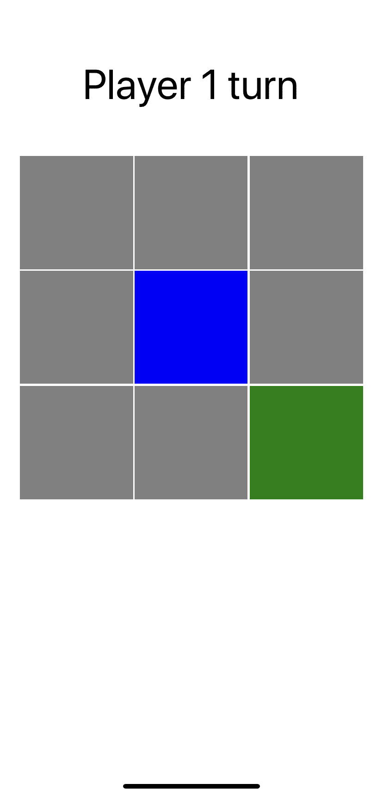
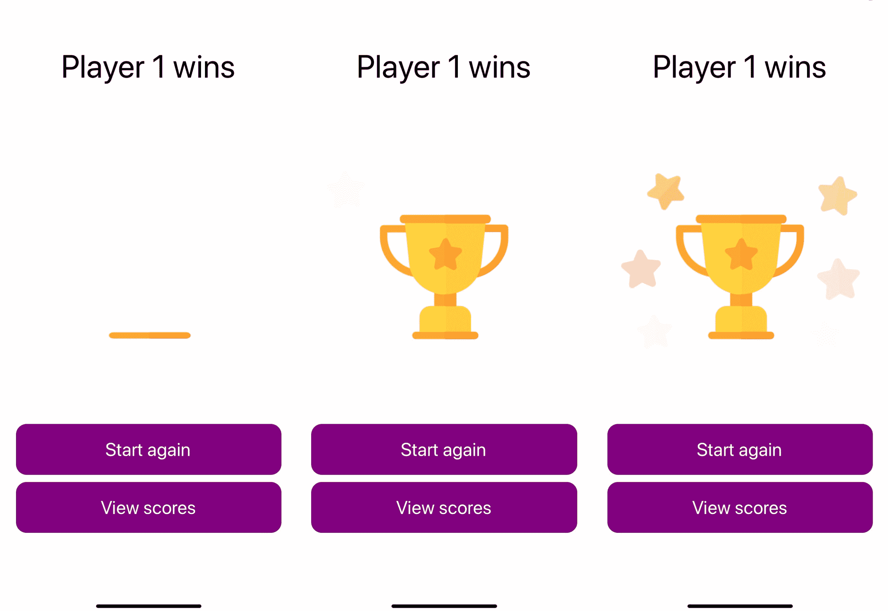

# 使用 React Native 和 Expo 制作动画游戏

您在本书中创建的大多数项目都集中在显示数据和使页面之间导航成为可能。在上一章中，您探讨了创建 web 和移动应用程序之间的一些差异。构建移动应用程序时的另一个区别是，用户期望动画和手势，因为它们使应用程序的使用变得简单和熟悉。这是您将在本章中重点介绍的内容。

在本章中，您将使用 React-Native（一个名为 Lottie 的包）和 Expo 的`GestureHandler`中的动画 API 向 React-Native 应用程序添加动画和手势。它们共同使我们能够创建能够充分利用手机交互方式的应用程序，这非常适合于*Tic Tac Toe*等游戏。此外，应用程序将在游戏界面旁边显示此游戏的高分排行榜。

要创建此游戏，将介绍以下主题：

*   使用 React 本机动画 API
*   洛蒂高级动画
*   使用 Expo 处理本地手势

# 项目概述

在本章中，我们将使用 React Native 和 Expo 创建一个动画的*Tic Tac Toe*游戏构建，它使用动画 API 添加基本动画，使用 Lottie 添加高级动画，使用 Expo 的手势处理程序处理本机手势。我们的出发点是使用 Expo CLI 创建一个应用程序，该应用程序中实现了基本路由，因此我们的用户可以在游戏界面和游戏高分概览之间切换。

构建时间为 1.5 小时。

# 开始

我们将在本章中创建的项目建立在您可以在 GitHub 上找到的初始版本之上：[https://github.com/PacktPublishing/React-Projects/tree/ch9-initial](https://github.com/PacktPublishing/React-Projects/tree/ch9-initial) [。完整的源代码也可以在 GitHub 上找到：](https://github.com/PacktPublishing/React-Projects/tree/ch10-initial)[https://github.com/PacktPublishing/React-Projects/tree/ch9\.](https://github.com/PacktPublishing/React-Projects/tree/ch9)

您需要在移动 iOS 或 Android 设备上安装 application Expo 客户端，才能在物理设备上运行项目。或者，您可以在计算机上安装 Xcode 或 Android Studio，以便在虚拟设备上运行应用程序：

*   **对于 iOS**：有关如何设置本地机器以运行 iOS 模拟器的信息，请参见此处：[https://docs.expo.io/versions/v36.0.0/workflow/ios-simulator/](https://docs.expo.io/versions/v36.0.0/workflow/ios-simulator/) 。
*   **适用于 Android**：有关如何设置本地机器以从 Android Studio 运行模拟器的信息，请参见此处：[https://docs.expo.io/versions/v36.0.0/workflow/android-studio-emulator/](https://docs.expo.io/versions/v36.0.0/workflow/android-studio-emulator/) 。运行 emulator 时存在一个已知问题，可以通过确保您的`~/.bash_profile`或`~/.bash_rc`文件中存在以下行来防止该问题：

```jsx
export ANDROID_SDK=ANDROID_SDK_LOCATION export PATH=ANDROID_SDK_LOCATION/platform-tools:$PATH
export PATH=ANDROID_SDK_LOCATION/tools:$PATH
```

`ANDROID_SDK_LOCATION`的值是本地机器上 Android SDK 的路径，可以通过打开 Android Studio 并进入**首选项****外观&行为*****系统设置**【T10 Android SDK】找到。该路径列在说明 Android SDK 位置*的框中，如下所示：`/Users/myuser/Library/Android/sdk`。**

**This application was created using **Expo SDK version 33.0.0,** and so, you need to ensure that the version of Expo you're using on your local machine is similar. As React Native and Expo are frequently updated, make sure that you're working with this version so that the patterns described in this chapter behave as expected. In case your application doesn’t start or if you encounter errors, refer to the Expo documentation to learn more about updating the Expo SDK.

# 检查初始项目

您将在本章中使用的应用程序已经为您构建，但我们需要通过添加动画和过渡等功能来完成它。下载或克隆项目后，需要移动到项目的根目录，在那里可以运行以下命令来安装依赖项并启动应用程序：

```jsx
npm install && npm start
```

这将启动 Expo，使您能够从终端或浏览器启动项目。在终端中，您可以使用二维码在移动设备上打开应用程序，也可以选择在模拟器中打开应用程序

无论您是在虚拟设备还是物理设备上打开应用程序，此时应用程序的外观应如下所示：


该应用程序由三个屏幕组成：`Start`、`Game`和`LeaderBoard`。第一屏为`Start`，点击绿色按钮即可启动游戏。这将导致`Game`屏幕，该屏幕设置为模式。`Start`屏幕使用选项卡导航，您也可以从中访问`LeaderBoard`屏幕，该屏幕将显示球员的得分

此 React 本机应用程序的项目结构如下所示。此结构类似于我们在本书中创建的项目：

```jsx
tic-tac-toe
|-- .expo
|-- assets
    |-- icon.png
    |-- splash.png
    |-- winner.json
|-- Components
    |-- // ...
|-- context
    |-- AppContext.js
|-- node_modules
|-- Screens
    |-- Game.js
    |-- LeaderBoard.js
    |-- Start.js
|-- utils
    |-- arrayContainsArray.js
    |-- checkSlots.js
.gitignore
App.js
AppContainer.js
app.json
babel.config.js
package.json
```

在`assets`目录中，您将看到两幅图像：一幅图像将在移动设备上安装此应用程序后用作主屏幕上的应用程序图标，另一幅图像将用作启动应用程序时显示的启动屏幕。这里还放置了一个乐蒂动画文件，您将在本章后面使用它。您的应用程序的配置（例如应用商店）位于`app.json`中，而`babel.config.js`包含特定的巴别塔配置。

`App.js`文件是应用程序的实际入口点，在`context/AppContext.js`文件中创建的上下文提供程序中导入并返回`AppContainer.js`文件。在`AppContainer`中，定义了此应用程序的所有路由，`AppContext`将包含在整个应用程序中应该可用的信息。在`utils`目录中，您可以找到游戏的逻辑，即填充*Tic Tac Toe*板插槽并确定哪个玩家赢得游戏的功能。

此游戏的所有组件都位于`Screens`和`Components`目录中，前者保存由`Start`、`Game`和`LeaderBoard`路径呈现的组件。这些屏幕的子组件可以在`Components`目录中找到，该目录具有以下结构：

```jsx
|-- Components
    |-- Actions
        |-- Actions.js
    |-- Board
        |-- Board.js
    |-- Button
        |-- Button.js
    |-- Player
        |-- Player.js
    |-- Slot
        |-- Slot.js
        |-- Filled.js
```

前面结构中最重要的组件是`Board`、`Slot`和`Filled`，因为它们构成了游戏的大部分。`Board`由`Game`屏幕呈现，并保存游戏的一些逻辑，而`Slot`和`Filled`是在该棋盘上呈现的组件。`Actions`组件返回两个`Button`组件，以便我们可以离开`Game`屏幕或重新启动游戏。`Player`显示轮到的玩家或赢得游戏的玩家的姓名。

# 使用 React Native 和 Expo 创建动画 Tic Tac Toe 游戏应用程序

手机游戏通常有华而不实的动画，让用户想继续玩，让游戏更具互动性。*Tic Tac Toe*游戏已经开始运行，目前还没有使用动画，只是有一些内置导航的过渡。在本节中，您将向应用程序添加动画和手势，这将改进游戏界面，让用户在玩游戏时感觉更舒适。

# 使用 React 本机动画 API

在 React Native 中使用动画有多种方法，其中之一是使用动画 API，可以在 React Native 的核心中找到。通过动画 API，默认情况下可以从`react-native`为`View`、`Text`、`Image`和`ScrollView`组件创建动画。或者，您可以使用`createAnimatedComponent`方法创建自己的

# 创建基本动画

可以添加的最简单的动画之一是通过更改元素的不透明度值来淡入或淡出元素。在您之前创建的*Tic Tac Toe*游戏中，插槽中填充了绿色或蓝色，具体取决于填充该插槽的玩家。这些颜色已经显示了一个小的过渡，因为您正在使用`TouchableOpacity`元素创建插槽。但是，可以通过使用动画 API 为此添加自定义转换。要添加动画，必须更改以下代码块：

1.  首先在`src/Components/Slot`目录中创建一个新文件并调用它`Filled.js`。此文件将包含以下代码，用于构造`Filled`组件。在此文件中，添加以下代码：

```jsx
import React from 'react';
import { View } from 'react-native';

const Filled = ({ filled }) => {
  return (
    <View
        style={{
            position: 'absolute',
            display: filled ? 'block' : 'none',
            width: '100%',
            height: '100%',
            backgroundColor: filled === 1 ? 'blue' : 'green',
        }}
    />
  );
}

export default Filled;

```

此组件显示一个`View`元素，并使用使用 JSS 语法的样式化对象进行样式化，这是 React Native 的默认语法。此元素可用于填充另一个元素，因为其位置是绝对的，具有 100%宽度和 100%高度。它还需要`filled`道具，以便我们可以设置`backgroundColor`并确定组件是否显示。

2.  您可以将此组件导入到`Slot`组件中，并在任何玩家填满插槽后显示它。不必设置`SlotWrapper`组件的背景色，您可以将属于一个或两个播放器的颜色传递给`Filled`组件：

```jsx
import React from 'react';
import { TouchableOpacity, Dimensions } from 'react-native';
import styled from 'styled-components/native';
+ import Filled from './Filled';

const SlotWrapper = styled(TouchableOpacity)`
    width: ${Dimensions.get('window').width * 0.3};
    height: ${Dimensions.get('window').width * 0.3};
-   background-color: ${({ filled }) => filled ? (filled === 1 ? 'blue' : 'green') : 'grey'};
+ background-color: grey;
    border: 1px solid #fff;
`;

const Slot = ({ index, filled, handleOnPress }) => (
- <SlotWrapper filled={filled} onPress={() => !filled && handleOnPress(index)} />
+ <SlotWrapper onPress={() => !filled && handleOnPress(index)}>
+   <Filled filled={filled} /> 
+ </SlotWrapper>
);

export default Slot;
```

3.  现在，无论何时单击插槽，都不会改变任何可见内容，因为您需要先将可单击元素从`TouchableOpacity`元素更改为`TouchableWithoutFeedback`元素。这样，带有不透明度的默认过渡将消失，因此您可以用自己的替换。`TouchableWithoutFeedback`元素可以从`react-native`导入，并应放置在`View`元素周围，该元素将保存插槽的默认样式：

```jsx
import React from 'react';
- import { TouchableOpacity, Dimensions } from 'react-native';
+ import { TouchableWithoutFeedback, View, Dimensions } from 'react-native'; import styled from 'styled-components/native';
import Filled from './Filled';

- const SlotWrapper = styled(TouchableOpacity)`
+ const SlotWrapper = styled(View)`
    width: ${Dimensions.get('window').width * 0.3};
    height: ${Dimensions.get('window').width * 0.3};    background-color: grey;
    border: 1px solid #fff;
`;

const Slot = ({ index, filled, handleOnPress }) => (
- <SlotWrapper onPress={() => !filled && handleOnPress(index)}>
+ <TouchableWithoutFeedback onPress={() => !filled && handleOnPress(index)}>
+   <SlotWrapper>
      <Filled filled={filled} />
    </SlotWrapper>
+ <TouchableWithoutFeedback>
);

export default Slot;
```

现在，您刚刚按下的插槽将立即填充您在`Filled`组件的`backgroundColor`字段中指定的颜色，没有任何过渡

4.  要重新创建此过渡，您可以使用动画 API，您将使用该 API 更改`Filled`组件从被插槽渲染的那一刻起的不透明度。因此，您需要从`src/Components/Slot/Filled.js`中的`react-native`导入`Animated`：

```jsx
import React from 'react';
- import { View } from 'react-native';
+ import { Animated, View } from 'react-native';

const Filled = ({ filled }) => {
  return (
    ...

```

5.  动画 API 的新实例首先指定一个值，该值应在我们使用动画 API 创建的动画期间更改。整个组件中的动画 API 应该可以更改此值，因此可以将此值添加到组件的顶部。此值应使用`useState`钩子创建，因为您希望此值稍后可以更改：

```jsx
import React from 'react';
import { Animated, View } from 'react-native';

const Filled = ({ filled }) => {
+ const [opacityValue] = React.useState(new Animated.Value(0));

  return (
    ...
```

6.  现在，动画 API 可以使用内置的三种动画类型中的任何一种来更改此值。它们是`decay`、`spring`和`timing`，您将使用动画 API 中的`timing`方法在指定的时间范围内更改动画值。动画 API 可以从链接到`onPress`事件或生命周期方法的任何函数触发。由于`Filled`组件只应在插槽填充时显示，因此您可以使用在`filled`道具组件更改时触发的生命周期方法，即以`filled`道具作为依赖项的`useEffect`挂钩。当`filled`道具为`false`时，组件的`opacity`为`0`，因此可以删除显示器的样式规则：

```jsx
import React from 'react';
import { Animated, View } from 'react-native';

const Filled = ({ filled }) => {
  const [opacityValue] = React.useState(new Animated.Value(0));

+ **R**eact.useEffect(() => {
+    filled && Animated.timing(
+        opacityValue, 
+        {
+            toValue: 1,
+            duration: 500,
+        }
+    ).start();
+ }, [filled]);

return (
    <View
        style={{
            position: 'absolute',
 -          display: filled ? 'block' : 'none',
            width: '100%',
            height: '100%',
            backgroundColor: filled === 1 ? 'blue' : 'green',
        }}
    />
 );
}

export default Filled;
```

`timing`方法采用您在组件顶部指定的`opacityValue`和一个具有动画 API 配置的对象。其中一个字段是`toValue`，当动画结束时，它将成为`opacityValue`的值。另一个字段用于字段的持续时间，它指定动画应持续多长时间。

The other built-in animation types next to `timing` are `decay` and `spring`. Where the `timing` method changes gradually over time, the `decay` type has animations that change fast in the beginning and gradually slow down until the end of the animation. With `spring`, you can create animations that move a little outside of its edges at the end of the animations.

7.  最后，您只需将`View`元素更改为`Animated.View`元素，并将`opacity`字段和`opacityValue`值添加到`style`对象：

```jsx
import React from 'react';
- import { Animated, View } from 'react-native';
+ import { Animated } from 'react-native';

const Filled = ({ filled }) => {

...

return (    
- <View
+   <Animated.View
        style={{
            position: 'absolute',
            width: '100%',
            height: '100%',
            backgroundColor: filled === 1 ? 'blue : 'green',
+           opacity: opacityValue,
        }}
    />
  );
}

export default Filled;
```

现在，当您按下任何插槽时，`Filled`组件将淡入，因为不透明度值将持续 500 毫秒。当您在 iOS 模拟器或在 iOS 上运行的设备中运行应用程序时，这将使两个播放器的填充插槽如下所示。在 Android 上，应用程序看起来应该类似，因为没有添加特定于平台的样式：



要使动画看起来更平滑，还可以向`Animated`对象添加`easing`字段。此字段的值来自`Easing`模块，可从`react-native`导入。`Easing`模块有三个标准功能：`linear`、`quad`和`cubic`在此，`linear`功能可用于更平滑的定时动画：

```jsx
import React from 'react';
- import { Animated } from 'react-native';
+ import { Animated, Easing } from 'react-native';

const Filled = ({ filled }) => {
  const [opacityValue] = React.useState(new Animated.Value(0));

  React.useEffect(() => {
    filled && Animated.timing(
        opacityValue, 
        {
            toValue: 1,
            duration: 1000,
+           easing: Easing.linear(),
        }
    ).start();
  }, [filled]);

  return (
    ...
```

通过最后一次更改，动画完成，游戏界面已经感觉更平滑，因为插槽正在使用您自己的自定义动画填充。在本节的下一部分中，我们将结合这些动画中的一些，使此游戏的用户体验更加高级。

# 将动画与动画 API 相结合

通过改变`Filled`组件的不透明度进行转换已经是对游戏界面的改进。但是我们可以制作更多的动画，使游戏的互动更加吸引人。

我们可以做的一件事是将淡入动画添加到`Filled`组件的大小。为了使这个动画能够很好地处理我们刚刚创建的动画中的淡入淡出，我们可以使用动画 API 中的`parallel`方法。此方法将启动在同一时刻内指定的动画。要创建此效果，我们需要进行以下更改：

1.  对于第二个动画，您希望`Filled`组件不仅具有淡入的颜色，而且具有淡入的大小。要设置不透明度的初始值，必须为此组件的大小设置初始值：

```jsx
import React from 'react';
import { Animated, Easing } from 'react-native';

const Filled = ({ filled }) => {
  const [opacityValue] = React.useState(new Animated.Value(0));
+ const [scaleValue] = React.useState(new Animated.Value(0));

  React.useEffect(() => {
    ...
```

2.  您在`useEffect`钩子中创建的`Animated.timing`方法需要包装在`Animated.parallel`函数中。这样，您可以添加另一个动画，稍后更改`Filled`组件的大小。`Animated.parallel`函数以`Animated`方法的数组作为参数，必须这样添加：

```jsx
import React from 'react';
import { Animated, Easing } from 'react-native';

const Filled = ({ filled }) => {
  const [opacityValue] = React.useState(new Animated.Value(0));
  const [scaleValue] = React.useState(new Animated.Value(0));

 React.useEffect(() => {
+ filled && Animated.parallel([
- filled && Animated.timing(
+ Animated.timing(
      opacityValue,
      {
        toValue: 1,
        duration: 1000,
        easing: Easing.linear(),
      }
-   ).start();
+  ),
+  ]).start();
 }, [filled]);

 return (
 ...

```

Next to the `parallel` function, three other functions help you with animation composition. These functions are `delay`, `sequence`, and `stagger`, and can also be used in combination with each other. The `delay` function starts any animation after a predefined delay, the `sequence` function starts animations in the order you've specified and waits until an animation is resolved before starting another one, and the `stagger` function can start animations both in order and parallel with specified delays in-between.

3.  在`parallel`函数中，您需要添加动画 API 的`spring`方法，该方法可以为`Filled`组件的大小设置动画。这一次，您将不会使用`timing`方法，而是使用`spring`方法，它会在动画结尾添加一点反弹效果。还添加了一个`Easing`功能，使动画看起来更平滑：

```jsx
...
const Filled = ({ filled }) => {
    const [opacityValue] = React.useState(new Animated.Value(0));
    const [scaleValue] = React.useState(new Animated.Value(0));

    React.useEffect(() => {
      filled && Animated.parallel([
        Animated.timing(
          opacityValue,
          {
            toValue: 1,
            duration: 1000,
            easing: Easing.linear(),
          }        ),
+       Animated.spring(
+         scaleValue,
+         {
+           toValue: 1,
+           easing: Easing.cubic(),
+         },
+       ),
      ]).start();
    }, [filled]);

    return (
        ...
```

4.  此`spring`动画将`scaleValue`的值从`0`更改为`1`，并在动画结束时产生一点反弹效果。`scaleValue`还必须添加到`style`对象中，才能使`Animated.View`组件生效。`scaleValue`将添加到`transform`中的`scale`字段中字段，该字段将更改`Filled`组件的大小：

```jsx
...

return (    
   <Animated.View
        style={{
            position: 'absolute',
            width: '100%',
            height: '100%',
            backgroundColor: filled === 1 ? 'blue' : 'green',            opacity: opacityValue,
+           transform: [
+             {
+               scale: scaleValue,
+             }
+           ],
        }}
    />
 );
}

export default Filled
```

当你点击任何一个插槽时，`Filled`组件不仅会通过改变不透明度而淡入，还会通过改变其大小而淡入。动画末尾的反弹效果为淡入淡出效果添加了一种美妙的触感。

5.  但是，当您单击描述游戏赢家的插槽时，动画没有足够的时间结束，而赢家状态由组件渲染。因此，您还需要为设置游戏赢家的函数添加超时。此函数可在`src/Screens/Game.js`中找到，您可以在其中添加一个常量，用于设置动画应持续的毫秒数：

```jsx
import React from 'react';
import { View } from 'react-native';
import styled from 'styled-components/native';
import Board from '../Components/Board/Board';
import Actions from '../Components/Actions/Actions';
import Player from '../Components/Player/Player';
import checkSlots from '../utils/checkSlots';
import { AppContext } from '../context/AppContext';

+ export const ANIMATION_DURATION = 1000;

...
```

这也将把设置胜利者的函数包装在一个`setTimeout`函数中，该函数会将这些函数的执行延迟与动画持续的时间相同：

```jsx
...
const checkWinner = (player) => {
  const slots = state[`player${player}`];

  if (slots.length >= 3) {
    if (checkSlots(slots)) { +     setTimeout(() => {        setWinner(player);
        setPlayerWins(player); +     }, ANIMATION_DURATION);
    }
  }

  return false;
}

...
```

6.  由于导出了`ANIMATION_DURATION`常量，您可以在`src/Components/Slot/Filled.js`文件中导入该常量，并将该常量用于实际动画。这样，如果在某个点更改动画的持续时间，则不必对其他组件进行任何更改，这些更改才会可见：

```jsx
import React from 'react';
import { Animated, Easing } from 'react-native';
+ import { ANIMATION_DURATION } from '../../Screens/Game';

const Filled = ({ filled }) => {
    const [opacityValue] = React.useState(new Animated.Value(0));
    const [scaleValue] = React.useState(new Animated.Value(0));

    React.useEffect(() => {
      filled && Animated.parallel([
        Animated.timing(
          opacityValue,
          {
            toValue: 1,
- duration: 1000,
+           duration: ANIMATION_DURATION,
            easing: Easing.linear(),
          }
```

除了现在使用动画`Filled`组件填充的插槽，该组件执行两个并行动画外，当您单击其中任何一个时，设置游戏赢家的功能将等待插槽填充后再开火。

下一节将展示如何处理更高级的动画，例如当两个玩家中的任何一个获胜时显示动画图形。为此，我们将使用 Lottie 包，因为它支持比内置动画 API 更多的功能。

# 洛蒂高级动画

React 原生动画 API 非常适合构建简单动画，但构建更高级的动画可能更难。幸运的是，Lottie 提供了一个在 React Native 中创建高级动画的解决方案，使我们能够在 iOS、Android 和 React Native 中实时渲染后效动画。Lottie 可以使用`npm`作为单独的软件包安装，但也可以从 Expo 获得。由于 Lottie 仍然是 Expo 实验特性的一部分，因此您可以通过从`DangerZone`名称空间检索它来使用它。因此，目前最好从`npm`安装 Lottie，并将其导入到您想要使用它的文件中。

When using Lottie, you don't have to create these After Effects animations yourself; there's a whole library full of resources that you can customize and use in your project. This library is called `LottieFiles` and is available at `https://lottiefiles.com/`.

由于您已经将动画添加到棋盘游戏的插槽中，因此添加更高级动画的好地方是当任一玩家赢得游戏时显示的屏幕。在这个屏幕上，比赛结束后，可以显示奖杯而不是棋盘。现在让我们这样做：

1.  要开始使用 Lottie，请运行以下命令，该命令将安装 Lottie 及其依赖项，并将其添加到您的`package.json`文件中：

```jsx
npm install lottie-react-native
```

2.  安装过程完成后，您可以继续创建一个组件，该组件将用于渲染作为乐蒂文件下载的 After Effects 动画。可以在新的`src/Components/Winner/Winner.js`文件中创建此组件。在这个文件中，您需要从`lottie-react-native`导入 React，当然还有 Lottie，您刚刚安装了：

```jsx
import React from 'react';
import Lottie from 'lottie-react-native';

const Winner = () => ();

export default Winner;
```

3.  导入的`Lottie`组件可以呈现您自己创建或从`LottieFiles`库下载的任何 Lottie 文件。在`assets`目录中，您将发现一个名为`winner.json`的 Lottie 文件，可用于此项目。将该文件添加到源时，`Lottie`组件可以渲染该文件，并且可以通过传递样式对象来设置动画的宽度和高度。此外，您还应添加`autoPlay`道具，以便在组件渲染后启动动画：

```jsx
import React from 'react';
import Lottie from 'lottie-react-native';

const Winner = () => (
+    <Lottie
+        autoPlay
+        style={{
+            width: '100%',
+            height: '100%',
+        }}
+        source={require('../../img/winner.json')}
+    />
);

export default Winner;
```

4.  该组件现在将开始在包含该组件的任何屏幕中渲染奖杯动画。因为当任何一个玩家赢得游戏时，应该显示该动画而不是棋盘，所以`Board`组件将是添加该组件的好地方，因为您可以使用棋盘的包装样式。`Board`组件可以在`src/Components/Board/Board.js`文件中找到，您可以在这里导入`Winner`组件：

```jsx
import React from 'react';
import { View, Dimensions } from 'react-native';
import styled from 'styled-components/native';
import Slot from '../Slot/Slot';
+ import Winner from '../Winner/Winner';

...

const Board = ({ slots, winner, setSlot }) => (
    ...

```

在该组件的`return`功能中，您可以检查`winner`道具是`true`还是`false`，并根据结果显示`Winner`组件或迭代`slots`：

```jsx
const Board = ({ slots, winner, setSlot }) => (
 <BoardWrapper>
    <SlotsWrapper>
-    {slots.map((slot, index) =>
+    {
+      winner
+      ? <Winner />
+      : slots.map((slot, index) =>
            <Slot
              key={index}
              index={index}
              handleOnPress={!winner ? setSlot : () => { }}
              filled={slot.filled}
            />
        )
    }
    </SlotsWrapper>
  </BoardWrapper>
);
```

当`Board`组件接收到具有`true`值的`winner`道具时，用户将看到正在渲染的奖杯动画，而不是棋盘。当您使用 iOS 模拟器运行应用程序或在 iOS 设备上运行应用程序时，可以在此处看到这样的示例：



如果您发现此动画的速度太快，可以通过将动画 API 与 Lottie 相结合来更改此速度。`Lottie`组件可以使用`progress`道具来确定动画的速度。传递由动画 API 创建的值时，可以根据自己的需要调整动画的速度。将其添加到乐蒂动画可以按如下方式完成：

1.  首先，您需要导入`Animated`和`Easing`（稍后使用），并使用组件顶部的`Animated`和`useState`挂钩创建新值：

```jsx
import React from 'react';
+ import { Animated, Easing } from 'react-native'; import Lottie from 'lottie-react-native';

- const Winner = () => (
+ const Winner = () => {
+   const [progressValue] = React.useState(new Animated.Value(0));
+   return (
      <Lottie
        autoPlay
        style={{
          width: '100%',
          height: '100%' ,
        }}
        source={ require('../../img/winner.json') }
        progress={progressValue}
      />
  );
+ };

export default Winner;
```

2.  在`useEffect`钩子中，您可以创建`Animated.timing`方法，该方法将在您使用`duration`字段指示的时间范围内设置`progressValue`。动画应在组件渲染后立即开始，因此挂钩的依赖项数组应为空。您还可以将`Easing.linear`函数添加到`easing`字段，以使动画运行更平滑：

```jsx
...
const Winner = () => {
   const [progressValue] = React.useState(new Animated.Value(0));

+ React.useEffect(() => {
+    Animated.timing(progressValue, {
+      toValue: 1,
+      duration: 4000,
+      easing: Easing.linear,
+    }).start(); + }, []);

return (
  ...

```

3.  现在，`progressValue`值可以传递给`Lottie`组件，这将导致动画的不同行为：

```jsx
...

const Winner = () => {
  const [progressValue] = React.useState(new Animated.Value(0));

  ...

  return (
    <Lottie
      autoPlay
      style={{
        width: '100%',
        height: '100%' ,
      }}
      source={ require('../../img/winner.json') }
+ progress={progressValue}
      />
  );
};

export default Winner;
```

现在，动画正在减速。动画从头到尾播放需要 4000 毫秒，而不是默认的 3000 毫秒。在下一节中，您将通过处理移动设备上可用的手势，为该应用程序的用户体验增加更多的复杂性。

# 与世博会打交道

手势是移动应用程序的一个重要特征，因为它们将区分普通和优秀的移动应用程序。在您创建的*Tic Tac Toe*游戏中，可以添加一些手势，使游戏更具吸引力。

之前，您使用了`TouchableOpacity`元素，在用户通过更改该元素按下该元素后，该元素会给出反馈。另一个可以用于此的元素是`TouchableHighlight`元素。就像`TouchableOpacity`一样，用户可以按下它，但它不会改变不透明度，而是突出显示元素。这些反馈或突出显示手势让用户对他们在应用程序中做出决策时会发生什么有一个印象，从而改善用户体验。这些手势可以定制，也可以添加到其他元素中，从而可以定制可触摸的元素。

为此，您可以使用一个名为`react-native-gesture-handler`的软件包，它可以帮助您在每个平台上访问本机手势。所有这些手势都将在本机线程中运行，这意味着您可以添加复杂的手势逻辑，而无需处理 React-native 手势响应系统的性能限制。它支持的一些手势包括轻触、旋转、拖动和平移手势。使用 Expo CLI 创建的任何项目都可以从`react-native-gesture-handler`使用`GestureHandler`，而无需手动安装软件包

You can also use gestures directly from React Native, without having to use an additional package. However, the gesture responder system that React Native currently uses doesn't run in the native thread. Not only does this limit the possibilities of creating and customizing gestures, but you can also run into cross-platform or performance problems. Therefore, it's advised that you use the `react-native-gesture-handler` package, but this isn't necessary for using gestures in React Native.

# 处理敲击手势

我们将实现的第一个手势是点击手势，它将被添加到`Slot`组件中，以向用户提供更多关于其动作的反馈。当用户点击时，用户不会填充插槽，而是会在点击事件开始时收到一些反馈，并在事件完成时收到反馈。在这里，我们将使用在本机线程中运行的`react-native-gesture-handler`中的`TouchableWithoutFeedback`元素，而不是使用手势应答器系统的`react-native`中的`TouchableWithoutFeedback`元素。将`react-native`部件更换为`react-native-gesture-handler`部件可通过以下步骤完成：

1.  `TouchableWithoutFeedback`可以从`src/components/Slot.js`文件顶部的`react-native-gesture-handler`导入：

```jsx
import React from 'react';
- import { TouchableWithoutFeedback, View, Dimensions } from 'react-native';
+ import { View, Dimensions } from 'react-native';
+ import **{ Tou**chableWithoutFeedback } from 'react-native-gesture-handler'; import styled from 'styled-components/native';
import Filled from './Filled';

...

const Slot = ({ index, filled, handleOnPress }) => (
 ...
```

您不必更改返回函数中的任何内容，因为`TouchableWithoutFeedback`使用的道具与`react-native`中的道具相同。当你点击插槽时，什么都不会改变。这是因为该槽将由`Filled`组件填充，一旦出现动画，该组件将显示动画。

2.  当您轻触任何插槽并用手指按住它时，`handleOnPress`功能将不会被调用。只有当您通过移除手指完成轻触手势时，手势才会结束，并且会调用`handleOnPress`功能。要在触摸插槽启动点击手势时启动动画，可以使用来自`TouchableWithoutFeedback`的`onPressIn`回调。点击事件启动后，需要向`Filled`组件传递一个值，指示其应启动动画。这个值可以通过`useState`钩子创建，所以您已经有了一个可以调用的函数来更改这个值。当点击事件结束时，将手指从元素上移开，应调用`handleOnPress`函数。您可以使用`onPressOut`回调进行此操作：

```jsx
import React from 'react';
import { View, Dimensions } from 'react-native';
import { TapGestureHandler, State } from 'react-native-gesture-handler';
import styled from 'styled-components/native';
import Filled from './Filled';

...

- const Slot = ({ index, filled, handleOnPress }) => (
+ const Slot = ({ index, filled, handleOnPress }) => {
+  const [start, setStart] = React.useState(false);

+  return ( -    <TouchableWithoutFeedback onPress={() => !filled && handleOnPress(index)}> +    <TouchableWithoutFeedback onPressIn={() => setStart()} onPressOut={() => !filled && handleOnPress(index)}>
       <SlotWrapper>
-        <Filled filled={filled} />
+        <Filled filled={filled} start={start} />
       </SlotWrapper>
     </TouchableWithoutFeedback>
   );
};

export default Slot;
```

3.  在`src/Components/Slot/Filled.js`文件的`Filled`组件中，您需要检查`start`道具，并在该道具的值为`true`后启动动画。由于您不希望在`start`的值为`true`时启动整个动画，因此只有更改`opacityValue`的动画才会启动：

```jsx
import React from 'react';
import { Animated, Easing } from 'react-native';
import { ANIMATION_DURATION } from '../../utils/constants';

- const Filled = ({ filled }) => {
+ const Filled = ({ filled, start }) => {
    const [opacityValue] = React.useState(new Animated.Value(0));
- const [scaleValue] = React.useState(new Animated.Value(0));
+   const [scaleValue] = React.useState(new Animated.Value(.8));

+ React.useEffect(() => {
+   start && Animated.timing(
+     opacityValue,
+     {
+         toValue: 1,
+         duration: ANIMATION_DURATION,
+         easing: Easing.linear(),
+      }
+   ).start();
+ }, [start]);

  React.useEffect(() => {
    ...
```

4.  此外，可以从检查`filled`道具的`useEffect`挂钩中删除更改不透明度的动画。这个`useEffect`钩子只处理改变比例的动画。初始的`scaleValue`应该更改，否则组件的大小将等于`0`：

```jsx
+ const Filled = ({ filled, start }) => {
    const [opacityValue] = React.useState(new Animated.Value(0));
- const [scaleValue] = React.useState(new Animated.Value(0));
+   const [scaleValue] = React.useState(new Animated.Value(.8));

React.useEffect(() => {

... React.useEffect(() => {
- filled && Animated.parallel([
-   Animated.timing(
-     opacityValue,
-     {
-       toValue: 1,
-       duration: ANIMATION_DURATION,
-       easing: Easing.linear(),
-     }
-   ),
-   Animated.spring(
+   filled && Animated.spring(
      scaleValue,
      {
        toValue: 1,
        easing: Easing.cubic(),
      }
-    )
-  ]).start()
+  ).start();
 }, [filled]);

...
```

进行这些更改后，当您点击任何插槽时，`timing`动画将启动，插槽中会出现一个正方形，表示正在点击插槽。一旦您将手指从该插槽中释放，方块的大小将发生变化，并在`spring`动画开始时填充插槽的其余部分，当`onPress`功能更改`filled`的值时会发生这种情况。

# 自定义轻触手势

现在，插槽有不同的动画，这取决于点击事件的状态，如果用户对选择哪个插槽有第二个想法，这将非常有用。用户可以将手指从所选插槽中取出，在这种情况下，点击事件将遵循不同的状态流。你甚至可以决定用户是否应该长时间点击插槽以确定选择，或者像在某些社交媒体应用程序上喜欢图片一样双击插槽

要创建更复杂的点击手势（如这些），您需要知道点击事件经历不同的状态。`TouchableWithoutFeedback`在发动机罩下使用`TapGestureHandler`，可经历以下状态：`UNDETERMINED`、`FAILED`、`BEGAN`、`CANCELLED`、`ACTIVE`、`END`。这些状态的命名非常简单，处理程序通常会有以下流程：`UNDETERMINED > BEGAN > ACTIVE > END > UNDETERMINED`。在`TouchableWithoutFeedback`元素的`onPressIn`回调中添加函数时，当 tap 事件处于`BEGAN`状态时，调用此函数。状态为`END`时调用`onPressOut`回调，默认`onPress`回调响应`ACTIVE`状态。

要创建这些复杂的手势，您可以通过自己处理事件状态来使用`react-native-gesture-handler`包，而不是使用可触摸元素的声明方式：

1.  `TapGestureHandler`可以从`react-native-gesture-handler`导入，并允许您创建定制的可触摸元素，这些元素具有您可以定义自己的手势。您需要从`react-native-gesture-handler`导入`State`对象，该对象包含您需要用于处理 tap 事件状态检查的常量：

```jsx
import React from 'react';
- import { TouchableWithoutFeedback } from 'react-native-gesture-handler';
+ import { TapGestureHandler, State } from 'react-native-gesture-handler';import styled from 'styled-components/native';
import Filled from './Filled';

...

const Slot = ({ index, filled, handleOnPress }) => (
   ...
```

2.  `TouchableWithoutFeedback`元素有一个名为`onHandlerStateChange`的回调，而不是像`onPress`这样的事件处理程序。每当`TapGestureHandler`的状态发生变化时（例如，当点击该元素时），就会调用该函数。通过使用`TapGestureHandler`创建可触摸元素，您不再需要`TouchableWithoutFeedback`元素。此元素的功能可以移动到您将创建的新元素：

```jsx
...

const Slot = ({ index, filled, handleOnPress }) => {
...

return (
- <TouchableWithoutFeedback onPressIn={() => setStart()} onPressOut={() => !filled && handleOnPress(index)}>
+ <TapGestureHandler onHandlerStateChange={onTap}>
    <SlotWrapper>
      <Filled filled={filled} start={start} />
    </SlotWrapper>
- </TouchableWithoutFeedback>
+ </TapGestureHandler>
  );
};

...
```

3.  `onHandlerStateChange`获取`onTap`函数，您仍然需要创建该函数，并检查 tap 事件的当前状态。当点击事件处于类似于`onPressIn`处理程序的`BEGAN`状态时，`Filled`中的动画应该开始。点击事件的完成具有`END`状态，类似于`onPressOut`处理程序，在该处理程序中，您将调用`handleOnPress`函数，该函数将更改点击该插槽的玩家的道具值。将调用`setStart`函数重置启动动画的状态：

```jsx
import React from 'react';
import { View, Dimensions } from 'react-native';
import { TapGestureHandler, State } from 'react-native-gesture-handler';
import styled from 'styled-components/native';
import Filled from './Filled';

...

const Slot = ({ index, filled, handleOnPress }) => {
    const [start, setStart] = React.useState(false);

+   const onTap = event => { +    if (event.nativeEvent.state === State.BEGAN) {
+       setStart(true);
+    }  +    if (event.nativeEvent.state === State.END) {
+       !filled && handleOnPress(index);
+       setStart(false);
+    }
+ }

  return (
    ...
```

当您轻触任何插槽并将手指放在其上时，`handleOnPress`功能将不会被调用。只有当您通过移除手指完成轻触手势时，手势才会结束并调用`handleOnPress`功能。

这些手势可以定制得更多，因为您可以使用合成来拥有多个相互响应的点击事件。通过创建所谓的**交叉处理程序交互**，您可以创建支持双击手势和长按手势的可触摸元素。通过设置并传递使用 React`useRef`钩子创建的 ref，您可以让`react-native-gesture-handler`中的手势处理程序监听其他处理程序的状态生命周期。这样，您就可以对事件进行排序，并像双击事件一样响应手势：

1.  要创建 ref，您需要将`useRef`挂钩放置在组件顶部，并将此 ref 传递给`TapGestureHandler`：

```jsx
import React from 'react';
import { View, Dimensions } from 'react-native';
import { TapGestureHandler, State } from 'react-native-gesture-handler';
import styled from 'styled-components/native';
import Filled from './Filled';

...

const Slot = ({ index, filled, handleOnPress }) => {
   const [start, setStart] = React.useState(false);
+  const doubleTapRef = React.useRef(null);

   ...

   return (
-    <TapGestureHandler onHandlerStateChange={onTap}>
+    <TapGestureHandler
+       ref={doubleTapRef}
+       onHandlerStateChange={onTap} +    >
       <SlotWrapper>
          <Filled filled={filled} start={start} />
       </SlotWrapper>
     </TapGestureHandler>
  );
};

export default Slot;
```

2.  现在，您需要设置开始和完成轻触手势所需的轻触次数。您不必对`onTap`函数进行任何更改，因为第一次点击该元素时，点击事件的状态将为`BEGAN`。只有在点击元素两次后，点击事件状态才会变为`END`：

```jsx
... return (
  <TapGestureHandler
    ref={doubleTapRef}
    onHandlerStateChange={onTap}
+   numberOfTaps={2}
  >
    <SlotWrapper>
      <Filled filled={filled} start={start} />
    </SlotWrapper>
  </TapGestureHandler>
);

...
```

3.  要填充插槽，用户必须点击`TapGestureHandler`两次才能完成点击事件。但是，当点击一次`TapGestureHandler`时，您也可以通过添加另一个`TapGestureHandler`来调用一个函数，该函数将现有的`TapGestureHandler`作为其子函数。这个新的`TapGestureHandler`应该等待另一个处理程序有双击手势，它可以使用`doubleTapRef`进行检查。`onTap`函数应重命名为`onDoubleTap`，这样您就有了一个新的`onTap`函数来处理单次点击：

```jsx
...

const Slot = ({ index, filled, handleOnPress }) => {
   const [start, setStart] = React.useState(false);
   const doubleTapRef = React.useRef(null);

+  const onTap = event => {};

-  const onTap = event => {
+  const onDoubleTap = event => {
     ...
   }

   return (
+   <TapGestureHandler
+      onHandlerStateChange={onTap}
+      waitFor={doubleTapRef}
+ >
      <TapGestureHandler
        ref={doubleTapRef}
-       onHandlerStateChange={onTap}
+       onHandlerStateChange={onDoubleTap}
        numberOfTaps={2}
      > 
        <SlotWrapper>
           <Filled filled={filled} start={start} />
        </SlotWrapper>
      </TapGestureHandler>
+ </TapGestureHandler> );
}

...
```

4.  当您仅点击一次插槽时，动画将启动，因为`TapGestureHandler`将处于`BEGAN`状态。双击手势上的动画应仅在状态为`ACTIVE`而不是`BEGAN`时启动，因此动画不会仅在一次点击时启动。此外，通过在点击手势结束时调用的函数中添加一个`setTimeout`，动画将看起来更平滑，因为这两个动画会在彼此之后过快出现：

```jsx
...

const Slot = ({ index, filled, handleOnPress }) => {
   const [start, setStart] = React.useState(false);
   const doubleTapRef = React.useRef(null);

   const onTap = event => {};
   const onDoubleTap = event => {
-    if (event.nativeEvent.state === State.BEGAN) {
+    if (event.nativeEvent.state === State.ACTIVE) {
       setStart(true);
     }

     if (event.nativeEvent.state === State.END) {
+      setTimeout(() => {
         !filled && handleOnPress(index);
         setStart(false);
+      }, 100);
     }
   }

...
```

除了用双击手势来填充插槽外，长按手势还可以改善用户的交互。您可以通过以下步骤添加长按手势：

1.  从`react-native-gesture-handler`导入`LongPressGestureHandler`。

```jsx
import React from 'react';
import { View, Dimensions } from 'react-native';
- import { TapGestureHandler, State } from 'react-native-gesture-handler';
+ import { LongPressGestureHandler, TapGestureHandler, State } from 'react-native-gesture-handler';
import styled from 'styled-components/native';
import Filled from './Filled';

...
```

2.  在此处理程序上，您可以设置长按手势的最短持续时间，并设置在此时间段结束后应调用的函数。`LongPressGestureHandler`处理程序有一个状态生命周期，可以与`onDoubleTap`函数一起使用：

```jsx
...

const Slot = ({ index, filled, handleOnPress }) => {
 ...

 return (
+  <LongPressGestureHandler 
+    onHandlerStateChange={onDoubleTap} 
+    minDurationMs={500}
+  >
      <TapGestureHandler
        onHandlerStateChange={onTap}
        waitFor={doubleTapRef}
      >
         ...
     </TapGestureHandler>
+   </LongPressGestureHandler>
 )
};

export default Slot;
```

If you only want to create a long-press gesture, you can use the `onLongPress` event handler, which is available on the touchable elements from `react-native` and `react-native-gesture-handler`. It's advised that you use the touchable elements from `react-native-gesture-handler` as they will run in the native thread, instead of using the React Native gesture responder system.

3.  也许不是所有的用户都会明白，他们需要用长按的手势来填补空缺。因此，您可以使用`onTap`功能来提醒用户该功能，该功能只需点击一次即可调用。为此，您可以使用`Alert`API，它适用于 iOS 和 Android，并使用来自这两种平台的本机警报消息。在此警报中，您可以为用户添加一条小消息：

```jsx
import React from 'react';
- import { View, Dimensions } from 'react-native';
+ import { Alert, View, Dimensions } from 'react-native';
import { LongPressGestureHandler, TapGestureHandler, State } from 'react-native-gesture-handler';
import styled from 'styled-components/native';
import Filled from './Filled';

...

const Slot = ({ index, filled, handleOnPress }) => {
  const [start, setStart] = React.useState(false);
  const doubleTapRef = React.useRef(null);

  const onTap = event => {
+   if (event.nativeEvent.state === State.ACTIVE) {
+     Alert.alert(
+      'Hint',
+      'You either need to press the slot longer to make your move',
+     ); +   }
  }

  ...

```

当用户不使用长按在板上移动时，这将显示警报，从而使他们更容易理解。随着这些最终的添加，游戏界面得到了更大的改进。用户不仅可以看到基于他们动作的动画，还可以被告知可以使用哪些手势。

# 总结

在本章中，我们将动画和手势添加到使用 React Native 和 Expo 构建的简单的*Tic Tac Toe*游戏中。动画是使用 React Native Animated API 和 Lottie 创建的，该 API 和 Lottie 可从 Expo CLI 获得，并作为单独的软件包提供。我们还为游戏添加了基本的和更复杂的手势，由于`react-native-gesture-handler`软件包，游戏在本机线程中运行。

动画和手势为移动应用程序的用户界面提供了明显的改进，我们还可以做更多的事情。不过，我们的应用程序还需要向用户请求和显示数据。

之前，我们在 React 旁边使用了 GraphQL。在下一章中，我们将以此为基础。您将在下一章中创建的项目将探索如何使用 WebSockets 和使用 Apollo 的 GraphQL 在 React 本机应用程序中处理实时数据。

# 进一步阅读

*   各种乐透档案：[https://lottiefiles.com/](https://lottiefiles.com/)
*   更多关于动画 API 的信息：[https://facebook.github.io/react-native/docs/animated](https://facebook.github.io/react-native/docs/animated)**