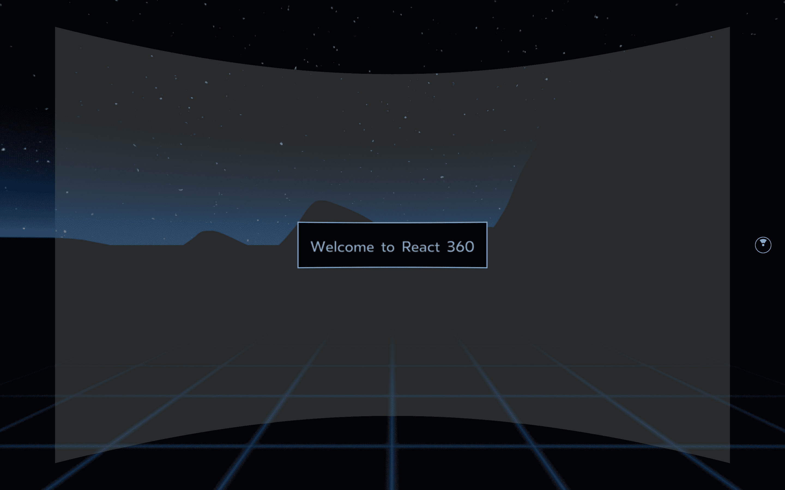
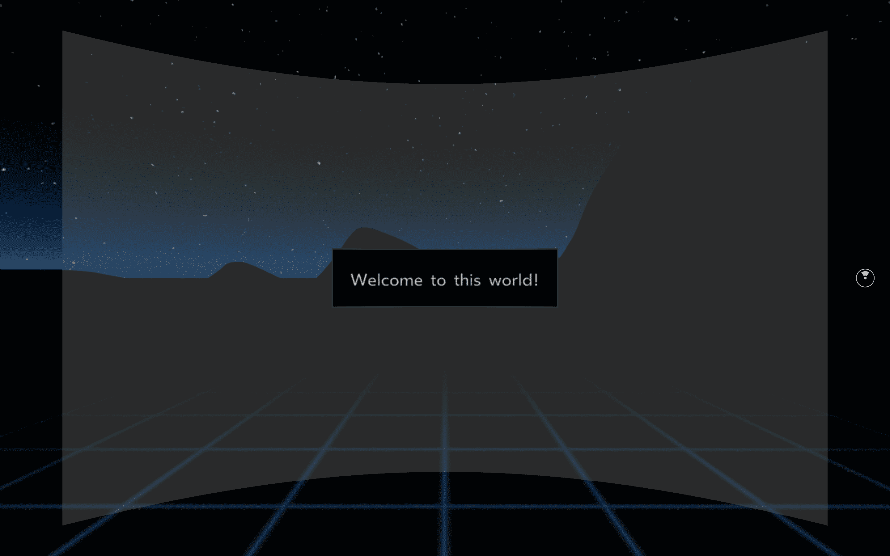

# 使用 React 360 创建虚拟现实应用程序

你几乎只剩下一章了，然后你可以称自己为反应专家，在每个平台上都有反应经验。在本书中，您已经使用 React 和 React Native 构建了 11 个应用程序，对于 grande 甜点，您可以使用 React 360。本章将最好地展示 React 和 React Native 的*learn once，write everywhere*策略的最后一部分。使用 React 360，您可以使用 React 的原理创建动态 3D 和**虚拟现实**（**VR**）体验，更具体地说，像生命周期和 UI 组件一样响应本机。尽管虚拟现实仍然是一项新兴技术，但虚拟现实的最佳使用案例是希望客户在线体验其商店或游戏的零售商店。

在本章中，您将探索 React 360 的基本功能，以及它与 React 和 React Native 的关系。您将构建的应用程序将能够渲染 360 度全景图像，并使用状态管理在屏幕之间进行渲染。动画 3D 对象也将显示在使用 React 360 构建的场景中。

本章将介绍以下主题：

*   开始使用 React 360
*   使用 React 360 创建全景查看器
*   构建可点击元素

# 项目概述

在本章中，您将使用 React 360 构建一个 VR 应用程序，该应用程序使用 React 和 React Native 的原理。2D 全景图像和 3D 对象都将添加到此应用程序中，项目可以使用**Metro bundler**在浏览器中运行。

构建时间为 1.5 小时。

# 开始

本章的应用程序将从头开始构建，并使用可在[的 GitHub 上找到的资产 https://github.com/PacktPublishing/React-Projects/tree/ch12-assets](https://github.com/PacktPublishing/React-Projects/tree/ch12-assets) [。](https://github.com/PacktPublishing/React-Projects/tree/ch1-assets)应将这些资产下载到您的计算机上，以便您在本章后面使用它们。本章的完整代码可在 GitHub 的[上找到 https://github.com/PacktPublishing/React-Projects/tree/ch12](https://github.com/PacktPublishing/React-Projects/tree/ch12) 。

React 360 需要与 React 和 React 本机项目相同版本的 Node.js 和`npm`。如果您尚未在计算机上安装 Node.js，请转到`https://nodejs.org/en/download/`，在那里您可以找到 macOS、Windows 和 Linux 的下载说明。

安装 Node.js 后，可以在命令行中运行以下命令来检查已安装的版本：

*   对于 Node.js（应为 v10.16.3 或更高版本），请使用以下命令：

```jsx
node -v
```

*   对于`npm`（应为 v6.9.0 或更高版本），使用以下命令：

```jsx
npm -v
```

# 使用 React 360 创建虚拟现实应用程序

React 360 使用 React 的原则，并在很大程度上基于 React Native。React 360 允许您使用 UI 组件创建应用程序，而无需处理移动或 VR 设备的复杂设置，这与 React Native 的工作原理类似。

# 开始使用 React 360

无论您是使用 React、React Native 还是 React 360 创建项目，都没有关系。有一些工具可以让您轻松开始使用这些技术中的任何一种。您在本书中使用了 Create React App 作为 React web 应用程序的起点，并使用 Expo CLI 作为 React Native 项目的起点。此 React 360 项目将使用 React 360 CLI 启动，这将帮助您创建和管理 React 360 应用程序。

# 设置 React 360

可通过运行以下命令从`npm`安装 React 360 CLI：

```jsx
npm install -g react-360-cli
```

这将从`npm`软件包注册表全局安装 React 360 CLI。安装过程完成后，您可以通过执行以下命令来使用它创建第一个 React 360 项目：

```jsx
react-360 init virtual-reality
```

通过执行此命令，将创建一个名为`virtual-reality`的新 React 360 项目。将安装运行 React 360 应用程序所需的所有软件包，例如`react`、`react-native`、`react-360`、`react-360-web`和`three`。`three`软件包安装`three.js`，这是一个轻量级且易于使用的 JavaScript 3D 库，附带默认的 WebGL 渲染器。React 360 使用此渲染器渲染三维图形，它通过添加一个允许您创建声明性 UI 组件的层来实现

此外，构建项目所需的所有文件都创建在同名目录中。此目录具有以下结构，其中以下文件非常重要：

```jsx
virtual-reality
|-- __tests__
    |-- index-test.js
|-- node_modules
|-- static_assets
    |-- 360_world.jpg
.babelrc
client.js
index.html
index.js
package.json
```

`__tests__`目录是使用`react-test-renderer`包创建测试文件的地方。`node_modules`目录是安装软件包的地方，`static_assets`目录保存在开发模式中静态使用的文件，这些文件稍后可能会传输到 CND。要在浏览器（或移动设备）中使用 React 360，您需要使用 Babel，它可以传输您的代码。此配置可在`.babelrc`文件中找到。由`react-360-cli`创建的最重要的文件是`client.js`、`index.html`和`index.js`，因为这些文件是您开发和服务应用程序的地方。`client.js`文件包含用于执行应用程序的代码，`index.js`保存由`index.html`中装入 DOM 的应用程序呈现的实际代码。

React 360 使用了另一个 JavaScript 捆绑包，名为**Metro**，而不是 webpack。这是 Facebook 创建的，就像 React 一样。Metro 是 React-Native 项目的绑定器，由于 React-360 也采用了 React-Native 的许多原则来在 VR 设备上运行，因此 Metro 是 React-360 应用程序的首选绑定器。就像 webpack 一样，您的所有源代码都以可读的格式打包到一个大文件中，供 web 浏览器使用。在开发应用程序时，Metro bundler 将运行本地开发服务器，允许您在浏览器中查看应用程序。文件在请求时被编译或处理，当您的应用程序完成时，可以使用它来创建生产就绪的构建。您可以使用以下命令启动捆绑程序以启动开发服务器：

```jsx
npm start 
```

这将启动 Metro bundler 并编译您的源代码，这些源代码将装载到`index.html`文件中的 DOM 中，并在`http://localhost:8081/index.html`中提供。

当您第一次在浏览器中访问项目时，bundler 可能需要较长的加载时间，因为它需要读取文件系统以获取有关如何渲染的更多信息。如果您对项目的源代码进行更改，这些更改将更快地可见，以提高开发速度。React 360 CLI 创建的初始应用程序现在在`http://localhost:8081/index.html`处可见，它显示了一个 360 度的查看器，可以探索`static_img/360_world.jpg`文件中的黑暗环境。情况如下：



React 360 应用程序可以将 360 度（或 3D）图像或视频显示为背景，并在该背景上渲染 2D 和 3D UI 组件。在`client.js`文件中，`static_assets`目录中的图像用作 360 度 2D 背景图像，代码如下：

```jsx
function init(bundle, parent, options = {}) {
  ...

 // Load the initial environment
 r360.compositor.setBackground(r360.getAssetURL('360_world.jpg'))
}

window.React360 = {init};
```

`getAssetUrl`函数指向`static_assets`目录，稍后可用于指向 CDN 或其他 URL，当应用程序正在生产时，您的背景图像位于该 URL 中

In case you have 3D glasses in your possession, you can replace the initial 360 degree 2D image with a 3D 360 image to create a 3D effect. NASA's website is a good source for finding 360 degree 3D images from any of the Mars missions, for example. Images from this mission can be found at `https://mars.nasa.gov/3d/images` and the downloaded files can be placed in `static_assets`. This should be used in the `client.js` file instead of the `360_world.jpg` file.

`react-360 init`创建的应用程序也会显示一些 UI 组件；在下一节中，我们将更详细地探讨如何在 React 360 中使用 UI 组件。

# React 360 用户界面组件

之前，我们提到 React 360 使用了 React Native 的许多概念。其中一个是可以呈现的 UI 组件的使用，React 360 提供了四个现成的 UI 组件，即，`View`、`Text`、`Entity`和`VrButton`。首先，`View`和`Text`组件是 2D 组件，在`index.js`文件中用于创建您可以在应用程序中看到的面板和问候语。其他两个组件更为复杂，在`Entity`组件的情况下可用于渲染 3D 对象，或者在`VrButton`组件的情况下响应用户操作，如按下`a`键。

从`client.js`文件中，这些组件可以放置在`index.js`文件中的圆柱体表面上，因为它们是由`client.js`中的`renderToSurface`渲染的。这里，声明的默认曲面是指显示来自`index.js`的 UI 组件的 2D 圆柱体曲面：

```jsx
function init(bundle, parent, options = {}) {

  ...

 // Render your app content to the default cylinder surface
 r360.renderToSurface(
    r360.createRoot('virtual_reality', { /* initial props */ }),
    r360.getDefaultSurface() );

  ...

}

window.React360 = {init};
```

在`index.js`文件中，我们有`View`和`Text`组件，它们用于渲染默认曲面，并在启动应用程序时显示欢迎消息。`index.js`的默认导出名为`virtual_reality`，是指项目名称，与`client.js`中的`createRoot`功能使用的名称相同

随着应用程序的增长，应用程序的初始结构和命名可能会变得有点混乱。为了解决这个问题，您可以拆分组件，并区分`index.js`中的应用程序入口点和实际的 UI 组件。为此，需要进行以下更改：

1.  将`index.js`文件移动到一个名为`Components`的新目录，并将此文件命名为`Panel.js`。在这里，您需要将该类组件的名称从`virtual_reality`更改为`Panel`：

Unfortunately, the current version of React 360 doesn't work well with React 16.8+, so you need to use a class component to use life cycles. 

```jsx
import React from 'react';
import {
- AppRegistry,
  StyleSheet,
  Text,
  View,
} from 'react-360';

- export default class virtual_reality extends React.Component {
+ export default class Panel extends React.Component {
   render() {
     return (
       <View style={styles.panel}>
         <View style={styles.greetingBox}>
           <Text style={styles.greeting}>Welcome to React 360</Text>
         </View>
       </View>
     );
   }
 };

const styles = StyleSheet.create({
  ...
});

- AppRegistry.registerComponent('virtual_reality', () => virtual_reality); 
```

2.  这个新创建的`Panel`组件可以导入到`index.js`文件中，您需要删除其中已经存在的所有代码，并将其替换为以下代码块：

```jsx
import {
  AppRegistry,
} from 'react-360';
import Panel from './Components/Panel';

AppRegistry.registerComponent('virtual_reality', () => Panel);
```

3.  要查看您所做的更改，您需要在`http://localhost:8081/index.html`刷新浏览器，然后 Metro bundler 将再次编译代码。由于没有进行任何可见的更改，因此需要查看终端中的输出，以查看是否成功。要直接在浏览器中查看这些更改，您可以通过更改`Text`组件中的值，对`Panel`组件中显示的文本进行一些更改：

```jsx
import React from 'react';
import {  StyleSheet,
  Text,
  View,
} from 'react-360';
export default class Panel extends React.Component {
  render() {
    return (
      <View style={styles.panel}>
        <View style={styles.greetingBox}>
-         <Text style={styles.greeting}>Welcome to React 360</Text>
+         <Text style={styles.greeting}>Welcome to this world!</Text>
        </View>
      </View>
    );
  };
};

...
```

此更改后刷新浏览器时，将显示文本*“欢迎来到这个世界！”*，而不是初始消息。

这些`View`和`Text`组件是简单的 2D 元素，可以使用`StyleSheet`设置样式，您在 React Native 中也使用了`StyleSheet`。通过使用此方法设置 React 360 组件的样式，React 360 的学习曲线变得不那么陡峭，并且应用了*一次学习，随处书写*原则。`View`和`Text`组件的样式放置在`scr/Panel.js`文件的底部。可用于`View`和`Text`组件的样式规则是有限的，因为并非每个样式规则都适用于这些组件。您可以对此样式进行一些小的更改，例如我们在以下代码块中所做的更改：

```jsx
...

const styles = StyleSheet.create({
  panel: {
    // Fill the entire surface
    width: 1000,
    height: 600,
    backgroundColor: 'rgba(255, 255, 255, 0.4)',
    justifyContent: 'center',
    alignItems: 'center',
  },
  greetingBox: {
-   padding: 20,
-   backgroundColor: '#000000',
-   borderColor: '#639dda',
+   padding: 25,
+   backgroundColor: 'black',
+   borderColor: 'green',
    borderWidth: 2,
  },
  greeting: {
    fontSize: 30,
  }  
});
```

下面的屏幕截图显示了这些更改后应用程序的外观，其中显示欢迎消息的面板中的框发生了一些变化：



此外，使用`panel`样式的第一个视图是在`client.js`中创建的，是默认曲面，具有圆柱体形状，默认宽度为`1000px`，高度为`600px`。还可以更改此曲面的形状和大小，我们将在接下来的部分中进行此操作。

在本节中，您了解了如何开始使用 React 360 的基本知识。现在，我们将学习如何与 React 360 交互。

# React 360 中的相互作用

在上一节中，您设置了 React 360 的基础知识，并对显示欢迎消息的初始曲面进行了一些更改。使用 React 360，可以创建其他曲面，甚至可以与用户进行一些交互。这些曲面可以具有不同的形状和大小，例如平面或圆形，这使得可以在这些曲面上添加可操作的按钮。

# 使用本地状态和 VrButton

在本节中，您将向曲面添加一些按钮，以便用户可以关闭欢迎消息或切换背景图像场景。首先，我们先创建一个按钮，关闭欢迎消息界面：

1.  `Panel`组件是一个类组件，允许您访问生命周期和本地状态管理。由于您希望能够关闭欢迎消息，因此可以使用本地状态。在`Panel`组件声明的顶部，必须添加一个具有初始状态的`constructor`：

```jsx
import React from 'react';
import {  StyleSheet,
  Text,
  View,
} from 'react-360';
export default class Panel extends React.Component {
+ constructor() {
+   super();
+   this.state = {
+     open: true
+   }
+ }

  render() {
    return (

      ...
```

If you're not very familiar with using class components for life cycles, you can look back at the few first chapters of this book. In these chapters, class components are used for life cycles instead of Hooks, which you've primarily used in the last few chapters.

2.  初始状态现在已经设置好，您可以使用它来修改面板的样式，方法是使用一个`styles`数组，而不仅仅是一个对象。除了在这个数组中传递一个`style`对象外，还可以使用条件排列直接插入样式规则。如果打开状态为非真，面板的样式将添加`display: 'none'`样式规则。否则，一个空数组将扩展到`style`数组中：

```jsx
...

export default class Panel extends React.Component {
  constructor() {
    super();
    this.state = {
      open: true,
    };
  }

  render() {
+   const { open } = this.state;
    return (
-     <View style={styles.panel}>
+     <View style={[styles.panel, ...(!open ? [{ display: 'none' }] : [])]}>
        <View style={styles.greetingBox}>          <Text style={styles.greeting}>Welcome to this world!</Text>
        </View>
      </View>
    );
  };
};
```

3.  将此`state`变量添加到面板的样式道具后，可以创建更改打开状态值的按钮。您可能还记得 React 360 有四个默认 UI 组件，其中一个称为`VrButton`。此组件类似于 React Native 中的`TouchableOpacity`，默认情况下没有任何样式。`VrButton`可从`react-360`导入，并可放置在`Text`（或`View`组件内。点击此`VrButton`将改变打开状态，因为它使用`setState`方法：

```jsx
import React from 'react';
import {  StyleSheet,
  Text,
  View,
+ VrButton,
} from 'react-360';
export default class Panel extends React.Component {

  ...

  render() {
    return (      <View style={[styles.panel, ...(!open ? [{ display: 'none' }] : [])]}>
        <View style={styles.greetingBox}>          <Text style={styles.greeting}>Welcome to this world!</Text>
        </View>
+       <VrButton
+         onClick={() => this.setState({ open: false })}
+       >
+         <Text>Close X</Text>
+       </VrButton>
      </View>
    );
  };
};
```

4.  我们还可以为`VrButton`和`Text`添加一些样式。这些组件的样式可以放置在与此文件中其他组件的样式相同的`StyleSheet`中：

```jsx
  ...

  render() {
    return (      <View style={[styles.panel, ...(!open ? [{ display: 'none' }] : [])]}>
        <View style={styles.greetingBox}>          <Text style={styles.greeting}>Welcome to this world!</Text>
        </View>
        <VrButton          onClick={() => this.setState({ open: false })}
+         style={styles.closeButton}
        >
-         <Text>Close X</Text>
+         <Text style={styles.close}>Close X</Text>
        </VrButton>
      </View>
    );
  };
};

const styles = StyleSheet.create({

  ... 

+   closeButton: {
+     position: 'absolute',
+     top: 20,
+     right: 20,
+   },
+   close: {
+     fontSize: 40,
+     color: 'black',
+   },
});
```

现在，当你在浏览器中刷新应用程序时，面板的右上角会有一个按钮，上面写着`Close X`。单击此按钮时，面板将关闭，您可以自由浏览整个背景曲面。除了关闭面板外，您还可以更改整个应用程序的场景，这将在本节的最后一部分中添加。

# 动态变化的场景

应用程序正在使用为曲面显示的默认背景，但也可以动态更改此背景图像。初始应用程序附带默认的 360 度背景图像。要改变这一点，您需要制作自己的 360 度全景图像或从互联网下载一些图像。使用特殊摄像头或通过在移动设备上下载应用程序，可以创建自己的 360 度图像。在线图片可以在许多股票图片网站上找到。在本书的 GitHub 存储库中的`ch12-assets`分支中，您可以找到一组 360 度全景图像。

目前，您的应用程序只有一个默认曲面，这是一个圆形曲面，显示`Panel`组件中的欢迎面板。还可以添加平面组件，以便用户可以使用按钮更改场景。这要求您进行以下更改：

*   创建显示指定按钮的组件
*   从`index.js`导入并注册组件
*   在`client.js`中设置新曲面

在进行这些更改之前，您必须从 GitHub 存储库下载图像，并将它们放置在`static_assets`目录中，以便可以从应用程序中使用它们。现在，进行以下更改以更改场景：

1.  在`Components`目录中创建一个名为`Navigation`的新组件，并在其中放置以下代码块。这将返回一个具有曲面基本样式的组件，稍后将在其中放置按钮：

```jsx
import React from 'react';
import { StyleSheet, View } from 'react-360';

export default class Navigation extends React.Component {
  render() {
    return <View style={styles.navigation} />;
  }
}

const styles = StyleSheet.create({
  navigation: {
    width: 800,
    height: 100,
    backgroundColor: 'blue',
    justifyContent: 'space-between',
    alignItems: 'center',
    flexDirection: 'row',
  }
});
```

2.  在`index.js`文件中，您必须导入`Navigation`组件并使用`AppRegistry`方法注册。这将确保可以将组件渲染到曲面：

```jsx
import { AppRegistry } from 'react-360';
import Panel from './Components/Panel';
+ import Navigation from './Components/Navigation';

AppRegistry.registerComponent('Panel', () => Panel);
+ AppRegistry.registerComponent('Navigation', () => Navigation);
```

3.  在`client.js`文件中，必须将该`Navigation`组件添加到曲面中；在这种情况下，这是一个平面。可以使用`react-360`中的`Surface`方法创建新曲面，并且必须指定零部件的形状和尺寸。还可以设置角度来定位零部件：

```jsx
function init(bundle, parent, options = {}) {
  const r360 = new ReactInstance(bundle, parent, {
    // Add custom options here
    fullScreen: true,
    ...options
  });

+ const navigationPanel = new Surface(1000, 100, Surface.SurfaceShape.Flat);
+ navigationPanel.setAngle(0, -0.3);

+ r360.renderToSurface(r360.createRoot('Navigation'), navigationPanel);

  // Render your app content to the default cylinder surface
  r360.renderToSurface(
    r360.createRoot('virtual_reality', { /* initial props */ }),
    r360.getDefaultSurface(),
  );

  ...

}

window.React360 = {init};
```

通过在浏览器中刷新项目，您将看到在屏幕底部呈现蓝色块。要向该块添加按钮，您可以使用`VrButton`组件并将当前选择的背景置于本地状态。现在让我们这样做：

1.  在`Components/Navigation.js`文件中，您可以向`Navigation`组件添加必要的按钮。为此，您需要从`react-360`导入`VrButton`和`Text`组件，并将它们放置在正在渲染的`View`组件中。他们将获得造型道具，因为您希望按钮在左侧或右侧都有边距：

```jsx
import React from 'react';
- import { StyleSheet, View } from 'react-360';
+ import {
+   StyleSheet,
+   Text,
+   View,
+   VrButton,
+ } from 'react-360';

export default class Navigation extends React.Component {
  render() {
-   return <View style={styles.navigation} />;
+   return (
+     <View style={styles.navigation}>
+       <VrButton style={[styles.button, styles.buttonLeft]}>
+         <Text style={styles.buttonText}>{'< Prev'}</Text>
+       </VrButton>
+       <VrButton style={[styles.button, styles.buttonRight]}>
+         <Text style={styles.buttonText}>{'Next >'}</Text>
+       </VrButton> +   );
  }
}

...
```

2.  这些样式化对象可以添加到此文件底部的`StyleSheet`方法中，就在`navigation`样式化的正下方：

```jsx
...

const styles = StyleSheet.create({
  navigation: {
    width: 800,
    height: 100,
    backgroundColor: 'blue',
    justifyContent: 'space-between',
    alignItems: 'center',
    flexDirection: 'row',
  },
+ button: {
+   padding: 20,
+   backgroundColor: 'white',
+   borderColor: 'black',
+   borderWidth: 2,
+   alignItems: 'center',
+   width: 200,
+ },
+ buttonLeft: {
+   marginLeft: 10,
+ },
+ buttonRight: {
+   marginRight: 10,
+ },
+ buttonText: {
+   fontSize: 40,
+   fontWeight: 'bold',
+   color: 'blue',
+ },
});
```

3.  您从 GitHub 存储库下载并放置在`static_assets`中的不同 360 度全景背景图像可以稍后使用`react-360`中的`assets`方法导入到此文件。为此，您需要创建一个常量，该常量是这些图像的所有文件名的数组，包括由`react-360-cli`添加的初始图像。此外，此处必须导入`assets`和`Environment`方法，因为您需要这些方法来更改背景图像：

```jsx
import React from 'react';
import {
+ assets,
+ Environment,
  StyleSheet,
  Text,
  View,
  VrButton,
} from 'react-360';

+ const backgrounds = [
+  '360_world.jpg',
+  'beach.jpg',
+  'landscape.jpg',
+  'mountain.jpg',
+  'winter.jpg',
+ ];

export default class Navigation extends React.Component {

  ...
```

4.  就像我们对`Panel`组件所做的那样，我们需要创建一个初始状态来定义要显示的背景。这将是 backgrounds 数组的第一个背景，意思是`0`。此外，必须创建一个可以使用`setState`方法更改`currentBackground`的函数。当`currentBackground`的状态改变时，背景图像将使用`Environment`方法更新，该方法使用`assets`方法从`static_assets`目录中选择一个背景：

```jsx
...

export default class Navigation extends React.Component {
+ constructor() {
+  super();
+  this.state = {
+    currentBackground: 0
+  };
+ }

+ changeBackground(change) {
+  const { currentBackground } = this.state; 
+  this.setState(
+    {
+      currentBackground: currentBackground + change
+    },
+    () => {
+      Environment.setBackgroundImage(
+        asset(backgrounds[this.state.currentBackground], { format: '2D' })
+      );
+    }
+  );
+ }

  ...
```

5.  当`Navigation`组件挂载并使用第一个背景图像时，可以调用新创建的`changeBackground`函数，但当用户点击按钮时，也必须调用`changeBackground`函数。这可以通过添加一个`componentDidMount`生命周期并通过按钮上的`onClick`事件调用该函数来实现：

```jsx
...

export default class Navigation extends React.Component {

  ...

+ componentDidMount() {
+   this.changeBackground(0);
+ }

  render() {
    return (
      <View style={styles.navigation}>
+       <VrButton style={[styles.button, styles.buttonLeft]}>
+       <VrButton
+         onClick={() => this.changeBackground(-1)}
+         style={[styles.button, styles.buttonLeft]}
+       >
          <Text style={styles.buttonText}>{`< Prev`}</Text>
        </VrButton>
+       <VrButton style={[styles.button, styles.buttonRight]}>
+       <VrButton
+         onClick={() => this.changeBackground(1)}
+         style={[styles.button, styles.buttonRight]}
+       >
          <Text style={styles.buttonText}>{`Next >`}</Text>
        </VrButton>
      </View>
    );
  }
}

... 
```

6.  在浏览器中刷新项目时，按一次左键或多次右键可能会出现错误。为了防止发生此错误，您需要确定`currentBackground`状态的最大值和最小值的范围。该值不能低于零或高于`backgrounds`数组的长度。您可以通过对`changeBackground`功能进行以下更改来完成此操作：

```jsx
...

export default class Navigation extends React.Component {

  ...

  changeBackground(change) {
   const { currentBackground } = this.state;

   this.setState(
     {
-      currentBackground: currentBackground + change
+      currentBackground:
+        currentBackground + change > backgrounds.length - 1
+          ? 0
+          : currentBackground + change < 0
+          ? backgrounds.length - 1
+          : currentBackground + change
     },
     () => {
       Environment.setBackgroundImage(
         asset(backgrounds[this.state.currentBackground], { format: '2D' })
       );
     }
   );
  }

  ...
```

`currentBackground`状态的值始终是可以在`backgrounds`数组长度内找到的值，这使您可以在不同的背景图像之间来回导航。单击“上一步”或“下一步”按钮几次后，您的应用程序将如下所示：


使用 React 360 可以做的另一件事是添加动画组件，就像我们在查看 React Native 时所做的那样。在下一节中，您将学习如何添加这些动画。

# 动画和 3D

到目前为止，您在本章中添加的所有组件都是二维的，没有动画；但是，也可以使用 React 360 设置组件动画，甚至可以添加三维对象。这些三维对象必须在专用三维建模软件中预构建，或从 internet 下载，并可以添加到应用程序中的曲面中。对于动画，必须导入动画 API，这与我们用于 React Native 的动画 API 类似。

# 动画

在开始在 React 360 中使用 3D 对象之前，让我们学习如何使用 React 360 中的动画 API 创建动画。动画 API 使用 React Native 的动画 API，可用于为 UI 组件创建简单和高级动画。使用动画 API，您可以轻松创建淡入淡出或旋转的动画，只需使用受局部状态影响的值即可。

其中一个可以设置动画的组件是`Panel`组件，它显示欢迎消息，因为该组件有一个用户可以单击以关闭曲面的元素。当用户点击关闭 X 按钮时，组件的显示样式规则将设置为`none`，使组件突然消失。相反，您可以通过执行以下操作将其更改为平滑动画：

1.  `panel`组件是在`Components/Panel.js`文件中创建的，是导入`Animated`API 的地方，您可以从`react-360`进行导入：

```jsx
import React from 'react';
- import { StyleSheet, Text, View, VrButton } from 'react-360';
+ import {
+   Animated,
+   StyleSheet,
+   Text,
+   View,
+   VrButton,
+ } from 'react-360';

export default class Panel extends React.Component {
```

2.  在`constructor()`中，应设置`Animated`值的初始值。在本例中称之为`opacity`，因为您希望`Panel`组件的`opacity`变为零，使其消失。最初，`opacity`应为 1，因为用户打开应用程序时必须显示欢迎消息：

```jsx
...

export default class Panel extends React.Component {
  constructor() {
    super();
    this.state = {
      open: true,
+     opacity: new Animated.Value(1),
    };
  }

  render() {
    ...

```

3.  当用户点击`Panel`组件中的`VrButton`时，`open`的状态会发生变化，然后动画开始。因此，必须创建一个`componentDidUpdate()`生命周期方法，在该方法中，您可以检查`open`的`state`中的更改，然后启动动画。当`open`的值从`true`变为`false`时，动画应开始将`opacity`的值从`1`变为`0`，使其消失：

```jsx
export default class Panel extends React.Component {
  constructor() {
    super();
    this.state = {
      open: true,
      opacity: new Animated.Value(1),
    };
  }

+ componentDidUpdate() {
+   const { open, opacity } = this.state;
+   Animated.timing(opacity, {
+     toValue: open ? 1 : 0,
+     duration: 800,
+   }).start(); + }

  render() {

    ...
```

4.  最后，这个值应该传递给`Animated`组件的`style`道具，这意味着您需要将`View`组件更改为能够处理动画的`Animated.View`组件。`display`样式规则可以从`style`道具中删除，并替换为`opacity`，因为这控制用户是否可以看到组件：

```jsx
render() {
- const { open, opacity } = this.state;
+ const { opacity } this.state;

  return (
-   <View style={[styles.panel, ...(!open ? [{ display: 'none' }] : [])]}>
+   <Animated.View style={[styles.panel, { opacity }]}>
      <View style={styles.welcomeBox}>
        <Text style={styles.welcome}>Welcome to this world!</Text>
      </View>
      <VrButton
        onClick={() => this.setState({ open: false })}
        style={styles.closeButton}
      >
        <Text style={styles.close}>Close X</Text>
      </VrButton>
-   </View>
+   </Animated.View>
  );
}
```

现在，当您点击`VrButton`关闭`Panel`组件并显示欢迎消息时，该组件将慢慢消失在背景中。同样类型的动画可以添加到`Navigation`组件中，因为您希望确保我们的用户知道他们可以在不同的背景中导航。您可以通过反复淡入淡出来突出显示要单击的选项，例如“下一步”按钮。这与`Panel`组件的许多逻辑相同：

1.  应在`Components/Navigation.js`文件顶部导入动画 API，并且必须为`opacity`状态创建初始值：

```jsx
import React from 'react';
import {
+ Animated,
  asset,
  Environment,
  StyleSheet,
  Text,
  View,
  VrButton,
} from 'react-360';

...

export default class Navigation extends React.Component {
  constructor() {
    super(); 
    this.state = {
      currentBackground: 0,
+     opacity: new Animated.Value(0),
    };
  }

  changeBackground(change) {
    ...
```

2.  动画应该在组件装载后立即启动，因此用于更改`opacity`值的`Animated.timing`方法必须置于`componentDidMount()`生命周期方法中。这将启动`opacity`从`0`到`1`的动画，使按钮内的文本闪烁：

```jsx
...

componentDidMount() {
+ const { opacity } = this.state;
  this.changeBackground(0);

+ Animated.timing(opacity, {
+  toValue: 1,
+  duration: 800
+ }).start()
}

render() {

  ...
```

3.  按钮`VrButton`内的`Text`组件，用户可以导航到下一个背景图像，现在可以更改为`Animated.Text`组件，并且`style`道具必须添加`opacity`样式规则。这将向该组件添加动画，使文本在安装应用程序时闪烁一次：

```jsx
render() {
+ const { opacity } = this.state;
  return (
    <View style={styles.navigation}>
      <VrButton
        onClick={() => this.changeBackground(-1)}
        style={[styles.button, styles.buttonLeft]}
      >
        <Text style={styles.buttonText}>{`< Prev`}</Text>
      </VrButton>
      <VrButton
        onClick={() => this.changeBackground(1)}
        style={[styles.button, styles.buttonRight]}
      >
-       <Text style={styles.buttonText}>{`Next >`}</Text>
+       <Animated.Text style={[styles.buttonText, { opacity }]}>{`Next >`}</Animated.Text> </VrButton>
    </View>
  );
}

... 
```

4.  您不希望按钮文本只闪烁一次。要使其反复闪烁，您可以使用`Animated`中的`loop`和`sequence`方法获得此动画的多次迭代。为了使它更平滑，我们可以给动画添加一个小延迟。这将重复 10 次，之后按钮将停止闪烁：

```jsx
...

componentDidMount() {
  const { opacity } = this.state;
  this.changeBackground(0);

+ Animated.loop(
+  Animated.sequence([
+    Animated.delay(400),
     Animated.timing(opacity, {
       toValue: 1,
       duration: 800
-    }).start()
+    })
+  ]),
+  {
+    iterations: 10
+  }
+ ).start();
}

render() {

  ...
```

现在，当应用程序挂载时，“下一步”按钮将闪烁 10 次，从而向用户强调可以在背景场景之间导航。但是，这些动画并不是您可以添加的唯一动画功能。在下一节中，您将学习如何添加动画 3D 对象。

# 渲染三维对象

要在 React 360 中使用三维对象，您需要预先构建三维对象，可以使用特殊的三维建模软件创建或从 internet 下载。在本节中，我们将在本章中使用 GitHub 存储库中的 3D 对象，您可以在其中找到 React 360 支持的`.obj`文件。除 OBJ 外，React 360 还支持 GLTF 模型作为 3D 对象。

OBJ files is a standard format for 3D model files that can be exported and imported by numerous 3D tools. Please keep in mind that React 360 doesn't support lighting and that you will need to include more advanced packages to render complex textures in a 3D model. Due to this, the 3D model that will be used in this example is just in one color, which is white. 

在使用存储在`static_assets`目录中的 3D 模型的同时，使用`Entity`对象可以轻松地向 React 360 添加 3D 对象。通过使用`Entity`可以将 3D 模型转换为需要在`index.js`中注册的组件，以便在`client.js`中使用并添加到应用程序中。

要添加三维对象，请进行以下更改：

1.  首先，确保您已将本章 GitHub 存储库中的`helicopter.obj`文件复制到`static_assets`目录中，并在`Components`目录中创建一个名为`Helicoper.js`的新文件。在此文件中，可以使用`asset`方法导入 3D 模型，并将其添加为`Entity`对象的源。为此，请使用以下代码：

```jsx
import React from 'react';
import { asset } from 'react-360';
import Entity from 'Entity';

export default class Helicopter extends React.Component {
  render() {
    return (
      <Entity
        source={{
          obj: asset('helicopter.obj'),
        }}
        style={{
          transform: [
            { rotate: 90 },
            { scaleX: 0.02 }, 
            { scaleY: 0.02 }, 
            { scaleZ: 0.02 },
          ]
        }}
      />
    );
  }
}
```

`style`道具中`Entity`对象的缩放将减小 3D 模型的大小；否则，它将太大而无法正确显示。此外，`rotateY`的值将使直升机在*y*轴上旋转 90 度。

2.  此`Helicopter`组件应显示在您的应用程序中，但只有将其注册到`index.js`文件中的`AppRegistry`才能执行此操作：

```jsx
import { AppRegistry } from 'react-360';
import Panel from './Components/Panel';
import Navigation from './Components/Navigation';
+ import Helicopter from './Components/Helicopter';

AppRegistry.registerComponent('Panel', () => Panel);
AppRegistry.registerComponent('Navigation', () => Navigation);
+ AppRegistry.registerComponent('Helicopter', () => Helicopter);
```

3.  可以使用`renderToLocation`方法将此组件装入`client.js`文件中的应用程序。以前，您使用了`renderToSurface`方法来安装`Panel`和`Navigation`组件，但是，对于 3D 对象，这将不起作用。除组件本身外，`renderToLocation`方法还考虑对象的放置位置：

```jsx
- import { ReactInstance, Surface } from 'react-360-web';
+ import { ReactInstance, Surface, Location } from 'react-360-web';

function init(bundle, parent, options = {}) {

  ...

+ const location = new Location([-100, 10, -2]);
+ r360.renderToLocation(r360.createRoot('Helicopter'), location);

  // Render your app content to the default cylinder surface
  r360.renderToSurface(

    ...

```

现在，当您打开应用程序时，当您向左旋转 90 度时，将看到一架白色直升机。在前面的代码中，`Location`用于在应用程序中创建安装 3D 模型的位置。这是通过`new Location([-100, 10, -2])`完成的。当应用程序启动时，这将使对象向左 100 米，向上 10 米，距离用户的初始位置 2 米。这可以在以下截图中看到，该截图拍摄于此应用程序的一个不同场景中：


但是，React 360 不会停止导入和渲染 3D 对象：您还可以像其他任何组件一样设置它们的动画。为此，可以再次使用动画 API。可以将其与本地状态一起使用，以将任何动画添加到 3D 直升机。`Entity`的`style`道具已经有了一些确定比例的样式，这是可以通过使用`Animated`值动态生成的。通过进一步减小直升机的比例，它看起来就像在飞行，并消失在远处。通过改变`rotateY`值使其看起来像直升机在转弯，可以添加更多效果。

要创建动画 3D 对象，请对`Components/Helicopter.js`进行以下更改：

1.  从`react-360`导入`Animated`并创建`Entity`的`Animated`版本。因为这不是预定义的`Animated`组件，所以我们不能通过键入`Animated.Entity`来实现。相反，我们需要使用`createAnimatedComponent`方法创建一个客户`Animated`组件：

```jsx
import React from 'react';
- import { asset } from 'react-360';
+ import { Animated, asset } from 'react-360'; import Entity from 'Entity';

+ const AnimatedEntity = Animated.createAnimatedComponent(Entity);

export default class Helicopter extends React.Component {

  ...
```

2.  必须将`constructor`添加到`Helicopter`组件中，其中`scale`和`rotateY`的初始`Animated`值均设置为本地状态值。`scale`的初始值为`0.02`，与直升机当前刻度相同，而`rotateY`将获得与当前刻度相同的值：

```jsx
...

export default class Helicopter extends React.Component {
+ constructor() {
+   super();
+   this.state = {
+     scale: new Animated.Value(0.02),
+     rotateY: new Animated.Value(90)
+   }; + }

  render() {

    ...
```

3.  我们可以在`componentDidMount()`生命周期方法中将动画创建为一个序列，因为我们希望直升机转弯并飞走。动画的第一部分是一个小延迟，因此动画不会在应用程序装载后立即启动。1 秒（1000 毫秒）后，直升机将开始转弯约 8 秒，并在另一个小延迟后飞走：

```jsx
...

+ componentDidMount() {
+   const { scale, rotateY } = this.state;
+
+   Animated.sequence([
+     Animated.delay(1000),
+     Animated.timing(rotateY, {
+       toValue: 0,
+       duration: 8000
+     }),
+     Animated.delay(800),
+     Animated.timing(scale, {
+       toValue: 0,
+       duration: 8000
+     })
+   ]).start(); + }

render() {

  ...
```

4.  必须用处理来自`Animated`API 的值的`AnimatedEntity`组件替换`Entity`组件。可以从本地状态获取这些值，以便将它们添加到`AnimatedEntity`组件的`style`属性中：

```jsx
  render() {
+   const { scale, rotateY } = this.state; 
    return (
-     <Entity
+     <AnimatedEntity
        source={{
          obj: asset('helicopter.obj')
        }}
        style={{
          transform: [
-           { rotateY: 90 },
-           { scaleX: 0.02 },
-           { scaleY: 0.02 },
-           { scaleZ: 0.02 },
+ { rotateY },
+           { scaleX: scale },
+           { scaleY: scale },
+           { scaleZ: scale },
          ]
        }}
      />
    );
  }
}
```

现在，直升机将开始从`90`度转向`0`度，经过一段时间，它将飞向远方并消失。

# 总结

在最后一章中，您已经结合了从本书中收集的所有知识，开始学习 React 360。尽管 React 360 使用 React 和 React Native 的实践，但它与其他 React 技术相比，提供了一个不同且更适合的用例。在撰写本文时，众所周知的原则（如本地状态的生命周期方法和动画 API）已被用于创建允许用户探索 2D 全景图像的 VR 应用程序。它有基本的动画，还有一个可以飞到远处的 3D 直升机对象。

在这最后一章中，您已经完成了本书的所有 12 章，并使用 React、React Native 和 React 360 创建了 12 个项目。现在，您已经对 React 所能做的一切以及如何在不同平台上使用它有了坚实的理解。虽然 React 和 React Native 已经是成熟的库，但是不断添加新功能。即使你读完这本书，你也可能会发现一些新的功能，从**并发模式**开始。我唯一的建议是永远不要停止学习，并在发布新功能时密切关注文档。

# 进一步阅读

*   React 360 本机模块示例：[https://facebook.github.io/react-360/docs/example-native-modules.html](https://facebook.github.io/react-360/docs/example-native-modules.html)
*   NASA 3D 图像：[https://mars.nasa.gov/3d/images](https://mars.nasa.gov/3d/images)