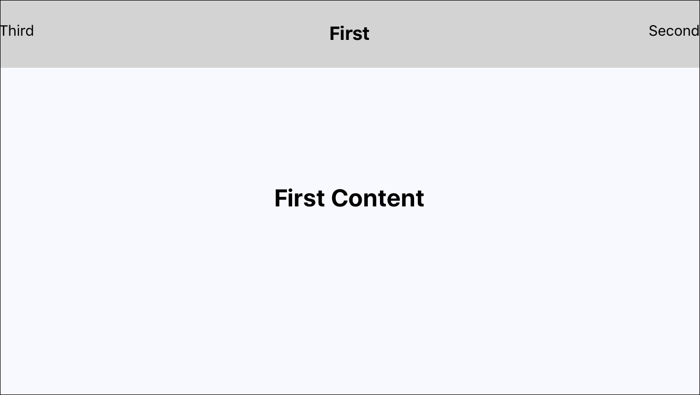

# 十五、在屏幕之间导航

路由是任何 React web 应用的重要组成部分。如果没有路由，与 URL 相对应的页面将无法管理，从而使应用无法扩展。React 本机应用没有映射到页面的 URL，但您可以实现概念上类似于将 URL 路由到页面的导航。

我们将首先考虑如何将移动应用划分为多个屏幕，并介绍与 React 本机导航一起使用的常用术语。然后，我们将通过几个示例演示 React Native 的导航能力。

# 筛选组织

在 web 应用中，考虑屏幕是很容易的，因为您有一个指向每个屏幕的 URL。换句话说，URL 使思考屏幕组织变得自然和容易。删除 URL 后，屏幕组织突然变得更加困难。

想象一下，尝试在移动应用中构建屏幕过渡，而不使用我们在 web 界面中视为理所当然的页面抽象。您必须构建自己的抽象，以确保呈现每个屏幕的每个组件，并在用户离开页面后将其删除。不理想。

但是，您确实希望使用某种页面，因为在为 web 构建 React 应用时，您已经习惯了使用这种页面，对吗？在下一节中，我们将介绍 React Native 中使用的术语，这些术语有助于实现这一点。真正的挑战仅仅是找到正确的屏幕。这很有挑战性，因为没有传统意义上的 URL。然而，只要假装有 URL；这将帮助您将应用内容分解到正确的屏幕中。

# 导航器、场景、路线和堆栈

在 React 原生应用中，控制导航的核心机制是`Navigator`组件。它用于控制路线堆栈和场景。我将在这里快速定义这些概念，然后深入研究一些代码。

*   **导航器**：用于控制用户如何在应用中导航的总体组件
*   **场景**：一个简单的 React 组件，表示用户当前正在看的内容。`Navigator`将他们带到另一个场景，而不是按页面上的链接将他们带到另一个页面
*   **路由**：包含场景信息的 JavaScript 对象。`Navigator`根据路线提供的信息计算出如何渲染场景
*   **栈**：由`Navigator`持有的路由栈。这些是用户可以在 React 本机应用中导航到的所有路由

困惑的别担心！一旦我开始用代码说话，这一切都会变得有意义：现在。

### 注

实际上，React Native 还提供了另外两个`Navigator`组件。我只介绍了通用的`Navigator`组件，因为它在 iOS 和 Android 上的工作原理相同。但是如果你感兴趣的话，有`NavigatorIOS`是面向 iOS 设备的，还有`NavigatorExperimental`，它采用不同的方法来处理路由。

# 对路线的响应

让我们实现一个包含三个场景的简单 UI（记住，场景与页面同义）。每个场景都将链接到其他两个场景，以便您可以实际导航应用。让我们从主应用模块开始：

```jsx
import React from 'react'; 
import { 
  AppRegistry, 
  Navigator, 
} from 'react-native'; 

import routes from './routes'; 

// Renders a scene. The "Scene" is a React component, and 
// is found as a property of the "route". The "navigator" 
// instance is passed to the scene as a property. 
const renderScene = (route, navigator) => ( 
  <route.Scene navigator={navigator} /> 
); 

// Renders a "<Navigator>" component. This is the root 
// component of the application because it manages 
// "scenes" that represent actual content. It's given 
// and "initialRoute" to render when the application 
// starts, and a "initialRouteStack" for all possible 
// routes. 
const RespondingToRoutes = () => ( 
  <Navigator 
    initialRoute={routes[0]} 
    initialRouteStack={routes} 
    renderScene={renderScene} 
  /> 
); 

AppRegistry.registerComponent( 
  'RespondingToRoutes', 
  () => RespondingToRoutes 
); 

```

该组件实际上并不呈现任何应用内容，只呈现`<Navigator>`。导航器负责管理场景的渲染方式。例如，我们刚刚创建的`renderScene()`函数从路由中获取`Scene`组件并对其进行渲染。`navigator`使用此功能在当前路由更改时呈现内容。

如您所见，`navigator`传递了一个初始路由和一个路由堆栈。这两个都来自`routes`模块，但在我们研究它之前，让我们先看看这个应用是什么样子的：


这个 UI 显然没有太多东西，这是设计的；我想让你专注于导航。您正在查看此应用的第一个页面，其中有两个文本链接，可将用户带到这些页面。在我们了解这些链接如何工作之前，让我们先看看`routes`模块：

```jsx
// Imports all the scenes. 
import first from './scenes/first'; 
import second from './scenes/second'; 
import third from './scenes/third'; 

// Exports the route stack, an array of all 
// available scenes. 
export default [ 
  first, 
  second, 
  third, 
]; 

```

相当简单；它构建了一个场景数组，导航器可以将其用作初始路由堆栈。你可能想知道为什么这种间接性是必要的；我不能在主模块中构建阵列吗？有时，正如您稍后将看到的，需要增加路线数据。当这种情况发生时，所有的路线都在一个地方，远离其他任何东西，这是很好的。

现在，让我们看看其中一个场景模块。我们只看第一个场景，因为这三个场景几乎完全相同：

```jsx
import React, { PropTypes } from 'react'; 
import { View, Text } from 'react-native'; 

import styles from '../styles'; 

// Import the scenes that this scene can jump to. 
import second from './second'; 
import third from './third'; 

// Renders a view with two text links in it. 
const Scene = ({ navigator }) => ( 
  <View style={styles.container}> 
    <Text 
      style={styles.item} 
      onPress={() => navigator.jumpTo(second)} 
    > 
      Second 
    </Text> 
    <Text 
      style={styles.item} 
      onPress={() => navigator.jumpTo(third)} 
    > 
      Third 
    </Text> 
  </View> 
); 

Scene.propTypes = { 
  navigator: PropTypes.object.isRequired, 
}; 

export default { 
  Scene, 
}; 

```

由`Scene`组件呈现的两个链接使用响应`Press`事件的`<Text>`组件呈现。不要像在 web 应用中那样只指向 URL，你必须明确地告诉导航器你想去哪里。这就是主模块将`navigator`实例作为属性传递给场景组件的原因。

这里使用的`navigator`方法是`jumpTo()`，它将`route`对象作为参数。在路由堆栈中查找该路由，并调用`navigator`的`renderScene()`方法。不能跳转到不在路由堆栈中的路由，因为这些组件已经渲染，导航器只是管理它们的显示。

### 注

您可能已经注意到，`Scene`组件作为对象的属性导出，而不仅仅是直接导出组件。事实上，我只想使用组件作为路由，这确实有效，但`Navigator` 属性验证会出现问题，因为它需要的是对象，而不是函数。如果我放任自流，我就活不下去了。

# 导航栏

前面的示例将导航链接作为主要内容呈现。但是，通常最好将导航链接放在它们自己的部分中。`Navigator`组件允许您指定导航栏。现在，让我们从主模块开始尝试：

```jsx
import React from 'react'; 
import { 
  AppRegistry, 
  Navigator, 
} from 'react-native'; 

import routes from './routes'; 
import styles from './styles'; 

// Renders the scene, the "navigator" property 
// is no longer needed here since navigation is 
// now handled separately. 
const renderScene = route => (<route.Scene />); 

// The composition of the navigation bar is three components: 
// "Title", "LeftButton", and "RightButton". These 
// components come from the "route". 
const routeMapper = { 
  Title: (route, navigator) => ( 
    <route.Title navigator={navigator} /> 
  ), 
  LeftButton: (route, navigator) => ( 
    <route.LeftButton navigator={navigator} /> 
  ), 
  RightButton: (route, navigator) => ( 
    <route.RightButton navigator={navigator} /> 
  ), 
}; 

// Renders the "<NavigationBar>" component, using 
// the "routeMapper" object to configure the 
// navigation buttons. We can also style it however 
// we want. 
const navigationBar = ( 
  <Navigator.NavigationBar 
    style={styles.nav} 
    routeMapper={routeMapper} 
  /> 
); 

// Uses the "navigationBar" property to render the 
// navbar independent of the scene content. 
const NavigationBar = () => ( 
  <Navigator 
    initialRoute={routes[0]} 
    initialRouteStack={routes} 
    renderScene={renderScene} 
    navigationBar={navigationBar} 
  /> 
); 

AppRegistry.registerComponent( 
  'NavigationBar', 
  () => NavigationBar 
); 

```

这看起来像上一节中的主模块，主要区别在于我们将导航栏组件传递给`<Navigator>`。还有一些额外的路线数据；导航栏需要标题、左按钮和右按钮的组件。下面是屏幕现在的样子：



如您所见，导航位于屏幕顶部，为屏幕其余部分的其他内容腾出空间。这种导航条最棒的地方在于它在 iOS 和 Android 中的外观和功能都是一样的。

现在让我们看看第一个场景模块是什么样子的：

```jsx
import React, { PropTypes } from 'react'; 
import { View, Text } from 'react-native'; 

import styles from '../styles'; 
import second from './second'; 
import third from './third'; 

// The "Scene" component only has to worry about 
// rendering content now. In this case, some simple 
// text and styles. 
const Scene = () => ( 
  <View style={styles.container}> 
    <Text style={styles.content}> 
      First Content 
    </Text> 
  </View> 
); 

// The title component for the navigation bar... 
const Title = () => ( 
  <Text style={styles.title}>First</Text> 
); 

// The left button for the navigation bar... 
const LeftButton = ({ navigator }) => ( 
  <Text 
    onPress={() => navigator.jumpTo(third)} 
  > 
    Third 
  </Text> 
); 

LeftButton.propTypes = { 
  navigator: PropTypes.object.isRequired, 
}; 

// The right button for the navigation bar... 
const RightButton = ({ navigator }) => ( 
  <Text 
    onPress={() => navigator.jumpTo(second)} 
  > 
    Second 
  </Text> 
); 

RightButton.propTypes = { 
  navigator: PropTypes.object.isRequired, 
}; 

// The exported route now has components for the 
// scene and for the navigation bar. 
export default { 
  Scene, 
  Title, 
  LeftButton, 
  RightButton, 
}; 

```

这里发生的事情比前面的例子要多得多。这是因为该模块同时声明了`Scene`组件和导航组件：总共四个。但是，最好在同一个模块中声明它们，因为它们是密切相关的，而且很小。如果您查看导出，您可以看到 route 对象实际上包含的不仅仅是`Scene`组件；这是路线所需要的一切。

这个实现的唯一问题是它需要安装三个基本相同的独立组件。必须有一种更有效的方法。

# 动态场景

一些应用，比如我们在本章中正在开发的应用，具有非常相似的场景。事实上，它们是如此相似，以至于有三个独特的组件用于此目的让人感到尴尬和重复。使用一个场景和导航栏，并通过路由对象向它们传递动态信息，这将更有意义。

让我们对应用进行一些更改，从主模块开始，这样我们就不再需要重复的组件：

```jsx
import React from 'react'; 
import { 
  AppRegistry, 
  Navigator, 
} from 'react-native'; 

import routes from './routes'; 
import styles from './styles'; 

// The scene content now comes from the "route". 
const renderScene = route => ( 
  <route.Scene 
    content={route.content} 
  /> 
); 

// The "routeMapper" object now has to pass each navbar item 
// more properties since the same component is used now. For 
// example, the "LeftButton" component passes in "content" 
// and the "route" that's to be activated if the user presses 
// the button. 
const routeMapper = { 
  Title: (route, navigator) => ( 
    <route.Title 
      navigator={navigator} 
      title={route.title} 
    /> 
  ), 
  LeftButton: (route, navigator) => ( 
    <route.LeftButton 
      navigator={navigator} 
      content={route.leftTitle} 
      route={route.leftRoute} 
    /> 
  ), 
  RightButton: (route, navigator) => ( 
    <route.RightButton 
      navigator={navigator} 
      content={route.rightTitle} 
      route={route.rightRoute} 
    /> 
  ), 
}; 

const navigationBar = ( 
  <Navigator.NavigationBar 
    style={styles.nav} 
    routeMapper={routeMapper} 
  /> 
); 

// The "Navigator" component no longer has an initial 
// route stack passed to it. Instead, current routes 
// are "replaced" by new routes. 
const DynamicRouteData = () => ( 
  <Navigator 
    initialRoute={routes[0]} 
    renderScene={renderScene} 
    navigationBar={navigationBar} 
  /> 
); 

AppRegistry.registerComponent( 
  'DynamicRouteData', 
  () => DynamicRouteData 
); 

```

您可以在这里看到，代码看起来或多或少与上一节中的代码相同，只是现在我们在渲染组件时将更多属性传递给组件。例如，主`Scene`组件从属性获取传递给它的内容。左按钮将其内容和要遵循的路由作为属性值传入。

现在，让我们来看看应用中的每个屏幕所使用的场景模块：

```jsx
import React, { PropTypes } from 'react'; 
import { View, Text } from 'react-native'; 

import styles from './styles'; 

// The content rendered by the scene now comes from 
// a property, since this is the only scene component 
// in the whole app. 
const Scene = ({ content }) => ( 
  <View style={styles.container}> 
    <Text style={styles.content}> 
      {content} 
    </Text> 
  </View> 
); 

Scene.propTypes = { 
  content: PropTypes.node.isRequired, 
}; 

// The "title" value also comes from a prop. 
const Title = ({ title }) => ( 
  <Text style={styles.title}>{title}</Text> 
); 

Title.propTypes = { 
  title: PropTypes.node.isRequired, 
}; 

// The left button label and the route that's activated 
// on press are passed in as properties. 
const LeftButton = ({ navigator, route, content }) => ( 
  <Text onPress={() => navigator.replace(route)}> 
    {content} 
  </Text> 
); 

LeftButton.propTypes = { 
  navigator: PropTypes.object.isRequired, 
  route: PropTypes.object.isRequired, 
  content: PropTypes.node.isRequired, 
}; 

// The right button label and the route that's activated 
// on press are passed in as properties. 
const RightButton = ({ navigator, route, content }) => ( 
  <Text onPress={() => navigator.replace(route)}> 
    {content} 
  </Text> 
); 

RightButton.propTypes = { 
  navigator: PropTypes.object.isRequired, 
  route: PropTypes.object.isRequired, 
  content: PropTypes.node.isRequired, 
}; 

export default { 
  Scene, 
  Title, 
  LeftButton, 
  RightButton, 
}; 

```

此模块与前面部分中的其他场景模块之间的关键变化是此处没有硬编码。标签，甚至管线本身，都作为组件属性传递进来。我在这里介绍的另一个变化是使用`replace()`方法来改变当前路线，而不是`jumpTo()`方法。不同之处在于，由于我们没有活动的路由堆栈，我们可以卸载已经渲染的内容并重新渲染新组件。这应该是非常有效的，因为组件类型是相同的；只是属性值发生了变化。

最后，让我们看一下 ToY0T0.模块：

```jsx
import mainRoute from './scene'; 

// Each route object has enough data to render 
// the dynamic parts of the scene and the navbar. 
const firstRoute = { 
  index: 0, 
  title: 'First', 
  leftTitle: 'Third', 
  rightTitle: 'Second', 
  content: 'First Content', 
}; 

const secondRoute = { 
  index: 1, 
  title: 'Second', 
  leftTitle: 'First', 
  rightTitle: 'Third', 
  content: 'Second Content', 
}; 

const thirdRoute = { 
  index: 2, 
  title: 'Third', 
  leftTitle: 'Second', 
  rightTitle: 'First', 
  content: 'Third Content', 
}; 

// Each route is extended with the components from the 
// scene. This means that the same component is reused, 
// and new property values change the data as the 
// user navigates the application. 
export default [ 
  Object.assign(firstRoute, mainRoute, { 
    leftRoute: thirdRoute, 
    rightRoute: secondRoute, 
  }), 
  Object.assign(secondRoute, mainRoute, { 
    leftRoute: firstRoute, 
    rightRoute: thirdRoute, 
  }), 
  Object.assign(thirdRoute, mainRoute, { 
    leftRoute: secondRoute, 
    rightRoute: firstRoute, 
  }), 
]; 

```

渲染的组件来自`mainRoute`。我们所要做的就是使用`Object.assign()`与每条路线共享这些组件的引用。

### 注

从技术上讲，我们不必从这个模块导出任何数组，因为我们只通过第一条路径到达`navigator`。但是，我不确定我是否喜欢这样的假设，即您永远不会使用这些路由作为初始路由堆栈。当有疑问时，将所有路由导出为数组。

# 来回跳跃

在上一个示例中，您告诉了左导航按钮和右导航按钮，它们应该通过路由中的传递路由链接到哪里。这种方法的挑战在于需要大量的工作才能使导航数据保持最新，尤其是当您只需要简单的前后行为时。让我们对应用进行一些调整，以便按钮自动知道使用哪条路线。

首先，让我们看一下 UI，这样你就可以看到我们在这里所要达到的目标：


如果你看一下导航栏，你会发现有一个标题和一个前进按钮。但是没有后退按钮。这是因为用户在第一个屏幕上，所以没有地方可以导航回去。当用户移动到第二个屏幕时，他们将看到前进和后退按钮。现在让我们来看看主要模块：

```jsx
import React from 'react'; 
import { 
  AppRegistry, 
  Navigator, 
} from 'react-native'; 

import routes from './routes'; 
import styles from './styles'; 

const renderScene = (route, navigator) => ( 
  <route.Scene 
    navigator={navigator} 
    content={route.content} 
  /> 
); 

// The "LeftButton" and "RightButton" components 
// are passed the "routes" array as a property so 
// that they can do bounds-checking. 
const routeMapper = { 
  Title: (route, navigator) => ( 
    <route.Title 
      navigator={navigator} 
      title={route.title} 
    /> 
  ), 
  LeftButton: (route, navigator) => ( 
    <route.LeftButton 
      navigator={navigator} 
      route={route} 
      routes={routes} 
    /> 
  ), 
  RightButton: (route, navigator) => ( 
    <route.RightButton 
      navigator={navigator} 
      route={route} 
      routes={routes} 
    /> 
  ), 
}; 

const navigationBar = ( 
  <Navigator.NavigationBar 
    style={styles.nav} 
    routeMapper={routeMapper} 
  /> 
); 

// Notice how we're passing in an initial route stack 
// again? This is how we're able to use "jumpForward()" 
// and "jumpBack()". 
const JumpingBack = () => ( 
  <Navigator 
    initialRoute={routes[0]} 
    initialRouteStack={routes} 
    renderScene={renderScene} 
    navigationBar={navigationBar} 
  /> 
); 

AppRegistry.registerComponent( 
  'JumpingBack', 
  () => JumpingBack 
); 

```

与上一个示例相比，我们改变了两件事。首先，您可以看到我们再次通过`initialRouteStack`属性。这意味着该数组中的所有路由都被渲染，但仅显示`initialRoute`。我们这样做是因为为了在事先不知道下一条路线的情况下来回跳跃，我们需要一个路线堆栈。

考虑此导航模型的另一种方法是使用数组索引。我们从 0 开始，堆栈中的第一条路由。当用户按 forward 键时，索引将递增。当用户按下 back 键时，索引将递减。让我们来看看简化的 To0t0 模块现在：

```jsx
import mainRoute from './scene'; 

const firstRoute = { 
  title: 'First', 
  content: 'First Content', 
}; 

const secondRoute = { 
  title: 'Second', 
  content: 'Second Content', 
}; 

const thirdRoute = { 
  title: 'Third', 
  content: 'Third Content', 
}; 

// The exported routes no longer contain properties 
// that point to other routes. 
export default [ 
  Object.assign(firstRoute, mainRoute), 
  Object.assign(secondRoute, mainRoute), 
  Object.assign(thirdRoute, mainRoute), 
]; 

```

这更容易消化。没有更多的左按钮和右按钮组件。最后，让我们看一下呈现屏幕的 AutoT0.组件：

```jsx
import React, { PropTypes } from 'react'; 
import { View, Text } from 'react-native'; 

import styles from './styles'; 

const Scene = ({ content }) => ( 
  <View style={styles.container}> 
    <Text style={styles.content}> 
      {content} 
    </Text> 
  </View> 
); 

Scene.propTypes = { 
  content: PropTypes.node.isRequired, 
}; 

const Title = ({ title }) => ( 
  <Text style={styles.title}>{title}</Text> 
); 

Title.propTypes = { 
  title: PropTypes.node.isRequired, 
}; 

// The left button is the "back" button. Notice that we 
// don't require a specific route here - we just use 
// the "jumpBack()" method. 
const LeftButton = ({ navigator, route, routes }) => 
  routes.indexOf(route) === 0 ? null : ( 
    <Text onPress={() =>navigator.jumpBack()}> 

      &#9654:
    </Text> 
  ); 

LeftButton.propTypes = { 
  navigator: PropTypes.object.isRequired, 
  route: PropTypes.object.isRequired, 
  routes: PropTypes.array.isRequired, 
}; 

// The right button is the "forward" button. Notice that 
// we don't require a specific route here - we just use 
// the "jumpForward()" method. 
const RightButton = ({ navigator, route, routes }) => 
  routes.indexOf(route) === (routes.length - 1) ? null : ( 
    <Text onPress={() => navigator.jumpForward()}> 

      &#9664:
    </Text> 
  ); 

RightButton.propTypes = { 
  navigator: PropTypes.object.isRequired, 
  route: PropTypes.object.isRequired, 
  routes: PropTypes.array.isRequired, 
}; 

export const route = { 
  Scene, 
  Title, 
  LeftButton, 
  RightButton, 
}; 

export default route; 

```

如您所见，左侧和右侧按钮分别呈现一个使用`jumpBack()`和`jumpForward()`方法的箭头。每个`Press`事件都有一个简单的边界检查机制，确保按钮实际呈现。例如，如果用户位于路由堆栈的开头，则无需渲染“后退”按钮。这个附加逻辑非常强大，因为这个组件不需要依赖任何传递给它的路由，只需要`Navigator`方法。

# 总结

在本章中，您学习了 React 本机应用中的导航。我们将用于导航 web 应用的传统机制与本地移动应用中使用的机制进行了比较。React Native 的关键区别在于没有 URL。相反，您必须依赖于管线对象。

接下来，您实现了一个基本示例，该示例根据按下的链接呈现不同的屏幕内容。链接可能很棘手，因为您没有传递由 web 浏览器自动处理的 URL。接下来，您了解了导航栏组件，该组件可以传递到`navigator`，以在 iOS 和 Android 之间提供一致的导航。

然后，您实现了通过`route`对象传递内容的动态场景。您只提供了一个初始路由，而不是提供初始路由堆栈，只要用户按下导航按钮，该初始路由就会被替换。最后，您学习了一种实现简单的前后导航的简单技术。在下一章中，您将学习如何呈现数据列表。