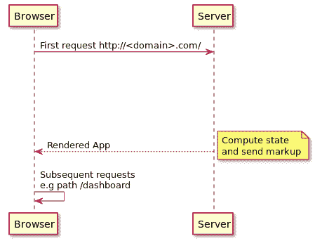

# 六、在服务器端应用中使用`StaticRouter`

****服务器端渲染**（**SSR**是一种仅在服务器端渲染客户端**单页应用**（**SPA**）并发送完全渲染的页面作为对用户请求的响应的技术。在客户端 SPA 中，JavaScript 包作为脚本标记包含，并且最初，页面中不呈现任何内容。首先下载包，然后通过执行包中的代码填充 DOM 节点。在连接不良的情况下，这有两个缺点，下载捆绑包可能需要更多的时间，并且不执行 JavaScript 的爬虫程序将无法看到任何内容，从而影响页面的 SEO。**

 **SSR 通过加载 HTML、CSS 和 JavaScript 响应用户的请求来解决这些问题；内容在服务器上呈现，最终的 HTML 被提供给爬虫程序。React 应用可以使用 Node.js 在服务器上呈现，React Router 中可用的组件可以用于定义应用中的路由。

在本章中，我们将了解如何在服务器端呈现的 React 应用中使用 React 路由组件：

*   使用 Node.js 和 Express.js 执行 React 应用的 SSR
*   添加`<StaticRouter>`组件并创建路由
*   理解`<StaticRouter>`道具
*   通过在服务器上呈现第一个页面，然后允许客户端代码接管后续页面的呈现，创建同构的 React 应用

# 使用 Node.js 和 Express.js 执行 React 应用的 SSR

在本例中，我们将使用 Node.js 和 Express.js 创建一个服务器端应用，该应用将在服务器上呈现 React 应用。js 是服务器和应用的跨平台 JavaScript 运行时环境。它基于 Google 的 V8 JavaScript 引擎构建，并使用事件驱动、非阻塞 I/O 模型，这使得它高效且轻量级。Express.js 是 Node.js 环境中使用的最流行的路由和中间件 web 框架模块之一。它允许您创建中间件，帮助处理来自客户端的 HTTP 请求。

# 安装依赖项

让我们首先使用`npm init`命令创建一个服务器端应用：

```jsx
npm init -y
```

这将创建一个文件`package.json`，其中包含各个字段的默认值。下一步是添加依赖项：

```jsx
npm install --save react react-dom react-router react-router-dom express
```

前面的命令将把所有必要的库添加到 package.json 文件的`dependencies`列表中。请注意，我们不是使用`create-react-app`CLI 创建 React 应用；相反，我们将添加所需的依赖项，并编写用于构建应用的配置文件

要构建应用，将以下开发依赖项添加到`devDependencies`列表中：

```jsx
npm install --save-dev webpack webpack-cli nodemon-webpack-plugin webpack-node-externals babel-core babel-loader babel-preset-env babel-preset-react 
```

前面的命令将为`package.json`文件中的`devDependencies`列表添加构建应用所需的库。

下一步是编写构建配置，以便构建服务器端应用。

# 网页包生成配置

这来自 Webpack 的文档：

At its core, **W****ebPack** is a *static module bundler* for modern JavaScript applications. When webpack processes your application, it internally builds a *dependency graph* which maps every module your project needs and generates one or more *bundles*.

Webpack 已经成为为 JavaScript 应用创建捆绑包的事实标准。`create-react-app`CLI 包括内部使用`webpack`为开发和生产环境创建捆绑包的脚本。

创建一个名为`webpack-server.config.babel.js`的文件，包括以下配置：

```jsx
import path from 'path';
import webpack from 'webpack';
import nodemonPlugin from 'nodemon-webpack-plugin';
import nodeExternals from 'webpack-node-externals';

export default {
    entry: './src/server/index.js',
    target: 'node',
    externals: [nodeExternals()],
    output: {
        path: path.resolve(__dirname, 'dist'),
        filename: 'server.js',
        publicPath: '/'
    },
    module: {
        rules: [
            {
                test: /\.js$/,
                use: 'babel-loader'
            }
        ]
    },
    plugins: [
        new webpack.DefinePlugin({
            __isBrowser__: false
        }),
        new nodemonPlugin()
    ]
}
```

从前面的配置中，提到文件`index.js`（在`./src/server`路径处）作为入口点，并且生成的输出文件`server.js`被复制到`dist`目录。`webpack`插件`babel-loader`用于使用`Babel`和`Webpack`在应用中传输 JavaScript 文件。`nodemon-webpack-plugin`用于运行`nodemon`实用程序，该实用程序将监视应用中 JavaScript 文件的更改，并在`webpack`以监视模式运行时重新加载和构建应用。

下一步是创建一个`.babelrc`文件，该文件将列出构建应用所需的预设：

```jsx
{
 "presets": ["env","react"]
}
```

`babel-preset-env`和`babel-preset-react`插件用于传输 ES6，并将代码向下转换为 ES5。最后一步，在`package.json`文件中添加脚本命令，使用`webpack-server.config.babel.js`文件中提到的配置启动应用：

```jsx
"scripts": {
    "start": "webpack --config webpack-server.config.babel.js --watch --mode development"
}
```

命令`npm start`将构建应用，并将侦听应用中 JavaScript 文件中的更改，并在检测到更改时重建。

# 服务器端应用

如`webpack`配置中所述，应用的入口点位于`/src/server/index.js`。让我们在此路径创建`index.js`文件，并包含以下代码，该代码在给定端口启动服务器应用：

```jsx
import express from 'express';

const PORT = process.env.PORT || 3001;

const app = express();

app.get('*', (req, res) => {
    res.send(`
        <!DOCTYPE HTML>
 <html>
 <head>
 <title>React SSR example</title>
 </head>
 <body>
 <main id='app'>Rendered on the server side</main>
 </body>
 </html>
 `);
});

app.listen(PORT, () => {
    console.log(`SSR React Router app running at ${PORT}`);
});
```

当您运行`npm start`命令并访问 URL`http://localhost:3001`处的应用时，将呈现前面的 HTML 内容。这确保了`webpack`配置构建应用并在端口`3001`处运行前面的服务器端代码，`nodemon`监视文件中的更改。

# 使用 ReactDOMServer.renderToString 呈现 React 应用

要在服务器端呈现 React 应用，首先创建 React 组件文件-`shared/App.js`：

```jsx
import React, { Component } from 'react';

export class App extends Component {
    render() {
        return (
            <div>Inside React App (rendered with SSR)</div>
        );
    }
}
```

然后，在`server/index.js`文件中呈现前面的组件：

```jsx
import express from 'express';
import React from 'react';
import ReactDOMServer from 'react-dom/server';
import { App } from '../shared/App';

app.get('*', (req, res) => {

    const reactMarkup = ReactDOMServer.renderToString(<App />);

    res.send(`
        <!DOCTYPE HTML>
        <html>
        ...
            <main id='app'>${reactMarkup}</main>   
        ...
        </html>
    `);
});
```

`ReactDOMServer`类包括在服务器端 Node.js 应用中呈现 React 组件的各种方法。`ReactDOMServer`类中的`renderToString`方法在服务器端呈现 React 组件并返回生成的标记。然后，可以将生成的标记字符串包含在发送给用户的响应中。

当您访问`http://localhost:3001`页面时，您会注意到 React 应用内的消息（用 SSR 呈现）显示出来

要确认内容确实在服务器端呈现，可以右键单击页面并从上下文菜单中选择查看页面源选项。页面源显示在新选项卡中，其中包括以下内容：

```jsx
<main id='app'>
 <div data-reactroot="">
        Inside React App (rendered with SSR) </div>
</main>
```

当爬虫程序访问应用时，前面的内容很有用。通过在服务器端呈现 React 组件，将填充标记并将其作为来自服务器的响应包含。这些内容随后被搜索引擎的爬虫编入索引，帮助应用的 SEO 方面。

# 添加<staticrouter>并创建路由</staticrouter>

`<StaticRouter>`组件是`react-router-dom`包的一部分（使用`react-router`中的`<StaticRouter>`定义），用于呈现服务器端的 React 路由组件。`<StaticRouter>`组件与其他路由组件类似，因为它只接受一个子组件 React 应用的根组件（`<App />`。此组件应在无状态应用中使用，在该应用中，用户不会四处单击以导航到页面的不同部分。

让我们通过包装应用的根组件来包含`<StaticRouter>`组件：

```jsx
import { StaticRouter } from 'react-router-dom';

app.get('*', (req, res) => {
    const context = {};
    const reactMarkup = ReactDOMServer.renderToString(
        <StaticRouter context={context} location={req.url}>
            <App />
        </StaticRouter>
    );

    res.send(`
        ...
        <main id='app'>${reactMarkup}</main>
        ...
    `);
});
```

请注意，`<StaticRouter>`组件接受两个支柱—`context`和`location`。`context`对象是空对象，当`<App />`中的`<Route>`组件之一由于浏览器的位置匹配而呈现时，会填充属性。

`location`对象通常是请求的 URL，中间件功能可以使用此信息。请求对象（`req`包含指定请求 URL 的`url`属性。

让我们在`App.js`中包含两个`<Route>`组件：

```jsx
export class App extends Component { 
    render() {
        return (
            <div>
                Inside React App (rendered with SSR)
                <Route
                    exact
 path='/'
                    render={() => <div>Inside Route at path '/'</div>}
                />
 <Route
                    path='/home'
                    render={() => 
                       <div>Inside Home Route at path '/home'</div>
                    }
```

```jsx
 />
            </div>
        );
    }
}
```

`<Route>`组件与`<StaticRouter>`组件的`location`属性中指定的请求 URL 匹配并呈现。

# 使用<redirect>和 staticContext 进行服务器端重定向</redirect>

在前面的示例中，让我们使用`<Redirect>`组件将用户从`/`路径重定向到`/home`路径：

```jsx
<Route
    path="/"
    render={() => <Redirect to="/home" />}
    exact
/>
```

当您尝试访问 URL`http://localhost:3001/`时，您会注意到重定向没有发生，浏览器的 URL 也没有更新。在客户端环境中，前面的重定向已经足够了。但是，在服务器端环境中，服务器负责处理重定向。在这种情况下，`<StaticRouter>`组件中提到的`context`对象填充了必要的细节：

```jsx
{
    "action": "REPLACE",
    "location": {
        "pathname": "/home",
        "search": "",
        "hash": "",
        "state": undefined
    },
    "url": "/home"
}
```

`context`对象包含组件渲染的结果。当组件仅呈现内容时，它通常是一个空对象。但是，当渲染组件重定向到其他路径时，它将填充前面的详细信息。请注意，`url`属性指定了用户应该重定向到`'/home'`路径的路径。

可以添加检查，查看`context`对象中是否存在`url`属性，然后使用`response`对象上的`redirect`方法重定向用户：

```jsx
...
const reactMarkup = ReactDOMServer.renderToString(
    <StaticRouter context={context} location={req.url}>
        <App />
    </StaticRouter>
);

if (context.url) {
    res.redirect(301, 'http://' + req.headers.host + context.url);
} else {
    res.send(`
        <!DOCTYPE HTML>
        <html>
            ...
        </html>
    `);
}

```

`response`对象中的`redirect`方法用于执行服务器端重定向，并提及要重定向到的状态代码和 URL。

通过在渲染组件中使用`staticContext`属性，也可以使用更多属性填充`context`对象：

```jsx
<Route
    path="/"
    exact
    render={({ staticContext, }) => {
        if (staticContext) {
            staticContext.status = 301;
        }
        return (
            <Redirect to="/home" />
        )
    }}
/>
```

这里，`staticContext`道具在渲染组件中可用，并且在使用`<Redirect>`组件重定向用户之前，将`status`属性添加到该道具中。然后，`status`属性在`context`对象中可用：

```jsx
res.redirect(context.status, 'http://' + req.headers.host + context.url);
```

这里，`context`对象中的`status`属性用于设置使用`redirect`方法重定向用户时的 HTTP 状态。

# 请求与匹配路径匹配的 URL

在服务器端呈现 React 应用时，了解请求的 URL 是否与应用中的任何现有路由匹配也很有帮助。只有当路由可用时，才应在服务器端呈现相应的组件。然而，如果路由不可用，则应向用户显示未找到页面（404）。`react-router`包中的`matchPath`功能允许您将请求的 URL 与包含路由匹配属性的对象进行匹配，例如`path`、`exact`、`strict`和`sensitive`：

```jsx
import { matchPath } from 'react-router'

app.use('*', (req, res) => {
    const isRouteAvailable = matchPath(req.url, {
path: '/dashboard/',
 strict: true
 });
    ...

});
```

`matchPath`函数类似于库如何根据请求的 URL 路径匹配`<Route>`组件。传递给`matchPath`函数的第一个参数是请求的 URL，第二个参数是请求的 URL 应与之匹配的对象。当路由匹配时，`matchPath`函数返回一个对象，详细说明请求的 URL 如何匹配该对象。

例如，如果请求的 URL 为`/dashboard/`，则`matchPath`函数返回以下对象：

```jsx
{
    path: '/dashboard/',
    url: '/dashboard/',
    isExact: true,
    params: {}
}
```

这里，`path`属性提到用于匹配请求 URL 的路径模式，`url`属性提到 URL 的匹配部分，`isExact`布尔属性设置为`true`，如果请求的 URL 和路径完全匹配，`params`属性列出与提供的路径名匹配的参数。请考虑下面的示例，其中提到路径中的参数：

```jsx
const matchedObject = matchPath(req.url, '/github/:githubID');
```

这里，不是将对象指定为第二个参数，而是指定一个路径字符串。如果要将路径与请求的 URL 相匹配，并使用`exact`、`strict`和`sensitive`属性的默认值，则此简短符号非常有用。匹配的对象将返回以下内容：

```jsx
{
    path: '/github/:githubID',
    url: '/github/sagar.ganatra',
    isExact: true,
    params: { githubID: 'sagar.ganatra' } 
}
```

请注意，`params`属性现在填充了`path`中提到的参数列表，以及请求的 URL 中提供的值。

在服务器端，在初始化`<StaticRouter>`并呈现 React 应用之前，可以执行检查，以查看请求的 URL 是否与对象集合中定义的任何路由匹配。例如，考虑路由对象的集合。

在`shared/routes.js`中，我们有以下内容：

```jsx
export const ROUTES = [
    {
        path: '/',
        exact: true
    },
    {
        path: '/dashboard/',
        strict: true
    },
    {
        path: '/github/:githubId'
    }
];
```

前面的数组包含路由对象，可在`matchPath`中使用这些对象检查请求的 URL 是否与前面列表中的任何路由匹配：

```jsx
app.get('*', (req, res) => {
    const isRouteAvailable = ROUTES.find(route => {
        return matchPath(req.url, route);
    })
    ...
});
```

如果找到请求的 URL，则`isRouteAvailalbe`将是`ROUTES`列表中匹配的对象，否则当路由对象均不匹配请求的 URL 时，将其设置为`undefined`。在后一种情况下，可以将未找到的页面标记发送给用户：

```jsx
if (!isRouteAvailable) {
    res.status(404);
    res.send(`
        <!DOCTYPE HTML>
        <html>
            <head><title>React SSR example</title></head>
            <body>
                <main id='app'>
                Requested page '${req.url}' not found
                </main>
            </body>
        </html>`);
    res.end();
}
```

当用户请求路径时，比如说`/user`，在`ROUTES`中提到的对象都不匹配，并且发送前面的响应，提到`404`HTTP 状态，响应体提到没有找到请求的路径`/user`。

# 静态路由上下文属性

`<StaticRouter>`组件接受道具`basename`、`location`和`context`。与其他路由实现类似，`<StaticRouter>`中的`basename`属性用于指定`baseURL`位置，`location`中的`basename`属性用于指定位置属性-`pathname`、`hash`、`search`和`state`。

`context`道具仅在`<StaticRouter>`实现中使用，它包含组件渲染的结果。如前所述，`context`对象可以填充 HTTP 状态码和其他任意属性。

初始化时，上下文对象可以包含可由渲染组件使用的属性：

```jsx
const context = {
    message: 'From StaticRouter\'s context object' }

const reactMarkup = ReactDOMServer.renderToString(
    <StaticRouter context={context} location={req.url} >
        <App />
    </StaticRouter>
);
```

这里，上下文对象包含一个`message`属性，当找到与请求的 URL 匹配的`<Route>`组件时，包含该属性的`staticContext`对象可用于呈现的组件：

```jsx
<Route
    path='/home'
    render={({ staticContext }) => {
        return (
            <div>
                Inside Home Route, Message - {staticContext.message}
            </div>
        );
    }}
/>
```

当您尝试访问`/home`路径时，前面的`<Route>`匹配，并且呈现`staticContext`消息属性中提到的值

`staticContext`道具仅在服务器端环境中可用，因此，当您尝试在同构应用中引用`staticContext`对象（将在下一节中讨论）时，会抛出一个错误，指出您正在尝试访问 undefined 的属性消息。可以添加检查以查看`staticContext`是否可用，或者是否可以检查在网页包配置中定义的`__isBrowser__`属性的值：

```jsx
<Route
    path='/home'
    render={({ staticContext }) => {
        if (!__isBrowser__) {
            return (
                <div>
                    Inside Home Route, Message - {staticContext.message}
                </div>
            );
        }
        return (
            <div>Inside Home Route, Message</div>
        );
    }}
/>
```

在前面的示例中，如果页面是在服务器端呈现的，`__isBrowser__`属性将是`false`，并且将呈现`staticContext`对象中指定的消息。

# 创建同构应用

代码可以在服务器端和客户端环境上运行而几乎没有更改或没有更改的应用称为同构应用。在同构应用中，用户的 web 浏览器发出的第一个请求由服务器处理，任何后续请求由客户端处理。通过在服务器端处理和呈现第一个请求，并发送 HTML、CSS 和 JavaScript 代码，可以提供更好的用户体验，还可以帮助搜索引擎爬虫对页面进行索引。然后，所有后续请求都可以由客户端代码处理，该代码作为服务器第一次响应的一部分发送。

以下是更新的请求-响应流：



要在客户端呈现应用，可以使用`<BrowserRouter>`或`<HashRouter>`组件。在本例中，我们将使用`<BrowserRouter>`组件。

为客户端代码添加目录后的应用结构如下：

```jsx
/server-side-app
|--/src
|----/client
|------index.js
|----/server
|------index.js
|----/shared
|------App.js
```

在这里，`shared`目录将包含服务器和客户端代码都可以使用的代码。使用`<BrowserRouter>`组件的客户端特定代码位于`client`目录中的`index.js`文件中：

```jsx
import React from "react";
import ReactDOM from "react-dom";
import { BrowserRouter } from "react-router-dom";
import { App } from "../shared/App";

// using hydrate instead of render in SSR app
ReactDOM.hydrate(
    <BrowserRouter>
        <App />
    </BrowserRouter>,
    document.getElementById("app")
);
```

这里，使用`ReactDOM`类中的`hydrate`方法，而不是调用`render`方法来呈现应用。`hydrate`方法专门设计用于处理初始呈现发生在服务器端（使用`ReactDOMServer`）的情况，并且更新页面特定部分的所有后续路由更改请求都由客户端代码处理。`hydrate`方法用于将事件侦听器附加到服务器端呈现的标记。

下一步是构建应用，以便在构建时生成客户端包，并将其包含在服务器的第一个响应中。

# 网页包配置

现有的 webpack 配置构建服务器端应用并运行`nodemon`实用程序来监视更改。要生成客户端包，我们需要包含另一个网页包配置文件-`webpack-client.config.babel.js`：

```jsx
import path from 'path';
import webpack from 'webpack';

export default {
    entry: './src/client/index.js',
    output: {
        path: path.resolve(__dirname, './dist/public'),
        filename: 'bundle.js',
        publicPath: '/'
    },
    module: {
        rules: [
            {
                test: /\.js$/,
                use: 'babel-loader'
            }
        ]
    },
    plugins: [
        new webpack.DefinePlugin({
            __isBrowser__: "true"
        })
    ]
}
```

前面的配置解析了`/src/client/index.j`文件中的依赖项，并在`/dist/public/bundle.js`处创建了一个 bundle。此捆绑包包含运行应用所需的所有客户端代码；不仅是`index.js`文件中的代码，还有`shared`目录中声明的组件。

当前的`npm start`脚本也需要修改，以便客户端应用代码与服务器端代码一起构建。让我们创建一个同时导出服务器和客户端网页包配置的文件-`webpack.config.babel.js`：

```jsx
import clientConfig from './webpack-client.config.babel';
import serverConfig from './webpack-server.config.babel';

export default [clientConfig, serverConfig];
```

最后，`npm start`脚本更新为参考前面的配置文件：

```jsx
"start": "webpack --config webpack.config.babel.js --mode development --watch"
```

前面的脚本将生成包含服务器端代码的`server.js`和包含客户端代码的`bundle.js`。

# 服务器端配置

最后一步是更新服务器端代码，将客户端包（`bundle.js`作为第一个响应的一部分包含在内。服务器端代码可以包含一个`<script>`标记，用于指定源（`src`属性中的`bundle.js`文件：

```jsx
res.send(`
    <!DOCTYPE HTML>
    <html>
        <head>
            <title>React SSR example</title>
            <script src='/bundle.js' defer></script>
        ...
    </html>
`);
```

此外，为了让我们的 express 服务器提供 JavaScript 文件，我们还包括了用于提供静态内容的中间件功能：

```jsx
app.use(express.static('dist/public'))
```

前面的代码允许从`dist/public`目录提供静态文件，如 JavaScript 文件、CSS 文件和图像。在使用`app.get()`之前，应包含上述语句。

当您在`/home`路径访问应用时，第一个响应来自服务器，并且除了呈现与`/home`路径匹配的`<Route>`之外，响应中还包括客户端包`bundle.js`。通过浏览器下载`bundle.js`文件，然后通过客户端代码处理路由路径中的任何更改。

# 总结

在本章中，我们研究了如何使用`ReactDOMserver.renderToString`方法在服务器端（使用 Node.js 和 Express.js）呈现 React 应用。React Router 中的`<StaticRouter>`组件可用于包装应用的根组件，从而使您能够添加与服务器端请求的 URL 路径匹配的`<Route>`组件。`<StaticRouter>`组件接受道具`context`和`location`。呈现组件中的`staticContext`道具（仅在服务器端可用）包含`context`道具中的`<StaticRouter>`提供的数据。当您想使用`<Redirect>`组件重定向用户时，它还可以用于添加属性

`matchPath`函数用于确定请求的 URL 是否与`{path, exact, strict, sensitive}`形状的提供对象匹配。这类似于库如何将请求的 URL 与页面中可用的`<Route>`组件相匹配。`matchPath`函数使我们能够确定请求的 URL 是否与集合中的任何 routes 对象匹配；这为我们提供了一个提前发送 404:Page not found 响应的机会

还可以创建一个同构的 React 应用，在服务器端呈现第一个请求，在客户端呈现后续请求。这是通过在从服务器发送第一个响应时包含客户端包文件来实现的。客户端代码在第一个请求之后接管，这使您能够更新页面中与请求的路由匹配的特定部分。

在[第 7 章](07.html)中*在 React 本机应用*中使用 NativeRouter，我们将了解如何使用`NativeRouter`组件在使用 React 本机创建的本机移动应用中定义路由**