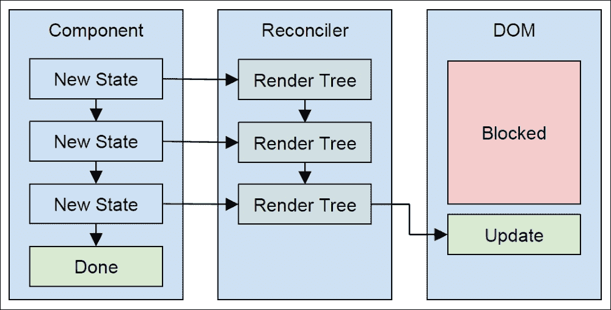
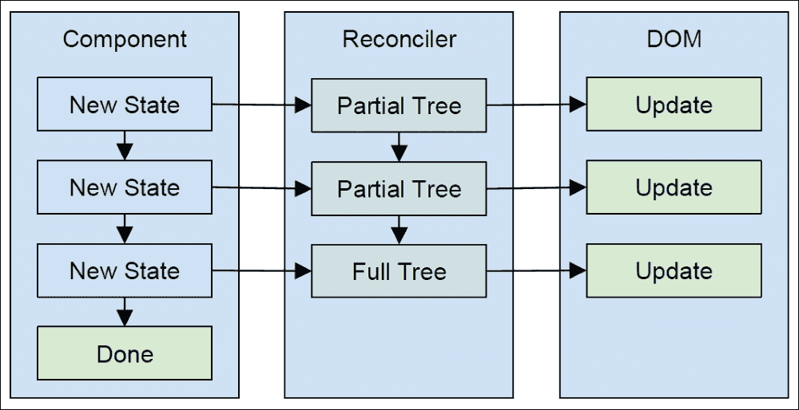

# 第一章，第十六章有什么新内容

React 16 的发布包含了足够重要的更改，可以专门用一章来介绍它们。这一特定版本的发布花费了相对较长的时间。这是因为 React 中计算如何有效地呈现组件更改的部分从头重写。兼容性是另一个因素：这次重写没有重大的破坏性 API 更改。

在本章中，您将了解 React 16 中引入的主要更改：

*   对对账内部进行的主要更改，以及这些更改对 React 项目的意义
*   通过设置错误边界将错误限制到应用程序的各个部分
*   创建渲染多个元素的组件和渲染字符串的组件
*   向门户渲染

# 重新思考渲染

您不需要深入了解 React 的协调内部是如何工作的。这将破坏 React 的目的以及它如何为我们封装所有这些工作。但是，了解 React 16 中发生的主要内部更改的动机，以及它们在更高级别上的工作方式，将有助于您思考如何最好地设计当前和未来 React 应用程序的组件。

## 现状

React 在选择一个库来帮助构建用户界面时，已将自己确立为标准之一。实现这一点的两个关键因素是其简单性和性能。React 很简单，因为它有一个很小的 API 表面，很容易挑选和实验。React 之所以具有性能，是因为它通过协调渲染树中的更改来最小化必须调用的 DOM 操作的数量。

这两个因素之间的相互作用导致 React 的人气飙升。如果 API 很难使用，React 提供的良好性能就没有价值。React 的首要价值在于它使用简单，开箱即用，性能良好。

随着 React 的广泛采用，人们认识到其内部和解机制可以得到改进。例如，某些 React 应用程序更新组件状态的速度快于渲染完成的速度。再考虑另一个例子：在屏幕上看不到的部分渲染树的更改应该比用户可以看到的元素具有更低的优先级。这些问题足以降低用户体验，使其感觉不到流动性。

如何在不中断 API 和渲染树协调的情况下解决这些问题？

## 运行至完工

JavaScript 是单线程的，运行到完成。这意味着默认情况下，您运行的任何 JavaScript 代码都将阻止任何其他浏览器任务的运行，例如绘制屏幕。这就是为什么 JavaScript 代码的速度特别重要的原因。但是，在某些情况下，即使 React 协调代码的性能也不足以掩盖用户的瓶颈。当显示新树时，React 别无选择，只能在计算新渲染树时阻止 DOM 更新和事件侦听器。

一种可能的解决方案是将协调工作分解成更小的块，并以这样的方式排列它们，以防止 JavaScript 运行到完成线程阻止重要的 DOM 更新。这意味着协调器不必渲染完整的树，然后必须重新渲染，因为第一次渲染时发生了事件。

让我们看一下这个问题的一个可视示例：



此图显示，任何时候 React 组件中的状态发生变化，在渲染完成之前都不会发生任何其他情况。正如您所看到的，随着状态更改的累积，协调整个树可能会变得昂贵，而且，DOM 一直被阻止做任何事情。

协调呈现树与 JavaScript 的 run-to-completion 语义是同步的。换句话说，React 不能暂停它正在做的事情以让 DOM 更新。现在让我们看看 React 16 如何试图改变上图：



此版本的 React 渲染/协调过程与上一版本类似。事实上，左边的组件没有任何变化，这反映了 React 16 中不变的 API。尽管有一些微妙但重要的区别。

让我们先看看对账人。它不会在每次组件更改状态时构建新的渲染树，而是渲染部分树。换句话说，它执行大量工作，从而创建渲染树的一部分。它没有完成整个树的原因是，协调过程可以暂停并允许运行任何 DOM 更新。您可以在图像右侧看到 DOM 中的差异。

当协调器继续构建渲染树时，它首先检查自暂停后是否发生了新的状态更改。如果是这样，它将根据新的状态更改，获取部分完成的渲染树并尽可能重用它。然后，它继续运行，直到下一次暂停。最终，和解完成。在协调期间，DOM 有机会响应事件并呈现任何未完成的更改。在 React 16 之前，这是不可能的，您必须等到整个树被呈现之后，DOM 中的任何事情才能发生。

## 什么是纤维？

为了将呈现组件的工作分离为更小的工作单元，React 创建了一个称为**光纤**的抽象。光纤表示可以暂停和恢复的渲染工作单元。它还具有其他低级属性，例如优先级以及光纤输出完成后应返回到的位置。

在开发过程中，React 16 的代码名为 React Fiber，因为这是一个基本的抽象概念，它允许调度整个渲染工作的各个部分，以提供更好的用户体验。React 16 标志着这种新的协调架构的首次发布，但尚未完成。例如，一切仍然是同步的。

## 异步与前方道路

React 16 为下一个主要版本中异步渲染的最终目标奠定了基础。React 16 中没有包含此功能的主要原因是团队希望将基本的协调更改发布到野外。还有一些其他的新特性也需要发布，我们将在下面的章节中介绍。

在 React 中引入异步呈现功能后，您不必修改任何代码。相反，您可能会注意到应用程序某些区域的性能有所提高，这将受益于按优先级和计划的渲染。

## 更好的组件错误处理

React 16 为组件引入了更好的错误处理能力。这个概念被称为**错误边界**，它被实现为一个生命周期方法，当任何子组件抛出异常时调用该方法。实现`componentDidCatch()`的父类是错误边界。在应用程序中，您可能有不同的边界，这取决于您的功能是如何组织的。

此功能的动机是为应用程序提供从某些错误中恢复的机会。在 React 16 之前，如果组件抛出错误，整个应用程序将停止。这可能并不理想，尤其是当次要组件的问题使关键组件停止工作时。

让我们创建一个具有错误边界的`App`组件：

```jsx
class App extends Component {
  state = {}

  componentDidCatch(err) {
    this.setState({ err: err.message });
  }

  render() {
    return (<p><MyError err={this.state.err}/></p>);
  }
}
```

`App`组件只会呈现`MyError`——一个故意抛出错误的组件。当发生这种情况时，调用`componentDidCatch()`方法，并将错误作为参数。然后可以使用此值更改零部件的状态。在本例中，它将错误消息设置为`err`状态。然后，`App`将尝试重新渲染。

如您所见，`this.state.err`作为属性传递给`MyError`。在第一次渲染期间，此值未定义。当`App`捕捉到`MyError`抛出的错误时，错误被传递回组件。现在我们来看`MyError`：

```jsx
const MyError = (props) => {
  if (props.err) {
    return <b style={{color: 'red'}}>{props.err}</b>;
  }

  throw new Error('epic fail');
};
```

此组件抛出错误消息`'epic fail'`。当`App`捕捉到这个错误时，它用`err`道具呈现`MyError`。发生这种情况时，它只是将错误字符串呈现为红色。这恰好是我为这个应用选择的策略；在再次调用错误行为之前，始终检查错误状态。在`MyError`中，通过第二次不执行`throw new Error('epic fail')`来恢复整个应用程序。

有了`componentDidCatch()`，你就自由了；为错误恢复设置您喜欢的任何策略。通常，您无法恢复发生故障的特定组件。

## 呈现多个元素和字符串

因为 React 是第一次发布的，所以规则是组件只能呈现一个元素。在 React 16 中，这在两个重要方面发生了变化。首先，您现在可以从组件返回元素集合。这简化了呈现同级元素将大大简化事情的情况。其次，现在可以呈现纯文本内容。

这两种更改都会导致页面上的元素减少。通过允许同级元素由组件呈现，您不必为了返回单个元素而用元素包装它们。通过呈现字符串，您可以将测试内容呈现为子组件或其他组件，而无需将其包装到元素中。

以下是渲染多个元素的效果：

```jsx
const Multi = () => [
  'first sibling',
  'second sibling'
].map((v, i) => <p key={i}>{v}</p>);
```

请注意，您必须为集合中的元素提供一个`key`属性。现在，让我们添加一个返回字符串值的元素：

```jsx
const Label = () => 'Name:';

const MultiWithString = () => [
  'first sibling',
  'second sibling'
].map((v, i) => <p key={i}><Label/> {v}</p>);
```

`Label`组件只返回一个字符串作为其呈现内容。`p`元素将`Label`呈现为子元素，与`{v}`值相邻。当组件可以返回字符串时，您有更多的选项来组合构成 UI 的元素。

## 呈现到门户

我想介绍的 React 16 的最后一个新特性是门户的概念。通常，组件的呈现输出放置在 JSX 元素位于树中的位置。但是，有时我们可以更好地控制组件渲染输出的最终位置。例如，如果要在根元素之外渲染组件，该怎么办？

门户允许组件在渲染时指定其容器元素。假设您希望在应用程序中显示通知。屏幕上不同位置的多个组件需要能够在屏幕上的一个特定位置呈现通知。让我们来看看如何使用门户来定位元素：

```jsx
import React, { Component } from 'react';
import { createPortal } from 'react-dom';
class MyPortal extends Component {
  constructor(...args) {
    super(...args);
    this.el = document.createElement('strong');
  }

  componentWillMount() {
    document.body.appendChild(this.el);
  }

  componentWillUnmount() {
    document.body.removeChild(this.el);
  }

  render() {
    return createPortal(
      this.props.children,
      this.el
    );
  }
};
```

在这个组件的构造函数中，目标元素被创建并存储在`el`属性中。然后，在`componentWillMount()`中，元素被附加到文档体。实际上，您不需要在组件中创建目标元素，而是可以使用现有元素。`componentWillUnmount()`方法删除此元素。

在`render()`方法中，`createPortal()`函数用于创建门户。它有两个参数：要呈现的内容和目标 DOM 元素。在本例中，它传递其子属性。让我们看看如何使用 Ty2 T2：

```jsx
class App extends Component {
  render() {
    return (
      <div>
        <p>Main content</p>
        <MyPortal>Bro, you just notified me!</MyPortal>
      </div>
    );
  }
}
```

最终结果是传递给`MyPortal`的文本被呈现为根 React 元素之外的强元素。在使用门户之前，您必须求助于某种必要的变通方法，才能使类似的工作正常进行。现在，我们可以在相同的上下文中呈现通知，只要它恰好插入 DOM 中的其他地方，就可以正确显示。

# 总结

本章的目的是向您介绍 React 16 的实质性变化。值得注意的是，与之前的 React 版本几乎没有兼容性问题。这是因为大多数更改都是内部更改，不需要对 API 进行更改。还添加了一些新功能。

React 16 的标题是其新的内部和解。与其在组件改变状态时尝试协调所有内容，不如将协调工作分解为更小的单元。可以对这些单元进行优先级排序、计划、暂停和恢复。在不久的将来，React 将充分利用这种新的体系结构，并开始异步呈现工作单元。

您还学习了如何在 React 组件中使用新的错误边界功能。使用错误边界允许您从组件错误中恢复，而无需关闭整个应用程序。然后，您了解了 React 组件现在可以返回组件集合。这与渲染组件集合时类似。现在您可以直接从组件执行此操作。最后，您学习了如何使用门户将组件渲染到非标准位置。

在下一章中，您将学习如何构建反应式组件。