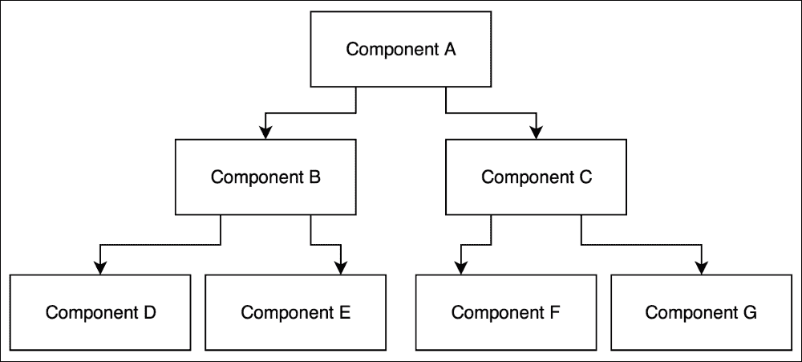

# 第四章，创建第一个 React 组件

在上一章中，您学习了如何创建 React 元素以及如何使用它们来呈现 HTML 标记。您看到了使用 JSX 生成 React 元素是多么容易。在这一点上，您已经对 React 有了足够的了解，可以创建静态网页，我们在[第 3 章](03.html "Chapter 3. Creating Your First React Element")*创建您的第一个 React 元素*中讨论了这一点。然而，我打赌这不是你决定学习反应的原因。您不希望只构建由静态 HTML 元素组成的网站。您希望构建对用户和服务器事件做出反应的交互式用户界面。对事件作出反应意味着什么？静态 HTML 元素**如何反应**？元素如何反应？在本章中，我们将在介绍 React 组件的同时回答这些问题和许多其他问题。

# 无状态与有状态

反应意味着从一种状态切换到另一种状态。这意味着你首先需要有一个状态，并且有能力改变这个状态。我们是否在 React 元素中提到了一种状态或改变这种状态的能力？不，他们是无国籍的。它们的唯一目的是构造和呈现虚拟 DOM 元素。事实上，我们希望它们以完全相同的方式渲染，因为我们为它们提供了完全相同的参数集。我们希望它们是一致的，因为这使我们很容易对它们进行推理。这是使用 React 的一个关键好处，它可以简化对 web 应用程序工作方式的推理。

如何向无状态元素添加状态？如果我们不能将状态封装在 React 元素中，那么我们应该将 React 元素封装在已经具有状态的东西中。想象一个代表用户界面的简单状态机。每个用户操作都会触发状态机中的状态变化。每个状态都由不同的 React 元素表示。在 React 中，此状态机称为**React 组件**。

# 创建第一个无状态 React 组件

在下面的例子中，我们来看看如何创建一个反应组件：

```jsx
import React, { Component } from 'react';
import ReactDOM from 'react-dom';

class ReactClass extends Component {
  render () {
    return (
      <h1 className="header">React Component</h1>
    );
  }
}

const reactComponent = ReactDOM.render(
  <ReactClass/>,
  document.getElementById('react-application')
);
export default ReactClass;
```

前面的一些代码对您来说应该已经很熟悉了，其余的代码可以分解为两个简单的步骤：

1.  创建 React 组件类。
2.  创建一个 React 组件。

让我们仔细看看我们如何创建一个反应组件：

1.  创建一个`ReactClass`类作为`Component`类的子类。在本章中，我们将重点学习如何更详细地创建 React 组件类。
2.  通过调用`ReactDOM.render()`函数并提供我们的`ReactClass`元素作为其元素参数来创建`reactComponent`。

我强烈建议您阅读 Dan Abramov 的这篇博文，其中更详细地解释了 React 组件、元素和实例之间的差异：[https://facebook.github.io/react/blog/2015/12/18/react-components-elements-and-instances.html](https://facebook.github.io/react/blog/2015/12/18/react-components-elements-and-instances.html)

我们的 React 组件的外观在`ReactClass`中声明。

`Component`类封装组件的状态并描述如何呈现组件。React 组件类至少需要有一个`render()`方法，以便返回`null`或`false`。以下是最简单形式的`render()`方法示例：

```jsx
class ReactClass extends Component {
  render() {
    return null;
  }
}
```

正如您所猜测的，`render()`方法负责告诉 React 这个组件应该呈现什么。它可以返回`null`，如上例所示，屏幕上不会呈现。或者，它可以返回我们在[第 3 章](03.html "Chapter 3. Creating Your First React Element")*创建第一个 React 元素*中学习的 JSX 元素：

```jsx
class ReactClass extends Component {
  render() {
    return (
      <h1 className="header">React Component</h1>
    );
  }
}
```

这个例子展示了如何将 React 元素封装在 React 组件中。我们创建一个具有`className`属性和一些文本作为其子元素的`h1`元素。然后，我们在调用`render()`方法时返回它。我们将 React 元素封装在 React 组件中这一事实并不影响它的渲染方式：

```jsx
<h1 data-reactroot class="header">React Component</h1>
```

如您所见，生成的 HTML 标记与我们在[第 3 章](03.html "Chapter 3. Creating Your First React Element")中创建的标记相同*创建第一个 React 元素*，而不使用 React 组件。在这种情况下，您可能会想，如果我们可以在没有`render()`方法的情况下呈现完全相同的标记，那么使用`render()`方法有什么好处？

使用`render()`方法的优点是，与任何其他函数一样，在返回值之前，它可以选择要返回的值。到目前为止，您已经看到了两个`render()`方法的示例：一个返回`null`，另一个返回 React 元素。我们可以将两者合并，并添加一个决定渲染内容的条件：

```jsx
class ReactClass extends Component {
  render() {
    const componentState = {
      isHidden: true
    };

    if (componentState.isHidden) {
      return null;
    }

    return (
      <h1 className="header">React Component</h1>
    );
  }
}
```

在本例中，我们创建了引用具有单个`isHidden`属性的对象的`componentState`常量。此对象充当 React 组件的状态。如果我们想隐藏我们的反应成分，那么我们需要将`componentState.isHidden`的值设置为`true`，我们的`render`函数将返回`null`。在这种情况下，React 将不渲染任何内容。从逻辑上讲，将`componentState.isHidden`设置为`false`，将返回 React 元素并呈现预期的 HTML 标记。您可能会问，我们如何将`componentState.isHidden`的值设置为`false`？还是到`true`？或者我们通常如何改变它？

让我们想想我们可能想要改变这种状态的场景。其中之一是当用户与我们的用户界面交互时。另一个是服务器发送数据时。或者，当一段时间过去了，现在，我们想要渲染其他东西。我们的`render()`方法不知道所有这些事件，也不应该知道，因为它的唯一目的是基于我们传递给它的数据返回 React 元素。我们如何向它传递数据？

有两种方法可以使用 React API 将数据传递给`render()`方法：

*   `this.props`
*   `this.state`

这里，`this.props`对你来说应该很熟悉。在[第三章](03.html "Chapter 3. Creating Your First React Element")*创建**您的第一个 React 元素*中，您了解到`React.createElement()`函数接受`props`参数。我们使用它将属性传递给 HTML 元素，但我们没有讨论场景后面会发生什么，以及为什么传递给`props`对象的属性会被渲染。

您放入`props`对象并传递给 JSX 元素的任何数据都可以通过`this.props`在`render()`方法内部访问。一旦您从`this.props`访问数据，您就可以呈现它：

```jsx
class ReactClass extends Component {
  render() {
    const componentState = {
      isHidden: false
    };

    if (componentState.isHidden) {
      return null;
    }

    return (
      <h1 className="header">{this.props.header}</h1>
    );
  }
}
```

在本例中，我们在`render()`方法中使用`this.props`来访问`header`属性。然后，我们将把`this.props.header`作为一个孩子直接传递给`h1 element`。

在上例中，我们可以将`isHidden`的值作为`this.props`对象的另一个属性传递：

```jsx
class ReactClass extends Component {
  render() {
    if (this.props.isHidden) {
      return null;
    }

    return (
      <h1 className="header">{this.props.header}</h1>
    );
  }
}
```

注意，在这个例子中，我们重复了两次`this.props`。一个`this.props`对象有我们想在`render`方法中多次访问的属性是很常见的。因此，我建议您首先对`this.props`进行分解：

```jsx
class ReactClass extends Component {
  render() {
    const {
      isHidden,
      header
    } = this.props;

    if (isHidden) {
      return null;
    }

    return (
      <h1 className="header">{this.header}</h1>
    );
  }
}
```

您是否注意到，在上一个示例中，我们不是通过`render()`方法存储`isHidden`，而是通过`this.props`传递它？我们删除了`componentState`对象，因为在`render()`方法中我们不需要担心组件的状态。`render()`方法不应该改变组件的状态或访问真实的 DOM，或者与 web 浏览器交互。我们可能希望在没有 web 浏览器的服务器上呈现 React 组件，并且我们应该期望`render()`方法在不考虑环境的情况下产生相同的结果。

如果我们的`render()`方法无法管理状态，那么我们如何管理它？如何设置状态，以及如何在 React 中处理用户或浏览器事件时更新状态？

在本章前面，您了解到在 React 中，我们可以用 React 组件表示用户界面。有两种类型的反应组件：

*   与一个国家
*   没有国家

等等我们不是说过 React 组件是状态机吗？当然，每个状态机都需要有一个状态。您是正确的，但是，将尽可能多的 React 组件保持为无状态是一个好的做法。

React 组件是可组合的。因此，我们可以有一个 React 组件的层次结构。假设我们有一个父 React 组件，它有两个子组件，而每个子组件又有另外两个子组件。所有组件都是有状态的，它们可以管理自己的状态：



如果层次结构中的顶部组件更新其状态，那么确定层次结构中最后一个子组件将渲染什么将有多容易？不容易。有一种设计模式可以消除这种不必要的复杂性。这个想法是通过两个关注点来分离组件：如何处理用户界面交互逻辑和如何呈现数据。

*   少数 React 组件是有状态的。它们应该位于组件层次结构的顶部。它们封装了所有的交互逻辑，管理用户界面状态，并使用`props`将该状态沿层次结构传递给无状态组件。
*   大多数 React 组件都是无状态的。它们通过`this.props`接收其父组件的状态数据，并相应地呈现该数据。

在前面的示例中，我们通过`this.props`接收`isHidden`状态数据，然后呈现该数据。我们的组件是无状态的。

接下来，让我们创建第一个有状态组件。

# 创建第一个有状态的 React 组件

有状态组件是应用程序处理交互逻辑和管理状态的最合适位置。它们使您更容易对应用程序的工作方式进行推理。这种推理在构建可维护的 web 应用程序中起着关键作用。

React 将组件的状态存储在`this.state`对象中。我们将`this.state`的初始值指定为`Component`类的公共类字段：

```jsx
class ReactClass extends React.Component {
  state = {
    isHidden: false
  };

  render() {
    const {
      isHidden
    } = this.state;

    if (isHidden) {
      return null;
    }

    return (
      <h1 className="header">React Component</h1>
    );
  }
}
```

现在，`{ isHidden: false }`是 React 组件和用户界面的初始状态。注意，在我们的`render()`方法中，我们现在从`this.state`而不是`this.props`解构`isHidden`属性。

在本章前面，您了解到我们可以通过`this.props`或`this.state`将数据传递给组件的`render()`函数。这两者的区别是什么？

*   `this.props`：存储从父级传递的只读数据。它属于父级并且不能被其子级更改。这些数据应该被认为是不可变的。
*   `this.state`：存储组件私有的数据。它可以由组件更改。当状态更新时，组件将重新呈现自身。

我们如何更新组件的状态？您可以使用`setState(nextState, callback)`通知 React 状态更改。此函数采用两个参数：

*   表示下一个状态的`nextState`对象。它也可以是一个签名为`function(prevState, props) => newState`的函数。此函数接受两个参数：previous state 和 properties，并返回表示新状态的对象。
*   `callback`功能，您很少需要使用它，因为 React 可以让您的用户界面保持最新。

React 如何使您的用户界面保持最新？每次您更新组件的状态时，它都会调用组件的`render()`函数，包括重新呈现的所有子组件。事实上，每次调用`render()`函数时，它都会重新呈现整个虚拟 DOM。

当您调用`this.setState()`函数并向其传递表示下一个状态的数据对象时，React 会将该下一个状态与当前状态合并。在合并过程中，React 将用下一个状态覆盖当前状态。未被下一状态覆盖的当前状态将成为下一状态的一部分。

假设这是我们当前的状态：

```jsx
{
  isHidden: true,
  title: 'Stateful React Component'
}
```

我们称之为`this.setState(nextState)`，其中`nextState`如下：

```jsx
{
  isHidden: false
}
```

React 将两个状态合并为一个新状态：

```jsx
{
  isHidden: false,
  title: 'Stateful React Component'
}
```

`isHidden`属性已更新，`title`属性未被删除或以任何方式更新。

现在我们知道了如何更新组件的状态，让我们创建一个对用户事件做出反应的有状态组件：

在本例中，我们将创建一个显示和隐藏标题的切换按钮。我们要做的第一件事是设置初始状态对象。我们的初始状态有两个属性：`isHeaderHidden`设置为`false`，标题设置为`Stateful React Component`。现在，我们可以通过`this.state`在`render()`方法中访问此状态对象。在我们的`render()`方法中，我们创建了三个反应元素：`h1`、`button`和`div`。我们的`div`元素充当`h1`和`button`元素的父元素。但是，在一种情况下，我们创建的`div`元素有两个子元素`header`和`button`元素，而在另一种情况下，我们只创建了一个子元素`button`。我们选择的案例取决于`this.state.isHeaderHidden`的值。组件的当前状态直接影响`render()`函数将呈现的内容。虽然这对您来说应该很熟悉，但在这个示例中有一些我们以前没有见过的新内容。

注意，我们在组件类中添加了一个名为`handleClick()`的新方法。`handleClick()`方法对反应没有特殊意义。它是我们应用程序逻辑的一部分，我们使用它来处理`onClick`事件。您也可以将自己的自定义方法添加到 React 组件类中，因为它只是一个 JavaScript 类。所有这些方法都可以通过`this`引用获得，您可以在组件类中的任何方法中访问该引用。例如，我们通过`render()`和`handleClick()`方法中的`this.state`访问状态对象。

我们的`handleClick()`方法做什么？它通过切换`isHeaderHidden`属性来更新组件的状态：

```jsx
this.setState(prevState => ({
  isHeaderHidden: !prevState.isHeaderHidden
}));
```

我们的`handleClick()`方法对用户与我们的用户界面的交互作出反应。我们的用户界面是一个`button`元素，用户可以点击它，我们可以向它附加一个事件处理程序。在 React 中，您可以通过将事件处理程序传递给 JSX 属性将其附加到组件：

```jsx
<button onClick={this.handleClick}>
  Toggle Header
</button>
```

React 对事件处理程序使用**camelCase**命名约定，例如`onClick`。您可以在[找到所有受支持事件的列表 http://facebook.github.io/react/docs/events.html#supported-事件](http://facebook.github.io/react/docs/events.html#supported-events)。

默认情况下，React 会在冒泡阶段触发事件处理程序，但您可以通过在事件名称后面添加`Capture`来告知 React 会在捕获阶段触发它们，例如`onClickCapture`。

React 将浏览器的本机事件包装到`SyntheticEvent`对象中，以确保所有受支持的事件在 Internet Explorer 8 及更高版本中的行为相同。

`SyntheticEvent`对象提供与本机浏览器事件相同的 API，这意味着您可以像往常一样使用`stopPropagation()`和`preventDefault()`方法。如果出于某种原因，您需要访问该本机浏览器的事件，那么您可以通过`nativeEvent`属性进行访问。

请注意，在前面的示例中，将`onClick`属性传递给我们的`createElement()`函数不会在呈现的 HTML 标记中创建内联事件处理程序：

```jsx
<button class="btn btn-default">Toggle header</button>
```

这是因为 React 实际上并不将事件处理程序附加到 DOM 节点本身。相反，React 使用单个事件侦听器在顶层侦听所有事件，并将它们委托给相应的事件处理程序。

在前面的示例中，您学习了如何创建一个有状态的 React 组件，用户可以与之交互并更改其状态。我们为`click`事件创建并附加了一个事件处理程序，用于更新`isHeaderHidden`属性的值。但是您是否注意到，用户交互不会更新我们存储在状态中的另一个属性`title`的值。你觉得奇怪吗？我们所在州的数据从未改变过。这一观察提出了一个重要问题；我们*不应该*在我们的州放什么？

问问自己，“我可以从组件的状态中删除哪些数据，并使其用户界面始终保持最新？”继续询问并不断删除这些数据，直到您完全确定没有什么可以删除，而不会破坏您的用户界面。

在我们的示例中，我们的状态对象中有`title`属性，我们可以移动到`render()`方法，而不会破坏切换按钮的交互性。该组件仍将按预期工作：

```jsx
class ReactClass extends Component {
  state = {
    isHeaderHidden: false
  }

  handleClick = () => {
    this.setState(prevState => ({
      isHeaderHidden: !prevState.isHeaderHidden
    }));
  }

  render() {
    const {
      isHeaderHidden
    } = this.state;

    if (isHeaderHidden) {
      return (
        <button
          className="btn ban-default"
          onClick={this.handleClick}
        >
          Toggle Header
        </button>
      );
    }

    return (
      <div>
        <h1 className="header">Stateful React Component</h1>
        <button
          className="btn ban-default"
          onClick={this.handleClick}
        >
          Toggle Header
        </button>
      </div>
    );
  }
}
```

另一方面，如果我们将`isHeaderHidden`属性移出状态对象，那么我们将破坏组件的交互性，因为我们的`render()`方法不会在用户每次单击我们的按钮时自动触发。这是一个中断交互的示例：

```jsx
class ReactClass extends Component {
  state = {}
  isHeaderHidden = false

  handleClick = () => {
    this.isHeaderHidden = !this.isHeaderHidden;
  }

  render() {
    if (this.isHeaderHidden) {
      return (
        <button
          className="btn ban-default"
          onClick={this.handleClick}
        >
          Toggle Header
        </button>
      );
    }

    return (
      <div>
        <h1 className="header">Stateful React Component</h1>
        <button
          className="btn ban-default"
          onClick={this.handleClick}
        >
          Toggle Header
        </button>
      </div>
    );
  }
}
```

### 注

**注**：为了更好的输出结果，请参考代码文件。

这是一个反模式。

记住这个经验法则：组件的状态应该存储组件的事件处理程序可能随时间改变的数据，以便重新呈现组件的用户界面并使其保持最新。在`state`对象中保留组件状态的最小可能表示，并根据组件`render()`方法中的`state`和`props`计算其余数据。利用 React 将在组件状态更改时重新呈现组件这一事实。

# 总结

在本章中，您达到了一个重要的里程碑：您学习了如何通过创建 React 组件来封装状态和创建交互式用户界面。我们讨论了无状态和有状态的 React 组件以及它们之间的区别。我们讨论了浏览器事件以及如何在 React 中处理它们。

在下一章中，您将了解 React 16 的新增功能。