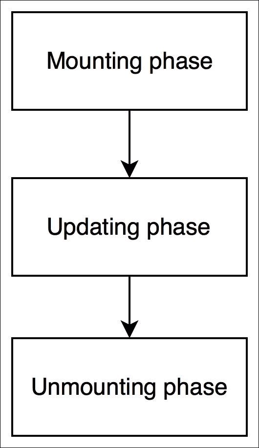

# 六、将您的 React 组件与另一个库一起使用

React 是一个构建用户界面的强大库。如果我们想将它与另一个负责接收数据的库集成，该怎么办？在上一章中，我们概述了 Snapterest web 应用应该能够执行的五项任务。我们认为其中四个与用户界面有关，但其中一个与接收数据有关：实时接收来自 Snapkite 引擎服务器的推文。

在本章中，您将学习如何将 React 与外部 JavaScript 库集成，以及 React 组件生命周期方法是什么，同时解决接收数据的重要任务。

# 在 React 组件中使用另一个库

正如我们在本书前面所讨论的，我们的 Snapterest web 应用将使用实时推特流。在[第 2 章](02.html "Chapter 2. Installing Powerful Tools for Your Project")*为您的项目*安装强大的工具时，您安装了**Snapkite 引擎**库，该库连接到 Twitter 流媒体 API，过滤传入的推文，并将其发送到我们的客户端应用。反过来，我们的客户端应用需要一种连接到该实时流并监听新 tweet 的方式。

幸运的是，我们不需要自己实现这个功能，因为我们可以重用另一个名为`snapkite-stream-client`的 Snapkite 模块。让我们安装此模块：

1.  导航到`~/snapterest`目录并运行以下命令：

    ```jsx
    npm install --save snapkite-stream-client

    ```

2.  这将安装`snapkite-stream-client`模块，并将其作为依赖项添加到`package.json`。
3.  现在我们准备在我们的一个 React 组件中重用`snapkite-stream-client`模块。

在上一章中，我们创建了具有两个子组件的`Application`组件：`Stream`和`Collection`。在本章中，我们将创建`Stream`组件。

让我们从创建`~/snapterest/source/components/Stream.js`文件开始：

```jsx
import React, { Component } from 'react';
import SnapkiteStreamClient from 'snapkite-stream-client';
import StreamTweet from './StreamTweet';
import Header from './Header.react';

class Stream extends Component {
  state = {
    tweet: null
  }

  componentDidMount() {
    SnapkiteStreamClient.initializeStream(this.handleNewTweet);
  }

  componentWillUnmount() {
    SnapkiteStreamClient.destroyStream();
  }

  handleNewTweet = (tweet) => {
    this.setState({
      tweet: tweet
    });
  }

  render() {
    const { tweet } = this.state;
    const { onAddTweetToCollection } = this.props; 
    const headerText = 'Waiting for public photos from Twitter...';

    if (tweet) {
      return (
        <StreamTweet
          tweet={tweet}
           onAddTweetToCollection={onAddTweetToCollection}
        />
      );
    }

    return (
      <Header text={headerText}/>
    );
  }
}

export default Stream;
```

首先，我们将导入`Stream`组件所依赖的以下模块：

*   `React`和`ReactDOM`：这是 React 库的一部分
*   `StreamTweet`和`Header`：这些是反应组分
*   `snapkite-stream-client`：这是一个图书馆

然后，我们将定义我们的 React 组件。让我们看看我们的 To.T0.组件实现的方法：

*   `componentDidMount()`
*   `componentWillUnmount()`
*   `handleNewTweet()`
*   `render()`

我们已经熟悉了`render()`方法。`render()`方法是 React API 的一部分。您已经知道，任何 React 组件都必须至少实现`render()`方法。让我们来看看我们的 To4T4 组件的方法：

```jsx
render() {
  const { tweet } = this.state;
  const { onAddTweetToCollection } = this.props;
  const headerText = 'Waiting for public photos from Twitter...';

  if (tweet) {
    return (
      <StreamTweet
        tweet={tweet}
        onAddTweetToCollection={onAddTweetToCollection}
      />
    );
  }

  return (
    <Header text={headerText}/>
  );
}
```

如您所见，我们创建了一个新的`tweet`常量，该常量引用`tweet`属性，该属性是组件状态对象的一部分。然后，我们将检查该变量是否引用了实际的`tweet`对象，如果引用了，我们的`render()`方法将返回`StreamTweet`组件，否则将返回`Header`组件。

`StreamTweet`组件呈现一个标题和来自流的最新 tweet，而`Header`组件仅呈现一个标题。

您是否注意到我们的`Stream`组件本身不渲染任何内容，而是返回两个其他组件中的一个，这两个组件执行实际渲染？`Stream`组件的目的是封装我们应用的逻辑，并将呈现委托给其他组件。在 React 中，您应该至少有一个组件封装应用的逻辑，并存储和管理应用的状态。这通常是根组件或组件层次结构中的高级组件之一。如果可能，所有其他子组件都不应有状态。如果你认为所有的反应组分都是`Views`，那么我们的`Stream`组分就是`ControllerView`组分。

我们的`Stream`组件将收到源源不断的新 tweet，每次收到新 tweet 时，它都需要重新呈现其子组件。为了实现这一点，我们需要将当前 tweet 存储在组件的状态中。一旦我们更新了它的状态，React 将调用它的`render()`方法并重新呈现它的所有子组件。为此，我们将实施`handleNewTweet()`方法：

```jsx
handleNewTweet = (tweet) => {
  this.setState({
    tweet: tweet
  });
}
```

`handleNewTweet()`方法接受`tweet`对象，并将其设置为组件状态`tweet`属性的新值。

那条新的推特是从哪里来的，什么时候来的？让我们看看我们的方法：

```jsx
componentDidMount() {
  SnapkiteStreamClient.initializeStream(this.handleNewTweet);
}
```

此方法调用`SnapkiteStreamClient`对象的`initializeStream()`属性，并传递`this.handleNewTweet`回调函数作为其参数。`SnapkiteStreamClient`是一个带有 API 的外部库，我们使用它初始化推文流。对于`SnapkiteStreamClient`收到的每一条新 tweet，`this.handleNewTweet`方法都将被调用。

为什么我们把这个方法命名为`componentDidMount()`？我们没有。我做了。事实上，`componentDidMount()`方法是 React API 的一部分。这是 React 组件的生命周期方法之一。它只调用一次，在 React 完成组件的初始渲染后立即调用。此时，React 已经创建了一个 DOM 树，它由我们的组件表示，现在我们可以使用另一个 JavaScript 库访问该 DOM。

`componentDidMount()`库是将 React 与另一个 JavaScript 库集成的理想场所。这是我们使用外部`SnapkiteStreamClient`库连接到推特流的地方。

现在我们知道了什么时候在 React 组件中初始化外部 JavaScript 库，但是我们应该在什么时候取消初始化并清理我们在`componentDidMount()`方法中所做的一切呢？在卸载组件之前，最好先清理所有东西。为此，React API 为我们提供了另一种组件生命周期方法-“T1”：

```jsx
componentWillUnmount() {
  SnapkiteStreamClient.destroyStream();
}
```

在 React 卸载组件之前，React 会调用`componentWillUnmount()`方法。正如您在`componentWillUnmount()`方法中看到的，您正在调用`SnapkiteStreamClient`对象的`destroyStream()`属性。`destroyStream()`属性清理了我们与`SnapkiteStreamClient`的连接，我们可以安全地卸载`Stream`组件。

您可能想知道组件生命周期方法是什么，以及我们为什么需要它们。

# 了解 React 组件的生命周期方法

想想 React 组件的作用是什么？它描述了要渲染的内容。我们知道它使用了`render()`方法。但是，有时，仅使用`render()`方法是不够的，因为如果我们想在组件渲染之前或之后执行某些操作，该怎么办？如果我们希望能够决定是否应该调用组件的`render()`方法，该怎么办？

看起来我们描述的是一个过程，在这个过程中，React 组件被渲染。此过程有不同的阶段，例如，渲染前、渲染后和渲染后。在 React 中，此过程称为**组件的生命周期**。每个反应组分都经过这个过程。我们想要的是一种与该过程挂钩的方法，并在该过程的不同阶段调用我们自己的函数，以便更好地控制它。为此，React 提供了许多方法，当组件生命周期过程中的某个阶段发生时，我们可以使用这些方法获得通知。这些方法称为**组件的生命周期方法**。它们是按可预测的顺序调用的。

所有 React 组件的生命周期方法可分为三个阶段：

*   **安装**：该阶段发生在组件插入 DOM 时
*   **更新**：此阶段发生在组件被重新呈现到虚拟 DOM 时，以确定是否需要更新实际 DOM
*   **卸载**：此阶段发生在组件从 DOM 中移除时：



在 React 的术语中，将组件插入 DOM 称为“装载”，而从 DOM 中移除组件称为“卸载”

了解 React 组件的生命周期方法的最佳方法是查看它们的运行情况。让我们创建我们在本章前面讨论过的`StreamTweet`组件。此组件将实现 React 的大多数生命周期方法。

导航到`~/snapterest/source/components/`并创建`StreamTweet.js`文件：

```jsx
import React, { Component } from 'react';
import Header from './Header';
import Tweet from './Tweet';

class StreamTweet extends Component {

  // define other component lifecycle methods here

  render() {
    console.log('[Snapterest] StreamTweet: Running render()');

    const { headerText } = this.state;
    const { tweet, onAddTweetToCollection } = this.props;

    return (
      <section>
        <Header text={headerText} />
        <Tweet
          tweet={tweet}
          onImageClick={onAddTweetToCollection}
        />
      </section>
    );
  }
}

export default StreamTweet;
```

如您所见，`StreamTweet`组件除了`render()`之外，还没有生命周期方法。我们将在前进中一个接一个地创建和讨论它们。

这四种方法是在组件*安装*阶段调用的，如下图所示：


如上图所示，调用的方法如下：

*   `constructor()`
*   `componentWillMount()`
*   `render()`
*   `componentDidMount()`

在本章中，我们将讨论这四种方法中的两种（除了`render()`。当组件插入 DOM 时，它们只被调用一次。让我们仔细看看他们每一个。

## 安装方式

现在让我们来看一些有用的安装方法。

### 组件安装方法

第二次调用`componentWillMount()`方法。在 React 将组件插入 DOM 之前立即调用*。在`StreamTweet`组件中的`constructor()`方法之后添加此代码：*

```jsx
componentWillMount() {
  console.log('[Snapterest] StreamTweet: 1\. Running componentWillMount()');

  this.setState({
    numberOfCharactersIsIncreasing: true,
    headerText: 'Latest public photo from Twitter'
  });

  window.snapterest = {
    numberOfReceivedTweets: 1,
    numberOfDisplayedTweets: 1
  };
}
```

我们用这种方法做了很多事情。首先，我们记录正在调用此方法的事实。事实上，为了演示，我们将记录该组件的每个组件生命周期方法。当您在 web 浏览器中运行此代码时，您应该能够打开 JavaScript 控制台，并看到这些日志消息按预期的升序打印。

接下来，我们使用`this.setState()`方法更新组件的状态：

*   将`numberOfCharactersIsIncreasing`属性设置为`true`
*   将`headerText`属性设置为`'Latest public photo from Twitter'`

因为这是该组件将呈现的第一条 tweet，所以我们知道字符数肯定会从零增加到第一条 tweet 中的字符数。因此，我们将其设置为`true`。我们还将默认文本分配给标题`'Latest public photo from Twitter'`。

如您所知，调用`this.setState()`方法会触发组件的`render()`方法，因此在组件的安装阶段`render()`似乎会被调用两次。但是，在本例中，React 知道尚未呈现任何内容，因此它只会调用一次`render()`方法。

最后，在这个方法中，我们定义了一个具有以下两个属性的`snapterest`全局对象：

*   `numberOfReceivedTweets`：此属性统计所有接收推文的数量
*   `numberOfDisplayedTweets`：此属性仅统计显示的推文数量

我们将`numberOfReceivedTweets`设置为`1`，因为我们知道`componentWillMount()`方法在收到第一条 tweet 时只调用一次。我们也知道，我们的`render()`方法将在第一条推文中调用，因此我们也将`numberOfDisplayedTweets`设置为`1`：

```jsx
window.snapterest = {
  numberOfReceivedTweets: 1,
  numberOfDisplayedTweets: 1
};
```

这个全局对象不是 React 或 web 应用逻辑的一部分；我们可以移除它，一切都会像预期的那样工作。在前面的代码中，`window.snapterest`是一个方便的工具，用于跟踪我们在任何时间点处理了多少条 tweet。我们使用全局`window.snapterest`对象仅用于演示目的。我强烈建议您不要在实际项目中将自己的属性添加到全局对象中，因为您可能会覆盖现有属性，和/或您的属性稍后可能会被您不拥有的其他 JavaScript 代码覆盖。稍后，如果您决定在生产环境中部署 Snapterest，请确保从`StreamTweet`组件中删除全局`window.snapterest`对象和相关代码。

在 web 浏览器中查看 Snapterest 几分钟后，可以打开 JavaScript 控制台并键入`snapterest.numberOfReceivedTweets`和`snapterest.numberOfDisplayedTweets`命令。这些命令将输出数字，帮助您更好地了解新推文的发布速度，以及其中有多少未显示。在下一个组件生命周期方法中，我们将向`window.snapterest`对象添加更多属性。

### 组件安装方法

在 React 将组件插入 DOM 后，立即调用`componentDidMount()`方法*。更新后的 DOM 现在可以访问，这意味着此方法是初始化需要访问该 DOM 的其他 JavaScript 库的最佳位置。*

在本章前面，我们使用初始化外部`snapkite-stream-client`JavaScript 库的`componentDidMount()`方法创建了`Stream`组件。

让我们来看看这个组件的 Tyt0.方法。在`componentWillMount()`方法之后，向您的`StreamTweet`组件添加以下代码：

```jsx
componentDidMount = () => {
  console.log('[Snapterest] StreamTweet: 3\. Running componentDidMount()');

  const componentDOMRepresentation = ReactDOM.findDOMNode(this);

  window.snapterest.headerHtml = componentDOMRepresentation.children[0].outerHTML;
  window.snapterest.tweetHtml = componentDOMRepresentation.children[1].outerHTML;
}
```

这里，我们使用`ReactDOM.findDOMNode()`方法引用表示`StreamTweet`组件的 DOM。我们传递引用当前组件的`this`参数（在本例中为`StreamTweet`。`componentDOMRepresentation`常量引用我们可以遍历的 DOM 树，从而访问它的各种属性。为了更好地理解 DOM 树的外观，让我们仔细看看我们的 To6 T6 组件的方法：

```jsx
render() {
  console.log('[Snapterest] StreamTweet: Running render()');

  const { headerText } = this.state;
  const { tweet, onAddTweetToCollection } = this.props;

  return (
    <section>
      <Header text={headerText} />
      <Tweet
        tweet={tweet}
        onImageClick={onAddTweetToCollection}
      />
    </section>
  );
}
```

使用 JSX 的最大好处之一是，只需查看组件的`render()`方法，我们就可以轻松确定组件将拥有多少子元素。在这里，我们可以看到父`<section>`元素有两个子组件：`<Header/>`和`<Tweet/>`。

因此，当我们使用 DOM API`children`属性遍历生成的 DOM 树时，我们可以确定它也将有两个子元素：

*   `componentDOMRepresentation.children[0]`：这是我们`<Header />`组件的 DOM 表示
*   `componentDOMRepresentation.children[1]`：这是我们`<Tweet />`组件的 DOM 表示

每个元素的`outerHTML`属性获取表示每个元素的 DOM 树的 HTML 字符串。为了方便起见，我们将这个 HTML 字符串分配给我们的全局`window.snapterest`对象，正如我们在本章前面讨论的那样。

如果您正在使用另一个 JavaScript 库，例如**jQuery**以及 React，那么可以使用`componentDidMount()`方法将两者集成起来。如果您想要发送 AJAX 请求，或者使用`setTimeout()`或`setInterval()`函数设置计时器，那么您也可以使用这种方法。通常，`componentDidMount()`应该是您将 React 库与非 React 库和 API 集成的首选组件生命周期方法。

到目前为止，在本章中，您已经了解了 React 组件为我们提供的基本安装方法。我们在`StreamTweet`组件中使用了这三种方法。我们还讨论了`StreamTweet`组件的`render()`方法。这就是我们需要知道的，以理解 React 最初如何呈现`StreamTweet`组件。在第一次渲染时，React 将执行以下方法序列：

*   `componentWillMount()`
*   `render()`
*   `componentDidMount()`

这称为 React 组件的**安装阶段**。它只执行一次，除非我们卸载一个组件并再次装载它。

接下来，我们来讨论 React 组件的**卸载阶段**。

## 拆卸方法

现在让我们来看一种流行的卸载方法。

### 组件将采用卸载方法

React 在此阶段仅提供一种方法，即`componentWillUnmount()`。在 React 从 DOM 中删除组件并销毁它之前，会立即调用*。此方法可用于清理组件安装或更新阶段创建的任何数据。这正是我们在`StreamTweet`组件中所做的。在`componentDidMount()`方法之后，将此代码添加到您的`StreamTweet`组件：*

```jsx
componentWillUnmount() {
  console.log('[Snapterest] StreamTweet: 8\. Running componentWillUnmount()');

  delete window.snapterest;
}
```

在`componentWillUnmount()`方法中，我们使用`delete`操作符删除我们的全局`window.snapterest`对象：

```jsx
delete window.snapterest;
```

移除`window.snapterest`将保持我们的全局对象干净。如果您在`componentDidMount()`方法中创建了任何额外的 DOM 元素，那么`componentWillUnmount()`方法是移除它们的好地方。您可以将`componentDidMount()`和`componentWillUnmount()`方法视为将 React 组件与另一个 JavaScript API 集成的两步机制：

1.  在`componentDidMount()`方法中初始化。
2.  在`componentWillUnmount()`方法中终止。

这样，需要使用 DOM 的外部 JavaScript 库将与 React 呈现的 DOM 保持同步。

这就是高效卸载 React 组件所需的全部知识。

# 总结

在本章中，我们创建了`Stream`组件，并学习了如何将 React 组件与外部 JavaScript 库集成。您还了解了 React 组件的生命周期方法。我们还详细讨论了安装和卸载方法，并开始实现`StreamTweet`组件。

在下一章中，我们将了解组件生命周期的更新方法。我们还将实现我们的`Header`和`Tweet`组件，并学习如何设置组件的默认属性。