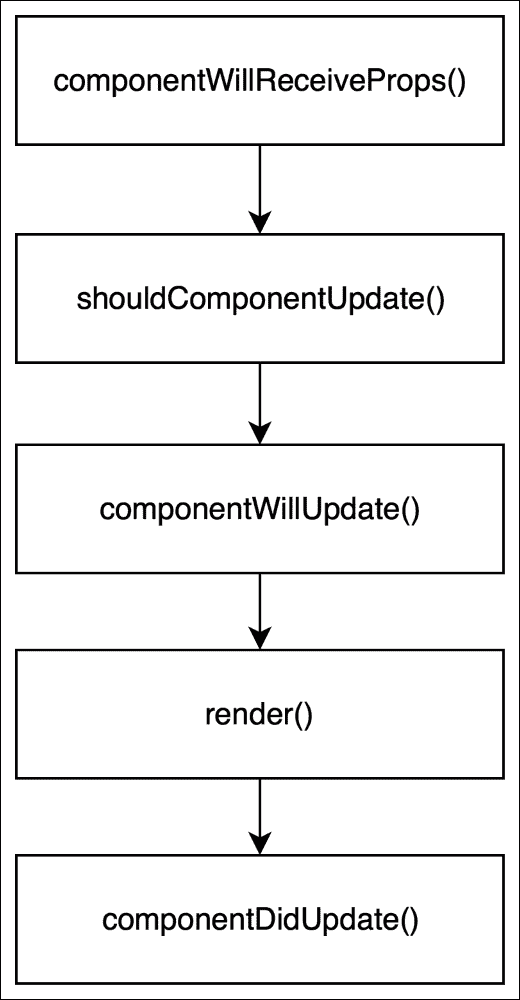

# 七、更新您的 React 组件

在上一章中，您了解了 React 组件可以经历三个阶段：

*   安装
*   更新
*   卸载

我们已经讨论了安装和卸载阶段。在本章中，我们将重点介绍更新阶段。在此阶段，React 组件已经插入到 DOM 中。此 DOM 表示组件的当前状态，当该状态更改时，React 需要评估新状态将如何改变先前呈现的 DOM。

React 为我们提供了一些方法，可以影响更新期间将要呈现的内容，以及了解更新发生的时间。这些方法允许我们控制从当前组件状态到下一个组件状态的转换。让我们进一步了解 React 组件更新方法的强大特性。

# 了解组件生命周期更新方法

React 组件有五种生命周期方法，属于组件*更新*阶段：

*   `componentWillReceiveProps()`
*   `shouldComponentUpdate()`
*   `componentWillUpdate()`
*   `render()`
*   `componentDidUpdate()`

请参见下图，以便更好地查看：



您已经熟悉了`render()`方法。现在我们来讨论其他四种方法。

## 组件将接受 PROPS 方法

我们将从`StreamTweet`组件中的`componentWillReceiveProps()`方法开始。在`StreamTweet.js`文件中`componentDidMount()`方法后添加以下代码：

```jsx
componentWillReceiveProps(nextProps) {
  console.log('[Snapterest] StreamTweet: 4\. Running componentWillReceiveProps()');

  const { tweet: currentTweet } = this.props;
  const { tweet: nextTweet } = nextProps;

  const currentTweetLength = currentTweet.text.length;
  const nextTweetLength = nextTweet.text.length;
  const isNumberOfCharactersIncreasing = (nextTweetLength > currentTweetLength);
  let headerText;

  this.setState({
    numberOfCharactersIsIncreasing: isNumberOfCharactersIncreasing
  });

  if (isNumberOfCharactersIncreasing) {
    headerText = 'Number of characters is increasing';
  } else {
    headerText = 'Latest public photo from Twitter';
  }

  this.setState({
    headerText
  });

  window.snapterest.numberOfReceivedTweets++;
}
```

此方法首先在组件生命周期的更新阶段调用。当组件从其父组件接收到新属性时，调用它。

此方法为我们提供了一个使用`this.props`对象比较当前组件属性和使用`nextProps`对象比较下一个组件属性的机会。基于这种比较，我们可以选择使用`this.setState()`函数更新组件的状态，在这种情况下不会触发额外的渲染。

让我们看看实际情况：

```jsx
const { tweet: currentTweet } = this.props;
const { tweet: nextTweet } = nextProps;

const currentTweetLength = currentTweet.text.length;
const nextTweetLength = nextTweet.text.length;
const isNumberOfCharactersIncreasing = (nextTweetLength > currentTweetLength);
let headerText;

this.setState({
  numberOfCharactersIsIncreasing: isNumberOfCharactersIncreasing
});
```

我们首先得到当前推文和下一条推文的长度。当前通过`this.props.tweet`提供，下一个通过`nextProps.tweet`提供。然后，我们通过检查下一条 tweet 是否比当前 tweet 长来比较它们的长度。比较结果存储在`isNumberOfCharactersIncreasing`变量中。最后，我们通过将`numberOfCharactersIsIncreasing`属性设置为`isNumberOfCharactersIncreasing`变量的值来更新组件的状态。

然后，我们将标题文本设置如下：

```jsx
if (isNumberOfCharactersIncreasing) {
  headerText = 'Number of characters is increasing';
} else {
  headerText = 'Latest public photo from Twitter';
}

this.setState({
  headerText
});
```

如果下一条 tweet 更长，我们将标题文本设置为`'Number of characters is increasing'`，否则，我们将其设置为`'Latest public photo from Twitter'`。然后，通过将`headerText`属性设置为`headerText`变量的值，再次更新组件的状态。

注意，我们在`componentWillReceiveProps()`方法中调用了`this.setState()`函数两次。这是为了说明一点，即无论您在`componentWillReceiveProps()`方法中调用`this.setState()`多少次，它都不会触发该组件的任何其他渲染。React 进行内部优化，将状态更新批处理在一起。

由于`StreamTweet`组件接收到的每一条新 tweet 都会调用一次`componentWillReceiveProps()`方法，因此它是计算接收到的 tweet 总数的好地方：

```jsx
window.snapterest.numberOfReceivedTweets++;
```

现在我们知道如何检查下一条 tweet 是否比当前显示的 tweet 长，但是我们如何选择不渲染下一条 tweet 呢？

## shouldComponentUpdate 方法

`shouldComponentUpdate()`方法允许我们决定下一个组件的状态是否应该触发组件的重新渲染。此方法返回一个布尔值，默认为`true`，但可以返回`false`，以下组件方法不会被调用：

*   `componentWillUpdate()`
*   `render()`
*   `componentDidUpdate()`

跳过对组件的`render()`方法的调用将阻止该组件重新呈现，这反过来将提高应用的性能，因为不会进行额外的 DOM 变化。

此方法在组件生命周期的更新阶段第二次调用。

这个方法对于我们来说是一个很好的地方，可以防止下一条显示一个或更少字符的 tweet。将此代码添加到`componentWillReceiveProps()`方法后的`StreamTweet`组件：

```jsx
shouldComponentUpdate(nextProps, nextState) {
  console.log('[Snapterest] StreamTweet: 5\. Running shouldComponentUpdate()');

  return (nextProps.tweet.text.length > 1);
}
```

如果下一条 tweet 的长度大于 1，`shouldComponentUpdate()`返回`true`，并且`StreamTweet`组件呈现下一条 tweet。否则返回`false`，并且`StreamTweet`组件不呈现下一个状态。

## 组件将更新方法

在 React 更新 DOM 之前，立即调用`componentWillUpdate()`方法*。它获取以下两个参数：*

*   `nextProps`：下一个属性对象
*   `nextState`：下一个状态对象

您可以使用这些参数来准备 DOM 更新。但是，您不能在`componentWillUpdate()`方法中使用`this.setState()`。如果您想更新组件的状态以响应其属性的更改，那么可以在`componentWillReceiveProps()`方法中进行更新，当属性更改时，React 将调用该方法。

为了演示何时调用`componentWillUpdate()`方法，我们需要将其记录在`StreamTweet`组件中。在`shouldComponentUpdate()`方法后添加此代码：

```jsx
componentWillUpdate(nextProps, nextState) {
  console.log('[Snapterest] StreamTweet: 6\. Running componentWillUpdate()');
}
```

在调用方法`componentWillUpdate()`后，React 调用执行 DOM 更新的`render()`方法。然后，调用`componentDidUpdate()`方法。

## 组件更新方法

在 React 更新 DOM 后，立即调用`componentDidUpdate()`方法*。它有两个参数：*

*   `prevProps`：前面的属性对象
*   `prevState`：前一状态对象

我们将使用此方法与更新的 DOM 交互或执行任何渲染后操作。在我们的`StreamTweet`组件中，我们将使用`componentDidUpdate()`来增加全局对象中显示的 tweet 数量。在`componentWillUpdate()`方法后添加此代码：

```jsx
componentDidUpdate(prevProps, prevState) {
  console.log('[Snapterest] StreamTweet: 7\. Running componentDidUpdate()');

  window.snapterest.numberOfDisplayedTweets++;
}
```

调用`componentDidUpdate()`后，更新周期结束。当组件的状态更新或父组件传递新属性时，将启动新循环。或者，当您调用`forceUpdate()`方法时，它会触发新的更新周期，但会跳过触发更新的组件上的`shouldComponentUpdate()`方法。但是，按照通常的更新阶段，对所有子组件调用`shouldComponentUpdate()`。尽量避免使用`forceUpdate()`方法；这将提高应用的可维护性。

我们对 React 组件生命周期方法的讨论到此结束。

# 设置默认 React 组件属性

正如您在上一章中所知道的，我们的`StreamTweet`组件呈现了两个子组件：`Header`和`Tweet`。

让我们创建这些组件。要执行此操作，请导航到`~/snapterest/source/components/`并创建`Header.js`文件：

```jsx
import React from 'react';

export const DEFAULT_HEADER_TEXT = 'Default header';

const headerStyle = {
  fontSize: '16px',
  fontWeight: '300',
  display: 'inline-block',
  margin: '20px 10px'
};

class Header extends React.Component {

  render() {
    const { text } = this.props;

    return (
      <h2 style={headerStyle}>{text}</h2>
    );
  }
}

Header.defaultProps = {
  text: DEFAULT_HEADER_TEXT
};

export default Header;
```

如您所见，我们的`Header`组件是一个呈现`h2`元素的无状态组件。标题文本作为`this.props.text`属性从父组件传递，这使得该组件灵活，允许我们在需要标题的任何地方重用它。我们将在本书后面再次重用此组件。

注意，`h2`元素有一个`style`属性。

在 React 中，我们可以在 JavaScript 对象中定义 CSS 规则，然后将该对象作为值传递给 React 元素的`style`属性。例如，在此组件中，我们定义引用对象的`headerStyle`变量，其中：

*   每个对象键都是 CSS 属性
*   每个对象值都是一个 CSS 值

名称中包含连字符的 CSS 属性应转换为**camelCase**样式；例如，`font-size`变为`fontSize`，而`font-weight`变为`fontWeight`。

在 React 组件中定义 CSS 规则的优点如下：

*   **可移植性**：您可以在一个 JavaScript 文件中轻松共享组件及其样式
*   **封装**：使样式内联可以限制样式影响的范围
*   **灵活性**：可以使用 JavaScript 的强大功能计算 CSS 规则

使用此技术的显著缺点是**内容安全策略**（**CSP**）可能会阻止内联样式产生任何影响。您可以在[了解更多关于 CSP 的信息 https://developer.mozilla.org/en-US/docs/Web/HTTP/CSP](https://developer.mozilla.org/en-US/docs/Web/HTTP/CSP) 。

我们的`Header`组件有一个属性我们还没有讨论，那就是`defaultProps`。如果忘记传递 React 组件所依赖的属性，该怎么办？在这种情况下，组件可以使用`defaultProps`属性设置默认属性；考虑下面的例子：

```jsx
Header.defaultProps = {
  text: DEFAULT_HEADER_TEXT
};
```

在本例中，我们将`text`属性的默认值设置为`'Default header'`。如果父组件通过了`this.props.text`属性，那么它将覆盖默认组件。

接下来，让我们创建`Tweet`组件。要执行此操作，请导航到`~/snapterest/source/components/`并创建`Tweet.js`文件：

```jsx
import React from 'react';
import PropTypes from 'prop-types';

const tweetStyle = {
  position: 'relative',
  display: 'inline-block',
  width: '300px',
  height: '400px',
  margin: '10px'
};

const imageStyle = {
  maxHeight: '400px',
  maxWidth: '100%',
  boxShadow: '0px 1px 1px 0px #aaa',
  border: '1px solid #fff'
};

class Tweet extends React.Component {
  handleImageClick() {
    const { tweet, onImageClick } = this.props;

    if (onImageClick) {
      onImageClick(tweet);
    }
  }

  render() {
    const { tweet } = this.props;
    const tweetMediaUrl = tweet.media[0].url;

    return (
      <div style={tweetStyle}>
        
      </div>
    );
  }
}

Tweet.propTypes = {
  tweet: (properties, propertyName, componentName) => {
    const tweet = properties[propertyName];

    if (! tweet) {
      return new Error('Tweet must be set.');
    }

    if (! tweet.media) {
      return new Error('Tweet must have an image.');
    }
  },
  onImageClick: PropTypes.func
};

export default Tweet;
```

该组件呈现一个带有子元素``的`<div>`元素。这两个元素都有内联样式，``元素有一个点击事件处理程序，即`this.handleImageClick`：

```jsx
handleImageClick() {
  const { tweet, onImageClick } = this.props;

  if (onImageClick) {
    onImageClick(tweet);
  }
}
```

当用户点击 tweet 的图像时，`Tweet`组件检查父组件是否将`this.props.onImageClick`回调函数作为属性传递并调用该函数。`this.props.onImageClick`属性是`Tweet`组件的可选属性，因此我们需要先检查它是否已传递，然后才能使用它。另一方面，`tweet`是必需的属性。

我们如何确保组件接收所有必需的属性？

# 验证反应组分属性

在 React 中，有一种方法可以使用组件的`propTypes`对象验证组件属性：

```jsx
Component.propTypes = {
  propertyName: validator
};
```

在这个对象中，您需要指定一个属性名和一个验证器函数来确定属性是否有效。React 提供了一些预定义的验证器供您重用。它们都在`prop-types`包的`PropTypes`对象中提供：

*   `PropTypes.number`：验证属性是否为数字
*   `PropTypes.string`：验证属性是否为字符串
*   `PropTypes.bool`：这将验证属性是否为布尔值
*   `PropTypes.object`：验证属性是否为对象
*   `PropTypes.element`：验证属性是否为 React 元素

有关`PropTypes`验证器的完整列表，您可以在[查看文档 https://facebook.github.io/react/docs/typechecking-with-proptypes.html](https://facebook.github.io/react/docs/typechecking-with-proptypes.html) 。

默认情况下，您使用`PropTypes`验证器验证的所有属性都是可选的。您可以用`isRequired`链接其中任何一个，以确保在缺少属性时 JavaScript 控制台上显示警告消息：

```jsx
Component.propTypes = {
  propertyName: PropTypes.number.isRequired
};
```

您还可以指定自己的自定义验证器函数，如果验证失败，该函数将返回一个`Error`对象：

```jsx
Component.propTypes = {
  propertyName(properties, propertyName, componentName) {
    // ... validation failed
    return new Error('A property is not valid.');
  }
};
```

让我们看一下在我们的 Ty1 T1 组件中的对象：

```jsx
Tweet.propTypes = {
  tweet(properties, propertyName, componentName) {
    const tweet = properties[propertyName];

    if (!tweet) {
      return new Error('Tweet must be set.');
    }

    if (!tweet.media) {
      return new Error('Tweet must have an image.');
    }
  },
  onImageClick: PropTypes.func
};
```

如您所见，我们正在验证两个`Tweet`组件属性：`tweet`和`onImageClick`。

我们使用自定义验证器函数来验证`tweet`属性。React 将三个参数传递到此函数：

*   `properties`：这是组件属性对象
*   `propertyName`：这是我们正在验证的属性的名称
*   `componentName`：组件名称

我们首先检查我们的`Tweet`组件是否收到`tweet`属性：

```jsx
const tweet = properties[propertyName];

if (!tweet) {
  return new Error('Tweet must be set.');
}
```

然后，我们假设的`tweet`属性是一个对象，并检查该对象是否没有`media`属性：

```jsx
if (!tweet.media) {
  return new Error('Tweet must have an image.');
}
```

这两个检查都返回一个将记录在 JavaScript 控制台中的`Error`对象。

我们将验证的另一个`Tweet`组件的属性是`onImageClick`：

```jsx
onImageClick: PropTypes.func
```

我们验证了`onImageClick`属性的值是一个函数。在本例中，我们重用了`PropTypes`对象提供的验证器函数。如您所见，`onImageClick`是一个可选属性，因为我们没有添加`isRequired`。

最后，出于性能原因，`propTypes`仅在 React 的开发版本中检查。

# 创建集合组件

您可能还记得我们最顶层的层次结构`Application`组件有两个子组件：`Stream`和`Collection`。

到目前为止，我们已经讨论并实现了`Stream`组件及其子组件。接下来，我们将关注我们的`Collection`组件。

创建`~/snapterest/source/components/Collection.js`文件：

```jsx
import React, { Component } from 'react';
import ReactDOMServer from 'react-dom/server';
import CollectionControls from './CollectionControls';
import TweetList from './TweetList';
import Header from './Header';

class Collection extends Component {
  createHtmlMarkupStringOfTweetList = () => {
    const { tweets } = this.props;

    const htmlString = ReactDOMServer.renderToStaticMarkup(
      <TweetList tweets={tweets} />
    );

    const htmlMarkup = {
      html: htmlString
    };

    return JSON.stringify(htmlMarkup);
  }

  getListOfTweetIds = () =>
    Object.keys(this.props.tweets)

  getNumberOfTweetsInCollection = () =>
    this.getListOfTweetIds().length

  render() {
    const numberOfTweetsInCollection = this.getNumberOfTweetsInCollection();

    if (numberOfTweetsInCollection > 0) {
      const {
        tweets,
        onRemoveAllTweetsFromCollection,
        onRemoveTweetFromCollection
      } = this.props;

      const htmlMarkup = this.createHtmlMarkupStringOfTweetList();

      return (
        <div>
          <CollectionControls
            numberOfTweetsInCollection={numberOfTweetsInCollection}
            htmlMarkup={htmlMarkup}
            onRemoveAllTweetsFromCollection={onRemoveAllTweetsFromCollection}
          />

          <TweetList
            tweets={tweets}
            onRemoveTweetFromCollection={onRemoveTweetFromCollection}
          />

        </div>
      );
    }

    return <Header text="Your collection is empty"/>;
  }
}

export default Collection;
```

我们的`Collection`组件负责呈现两件事：

*   用户已收集的推文
*   用于操作该集合的用户界面控件元素

让我们看一下组件的 To.T0A.方法：

```jsx
render() {
  const numberOfTweetsInCollection = this.getNumberOfTweetsInCollection();

  if (numberOfTweetsInCollection > 0) {
    const {
      tweets,
      onRemoveAllTweetsFromCollection,
      onRemoveTweetFromCollection
    } = this.props;

    const htmlMarkup = this.createHtmlMarkupStringOfTweetList();

    return (
      <div>
        <CollectionControls
          numberOfTweetsInCollection={numberOfTweetsInCollection}
          htmlMarkup={htmlMarkup}
          onRemoveAllTweetsFromCollection={onRemoveAllTweetsFromCollection}
        />

        <TweetList
          tweets={tweets}
          onRemoveTweetFromCollection={onRemoveTweetFromCollection}
        />

      </div>
    );
  }

  return <Header text="Your collection is empty"/>;
}
```

我们首先使用`this.getNumberOfTweetsInCollection()`方法在收集中获得大量推文：

```jsx
getNumberOfTweetsInCollection = () =>this.getListOfTweetIds().length
```

此方法反过来，使用另一种方法获取推特 ID 列表：

```jsx
getListOfTweetIds = () => Object.keys(this.props.tweets);
```

`this.getListOfTweetIds()`函数调用返回一个 tweet id 数组，然后`this.getNumberOfTweetsInCollection()`返回该数组的长度。

在我们的`render()`方法中，一旦我们知道我们收集的推文数量，我们就必须做出选择：

*   如果集合*不是*空，则渲染`CollectionControls`和`TweetList`组件
*   否则，渲染`Header`组件

所有这些组件都呈现什么？

*   `CollectionControls`组件呈现一个带有集合名称和一组按钮的标题，这些按钮允许用户重命名、清空和导出集合
*   `TweetList`组件呈现 tweet 列表
*   `Header`组件只是简单地呈现一个带有集合为空的消息的头

这样做的目的是仅在集合不为空时显示集合。在这种情况下，我们将创建四个变量：

```jsx
const {
  tweets,
  onRemoveAllTweetsFromCollection,
  onRemoveTweetFromCollection
} = this.props;

const htmlMarkup = this.createHtmlMarkupStringOfTweetList();
```

*   `tweets`变量引用从父组件传递的`tweets`属性
*   `htmlMarkup`变量引用组件的`this.createHtmlMarkupStringOfTweetList()`函数调用返回的字符串
*   `onRemoveAllTweetsFromCollection`和`onRemoveTweetFromCollection`变量引用从父组件传递的函数

顾名思义，`this.createHtmlMarkupStringOfTweetList()`方法创建一个字符串，表示通过呈现`TweetList`组件创建的 HTML 标记：

```jsx
createHtmlMarkupStringOfTweetList = () => {
  const { tweets } = this.props;

  const htmlString = ReactDOMServer.renderToStaticMarkup(
    <TweetList tweets={tweets}/>
  );

  const htmlMarkup = {
    html: htmlString
  };

  return JSON.stringify(htmlMarkup);
}
```

`createHtmlMarkupStringOfTweetList()`方法使用[第 3 章](03.html "Chapter 3. Creating Your First React Element")中讨论的`ReactDOMServer.renderToStaticMarkup()`函数*创建第一个反应元素*。我们将`TweetList`组件作为其参数传递：

```jsx
const htmlString = ReactDOMServer.renderToStaticMarkup(
  <TweetList tweets={tweets} />
);
```

此`TweetList`组件具有一个`tweets`属性，该属性引用父组件传递的`tweets`属性。

`ReactDOMServer.renderToStaticMarkup()`函数生成的 HTML 字符串存储在`htmlString`变量中。然后，我们用引用我们的`htmlString`变量的`html`属性创建一个新的`htmlMarkup`对象。最后，我们使用`JSON.stringify()`函数将`htmlMarkup`JavaScript 对象转换为 JSON 字符串。`JSON.stringify(htmlMarkup)`函数调用的结果就是我们的`createHtmlMarkupStringOfTweetList()`方法返回的结果。

该方法演示了 React 组件的灵活性；您可以使用相同的 React 组件来呈现 DOM 元素，并生成可以传递给第三方 API 的 HTML 标记字符串。

另一个有趣的观察是在`render()`方法之外使用 JSX 语法。事实上，您可以在源文件的任何地方使用 JSX，甚至在组件类声明之外。

让我们仔细看看当我们的集合是 Ty1 T1 而不是 Ty2 T2 空时，Tyt T0 分量返回什么：

```jsx
return (
  <div>
    <CollectionControls
      numberOfTweetsInCollection={numberOfTweetsInCollection}
      htmlMarkup={htmlMarkup}
      onRemoveAllTweetsFromCollection={onRemoveAllTweetsFromCollection}
    />

    <TweetList
      tweets={tweets}
      onRemoveTweetFromCollection={onRemoveTweetFromCollection}
    />

  </div>
);
```

我们将`CollectionControls`和`TweetList`组件包装在`<div>`元素中，因为 React 只允许一个根元素。让我们看看每个组件并讨论它的属性。

我们将以下三个属性传递给`CollectionControls`组件：

*   `numberOfTweetsInCollection`属性引用了我们集合中当前的推文数量。
*   `htmlMarkup`属性引用我们在此组件中使用`createHtmlMarkupStringOfTweetList()`方法生成的 HTML 标记字符串。
*   `onRemoveAllTweetsFromCollection`属性引用一个函数，该函数从我们的集合中删除所有 tweet。此功能在`Application`组件中实现，并在[第 5 章](05.html "Chapter 5. Making Your React Components Reactive")中讨论，*使您的 React 组件反应*。

我们将这两个属性传递给`TweetList`组件：

*   `tweets`属性引用来自父`Application`组件的推文。
*   `onRemoveTweetFromCollection`属性引用一个函数，该函数从我们存储在`Application`组件状态的 tweet 集合中删除 tweet。我们已经在[第 5 章](05.html "Chapter 5. Making Your React Components Reactive")中讨论了此功能，*使您的反应组分反应*。

这就是我们的组成部分。

# 总结

在本章中，您了解了组件生命周期的更新方法。我们还讨论了如何验证组件属性和设置默认属性值。我们的 Snapterest 应用也取得了良好的进展；我们创建并讨论了`Header`、`Tweet`和`Collection`组件。

在下一章中，我们将重点构建更复杂的 React 组件，并完成 Snapterest 应用的构建！