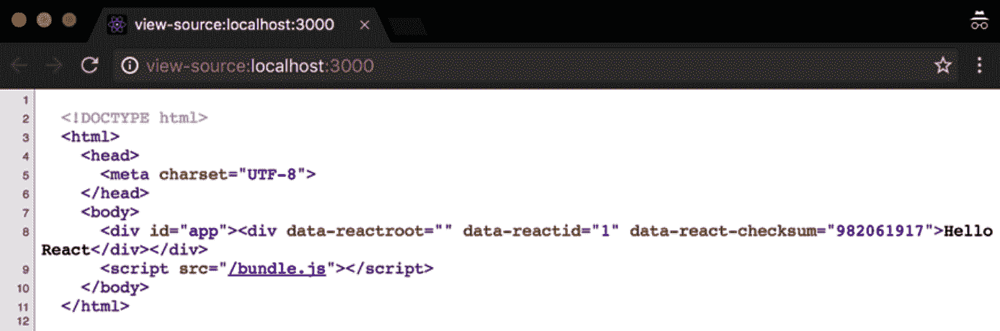

Server-Side Rendering for Fun and Profit

构建 React 应用程序的下一步是学习服务器端渲染是如何工作的，以及它能给我们带来什么好处。**u****通用应用程序**更适合搜索引擎优化，并支持前端和后端之间的知识共享。它们还可以提高 web 应用程序的感知速度，这通常会增加转换。然而，将服务器端呈现应用于 React 应用程序是有代价的，我们应该仔细考虑是否需要它。

在本章中，您将了解如何设置服务器端渲染应用程序，在相关章节结束时，您将能够构建通用应用程序，并了解该技术的优缺点。

在本章中，我们将介绍以下主题：

*   了解什么是通用应用程序
*   找出我们可能希望启用服务器端渲染的原因
*   使用 React 创建简单的静态服务器端呈现应用程序
*   将数据获取添加到服务器端渲染并理解脱水/水合等概念
*   使用 Zeith 的**Next.js**轻松创建一个 React 应用程序，该应用程序在服务器和客户端上运行

# 技术要求

要完成本章，您需要以下内容：

*   Node.js 12+
*   Visual Studio 代码

您可以在本书的 GitHub 存储库[中找到本章的代码 https://github.com/PacktPublishing/React-17-Design-Patterns-and-Best-Practices-Third-Edition/tree/main/Chapter09](https://github.com/PacktPublishing/React-17-Design-Patterns-and-Best-Practices-Third-Edition/tree/main/Chapter09) 。

# 了解通用应用程序

通用应用程序是可以使用相同代码在服务器端和客户端运行的应用程序。在这一节中，我们将探讨为什么我们应该考虑使我们的应用程序通用，我们将学习如何反应组件可以很容易地呈现在服务器端。

当我们谈论 JavaScript web 应用程序时，我们通常会想到存在于浏览器中的客户端代码。它们通常的工作方式是，服务器返回一个空的 HTML 页面，其中包含一个`script`标记以加载应用程序。当应用程序准备就绪时，它在浏览器中操纵 DOM 以显示 UI 并与用户交互。在过去的几年中，情况一直如此，对于大量的应用程序来说，这仍然是一条路要走。

在本书中，我们看到了使用 React 组件创建应用程序是多么容易，以及它们如何在浏览器中工作。我们还没有看到 React 如何在服务器上渲染相同的组件，这给了我们一个强大的功能，称为**服务器端渲染**（**SSR**。

在深入讨论细节之前，让我们试着理解创建在服务器和客户机上同时呈现的应用程序意味着什么。多年来，我们一直为服务器和客户端提供完全不同的应用程序：例如，在服务器上呈现视图的 Django 应用程序，以及在客户端上呈现一些 JavaScript 框架，如主干或 jQuery。这些独立的应用程序通常必须由两个拥有不同技能的开发团队进行维护。如果需要在服务器端呈现页面和客户端应用程序之间共享数据，可以在脚本标记中插入一些变量。使用两种不同的语言和平台，无法在应用程序的不同方面共享公共信息，例如模型或视图。

自从 2009 年 Node.js 发布以来，JavaScript 在服务器端也获得了大量关注和普及，这要归功于 web 应用程序框架，如**Express**。在双方使用相同的语言不仅使开发人员可以轻松地重用他们的知识，而且还允许在服务器和客户端之间以不同的方式共享代码。

尤其是 React，同构 web 应用程序的概念在 JavaScript 社区中变得非常流行。编写一个**同构应用程序**意味着构建一个在服务器和客户端上看起来相同的应用程序。使用相同的语言编写这两个应用程序的事实意味着大部分逻辑可以共享，这打开了许多可能性。这使得代码库更易于推理，并避免了不必要的重复。

React 将这一概念向前推进了一步，为我们提供了一个简单的 API 来在服务器上呈现组件，并透明地应用了使页面在浏览器上交互所需的所有逻辑（例如，事件处理程序）。

术语*同构*不适用于此场景，因为在 React 的情况下，应用程序是相同的，这就是为什么 React 路由的创建者之一 Michael Jackson 为此模式提出了一个更有意义的名称：**Universal**。

# 实施 SSR 的原因

SSR 是一个很好的特性，但我们不应该仅仅为了它而跳进它。我们应该有一个真正坚实的理由开始使用它。在本节中，我们将了解 SSR 如何帮助我们的应用程序，以及它可以为我们解决哪些问题。在接下来的部分中，我们将学习 SEO 以及如何提高应用程序的性能。

## 实现搜索引擎优化

我们希望在服务器端呈现应用程序的主要原因之一是**S****搜索引擎优化**（**SEO**。

如果我们向主要搜索引擎的爬虫提供一个空的 HTML 框架，它们就无法从中提取任何有意义的信息。如今，谷歌似乎能够运行 JavaScript，但也有一些局限性，搜索引擎优化往往是我们业务的一个关键方面。

多年来，我们一直在编写两个应用程序：一个用于爬虫程序的 SSR 应用程序，另一个用于客户端供用户使用。我们过去这样做是因为 SSR 应用程序无法提供用户期望的交互性级别，而客户端应用程序没有被搜索引擎索引。

维护和支持两个应用程序是困难的，这使得代码库不那么灵活，也不太容易更改。幸运的是，使用 React，我们可以在服务器端呈现组件，并将应用程序的内容提供给爬虫，这样爬虫就很容易理解和索引内容。

这是伟大的，不仅对搜索引擎优化，而且对社会共享服务。Facebook 或 Twitter 等平台为我们提供了一种定义共享页面时显示的片段内容的方法。

例如，使用 OpenGraph，我们可以告诉 Facebook，对于特定页面，我们希望显示特定的图像，并将特定的标题用作帖子的标题。仅使用客户端应用程序几乎不可能做到这一点，因为从页面提取信息的引擎使用服务器返回的标记。

如果我们的服务器为所有 URL 返回一个空的 HTML 结构，结果是当页面在社交网络上共享时，我们的 web 应用程序的片段也是空的，这会影响它们的病毒性。

## 通用代码库

我们在客户方面没有很多选择；我们的应用程序必须用 JavaScript 编写。有一些语言可以在构建时转换为 JavaScript，但概念没有改变。在服务器上使用相同语言的能力代表了公司在可维护性和知识共享方面的重大胜利。

能够在客户机和服务器之间共享逻辑，可以轻松地在双方应用任何更改，而无需进行两次工作，这在大多数情况下会导致更少的错误和问题。

维护一个代码库的工作量小于使两个不同的应用程序保持最新所需的工作量。你可以考虑在你的团队中的服务器端引入 JavaScript 的另一个原因是在前端开发人员和后端开发人员之间共享知识。

在双方重用代码的能力使协作更加容易，团队使用一种通用语言，这有助于更快地做出决策和更改。

## 更好的性能

最后，但并非最不重要的一点是，我们都喜欢客户端应用程序，因为它们速度快、响应快，但在用户对应用程序采取任何操作之前，必须加载并运行捆绑包。

在快速互联网连接上使用现代笔记本电脑或台式电脑可能不是问题。然而，如果我们使用 3G 连接的移动设备加载一个巨大的 JavaScript 包，用户在与应用程序交互之前必须等待一段时间。这不仅对一般的用户体验有害，而且还会影响转换。主要电子商务网站已经证明，页面负载增加几毫秒会对收入产生巨大影响。

例如，如果我们在服务器上为应用程序提供一个空 HTML 页面和一个`script`标记，并向用户显示一个微调器，直到他们可以点击任何东西，那么对网站速度的感知就会受到显著影响。

如果我们在服务器端呈现我们的网站，而用户在点击页面时就开始看到一些内容，那么他们更有可能留下来，即使他们在真正做任何事情之前必须等待相同的时间，因为无论 SSR 如何，客户端包都必须加载。

我们可以使用 SSR 极大地提高这种感知性能，因为我们可以在服务器上输出组件，并立即将一些信息返回给用户。

## 不要低估复杂性

即使 React 提供了在服务器上呈现组件的简单 API，创建通用应用程序也要付出代价。因此，我们应该仔细考虑之前，使其成为上述原因之一，并检查我们的团队是否准备支持和维护一个通用的应用程序。

正如我们将在接下来的部分中看到的，渲染组件并不是创建服务器端渲染应用程序所需完成的唯一任务。我们必须设置和维护服务器及其路由和逻辑，管理服务器数据流，等等。我们可能希望缓存内容以更快地为页面提供服务，并执行维护功能齐全的通用应用程序所需的许多其他任务。

因此，我的建议是首先构建客户端版本，只有当 web 应用程序在服务器上完全工作时，才应该考虑通过启用 SSR 来改善体验。SSR 应仅在严格必要时启用。例如，如果你需要 SEO 或者如果你需要定制社交共享信息，你应该开始考虑它。

如果您意识到您的应用程序需要大量时间才能完全加载，并且您已经完成了所有优化（有关此主题的更多信息，请参阅以下*第 10 章*、*提高应用程序的性能*），你可以考虑使用 SSR 给用户提供更好的体验，提高感知速度。现在我们已经了解了什么是 SSR 以及通用应用程序的好处，让我们在下一节中跳转到一些基本的 SSR 示例。

# 创建 SSR 的基本示例

现在，我们将创建一个非常简单的服务器端应用程序，以查看构建基本通用设置所需的步骤。这将是一个最小且简单的设置，因为这里的目标是展示 SSR 是如何工作的，而不是提供一个全面的解决方案或样板，即使您可以使用示例应用程序作为实际应用程序的起点。

This section assumes that all the concepts regarding JavaScript build tools, such as webpack and its loaders, are clear, and it requires a little bit of knowledge of Node.js. As a JavaScript developer, it should be easy for you to follow this section, even if you have never seen a Node.js application before.

申请将由两部分组成：

*   在服务器端，我们将使用**Express**创建一个基本 web 服务器，并使用服务器端应用程序提供一个 HTML 页面
*   在客户端，我们将像往常一样使用`react-dom`呈现应用程序

在运行之前，应用程序的两面都将通过 Babel 传输，并与 webpack 捆绑在一起，这将让我们充分利用 ES6 的强大功能以及 Node.js 和浏览器上的模块。

首先，我们创建一个新的项目文件夹（您可以称之为`ssr-project`，并运行以下命令来创建一个新包：

```jsx
npm init
```

一旦`package.json`被创建，是时候安装依赖项了。我们可以从`webpack`开始：

```jsx
npm install webpack
```

完成后，是时候安装`ts-loader`和我们需要使用 React 和 TSX 编写 ES6 应用程序的预设：

```jsx
npm install --save-dev @babel/core @babel/preset-env @babel/preset-react ts-loader typescript
```

我们还必须安装一个依赖项，我们需要它来创建服务器包。`webpack`让我们定义一组 external，它们是我们不想添加到 bundle 中的依赖项。事实上，在为服务器创建构建时，我们不想添加到我们使用的所有节点包包包包中；我们只想捆绑我们的服务器代码。有一个包可以帮助实现这一点，我们可以简单地将其应用于`webpack`配置中的外部条目，以排除所有模块：

```jsx
npm install --save-dev webpack-node-externals
```

伟大的现在是时候在`package.json`的 npm`scripts`部分创建一个条目了，这样我们就可以方便地从终端运行`build`命令：

```jsx
"scripts": {
  "build": "webpack"
}
```

接下来，您需要在根路径中创建一个`.babelrc`文件：

```jsx
{
  "presets": ["@babel/preset-env", "@babel/preset-react"]
}
```

我们现在必须创建名为`webpack.config.js`的配置文件，告诉`webpack`我们希望如何捆绑文件。

让我们开始导入用于设置节点外部的库。我们还将定义`ts-loader`的配置，该配置将用于客户端和服务器：

```jsx
const nodeExternals = require('webpack-node-externals')
const path = require('path')

const rules = [{
  test: /\.(tsx|ts)$/,
  use: 'ts-loader',
  exclude: /node_modules/
}]
```

在*第 8 章*中*让您的组件看起来漂亮*中，我们了解了如何从配置文件导出配置对象。`webpack`中有一个很酷的特性，它允许我们导出一系列配置，这样我们就可以在同一个位置定义客户端和服务器配置，并一次性使用它们。

下面代码块中显示的客户端配置应该非常熟悉：

```jsx
const client = {
  entry: './src/client.tsx',
  output: {
    path: path.resolve(__dirname, './dist/public'),
    filename: 'bundle.js',
    publicPath: '/'
  },
  module: {
    rules
  }
}
```

我们告诉`webpack`客户端应用程序的源代码在`src`文件夹中，我们希望在`dist`文件夹中生成输出包。

我们还使用前面用`ts-loader`创建的对象设置模块加载器。服务器配置略有不同；我们需要定义不同的`entry`、`output`，并添加一些新节点，如`target`、`externals`、`resolve`：

```jsx
const server = {
  entry: './src/server.ts',
  output: {
    path: path.resolve(__dirname, './dist'),
    filename: 'server.js',
    publicPath: '/'
  },
  module: {
    rules
  },
  target: 'node',
  externals: [nodeExternals()],
  resolve: {
    extensions: [".ts", ".tsx", ".js", ".json"],
  },
}
```

正如您所看到的，`entry`、`output`和`module`除了文件名之外是相同的。

新的参数是`target`，在这里我们指定节点告诉`webpac``k`忽略 node.js 的所有内置系统包，例如`fs`和`externals`，在这里我们使用前面导入的库告诉 webpack 忽略依赖项。

最后，但并非最不重要的一点是，我们必须将配置导出为阵列：

```jsx
module.exports = [client, server]
```

配置完成。我们现在已经准备好编写一些代码，我们将从我们更熟悉的 React 应用程序开始。

让我们在其中创建一个`src`文件夹和一个`app.ts`文件。

`app.ts`文件应包含以下内容：

```jsx
const App = () => <div>Hello React</div>

export default App
```

这里没有什么复杂的东西；我们导入 React，创建一个`App`组件，它呈现`Hello React`消息，然后导出它。

现在我们创建`client.tsx`，它负责呈现 DOM 中的`App`组件：

```jsx
import { render } from 'react-dom'
import App from './app'

render(<App />, document.getElementById('root'))
```

同样，这听起来应该很熟悉，因为我们导入了 React、ReactDOM 和前面创建的`App`组件，并使用`ReactDOM`在具有`app`ID 的 DOM 元素中呈现它。

现在让我们转到服务器。

首先要做的是创建一个`template.ts`文件，该文件导出一个函数，我们将使用该函数返回页面的标记，我们的服务器将返回给浏览器：

```jsx
export default body => `
  <!DOCTYPE html>
  <html>
 <head>
 <meta charset="UTF-8">
    </head>
 <body>
 <div id="root">${body}</div>
      <script src="/bundle.js"></script>
 </body>
 </html>`
```

这应该很简单。函数接受`body`，稍后我们将看到它包含 React 应用程序，并返回页面的框架。

值得注意的是，即使应用程序在服务器端呈现，我们也会在客户端加载捆绑包。SSR 只是 React 呈现应用程序所做工作的一半。我们仍然希望我们的应用程序是一个客户端应用程序，具有我们可以在浏览器中使用的所有功能，例如事件处理程序。

在此之后，您需要安装`express`、`react`和`react-dom`：

```jsx
npm install express react react-dom @types/express @types/react @types/react-dom
```

现在是创建`server.tsx`的时候了，它有更多的依赖性，值得详细探讨：

```jsx
import React from 'react' import express, { Request, Response } from 'express'
import { renderToString } from 'react-dom/server'
import path from 'path'
import App from './App'
import template from './template'
```

我们导入的第一件事是`express`，该库允许我们轻松创建具有某些路由的 web 服务器，并且还能够服务于静态文件。

其次，我们导入`React`和`ReactDOM`来呈现`App`，我们也导入了`App`。注意`ReactDOM`的`import`语句中的`/server`路径。我们导入的最后一件事是前面定义的模板。

现在，我们创建一个 Express 应用程序：

```jsx
const app = express()
```

我们告诉应用程序静态资产的存储位置：

```jsx
app.use(express.static(path.resolve(__dirname, './dist/public')))
```

您可能已经注意到，路径与我们在 webpack 的客户端配置中用作客户端包的输出目标的路径相同。

然后，下面是带有 React 的 SSR 逻辑：

```jsx
app.get('/', (req: Request, res: Response) => {
  const body = renderToString(<App />)
  const html = template(body)
  res.send(html)
})
```

我们告诉 Express 我们想要监听`/`路由，当它被客户端点击时，我们使用`ReactDOM`库将`App`呈现给字符串。下面是 React 的 SSR 的魔力和简单性。

`renderToString`的作用是返回由`App`组件生成的 DOM 元素的字符串表示形式；如果我们使用`ReactDOM`呈现方法，它将在 DOM 中呈现相同的树。

body 变量的值如下所示：

```jsx
<div data-reactroot="" data-reactid="1" data-react-checksum="982061917">Hello React</div>
```

如您所见，它表示我们在`App`的`render`方法中定义的内容，但 React 在客户端上用于将客户端应用程序附加到服务器端呈现字符串的两个数据属性除外。

现在我们有了应用程序的 SSR 表示，我们可以使用`template`函数将其应用于 HTML 模板，并在 Express response 中将其发送回浏览器。

最后，但并非最不重要的一点是，我们必须启动 Express 应用程序：

```jsx
app.listen(3000, () => {
  console.log('Listening on port 3000')
})
```

我们现在准备出发了；只剩下几次手术了。第一个是定义`npm`的`start`脚本，并将其设置为运行节点服务器：

```jsx
"scripts": {
  "build": "webpack",
  "start": "node ./dist/server"
}
```

脚本已准备就绪，因此我们可以首先使用以下命令构建应用程序：

```jsx
npm run build 
```

创建捆绑包后，我们可以运行以下命令：

```jsx
npm start
```

将浏览器指向`http://localhost:3000`并查看结果。

这里有两件重要的事情需要注意。首先，当我们使用浏览器的“查看页面源代码”功能时，我们可以看到正在呈现的应用程序的源代码以及从服务器返回的源代码，如果没有启用 SSR，我们将看不到这些代码。

其次，如果我们打开 DevTools 并安装了 React 扩展，我们可以看到`App`组件也已在客户端上启动。

以下屏幕截图显示了页面的来源：



伟大的现在，您已经使用 SSR 创建了第一个 React 应用程序，接下来我们将学习如何获取数据。

# **实现数据取数**

上一节中的示例应该清楚地解释如何在 React 中设置通用应用程序。这是非常简单的，主要的重点是完成事情。

然而，在实际应用程序中，我们可能希望加载一些数据，而不是静态的 React 组件，例如示例中的`App`。假设我们想在服务器上加载丹·阿布拉莫夫的`gists`，并从我们刚刚创建的 Express 应用程序返回项目列表。

在*第 6 章*、*管理数据*中的数据获取示例中，我们研究了如何使用`useEffect`启动数据加载。这在服务器上不起作用，因为组件不会装载到 DOM 上，而且生命周期钩子也不会被触发。

使用之前执行的钩子也不起作用，因为数据获取操作是`async`，而`renderToString`不是。因此，我们必须找到一种方法来预先加载数据，并将其作为道具传递给组件。

让我们看看如何从上一节获取应用程序，并对其进行一些更改，使其在 SSR 阶段加载`gists`。

首先要做的是将`App.tsx`更改为将`gists`的列表接受为`prop`，并在 render 方法中循环显示它们的描述：

```jsx
import { FC } from 'react'

type Gist = {
  id: string
  description: string
}

type Props = {
  gists: Gist[]
}

const App: FC<Props> = ({ gists }) => ( 
  <ul> 
    {gists.map(gist => ( 
      <li key={gist.id}>{gist.description}</li> 
    ))} 
  </ul> 
)

export default App
```

应用我们在前一章学到的概念，我们定义了一个无状态功能组件，它接收`gists`作为一个道具，并通过元素循环来呈现一个项目列表。现在，我们必须将服务器更改为检索`gists`并将其传递给组件。

要在服务器端使用**fetch**API，我们必须安装一个名为`isomorphic-fetch`的库，它实现了 fetch 标准。可在 Node.js 和浏览器中使用：

```jsx
npm install isomorphic-fetch @types/isomorphic-fetch
```

我们首先将库导入`server.tsx`：

```jsx
import fetch from 'isomorphic-fetch'
```

我们要进行的 API 调用如下所示：

```jsx
fetch('https://api.github.com/users/gaearon/gists') 
  .then(response => response.json()) 
  .then(gists => {})
```

此处，`gists`可用于最后一个`then`函数中。在我们的例子中，我们希望将它们传递给`App`。

因此，我们可以将`/`路线更改如下：

```jsx
app.get('/', (req, res) => { 
  fetch('https://api.github.com/users/gaearon/gists') 
    .then(response => response.json()) 
    .then(gists => { 
      const body = renderToString(<App gists={gists} />)
      const html = template(body)

      res.send(html)
    })
})
```

在这里，我们首先获取`gists,`，然后将`App`呈现给一个字符串，并传递属性。

一旦`App`被呈现，并且我们有了它的标记，我们就使用上一节中使用的模板并将其返回到浏览器。

在控制台中运行以下命令，并将浏览器指向`http://localhost:3000`。您应该能够看到服务器端呈现列表`gists`：

```jsx
npm run build && npm start
```

为了确保列表是从 Express 应用程序呈现的，您可以导航到`view-source:http://localhost:3000`，您将看到`gists`的标记和说明。

这很好，看起来很简单，但是如果我们检查 DevTools 控制台，我们可以看到 undefined error 的 Cannot read 属性“map”。我们看到错误的原因是，在客户端上，我们再次渲染了`App`，但没有将`gists`传递给它。

这在一开始听起来可能与直觉背道而驰，因为我们可能认为 React 足够聪明，可以在客户端的服务器端字符串中使用`gists`呈现。但事实并非如此，因此我们必须找到一种方法，使`gists`在客户端也可用。

您可以考虑在客户端上再次执行 F 取。这会起作用，但不是最佳的，因为最终会触发两个 HTTP 调用，一个在 Express 服务器上，一个在浏览器中。如果我们仔细想想，我们已经在服务器上进行了调用，并且我们拥有了所需的所有数据。在服务器和客户机之间共享数据的一个典型解决方案是将 HTML 标记中的数据脱水，然后将其放回浏览器中。

这似乎是一个复杂的概念，但事实并非如此。现在我们来看看它是多么容易实现。我们必须做的第一件事是在客户机上获取`gists`后，将其注入模板中。

要做到这一点，我们必须按如下方式稍微更改模板：

```jsx
export default (body, gists) => ` 
  <!DOCTYPE html> 
  <html> 
 <head> 
 <meta charset="UTF-8"> 
    </head> 
 <body> 
 <div id="root">${body}</div> 
      <script>window.gists = ${JSON.stringify(gists)}</script> 
      <script src="/bundle.js"></script> 
    </body> 
 </html> 
`
```

`template`函数现在接受两个参数-`body`的应用程序和`gists`的集合。第一个插入到 app 元素中，第二个用于定义一个附加到`window`对象的全局`gists`变量，以便我们可以在客户端中使用它。

在`Express`路由（`server.js`中，我们只需更改生成经过主体的模板的行，如下所示：

```jsx
const html = template(body, gists)
```

最后，但并非最不重要的是，我们必须使用附在`client.tsx`内的一个窗口上的`gists`，这非常简单：

```jsx
ReactDOM.hydrate( 
  <App gists={window.gists} />, 
  document.getElementById('app') 
)
```

**水合物**是在 React 16 中引入的，无论 HTML 服务器是否呈现标记，其工作原理与客户端的呈现类似。如果以前没有使用 SSR 的标记，`hydrate`方法将发出警告，您可以使用新的`suppressHydrationWarning`属性使其静音。

我们直接读取`gists`，然后将它们传递给在客户端上渲染的`App`组件。

现在，再次运行以下命令：

```jsx
npm run build && npm start
```

如果我们将浏览器窗口指向`http://localhost:3000`，错误就消失了，如果我们使用 React DevTools 检查`App`组件，我们可以看到客户端`App`组件如何接收`gists`的集合。

我们已经创建了第一个 SSR 应用程序，现在让我们看看如何通过在下一节中使用名为 Next.js 的 SSR 框架来更轻松地实现这一点。

# **使用 Next.js 创建 React 应用程序**

您已经通过 React 了解了 SSR 的基础知识，您可以使用我们创建的项目作为实际应用程序的起点。但是，您可能认为样板太多，需要了解太多不同的工具才能使用 React 运行简单的通用应用程序。这是一种常见的感觉，称为**JavaScript 疲劳**，如本书导言所述。

幸运的是，Facebook 开发者和 React 社区的其他公司正在努力改进 DX，让开发者的生活更轻松。此时，您可能已经使用`create-react-app`尝试了前面章节中的示例，并且您应该了解它如何使创建 React 应用程序变得非常简单，而不需要开发人员学习许多技术和工具。

现在，`create-react-app`还不支持 SSR，但有一家名为**Vercel**的公司已经创建了一个名为**Next.js**的工具，这使得生成通用应用程序非常容易，而不必担心配置文件。它还大大减少了样板文件。

重要的是，使用抽象对于快速构建应用程序总是非常好的。然而，在添加太多层之前，了解内部构件的工作原理是至关重要的，这就是为什么我们在学习 Next.js 之前先开始手动过程的原因。我们已经了解了 SSR 是如何工作的，以及如何将状态从服务器传递到客户端。现在基本概念已经清楚了，我们可以使用一种工具，它可以隐藏一点复杂性，让我们编写更少的代码来实现相同的结果。

我们将创建一个相同的应用程序，其中加载了丹·阿布拉莫夫的所有`gists`，您将看到代码是多么干净和简单，感谢 Next.js。

首先，创建一个新的项目文件夹（您可以称之为`next-project`，并运行以下命令：

```jsx
npm init
```

完成后，我们可以安装 Next.js 库并做出反应：

```jsx
npm install next react react-dom typescript @types/react @types/node
```

现在项目已经创建，我们必须添加一个`npm`脚本来运行二进制文件：

```jsx
"scripts": { 
  "dev": "next" 
}
```

完美的现在是时候生成我们的`App`组件了。

Next.js 是基于约定的，最重要的是您可以创建与浏览器 URL 匹配的页面。默认页面为`index`，因此我们可以创建一个名为`pages`的文件夹，并在其中放置一个`index.js`文件。

我们开始导入依赖项：

```jsx
import fetch from 'isomorphic-fetch'
```

同样，我们导入`isomorphic-fetch`是因为我们希望能够在服务器端使用`fetch`功能。

然后我们定义一个名为`App`的组件：

```jsx
const App = () => {

}

export default App
```

然后我们定义一个名为`getInitialProps`的`static async`函数，在这里我们告诉 Next.js 我们要在服务器端和客户端加载哪些数据。库将使从函数返回的对象作为组件内的道具可用。

应用于类方法的`static`和`async`关键字意味着可以在类实例之外访问该函数，并且该函数在其体内产生`wait`指令的执行。

这些概念非常先进，不属于本章的范围，但是如果您对它们感兴趣，您应该查看 ECMAScript 提案（[https://github.com/tc39/proposals](https://github.com/tc39/proposals) ）。

我们刚才描述的方法的实现如下：

```jsx
App.getInitialProps = async () => { 
  const url = 'https://api.github.com/users/gaearon/gists'
  const response = await fetch(url)
  const gists = await response.json()

  return { 
    gists 
  }
}
```

我们告诉函数启动 fetch 并等待响应；然后我们将响应转换为 JSON，它返回一个承诺。承诺解决后，我们可以返回带有`gists`的`props`对象。

组件的`render`看起来与前一个非常相似：

```jsx
return ( 
  <ul> 
    {props.gists.map(gist => ( 
       <li key={gist.id}>{gist.description}</li> 
     ))} 
   </ul> 
)
```

在运行项目之前，您需要配置`tsconfig.json`：

```jsx
{
  "compilerOptions": {
    "baseUrl": "src",
    "esModuleInterop": true,
    "module": "esnext",
    "noImplicitAny": true,
    "outDir": "dist",
    "resolveJsonModule": true,
    "sourceMap": false,
    "target": "es6",
    "lib": ["dom", "dom.iterable", "esnext"],
    "allowJs": true,
    "skipLibCheck": true,
    "strict": true,
    "forceConsistentCasingInFileNames": true,
    "noEmit": true,
    "moduleResolution": "node",
    "isolatedModules": true,
    "jsx": "preserve"
  },
  "include": ["src/**/*.ts", "src/**/*.tsx"],
  "exclude": ["node_modules"]
}
```

现在，打开控制台并运行以下命令：

```jsx
npm run dev
```

我们将看到以下输出：

```jsx
> Ready on http://localhost:3000
```

如果我们将浏览器指向该 URL，我们可以看到通用应用程序正在运行。感谢 Next.js，用几行代码和零配置设置一个通用应用程序是多么容易，这真是令人印象深刻。

您可能还注意到，如果在编辑器中编辑应用程序，您将能够在浏览器中立即看到结果，而无需刷新页面。这是 Next.js 的另一个特性，它支持热模块替换。它在开发模式中非常有用。

如果你喜欢这一章，就在 GitHub 上给一颗星星：[https://github.com/zeit/next.js](https://github.com/zeit/next.js) 。

# **总结**

通过 SSR 的旅程已经结束。现在，您可以使用 React 创建服务器端呈现的应用程序，并且应该清楚为什么它对您有用。搜索引擎优化当然是主要原因之一，但社会共享和性能也是重要因素。您了解了如何在服务器上加载数据，并在 HTML 模板中对其进行脱水，以便在客户端应用程序启动浏览器时可以使用这些数据。

最后，您已经了解了 Next.js 等工具如何帮助您减少样板文件，并隐藏设置服务器端 render React 应用程序通常会给代码库带来的一些复杂性。

在下一章中，我们将讨论如何提高 React 应用程序的性能。