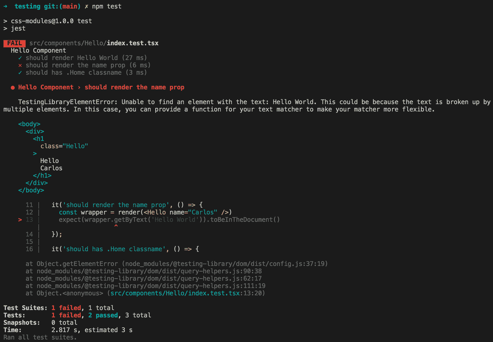
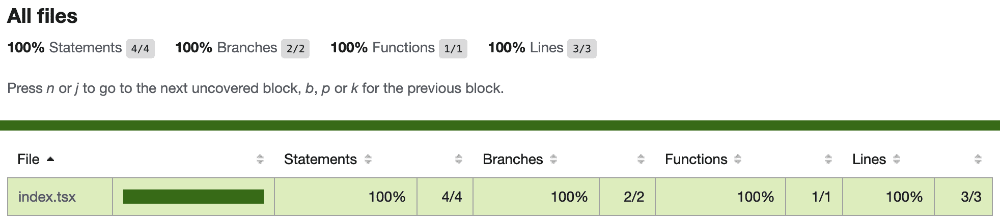
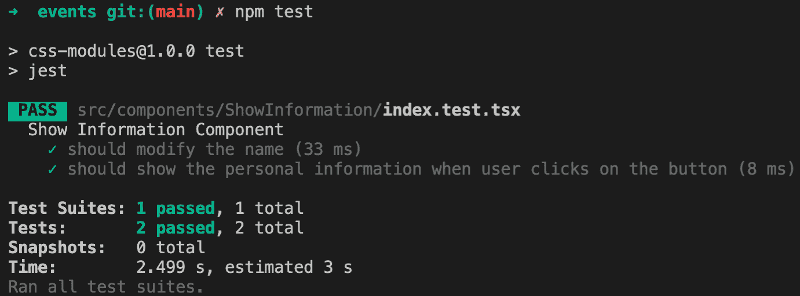

# 十一、测试和调试

React 由于其组件的缘故，使得测试我们的应用程序变得很容易。我们可以使用许多不同的工具来创建带有 React 的测试，这里我们将介绍最流行的工具，以了解它们提供的好处。

**Jest**是一个*一体式*测试框架解决方案，由 Facebook 的 Christopher Pojer 和社区内的贡献者维护，旨在为您提供最佳的开发者体验。

到本章结束时，您将能够从头创建一个测试环境，并为应用程序的组件编写测试。

在本章中，我们将研究以下主题：

*   为什么测试我们的应用程序很重要，以及它们如何帮助开发人员更快地开发
*   如何建立 Jest 环境，使用酶测试组件
*   React 测试库是什么？为什么它是测试 React 应用程序的*必备*
*   如何测试事件
*   React 开发工具和一些错误处理技术

# 技术要求

要完成本章，您需要以下内容：

*   Node.js 12+
*   Visual Studio 代码

您可以在本书的 GitHub 存储库中找到本章的代码：[https://github.com/PacktPublishing/React-17-Design-Patterns-and-Best-Practices-Third-Edition/tree/main/Chapter11](https://github.com/PacktPublishing/React-17-Design-Patterns-and-Best-Practices-Third-Edition/tree/main/Chapter11) 。

# 了解测试的好处

测试 web UI 一直是一项困难的工作。从单元测试到*端到端*测试，界面依赖于浏览器、用户交互和许多其他变量的事实使得很难实施有效的测试策略。

如果您曾经尝试过为 web 编写端到端测试，您就会知道获得一致的结果有多复杂，以及由于不同的因素（如网络）导致的错误否定会如何影响结果。除此之外，用户界面经常被更新，以改善体验、最大化转换或简单地添加新功能。

如果测试很难编写和维护，那么开发人员就不太容易覆盖他们的应用程序。另一方面，测试非常重要，因为它们使开发人员对自己的代码更有信心，这体现在速度和质量上。如果一段代码经过良好的测试（并且测试编写得很好），开发人员可以确保它能够正常工作并准备好发布。类似地，由于有了测试，重构代码变得更加容易，因为测试可以保证功能在重写过程中不会改变。

开发人员倾向于关注他们当前实现的功能，有时很难知道应用程序的其他部分是否受到这些更改的影响。测试有助于避免回归，因为它们可以判断新代码是否破坏了旧测试。编写新特性的信心越强，发布速度就越快。

测试应用程序的主要功能会使代码库更加坚实，无论何时发现新的 bug，都可以通过测试进行复制、修复和覆盖，以便以后不再发生。

幸运的是，React（以及组件时代）使测试用户界面变得简单高效。测试组件或组件树不是那么困难，因为应用程序的每个部分都有自己的职责和边界。如果组件是以正确的方式构建的，如果它们是纯的，并且以可组合性和可重用性为目标，那么它们可以作为简单的功能进行测试。

现代工具带给我们的另一个强大功能是能够使用 Node.js 和控制台运行测试。为每一个测试旋转浏览器会使测试变得更慢、更不可预测，从而降低开发人员的体验；相反，使用控制台运行测试更快。

在真实浏览器中呈现组件时，仅在控制台中测试组件有时会产生意外行为，但根据我的经验，这种情况很少见。当我们测试 React 组件时，我们希望确保它们正常工作，并且给定不同的道具集，它们的输出总是正确的。

我们可能还希望涵盖组件可能具有的所有不同状态。通过单击按钮，状态可能会改变，因此我们编写测试来检查所有事件处理程序是否都在执行它们应该执行的操作。

当覆盖了组件的所有功能，但我们想做更多的工作时，我们可以编写测试来验证组件在**边缘案例**上的行为。边缘情况是组件可以假设的状态，例如，当所有道具为`null`或存在错误时。一旦编写了测试，我们就可以非常确信组件的行为符合预期。

测试单个组件很好，但这不能保证多个单独测试的组件在组合在一起后仍能工作。正如我们稍后将看到的，使用 React，我们可以挂载组件树并测试它们之间的集成。

我们可以使用不同的技术来编写测试，其中最流行的是**测试驱动开发**（**TDD**）。应用 TDD 意味着首先编写测试，然后编写代码以通过测试。

遵循这种模式有助于我们编写更好的代码，因为在实现功能之前，我们不得不更多地考虑设计，这通常会导致更高的质量。

# 使用 Jest 进行无痛 JavaScript 测试

学习如何以正确的方式测试 React 组件最重要的方法是编写一些代码，这就是我们在本节中要做的。

React 文档说，在 Facebook 上，他们使用 Jest 测试组件。但是，React 不会强制您使用特定的测试框架，并且您可以毫无问题地使用您最喜欢的测试框架。为了看到 Jest 的实际应用，我们将从头开始创建一个项目，安装所有依赖项，并编写一个带有一些测试的组件。会很有趣的！

要做的第一件事是移动到新文件夹并运行以下操作：

```jsx
npm init
```

一旦`package.json`被创建，我们就可以开始安装依赖项，第一个是`jest`包本身：

```jsx
npm install --save-dev jest
```

为了告诉`npm`我们想要使用`jest`命令来运行测试，我们必须在`package.json`中添加以下脚本：

```jsx
"scripts": { 
  "build": "webpack",
  "start": "node ./dist/server",
  "test": "jest",
  "test:coverage": "jest --coverage"
}
```

为了使用 ES6 和 JSX 编写组件和测试，我们必须安装所有与 Babel 相关的软件包，以便 Jest 能够使用它们来传输和理解代码。

第二组依赖项的安装方式如下：

```jsx
npm install --save-dev @babel/core @babel/preset-env @babel/preset-react ts-jest
```

您可能知道，我们现在必须创建一个`.babelrc`文件，Babel 使用该文件来了解我们希望在项目中使用的预设和插件。

`.babelrc`文件如下所示：

```jsx
{ 
  "presets": ["@babel/preset-env", "@babel/preset-react"] 
}
```

现在，是时候安装 React 和`ReactDOM`，我们需要创建和呈现组件：

```jsx
npm install --save react react-dom
```

安装已经就绪，我们可以对 ES6 代码运行 Jest 并将组件呈现到 DOM 中，但是还有一件事要做。

我们需要安装`@testing-library/jest-dom`和`@testing-library/react`：

```jsx
npm install @testing-library/jest-dom @testing-library/react
```

安装这些软件包后，您必须创建`jest.config.js`文件：

```jsx
 module.exports = {
  preset: 'ts-jest',
  setupFilesAfterEnv: ['<rootDir>/setUpTests.ts']
}
```

然后，让我们创建`setUpTests.ts`文件：

```jsx
import '@testing-library/jest-dom/extend-expect'
```

现在，让我们假设我们有一个`Hello`组件：

```jsx
import React, { FC } from 'react'

type Props = {
  name: string
}

const Hello: FC<Props> = ({ name }) => <h1 className="Hello">Hello {name || 'World'}</h1>

export default Hello
```

为了测试这个组件，我们需要创建一个具有相同名称的文件，但在新文件中添加`.test`（或`.spec`）后缀。这将是我们的测试文件：

```jsx
import React from 'react' import { render, cleanup } from '@testing-library/react'

import Hello from './index'

describe('Hello Component', () => {
  it('should render Hello World', () => {
    const wrapper = render(<Hello />)
    expect(wrapper.getByText('Hello World')).toBeInTheDocument()
  })

  it('should render the name prop', () => {
    const wrapper = render(<Hello name="Carlos" />)
    expect(wrapper.getByText('Hello Carlos')).toBeInTheDocument()
  });

  it('should has .Home classname', () => {
    const wrapper = render(<Hello />)
    expect(wrapper.container.firstChild).toHaveClass('Hello')
  });

  afterAll(cleanup)
})
```

然后，为了运行`test`，您需要执行以下命令：

```jsx
npm test
```

您应该看到以下结果：


`PASS`标签表示所有测试均已成功通过；如果您至少一次测试失败，您将看到`FAIL`标签。让我们更改其中一个测试以使其失败：

```jsx
it('should render the name prop', () => {
  const wrapper = render(<Hello name="Carlos" />)
  expect(wrapper.getByText('Hello World')).toBeInTheDocument()
});
```

结果是：



如您所见，`FAIL`标签指定了一个`X`。此外，预期值和接收值提供了有用的信息，您可以看到预期值和接收值。

如果要查看所有单元测试的覆盖率百分比，可以执行以下命令：

```jsx
npm run test:coverage
```

结果如下：


覆盖率还生成结果的 HTML 版本；它创建了一个名为`coverage`的目录，并在另一个名为`Icov-report`的目录中创建。如果在浏览器中打开`index.html`文件，您将看到如下 HTML 版本：



既然您完成了第一次测试，并且知道了如何收集覆盖率数据，那么让我们在下一节中看看如何测试事件。

# 测试事件

这些事件在任何 web 应用程序中都非常常见，我们也需要测试它们，所以让我们学习如何测试事件。为此，我们创建一个新的`ShowInformation`组件：

```jsx
import { FC, useState, ChangeEvent } from 'react'

const ShowInformation: FC = () => {
  const [state, setState] = useState({ name: '', age: 0, show: false })

  const handleOnChange = (e: ChangeEvent<HTMLInputElement>) => {
    const { name, value } = e.target

    setState({
      ...state,
      [name]: value
    })
  }

  const handleShowInformation = () => {
    setState({
      ...state,
      show: true
    })
  }

 if (state.show) {
    return (
      <div className="ShowInformation">
        <h1>Personal Information</h1>

        <div className="personalInformation">
          <p>
            <strong>Name:</strong> {state.name}
          </p>
          <p>
            <strong>Age:</strong> {state.age}
          </p>
        </div>
      </div>
    )
  }

  return (
    <div className="ShowInformation">
      <h1>Personal Information</h1>

      <p>
        <strong>Name:</strong>
      </p>

      <p>
        <input name="name" type="text" value={state.name} onChange={handleOnChange} />
      </p>

      <p>
        <input name="age" type="number" value={state.age} onChange={handleOnChange} />
      </p>

      <p>
        <button onClick={handleShowInformation}>Show Information</button>
      </p>
    </div>
  )
}

export default ShowInformation
```

现在，让我们在`src/components/ShowInformation/index.test.tsx`处创建测试文件：

```jsx
import { render, cleanup, fireEvent } from '@testing-library/react'

import ShowInformation from './index'

describe('Show Information Component', () => {
  let wrapper

  beforeEach(() => {
    wrapper = render(<ShowInformation />)
  })

  it('should modify the name', () => {
    const nameInput = wrapper.container.querySelector('input[name="name"]') as HTMLInputElement
    const ageInput = wrapper.container.querySelector('input[name="age"]') as HTMLInputElement

    fireEvent.change(nameInput, { target: { value: 'Carlos' } })
    fireEvent.change(ageInput, { target: { value: 33 } })

    expect(nameInput.value).toBe('Carlos')
    expect(ageInput.value).toBe('33')
  })

  it('should show the personal information when user clicks on the button', () => {
    const button = wrapper.container.querySelector('button')

    fireEvent.click(button)

    const showInformation = wrapper.container.querySelector('.personalInformation')

    expect(showInformation).toBeInTheDocument()
  })

  afterAll(cleanup)
})
```

如果您运行了测试并且工作正常，您应该看到：



# 使用 React 开发工具

当在控制台中进行测试是不够的，并且我们希望在应用程序在浏览器中运行时检查它时，我们可以使用 React DevTools。

You can install this as a Chrome extension at the following URL: [https://chrome.google.com/webstore/detail/react-developer-tools/fmkadmapgofadopljbjfkapdkoienihi?hl=en](https://chrome.google.com/webstore/detail/react-developer-tools/fmkadmapgofadopljbjfkapdkoienihi?hl=en).

安装程序在 Chrome DevTools 中添加了一个名为**React**的选项卡，您可以在其中检查呈现的组件树，并检查它们已接收到哪些属性以及它们在特定时间点的状态。

道具和状态可以读取，并且可以实时更改，以触发 UI 中的更新，并立即查看结果。这是一个必备工具，在最新版本中，它有一个新功能，可以通过勾选 Trace React Updates 复选框启用。

启用此功能后，我们可以使用应用程序，直观地查看在执行特定操作时哪些组件得到更新。更新的组件以彩色矩形突出显示，因此很容易发现可能的优化。

# 使用 Redux 开发工具

如果您在应用程序中使用 Redux，您可能希望使用 Redux DevTools 来调试 Redux 流。您可以在以下 URL 安装：[https://chrome.google.com/webstore/detail/redux-devtools/lmhkpmbekcpmknklioeibfkpmmfibljd?hl=es](https://chrome.google.com/webstore/detail/redux-devtools/lmhkpmbekcpmknklioeibfkpmmfibljd?hl=es) 。

此外，您还需要安装`redux-devtools-extension`软件包：

```jsx
npm install --save-dev redux-devtools-extension
```

一旦安装了 React DevTools 和 Redux DevTools，就需要对它们进行配置。

如果您试图直接使用 Redux DevTools，它将不起作用；这是因为我们需要将`composeWithDevTools`方法传递到 Redux 存储中；这应该是`configureStore.ts`文件：

```jsx
// Dependencies
import { createStore, applyMiddleware } from 'redux';
import thunk from 'redux-thunk';
import { composeWithDevTools } from 'redux-devtools-extension';

// Root Reducer
import rootReducer from '@reducers';

export default function configureStore({ 
  initialState, 
  reducer 
}) {
  const middleware = [
    thunk
  ];

  return createStore(
    rootReducer,
    initialState,
    composeWithDevTools(applyMiddleware(...middleware))
  );
}
```

这是测试 Redux 应用程序的最佳工具。

# 总结

在本章中，您了解了测试的好处，以及可以用来用测试覆盖 React 组件的框架。

您学习了如何使用 React 测试库实现和测试组件和事件，如何使用 Jest 覆盖率，以及如何使用 React DevTools 和 Redux DevTools。在测试复杂组件（如高阶组件或具有多个嵌套字段的表单）时，务必记住常见的解决方案。

在下一章中，您将学习如何使用 React 路由在应用程序中实现路由。