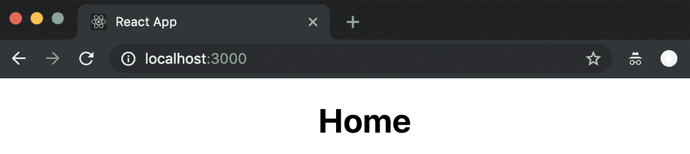
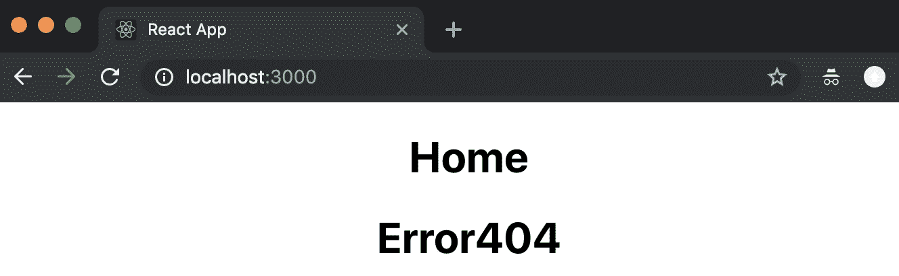
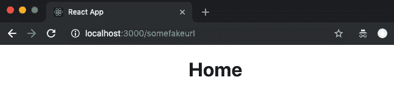
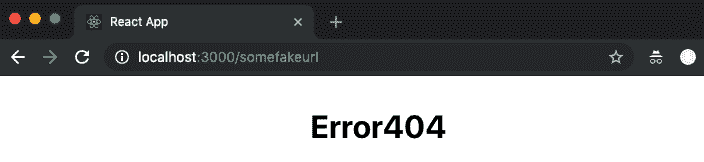
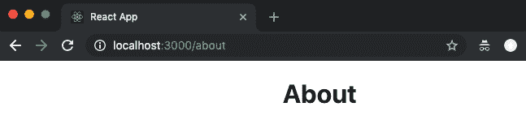
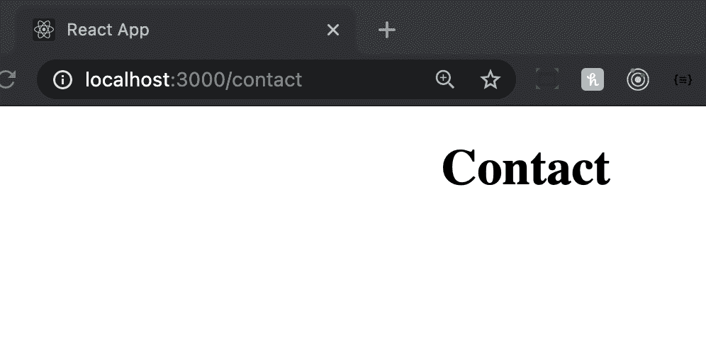
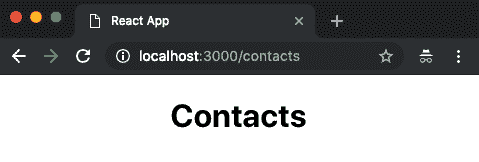
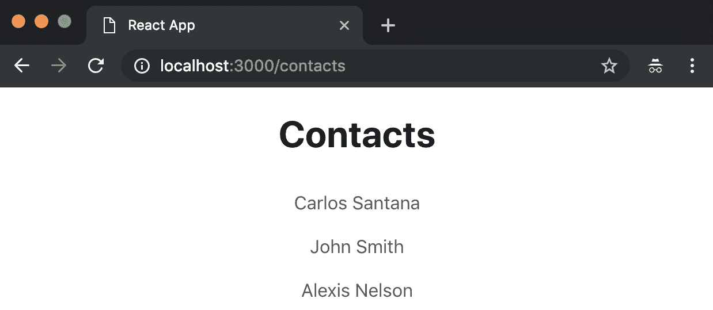
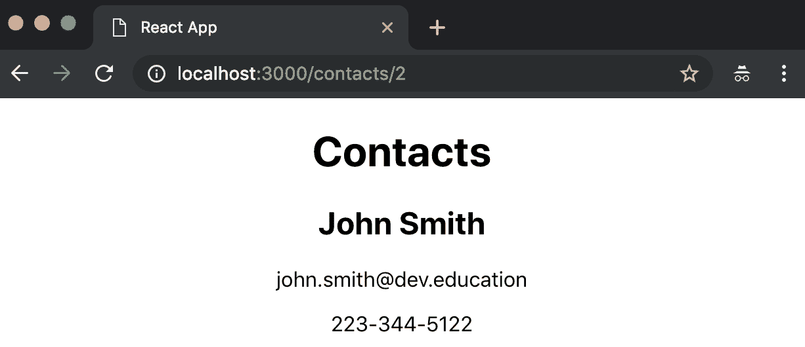
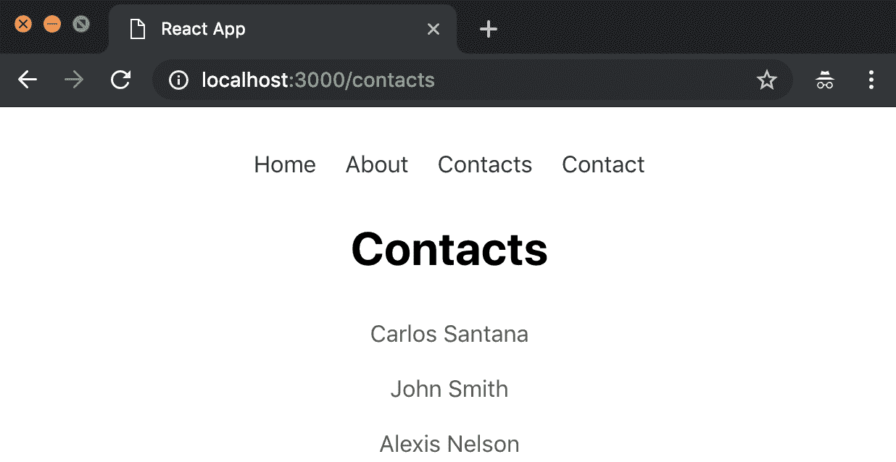

React Router

与 Angular 不同，React 是一个库而不是一个框架，这意味着特定功能（例如，路由或 PropType）不是 React 核心的一部分。取而代之的是，路由由名为**React Router**的第三方库处理。

在本章中，您将了解如何在应用程序中实现 React 路由，在相关章节结束时，您将能够添加动态路由并了解 React 路由的工作原理。

在本章中，我们将介绍以下主题：

*   了解`react-router`、`react-router-dom`和`react-router-native`包之间的差异
*   如何安装和配置 React 路由
*   添加`<Switch>`组件
*   添加`exact`属性
*   向管线添加参数

# 技术要求

要完成本章，您需要以下内容：

*   Node.js 12+
*   Visual Studio 代码

您可以在本书的 GitHub 存储库[中找到本章的代码 https://github.com/PacktPublishing/React-17-Design-Patterns-and-Best-Practices-Third-Edition/tree/main/Chapter12](https://github.com/PacktPublishing/React-17-Design-Patterns-and-Best-Practices-Third-Edition/tree/main/Chapter12) 。

# 安装和配置 React 路由

使用`create-react-app`创建新的 React 应用程序后，首先需要使用以下命令安装 React Router v5.x：

```jsx
npm install react-router-dom @types/react-router-dom
```

您可能对我们为什么要安装`react-router-dom`而不是`react-router`感到困惑。React 路由包含`react-router-dom`和`react-router-native`的所有公共组件。这意味着，如果您使用 React for the web，则应使用`react-router-dom`，如果您使用 React Native，则需要使用`react-router-native`。

`react-router-dom`包最初创建时包含版本 4，`react-router`使用版本 3。`react-router-dom`包比`react-router`包有一些改进。它们列在这里：

*   改进的`<Link>`组件（呈现`<a>`。
*   包括与浏览器`window.history`交互的`<BrowserRouter>`。
*   包括`<NavLink>`，它是一个`<Link>`包装器，知道它是否处于活动状态。
*   包括`<HashRouter>`，它使用 URL 中的哈希来呈现组件。如果你有一个静态页面，你应该使用这个组件而不是`<BrowserRouter>`。

# 创建我们的部分

让我们创建一些部分来测试一些基本路线。我们需要创建四个无状态组件（`About`、`Contact`、`Home`和`Error404`，并在它们的目录中将它们命名为`index.tsx`。

您可以将以下内容添加到`src/components/Home.tsx`组件中：

```jsx
const Home = () => ( 
  <div className="Home">
    <h1>Home</h1>
 </div>
)

export default Home
```

`src/components/About.tsx`组件可以通过以下方式创建：

```jsx
const About = () => ( 
  <div className="About">
 <h1>About</h1>
 </div>
)

export default About
```

下面创建`src/components/Contact.tsx`组件：

```jsx
const Contact = () => ( 
  <div className="Contact">
 <h1>Contact</h1>
 </div>
)

export default Contact
```

最后，`src/components/Error404.tsx`组件创建如下：

```jsx
const Error404 = () => ( 
  <div className="Error404">
 <h1>Error404</h1>
 </div>
)

export default Error404
```

在我们创建了所有的功能组件之后，我们需要修改我们的`index.tsx`文件来导入我们的路由文件，我们将在下一步创建该文件：

```jsx
// Dependencies
import { render } from 'react-dom'
import { BrowserRouter as Router } from 'react-router-dom'

// Routes
import AppRoutes from './routes'

render( 
  <Router>
 <AppRoutes />
 </Router>, 
  document.getElementById('root')
)
```

现在，我们需要创建`routes.tsx`文件，当用户访问根路径（`/`时，我们将在其中呈现`Home`组件：

```jsx
// Dependencies
import { Route } from 'react-router-dom'

// Components
import App from './App'
import Home from './components/Home'

const AppRoutes = () => ( 
  <App>
 <Route path="/" component={Home} /> 
 </App>
)

export default AppRoutes
```

之后，我们需要修改我们的`App.tsx`文件，将路由组件呈现为子级：

```jsx
import { FC, ReactNode } from 'react' 
import './App.css'

type Props = {
  children: ReactNode
}

const App: FC<Props> = ({ children }) => ( 
  <div className="App">
    {children}
  </div> 
)

export default App
```

如果您运行应用程序，您将在根目录（`/`中看到`Home`组件：



现在，当用户尝试访问任何其他路由时，我们添加`Error404`：

```jsx
// Dependencies
import { Route } from 'react-router-dom'

// Components
import App from './App'
import Home from './components/Home'
import Error404 from './components/Error404'

const AppRoutes = () => (
  <App>
 <Route path="/" component={Home} />
    <Route component={Error404} />
 </App>
)

export default AppRoutes
```

让我们再次运行应用程序。您将看到，`Home`和`Error404`组件都被渲染：



你可能想知道为什么会发生这种情况。这是因为我们需要使用`<Switch>`组件来执行一个与路径匹配的组件。为此，我们需要导入`Switch`组件并将其添加为路由的包装器：

```jsx
// Dependencies
import { Route, Switch } from 'react-router-dom'

// Components
import App from './App'
import Home from './components/Home'
import Error404 from './components/Error404'

const AppRoutes = () => (
  <App>
    <Switch>
      <Route path="/" component={Home} />
      <Route component={Error404} />
    </Switch>
  </App>
)

export default AppRoutes
```

现在，如果你转到根（`/`，你会看到`Home`组件和`Error404`不会同时执行，但是如果我们转到`/somefakeurl`，我们会看到`Home`组件也会执行，这是一个问题：



为了解决这个问题，我们需要在我们想要匹配的路径中添加`exact`道具。问题是`/somefakeurl`将匹配我们的根路径（`/`，但是如果我们想非常具体地描述路径，我们需要在`Home`路由中添加`exact`道具：

```jsx
const AppRoutes = () => (
  <App>
    <Switch>
      <Route path="/" component={Home} exact />
      <Route component={Error404} />
    </Switch>
  </App>
)
```

现在，如果您再次转到`/somefakeurl`，您将能够看到 Error404 组件：



现在，我们可以添加其他组件（`About`和`Contact`：

```jsx
// Dependencies
import { Route, Switch } from 'react-router-dom'

// Components
import App from './App'
import About from './components/About'
import Contact from './components/Contact'
import Home from './components/Home'
import Error404 from './components/Error404'

const AppRoutes = () => (
 <App>
 <Switch>
      <Route path="/" component={Home} exact />
      <Route path="/about" component={About} exact />
      <Route path="/contact" component={Contact} exact />
      <Route component={Error404} />
 </Switch>
 </App>
)

export default AppRoutes
```

现在，您可以访问`/about`：



或者，您现在可以访问`/contact`：



既然您已经实现了第一个路由，现在让我们在下一节中为路由添加一些参数。

# 向管线添加参数

到目前为止，您已经了解了如何使用 React 路由进行基本路由（一级路由）。现在，我将向您展示如何将一些参数添加到路由中，并将它们添加到我们的组件中。

在本例中，我们将创建一个`Contacts`组件，在我们访问`/contacts`路线时显示联系人列表，但当用户访问`/contacts/:contactId`时，我们将显示联系人信息（`name`、`phone`、`email`）。

我们需要做的第一件事是创建`Contacts`组件。让我们使用下面的框架。

让我们使用以下 CSS 样式：

```jsx
.Contacts ul {
  list-style: none;
  margin: 0;
  margin-bottom: 20px;
  padding: 0;
}

.Contacts ul li {
  padding: 10px;
}

.Contacts a {
  color: #555;
  text-decoration: none;
}

.Contacts a:hover {
  color: #ccc;
  text-decoration: none;
}
```

创建`Contacts`组件后，需要将其导入我们的路由文件：

```jsx
// Dependencies
import { Route, Switch } from 'react-router-dom'

// Components
import App from './components/App'
import About from './components/About'
import Contact from './components/Contact'
import Home from './components/Home'
import Error404 from './components/Error404'
import Contacts from './components/Contacts'

const AppRoutes = () => (
  <App>
    <Switch>
      <Route path="/" component={Home} exact />
      <Route path="/about" component={About} exact />
      <Route path="/contact" component={Contact} exact />
      <Route path="/contacts" component={Contacts} exact />
      <Route component={Error404} />
    </Switch>
  </App>
)

export default AppRoutes
```

现在，如果您转到`/contacts`URL，您将能够看到`Contacts`组件：



既然`Contacts`组件已连接到 React Router，让我们将联系人呈现为一个列表：

```jsx
import { FC, useState } from 'react'
import { Link } from 'react-router-dom'
import './Contacts.css'

type Contact = {
  id: number
  name: string
  email: string
  phone: string
}

const data: Contact[] = [
  {
    id: 1,
    name: 'Carlos Santana',
    email: 'carlos.santana@dev.education',
    phone: '415-307-3112'
  },
  {
    id: 2,
    name: 'John Smith',
    email: 'john.smith@dev.education',
    phone: '223-344-5122'
  },
  {
    id: 3,
    name: 'Alexis Nelson',
    email: 'alexis.nelson@dev.education',
    phone: '664-291-4477'
  }
]

const Contacts: FC = (props) => {
 // For now we are going to add our contacts to our
 // local state, but normally this should come
 // from some service.
  const [contacts, setContacts] = useState<Contact[]>(data)

  const renderContacts = () => (
    <ul>
      {contacts.map((contact: Contact, key) => (
        <li key={contact.id}>
          <Link to={`/contacts/${contact.id}`}>{contact.name}</Link>
        </li>
      ))}
    </ul>
  )

  return (
    <div className="Contacts">
      <h1>Contacts</h1>

      {renderContacts()}
    </div>
  )
}

export default Contacts
```

如您所见，我们正在使用`<Link>`组件，该组件将生成指向`/contacts/contact.id`的`<a>`标记，这是因为我们将在路由文件中添加一个新的嵌套路由，以匹配联系人的 ID：

```jsx
const AppRoutes = () => (
  <App>
 <Switch>
      <Route path="/" component={Home} exact />
      <Route path="/about" component={About} exact />
      <Route path="/contact" component={Contact} exact />
      <Route path="/contacts" component={Contacts} exact />
      <Route path="/contacts/:contactId" component={Contacts} exact />
      <Route component={Error404} />
 </Switch>
 </App>
)
```

React Router 有一个名为`match`的特殊道具，它是一个包含与路由相关的所有数据的对象，如果我们有参数，我们将能够在`match`对象中看到它们：

```jsx
import { FC, useState } from 'react'
import { Link } from 'react-router-dom'
import './Contacts.css'

const data = [
  {
    id: 1,
    name: 'Carlos Santana',
    email: 'carlos.santana@js.education',
    phone: '415-307-3112'
  },
  {
    id: 2,
    name: 'John Smith',
    email: 'john.smith@js.education',
    phone: '223-344-5122'
  },
  {
    id: 3,
    name: 'Alexis Nelson',
    email: 'alexis.nelson@js.education',
    phone: '664-291-4477'
  }
]

type Contact = {
  id: number
  name: string
  email: string
  phone: string
}

type Props = {
  match: any
}

const Contacts: FC<Props> = (props) => {
  // For now we are going to add our contacts to our
 // local state, but normally this should come
 // from some service.
  const [contacts, setContacts] = useState<Contact[]>(data)

 // Let's see what contains the match object.
  console.log(props)

  const { match: { params: { contactId } } } = props

  // By default our selectedNote is false
  let selectedContact: any = false

  if (contactId > 0) {
 // If the contact id is higher than 0 then we filter it from our
 // contacts array.
    selectedContact = contacts.filter(
      contact => contact.id === Number(contactId)
    )[0];
  }

  const renderSingleContact = ({ name, email, phone }: Contact) => (
    <>
      <h2>{name}</h2>
      <p>{email}</p>
      <p>{phone}</p>
    </>
  )

  const renderContacts = () => (
    <ul>
      {contacts.map((contact: Contact, key) => (
        <li key={key}>
          <Link to={`/contacts/${contact.id}`}>{contact.name}</Link>
        </li>
      ))}
    </ul>
  )

  return (
    <div className="Contacts">
      <h1>Contacts</h1>
      {/* We render our selectedContact or all the contacts */}
      {selectedContact
        ? renderSingleContact(selectedContact)
        : renderContacts()}
    </div>
  )
}

export default Contacts
```

`match`道具看起来像这样：


正如你所看到的，`match`道具包含了很多有用的信息。React Router 还包括对象的历史记录和位置。此外，我们还可以获得我们在路由中传递的所有参数；在这种情况下，我们正在接收`contactId`参数。

如果再次运行该应用程序，您将看到如下联系人：



如果您点击 John Smith（其`contactId`为`2`，您将看到联系信息：



在此之后，您可以在`App`组件中添加导航栏来访问所有路由：

```jsx
import { Link } from 'react-router-dom'
import './App.css'

const App = ({ children }) => (
  <div className="App">
    <ul className="menu">
      <li><Link to="/">Home</Link></li>
      <li><Link to="/about">About</Link></li>
      <li><Link to="/contacts">Contacts</Link></li>
      <li><Link to="/contact">Contact</Link></li>
    </ul>

    {children}
  </div>
)

export default App
```

现在，让我们修改我们的`App`样式：

```jsx
.App {
  text-align: center;
}

.App ul.menu {
  margin: 50px;
  padding: 0;
  list-style: none;
}

.App ul.menu li {
  display: inline-block;
  padding: 0 10px;
}

.App ul.menu li a {
  color: #333;
  text-decoration: none;
}

.App ul.menu li a:hover {
  color: #ccc;
}
```

最后，您将看到如下内容：



现在您知道了如何将带有参数的路由添加到应用程序中——这真是太棒了，对吧？

# 总结

我们通过 React 路由的旅程已经结束，现在您知道如何安装和配置 React 路由，如何创建基本路由，以及如何向嵌套路由添加参数。

在下一章中，我们将看到如何避免 React 中一些最常见的反模式。