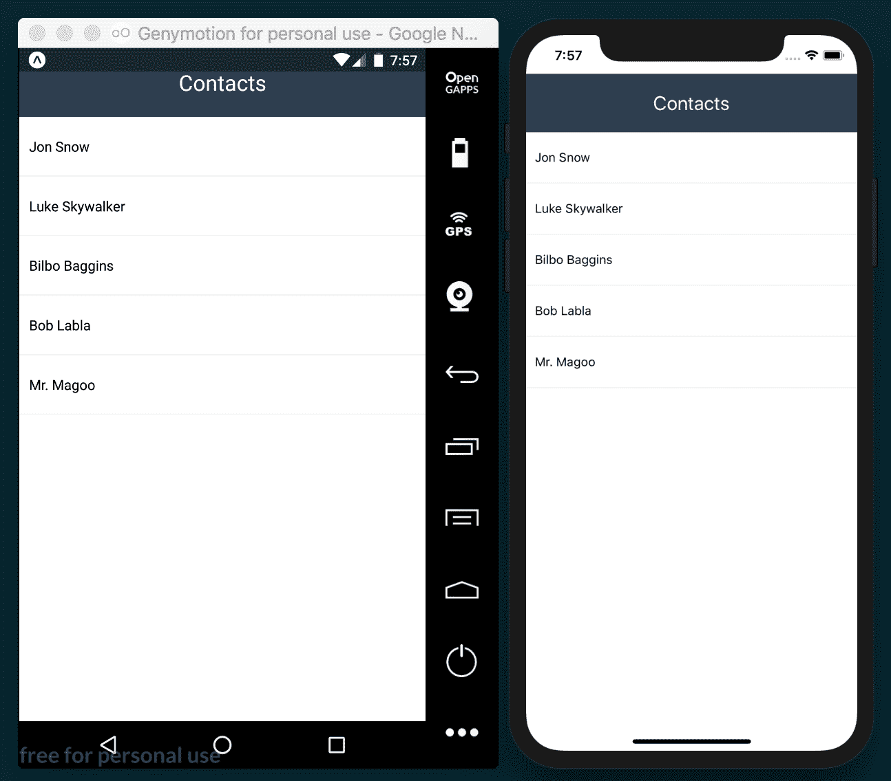

# 七、向应用添加高级动画

在本章中，我们将介绍以下配方：

*   从列表组件中删除项
*   创建 Facebook 反应小部件
*   全屏显示图像

# 介绍

在上一章中，我们介绍了在 React Native 中使用两个主要动画助手的基础知识：`Animated`和`LayoutAnimation`。在本章中，我们将通过构建更复杂的、展示常见本地 UX 模式的配方来进一步了解这些概念。

# 从列表组件中删除项

在本食谱中，我们将学习如何在带有动画侧边幻灯片的`ListView`中创建列表项。如果用户滑动项目超过阈值，则该项目将被删除。这是许多具有可编辑列表的移动应用中的常见模式。我们还将了解如何使用`PanResponder`处理拖动事件。

# 准备

我们需要创建一个空的应用。对于这个食谱，我们将其命名为`removing-list-items`。

我们还需要创建一个新的`ContactList`文件夹和其中的两个文件：`index.js`和`ContactItem.js`。

# 怎么做。。。

1.  让我们从导入主`App`类的依赖项开始，如下所示：

```jsx
import React from 'react';
import {
  Text,
  StyleSheet,
  SafeAreaView,
} from 'react-native';
import ContactList from './ContactList';
```

2.  这个组件将很简单。我们只需要渲染一个`toolbar`和我们在上一步中导入的`ContactList`组件，如下所示：

```jsx
const App = () => (
  <SafeAreaView style={styles.main}>
    <Text style={styles.toolbar}>Contacts</Text>
    <ContactList style={styles.content} />
  </SafeAreaView>
);

const styles = StyleSheet.create({
  main: {
    flex: 1,
  },
  toolbar: {
    backgroundColor: '#2c3e50',
    color: '#fff',
    fontSize: 22,
    padding: 20,
    textAlign: 'center',
  },
  content: {
    padding: 10,
    flex: 1,
  },
});

export default App;
```

3.  这就是我们所需要的一切，以便开始研究实际的清单。让我们在`ContactList/index.js`处打开文件并导入所有依赖项，如下所示：

```jsx
import React, { Component } from 'react';
import {
  ListView,
  ScrollView,
} from 'react-native';
import ContactItem from './ContactItem';
```

4.  然后我们需要定义一些数据。在现实世界的应用中，我们将从 API 获取数据，但为了保持简单并只关注拖动功能，让我们在同一个文件中定义数据：

```jsx
const data = [
  { id: 1, name: 'Jon Snow' },
  { id: 2, name: 'Luke Skywalker' },
  { id: 3, name: 'Bilbo Baggins' },
  { id: 4, name: 'Bob Labla' },
  { id: 5, name: 'Mr. Magoo' },
];
```

5.  此组件的`state`将只包含两个属性：列表的数据和一个布尔值，该布尔值将在拖动开始或结束时更新。如果您不熟悉`ListView`的工作原理，请查看[第 2 章](01.html)*中显示*配方的*，创建一个简单的 React 原生应用*。让我们按如下方式定义数据：

```jsx
export default class ContactList extends Component {
  ds = new ListView.DataSource({
    rowHasChanged: (r1, r2) => r1 !== r2
  });

  state = {
    dataSource: this.ds.cloneWithRows(data),
    swiping: false,
  };
  // Defined in later steps
} 
```

6.  `render`方法只需显示列表即可。在`renderScrollComponent`属性中，我们将仅在用户未滑动列表中的项目时启用滚动。如果用户正在刷卡，我们希望禁用垂直滚动，如下所示：

```jsx
  render() {
    const { dataSource, swiping } = this.state;

    return (
    <ListView
        key={data}
        enableEmptySections
        dataSource={dataSource}
        renderScrollComponent={
        (props) => <ScrollView {...props} scrollEnabled={!swiping}/>
        }
        renderRow={this.renderItem}
      />
    );
  }
```

7.  `renderItem`方法将返回列表中的每个项目。在这里，我们需要将联系人信息作为属性发送，同时发送三次回调：

```jsx
  renderItem = (contact) => (
    <ContactItem
      contact={contact}
      onRemove={this.handleRemoveContact}
      onDragEnd={this.handleToggleSwipe}
      onDragStart={this.handleToggleSwipe}
    />
  );
```

8.  我们需要在`state`对象上切换 swiping 属性的值，这将切换列表上的垂直滚动是否被锁定：

```jsx
  handleToggleSwipe = () => {
    this.setState({ swiping: !this.state.swiping });
  }
```

9.  删除项目时，我们需要找到给定`contact`的`index`，然后将其从原始列表中删除。之后，我们需要更新状态上的`dataSource`以使用结果数据重新呈现列表：

```jsx
  handleRemoveContact = (contact) => {
    const index = data.findIndex(
      (item) => item.id === contact.id
    );
    data.splice(index, 1);

    this.setState({
        dataSource: this.ds.cloneWithRows(data),
    });
  }
```

10.  我们已经完成了列表，现在让我们关注列表项。让我们打开`ContactList/ContactItem.js`文件并导入所需的依赖项：

```jsx
import React, { Component } from 'react';
import {
  Animated,
  Easing,
  PanResponder,
  StyleSheet,
  Text,
  TouchableHighlight,
  View,
} from 'react-native';
```

11.  我们需要为这个组件定义`defaultProps`。`defaultProps`对象将需要一个空函数，用于从父`ListView`元素传递给它的四个道具中的每一个道具。按下项目时，将执行`onPress`功能；触点移除时，将执行`onRemove`功能；两个拖动功能将监听拖动事件。在`state`上，我们只需要定义一个动画值来保持拖动的*x*和*y*坐标，如下所示：

```jsx
export default class ContactItem extends Component {
  static defaultProps = {
    onPress: () => {},
    onRemove: () => {},
    onDragEnd: () => {},
    onDragStart: () => {},
  };

  state = {
    pan: new Animated.ValueXY(),
  };
```

12.  组件创建时需要配置`PanResponder`。我们将在`componentWillMount`生命周期挂钩中执行此操作。`PanResponder`负责处理手势。它提供了一个简单的 API 来捕获用户手指生成的事件，如下所示：

```jsx
  componentWillMount() {
    this.panResponder = PanResponder.create({
      onMoveShouldSetPanResponderCapture: this.handleShouldDrag,
      onPanResponderMove: Animated.event(
        [null, { dx: this.state.pan.x }]
      ),
      onPanResponderRelease: this.handleReleaseItem,
      onPanResponderTerminate: this.handleReleaseItem,
    });
  }
```

13.  现在，让我们定义将为上一步中定义的每个回调执行的实际函数。我们可以从`handleShouldDrag`方法开始，如下所示：

```jsx
  handleShouldDrag = (e, gesture) => {
    const { dx } = gesture;
    return Math.abs(dx) > 2;
  }
```

14.  `handleReleaseItem`有点复杂。我们将把这个方法分为两个步骤。首先，我们需要弄清楚当前项是否需要删除。为了做到这一点，我们需要设置一个阈值。如果用户将元素滑动到阈值之外，我们将删除该项，如下所示：

```jsx
  handleReleaseItem = (e, gesture) => {
    const { onRemove, contact,onDragEnd } = this.props;
    const move = this.rowWidth - Math.abs(gesture.dx);
    let remove = false;
    let config = { // Animation to origin position
      toValue: { x: 0, y: 0 },
      duration: 500,
    };

    if (move < this.threshold) {
      remove = true;
      if (gesture.dx > 0) {
        config = { // Animation to the right
          toValue: { x: this.rowWidth, y: 0 },
          duration: 100,
        };
      } else {
        config = { // Animation to the left
          toValue: { x: -this.rowWidth, y: 0 },
          duration: 100,
        };
      }
    }
    // Remainder in next step
  }
```

15.  一旦我们有了动画的配置，我们就可以移动该项目了！首先，我们将执行`onDragEnd`回调，如果要删除该项，我们将运行`onRemove`函数，如下所示：

```jsx
  handleReleaseItem = (e, gesture) => {
    // Code from previous step

    onDragEnd();
    Animated.spring(
      this.state.pan,
      config,
    ).start(() => {
      if (remove) {
        onRemove(contact);
      }
    });
  }
```

16.  我们有完整的拖拽系统。现在我们需要定义`render`方法。我们只需要在`TouchableHighlight`元素中显示联系人名称，包装在`Animated.View`中，如下所示：

```jsx
  render() {
    const { contact, onPress } = this.props;

    return (
      <View style={styles.row} onLayout={this.setThreshold}>
        <Animated.View
          style={[styles.pan, this.state.pan.getLayout()]}
          {...this.panResponder.panHandlers}
        >
          <TouchableHighlight
            style={styles.info}
            onPress={() => onPress(contact)}
            underlayColor="#ecf0f1"
          >
            <Text>{contact.name}</Text>
          </TouchableHighlight>
        </Animated.View>
      </View>
    );
  }
```

17.  这个类还需要一个方法，通过`View`元素的`onLayout`道具在布局更改时触发。`setThreshold`将获取`row`的当前`width`并设置`threshold`。在本例中，我们将其设置为屏幕宽度的三分之一。需要这些值来决定是否删除该项，如下所示：

```jsx
  setThreshold = (event) => {
    const { layout: { width } } = event.nativeEvent;
    this.threshold = width / 3;
    this.rowWidth = width;
  }
```

18.  最后，我们将向行中添加一些样式，如下所示：

```jsx
const styles = StyleSheet.create({
  row: {
    backgroundColor: '#ecf0f1',
    borderBottomWidth: 1,
    borderColor: '#ecf0f1',
    flexDirection: 'row',
  },
  pan: {
    flex: 1,
  },
  info: {
    backgroundColor: '#fff',
    paddingBottom: 20,
    paddingLeft: 10,
    paddingTop: 20,
  },
});
```

19.  最终的应用应该类似于以下屏幕截图：



# 它是如何工作的。。。

在*步骤 5*中，我们在`state`上定义了`swiping`属性。此属性只是一个布尔值，在拖动开始时设置为`true`，在拖动完成时设置为`false`。我们需要这些信息，以便在拖动项目时锁定列表上的垂直滚动。

在*步骤 7*中，我们定义了列表中每一行的内容。`onDragStart`属性接收`handleToggleSwipe`方法，该方法将在拖动开始时执行。当拖动完成时，我们还将执行相同的方法。

在同一步骤中，我们还将`handleRemoveContact`方法发送到每个项目。顾名思义，我们将在用户刷出当前项时将其从列表中删除。

在*步骤 11*中，我们为项目组件定义了`defaultProps`和`state`。在过去的配方中，我们一直使用单个值创建动画，但在本例中，我们需要处理*x*和*y*坐标，因此我们需要`Animated.ValueXY`的实例。在内部，这个类处理两个`Animated.Value`实例，因此 API 与我们以前看到的几乎相同。

在*步骤 12*中创建`PanResponder`。React Native 中的手势系统与浏览器中的事件系统类似，在发生触摸事件时，手势处理分为两个阶段：捕捉和气泡。在我们的例子中，我们需要使用捕获阶段来确定当前事件是正在按下该项还是正在尝试拖动该项。`onMoveShouldSetPanResponderCapture`将捕获该事件。然后，我们需要通过返回`true`或`false`来决定是否拖动项目。

`onPanResponderMove`道具将从每一帧的动画中获取值，这些值将应用于`state`中的`pan`对象。我们需要使用`Animated.event`来访问每一帧的动画值。在这种情况下，我们只需要`x`值。稍后，我们将使用此值运行不同的动画，同时将元素返回到其原始位置或将其从屏幕中删除。

`onPanResponderRelease`功能将在用户释放项目时执行。如果由于任何其他原因，拖动被中断，`onPanResponderTerminate`将被执行。

在*步骤 13*中，我们需要检查当前事件是简单按下还是拖动。我们可以通过检查*x*轴上的增量来实现这一点。如果触摸事件移动超过两个像素，则用户尝试拖动该项目，否则，他们尝试按下按钮。我们将差异作为一个绝对数进行评估，因为运动可以是从左到右或从右到左，我们希望同时适应这两种运动。

在*步骤 14*中，我们需要获得项目相对于设备宽度的移动距离。如果该距离低于我们在`setThreshold`中定义的阈值，则我们需要删除这些项目。我们正在为每个动画定义`config`对象，否则会将项目返回到原始位置。但是如果我们需要删除该项，我们会检查方向并相应地设置配置。

在*步骤 16*中，我们定义了 JSX。我们设置要在`Animated.View`上设置动画的样式。在本例中，它是`left`属性，但我们可以从`state.pan`中存储的`Animated.ValueXY`实例调用`getLayout`方法，而不是手动创建对象，该方法返回顶部和左侧属性及其现有值。

在同一步骤中，我们还通过使用 spread 操作符展开`this.panResponder.panHandlers`来设置`Animated.View`的事件处理程序，该操作符将我们在前面步骤中定义的拖动配置绑定到`Animated.View`。

我们还定义了对来自`props`的`onPress`回调的调用，传递当前`contact`信息。

# 另见

您可以在以下位置找到`PanResponder`API 文档：

[https://facebook.github.io/react-native/docs/panresponder.html](https://facebook.github.io/react-native/docs/panresponder.html)

# 创建 Facebook 反应小部件

在这个配方中，我们将创建一个模拟 Facebook 反应小部件的组件。我们将有一个类似的按钮图像，按下时，将显示五个图标。图标行将在动画中使用交错幻灯片，同时将不透明度从`0`增加到`1`。

# 准备

让我们创建一个名为`facebook-widget`的空应用。

我们需要一些图像来显示假时间线。几张猫的图片就可以了，或者你可以使用 GitHub 上相应存储库中的猫图片（[https://github.com/warlyware/react-native-cookbook/tree/master/chapter-7/facebook-widget](https://github.com/warlyware/react-native-cookbook/tree/master/chapter-7/facebook-widget) ）。我们还需要五个图标来显示这五种反应，例如，愤怒、大笑、伤心和惊讶，它们也可以在相应的存储库中找到。

首先，我们将在空应用中创建两个 JavaScript 文件：`Reactions/index.js`和`Reactions/Icon.js`。我们需要将我们的 cat 图片复制到应用根目录中的`images/`文件夹中，反应图标应该放在`Reactions/images`中。

# 怎么做。。。

1.  我们将在`App`课程上创建一个虚假的 Facebook 时间线。让我们从导入依赖项开始，如下所示：

```jsx
import React from 'react';
import {
  Dimensions,
  Image,
  Text,
  ScrollView,
  StyleSheet,
  SafeAreaView,
} from 'react-native';
import Reactions from './Reactions';
```

2.  我们需要导入一些图像以在时间轴中渲染。这一步中的 JSX 非常简单：它只是一个`toolbar`，一个包含两个`Image`和两个`Reaction`组件的`ScrollView`，如下所示：

```jsx
const image1 = require(img/01.jpg');
const image2 = require(img/02.jpg');
const { width } = Dimensions.get('window');

const App = () => (
  <SafeAreaView style={styles.main}>
    <Text style={styles.toolbar}>Reactions</Text>
    <ScrollView style={styles.content}>
      <Image source={image1} style={styles.image} resizeMode="cover" />
      <Reactions />
      <Image source={image2} style={styles.image} resizeMode="cover" />
      <Reactions />
    </ScrollView>
  </SafeAreaView>
);

export default App;
```

3.  我们需要为该组件添加一些基本的`styles`，如下所示：

```jsx
const styles = StyleSheet.create({
  main: {
    flex: 1,
  },
  toolbar: {
    backgroundColor: '#3498db',
    color: '#fff',
    fontSize: 22,
    padding: 20,
    textAlign: 'center',
  },
  content: {
    flex: 1,
  },
  image: {
    width,
    height: 300,
  },
});
```

4.  我们已经准备好开始这个配方的`Reactions`部分。让我们从导入依赖项开始，如下所示。我们将在后面的步骤中构建导入的`Icon`组件：

```jsx
import React, { Component } from 'react';
import {
  Image,
  Text,
  TouchableOpacity,
  StyleSheet,
  View,
} from 'react-native';
import Icon from './Icon';
```

5.  接下来让我们定义`defaultProps`和首字母`state`。我们还需要在屏幕上显示`like`图标图像，如下所示：

```jsx
const image = require(img/like.png');

export default class Reactions extends Component {
  static defaultProps = {
    icons: [
      'like', 'heart', 'angry', 'laughing', 'surprised',
    ],
  };

  state = {
    show: false,
    selected: '',
  };

  // Defined at later steps 
}
```

6.  让我们定义两种方法：一种是将选择的`state`值设置为选择的`reaction`，另一种是切换`state`的`show`值以相应地显示或隐藏反应行，如下所示：

```jsx
  onSelectReaction = (reaction) => {
    this.setState({
      selected: reaction,
    });
    this.toggleReactions();
  }

  toggleReactions = () => {
    this.setState({
      show: !this.state.show,
    });
  };
```

7.  我们将为这个组件定义`render`方法。我们将显示一个图像，按下该图像时，将调用我们之前定义的`toggleReactions`方法，如下所示：

```jsx
  render() {
    const { style } = this.props;
    const { selected } = this.state;

    return (
      <View style={[style, styles.container]}>
        <TouchableOpacity onPress={this.toggleReactions}>
          <Image source={image} style={styles.icon} />
        </TouchableOpacity>
        <Text>{selected}</Text>
        {this.renderReactions()}
      </View>
    );
  }
```

8.  在这一步中，您会注意到我们正在调用`renderReactions`方法。接下来，我们将呈现用户按下主反应按钮时要显示的所有图标，如下所示：

```jsx
  renderReactions() {
    const { icons } = this.props;
    if (this.state.show) {
      return (
        <View style={styles.reactions}>
        { icons.map((name, index) => (
            <Icon
              key={index}
              name={name}
              delay={index * 100}
              index={index}
              onPress={this.onSelectReaction}
            />
          ))
        }
        </View>
      );
    }
  }
```

9.  我们需要为这个组件设置`styles`。我们将为反应图标图像设置大小，并定义一些填充。`reactions`容器的高度将为`0`，因为图标将浮动，我们不希望添加任何额外的空间：

```jsx
const styles = StyleSheet.create({
  container: {
    padding: 10,
  },
  icon: {
    width: 30,
    height: 30,
  },
  reactions: {
    flexDirection: 'row',
    height: 0,
  },
});
```

10.  `Icon`组件当前缺失，因此如果我们尝试在此时运行我们的应用，它将失败。让我们通过打开`Reactions/Icon.js`文件并添加组件的导入来构建此组件，如下所示：

```jsx
import React, { Component } from 'react';
import {
  Animated,
  Dimensions,
  Easing,
  Image,
  StyleSheet,
  TouchableOpacity,
  View,
} from 'react-native';
```

11.  让我们定义将要使用的图标。我们将为图标使用一个对象，以便我们可以轻松地按其键名检索每个图像，如下所示：

```jsx
const icons = {
  angry: require(img/angry.png'),
  heart: require(img/heart.png'),
  laughing: require(img/laughing.png'),
  like: require(img/like.png'),
  surprised: require(img/surprised.png'),
};
```

12.  现在我们应该为这个组件定义`defaultProps`。我们不需要定义初始状态：

```jsx
export default class Icon extends Component {
  static defaultProps = {
    delay: 0,
    onPress: () => {},
  };

}
```

13.  图标应通过动画显示在屏幕上，因此我们需要在安装组件时创建并运行动画，如下所示：

```jsx
  componentWillMount() {
    this.animatedValue = new Animated.Value(0);
  }

  componentDidMount() {
    const { delay } = this.props;

    Animated.timing(
      this.animatedValue,
      {
        toValue: 1,
        duration: 200,
        easing: Easing.elastic(1),
        delay,
      }
    ).start();
  }
```

14.  当按下图标时，我们需要执行`onPress`回调以通知父级已选择反应。我们将反应名称作为参数发送，如下所示：

```jsx
  onPressIcon = () => {
    const { onPress, name } = this.props;
    onPress(name);
  }
```

15.  谜题的最后一部分是`render`方法，在这里我们将为这个组件定义 JSX，如下所示：

```jsx
  render() {
    const { name, index, onPress } = this.props;
    const left = index * 50;
    const top = this.animatedValue.interpolate({
      inputRange: [0, 1],
      outputRange: [10, -95],
    });
    const opacity = this.animatedValue;

    return (
      <Animated.View
        style={[
          styles.icon,
          { top, left, opacity },
        ]}
      >
        <TouchableOpacity onPress={this.onPressIcon}>
          <Image source={icons[name]} style={styles.image} />
        </TouchableOpacity>
      </Animated.View>
    );
  }
```

16.  作为最后一步，我们将为每个`icon`添加样式。我们需要图标浮动，所以我们将`position`设置为`absolute`和`width`以及`height`设置为`40`像素。更改后，我们应该能够运行我们的应用：

```jsx
  icon: {
    position: 'absolute',
  },
  image: {
    width: 40,
    height: 40,
  },
});
```

17.  最终的应用应该类似于以下屏幕截图：


# 它是如何工作的。。。

在*步骤 2*中，我们在时间轴中定义了`Reactions`组件。目前，我们的重点不是处理数据，而是显示 UI。因此，我们不会通过`Reactions`道具发送任何回调来获取所选值。

在*步骤 5*中，我们定义了`defaultProps`和初始`state`。

我们在该州有两处房产：

*   `show`道具是一个布尔值。当用户按下主按钮时，我们使用它切换反应图标。当`false`时，我们隐藏反应，当`true`时，我们运行动画显示每个图标。
*   `selected`包含当前选择。每次选择一个新的反应，我们都会更新这个道具。

在*步骤 8*中，我们渲染图标。在这里，我们需要向创建的每个实例发送图标的名称。我们还为每个图标发送 100 毫秒的`delay`，这将创建一个漂亮的交错动画。`onPress`道具接收*步骤 6*中定义的`onSelectReaction`方法，将所选反应设置在`state`上。

在*步骤 13*中，我们创建动画。首先，我们使用`Animated.Value`助手定义`animatedValue`变量，正如前面的配方中提到的，它是负责保存动画中每个帧的值的类。一旦装入组件，我们就运行动画。动画从`0`到`1`，持续时间为 200 毫秒，使用弹性缓和功能，我们根据收到的`delay`道具延迟动画。

在*步骤 15*中，我们为`Icon`组件定义了 JSX。在这里，我们为`top`和`opacity`属性设置动画。对于`top`属性，我们需要对`animatedValue`中的值进行插值，以便图标从其原始位置向上移动 95 个像素。`opacity`属性所需的值是从`0`到`1`，因为我们不需要插入任何东西来完成这一点，所以我们可以直接使用`animatedValue`。

`left`值是根据`index`计算得出的：我们只需将图标移动到上一个图标的左侧 50 个像素，这将避免在示例位置渲染所有图标。

# 全屏显示图像

在本食谱中，我们将创建图像的时间线。当用户按下任何图像时，它将全屏显示黑色背景的图像。

我们将使用不透明度动画作为背景，并将图像从其原始位置滑入。

# 准备

让我们创建一个名为`photo-viewer`的空应用。

此外，我们还将创建用于在时间轴中显示每个图像的`PostContainer/index.js`，以及用于全屏显示所选图像的`PhotoViewer/index.js`。

您可以使用 GitHub（[上托管的此配方存储库中包含的图像 https://github.com/warlyware/react-native-cookbook/tree/master/chapter-7/photo-viewer](https://github.com/warlyware/react-native-cookbook/tree/master/chapter-7/photo-viewer) ），或者使用一些自己的照片。将它们放在项目根目录的`images`文件夹中。

# 怎么做。。。

1.  我们将在`App`类中显示带有图像的时间轴。让我们导入所有依赖项，包括我们将在后面的步骤中构建的其他两个组件，如下所示：

```jsx
import React, { Component } from 'react';
import {
  Dimensions,
  Image,
  Text,
  ScrollView,
  StyleSheet,
  SafeAreaView,
} from 'react-native';
import PostContainer from './PostContainer';
import PhotoViewer from './PhotoViewer';
```

2.  在这一步中，我们将定义要渲染的数据。它只是一个包含`title`和`image`的简单对象数组，如下所示：

```jsx
const image1 = require(img/01.jpg');
const image2 = require(img/02.jpg');
const image3 = require(img/03.jpg');
const image4 = require(img/04.jpg');

const timeline = [
  { title: 'Enjoying the fireworks', image: image1 },
  { title: 'Climbing the Mount Fuji', image: image2 },
  { title: 'Check my last picture', image: image3 },
  { title: 'Sakuras are beautiful!', image: image4 },
];
```

3.  现在我们需要声明这个组件的首字母`state`。当按下任何图像时，我们将更新`selected`和`position`属性，如下所示：

```jsx
export default class App extends Component {
  state = {
    selected: null,
    position: null,
  };
  // Defined in following steps
}
```

4.  为了更新`state`，我们将声明两种方法：一种是设置已按下图像的值，另一种是在关闭查看器时删除这些值：

```jsx
  showImage = (selected, position) => {
    this.setState({
      selected,
      position,
    });
  }

  closeViewer = () => {
    this.setState({
      selected: null,
      position: null,
    });
  }
```

5.  现在我们准备好研究`render`方法。在这里，我们需要渲染`ScrollView`中的每个图像，以便列表可以滚动，如下所示：

```jsx
  render() {
    return (
      <SafeAreaView style={styles.main}>
        <Text style={styles.toolbar}>Timeline</Text>
        <ScrollView style={styles.content}>
        {
          timeline.map((post, index) =>
            <PostContainer key={index} post={post}
            onPress={this.showImage} />
          )
        }
        </ScrollView>
        {this.renderViewer()}
      </SafeAreaView>
    );
  }
```

6.  在上一步中，我们调用了`renderViewer`方法。这里，我们将仅在状态中有 post`selected`时显示查看器组件。我们还将发送启动动画的初始位置和关闭查看器的回调，如下所示：

```jsx
  renderViewer() {
    const { selected, position } = this.state;

    if (selected) {
      return (
        <PhotoViewer
          post={selected}
          position={position}
          onClose={this.closeViewer}
        />
      );
    }
  }
```

7.  此组件的样式非常简单，只有一些颜色和填充，如下所示：

```jsx
const styles = StyleSheet.create({
  main: {
    backgroundColor: '#ecf0f1',
    flex: 1,
  },
  toolbar: {
    backgroundColor: '#2c3e50',
    color: '#fff',
    fontSize: 22,
    padding: 20,
    textAlign: 'center',
  },
  content: {
    flex: 1,
  },
});
```

8.  时间表已经完成，但如果我们尝试运行我们的应用，它将失败。让我们研究一下`PostContainer`组件。我们将从导入依赖项开始，如下所示：

```jsx
import React, { Component } from 'react';
import {
  Dimensions,
  Image,
  Text,
  TouchableOpacity,
  StyleSheet,
  View,
} from 'react-native';
```

9.  这个组件我们只需要两个`props`。`post`道具将接收图像数据`title`和`image`，而`onPress`道具是我们在按下图像时执行的回调，如下所示：

```jsx
const { width } = Dimensions.get('window');

export default class PostContainer extends Component {
  static defaultProps = {
    onPress: ()=> {},
  };
  // Defined on following steps
}
```

10.  该组件将位于`ScrollView`的内部。这意味着当用户开始滚动内容时，其位置将发生变化。按下图像时，我们需要获得屏幕上的当前位置，并将此信息发送到父组件，如下所示：

```jsx
  onPressImage = (event) => {
    const { onPress, post } = this.props;
    this.refs.main.measure((fx, fy, width, height, pageX, pageY) => {
      onPress(post, {
        width,
        height,
        pageX,
        pageY,
      });
    });
  }
```

11.  现在是为这个组件定义 JSX 的时候了。为了简单起见，我们将只呈现`image`和`title`：

```jsx
  render() {
    const { post: { image, title } } = this.props;

    return (
      <View style={styles.main} ref="main">
        <TouchableOpacity
           onPress={this.onPressImage}
           activeOpacity={0.9}
            >
          <Image
            source={image}
            style={styles.image}
            resizeMode="cover"
          />
        </TouchableOpacity>
        <Text style={styles.title}>{title}</Text>
      </View>
    );
  }
```

12.  和往常一样，我们需要为这个组件定义一些样式。我们将添加一些颜色和填充，如下所示：

```jsx
const styles = StyleSheet.create({
  main: {
    backgroundColor: '#fff',
    marginBottom: 30,
    paddingBottom: 10,
  },
  content: {
    flex: 1,
  },
  image: {
    width,
    height: 300,
  },
  title: {
    margin: 10,
    color: '#ccc',
  }
});
```

13.  如果我们现在运行应用，我们应该能够看到时间线，但是如果我们按下任何图像，就会抛出一个错误。我们需要定义查看器，所以让我们打开`PhotoViewer/index.js`文件并导入依赖项：

```jsx
import React, { Component } from 'react';
import {
  Animated,
  Dimensions,
  Easing,
  Text,
  TouchableOpacity,
  StyleSheet,
} from 'react-native';
```

14.  让我们为这个组件定义`props`。为了在屏幕上居中显示图像，我们需要知道当前设备的`height`：

```jsx
const { width, height } = Dimensions.get('window');

export default class PhotoViewer extends Component {
  static defaultProps = {
    onClose: () => {},
  };
  // Defined on following steps
}
```

15.  我们希望在显示此组件时运行两个动画，因此需要在安装组件后初始化并运行动画。动画很简单：在`400`毫秒内从`0`到`1`，并应用了一些缓和，如下所示：

```jsx
  componentWillMount() {
    this.animatedValue = new Animated.Value(0);
  }

  componentDidMount() {
    Animated.timing(
      this.animatedValue,
      {
        toValue: 1,
        duration: 400,
        easing: Easing.in,
      }
    ).start();
  }
```

16.  当用户按下关闭按钮时，我们需要执行`onClose`回调，通知父级需要删除此组件，如下所示：

```jsx
  onPressBtn = () => {
    this.props.onClose();
  }
```

17.  我们将把`render`方法分为两个步骤。首先，我们需要为动画插值，如下所示：

```jsx
  render() {
    const { post: { image, title }, position } = this.props;
    const top = this.animatedValue.interpolate({
      inputRange: [0, 1],
      outputRange: [position.pageY, height/2 - position.height/2],
    });
    const opacity = this.animatedValue;
    // Defined on next step 
  } 
```

18.  我们只需要定义三个元素：`Animated.View`设置背景动画；`Animated.Image`显示图像，以及一个关闭按钮。我们正在将`opacity`样式设置为主视图，这将使图像背景从透明变为黑色。图像将同时滑入，创建一个良好的效果：

```jsx
// Defined on previous step
  render() {
    return (
      <Animated.View
        style={[
          styles.main,
          { opacity },
        ]}
      >
        <Animated.Image
          source={image}
          style={[
            styles.image,
            { top, opacity }
          ]}
        />
        <TouchableOpacity style={styles.closeBtn}
          onPress={this.onPressBtn}
        >
          <Text style={styles.closeBtnText}>X</Text>
        </TouchableOpacity>
      </Animated.View>
    );
  }
```

19.  我们差不多完成了！本配方的最后一步是定义样式。我们需要将主容器的位置设置为绝对，以便图像位于其他所有内容之上。我们还将关闭按钮移动到屏幕右上角，如下所示：

```jsx
const styles = StyleSheet.create({
  main: {
    backgroundColor: '#000',
    bottom: 0,
    left: 0,
    position: 'absolute',
    right: 0,
    top: 0,
  },
  image: {
    width,
    height: 300,
  },
  closeBtn: {
    position: 'absolute',
    top: 50,
    right: 20,
  },
  closeBtnText: {
    fontSize: 20,
    color: '#fff',
    fontWeight: 'bold',
  },
});
```

20.  最终的应用应类似于以下屏幕截图：


# 它是如何工作的。。。

在*步骤 4*中，我们在`state`上定义了两个属性：`selected`和`position`。`selected`属性保存按下图像的图像数据，可以是*步骤 3*中定义的任何`timeline`对象。`position`属性将保存屏幕上当前的*y-*坐标，稍后用于设置图像从原始位置到屏幕中心的动画。

在*步骤 5*中，我们`map`在`timeline`数组上绘制每个`post`。我们为每个帖子使用了`PostContainer`元素，发送`post`信息，并使用`onPress`回调设置按下的图像。

在*步骤 10*中，我们需要图像的当前位置。为了实现这一点，我们使用`measure`方法从我们想要获取信息的组件获取信息。此方法接收回调函数，并在其他属性中检索`width`、`height`和屏幕上的当前位置。

我们正在使用一个引用来访问组件，该组件在下一步的 JSX 中声明。

在*步骤 11*中，我们为组件声明了 JSX。在主包装容器中，我们设置了`ref`属性，用于获取图像的当前位置。每当我们想要访问当前类的任何方法上的组件时，我们都会使用引用。我们可以通过简单地设置`ref`属性并为任何组件指定名称来创建引用。

在*步骤 18*中，我们对动画值进行插值，以获得每个帧的正确顶部值。该插值的输出将从图像的当前位置开始，并前进到屏幕中间。这样，根据值是负值还是正值，动画将从下到上运行，或者从下到上运行。

我们不需要插值`opacity`，因为当前动画值已经从`0`变为`1`。

# 另见

有关 REF 和 DOM 的详细说明，请参见以下链接：

[https://reactjs.org/docs/refs-and-the-dom.html](https://reactjs.org/docs/refs-and-the-dom.html) 。