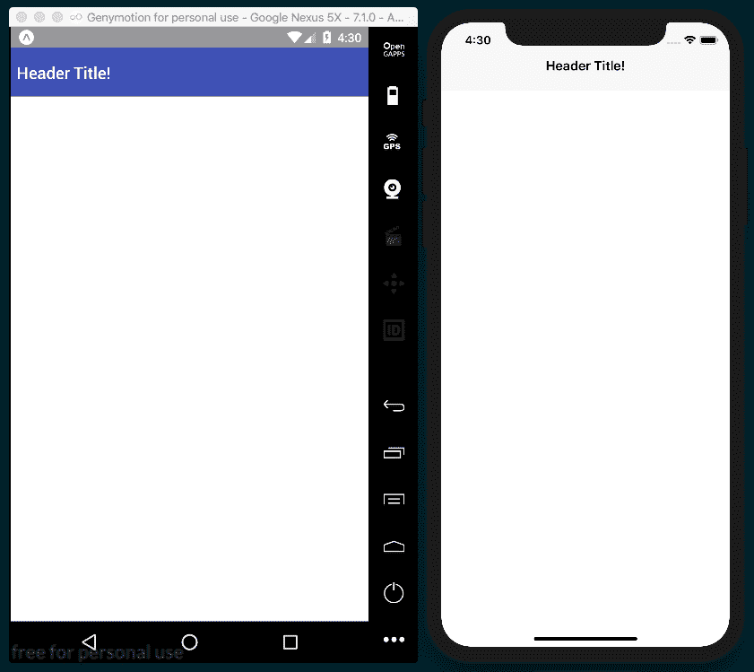
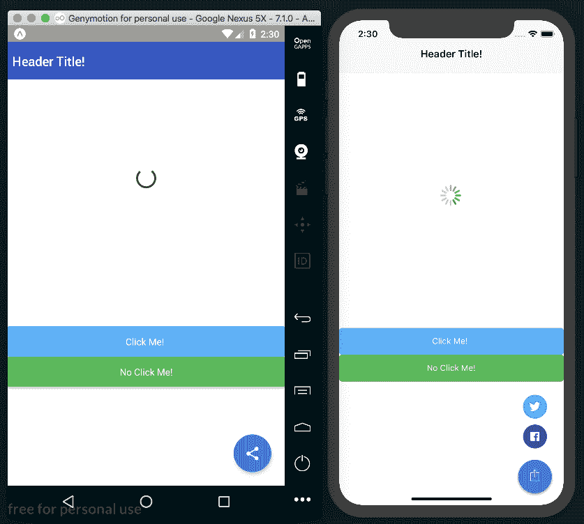
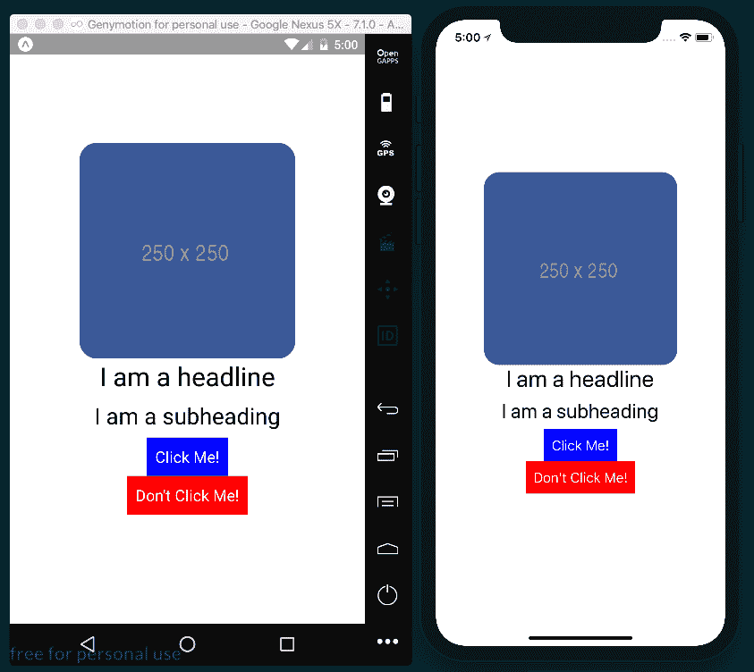
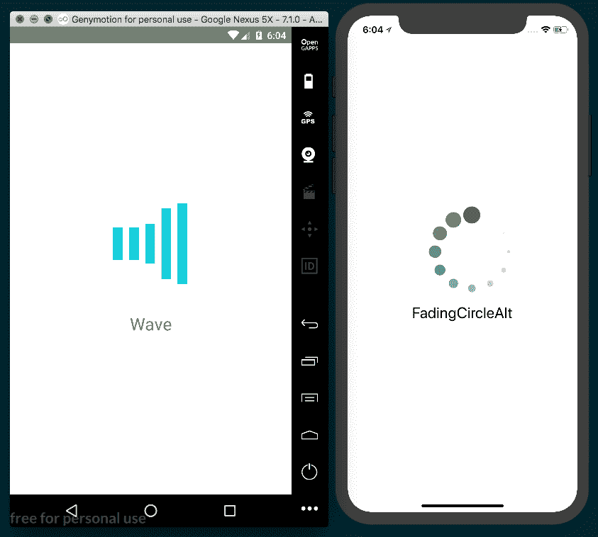
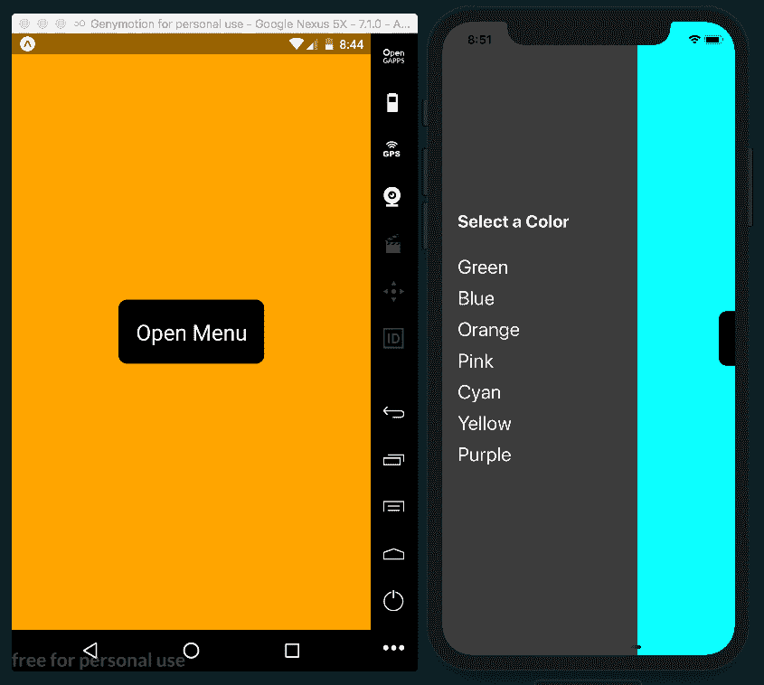
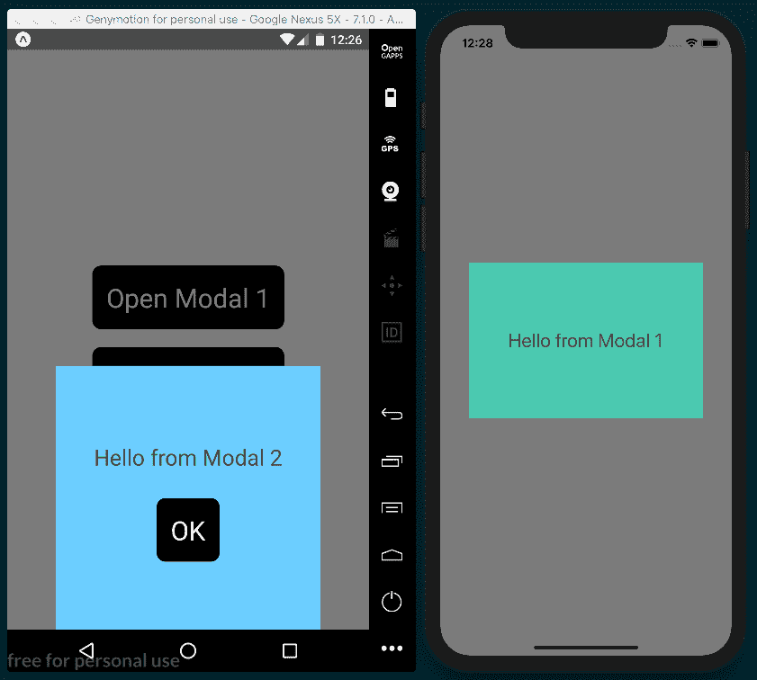

# 应用程序工作流和第三方插件

本章的工作方式有点不同，因此我们在继续介绍以下配方之前，将首先对其进行研究：

*   反应本地开发工具
*   规划应用程序并选择工作流程
*   将 NativeBase 用于跨平台 UI 组件
*   使用迷人的本机设置 UI 组件的样式
*   使用 react native spinkit 添加动画加载指示器
*   使用 react 本机端菜单添加端导航菜单
*   使用 react native modalbox 添加模态

# 本章的工作原理

在本章中，我们将更深入地了解每种引导新 React 本机应用程序的方法是如何工作的，以及我们如何集成可能对世博会友好也可能不友好的第三方软件包。在前几章中，重点完全放在构建 React 本机应用程序的功能部件上。因此，在本章中，这些方法中的许多还将起到第二个作用，即说明如何使用不同的工作流实现不同的包。

在本章中的大多数方法中，我们将从使用 React Native CLI 命令初始化的纯 React Native 项目开始，其操作如下：

```jsx
 react-native init
```

创建新的 React 本机应用程序时，您需要选择正确的工具来初始化应用程序。一般来说，您用于引导和开发 React 本机应用程序的工具要么侧重于简化开发过程，要么有意混淆您的本机代码，以方便您使用，并节省开支，或者通过提供对所有本机代码的访问并允许使用更多的第三方插件来保持开发过程的灵活性。

初始化和开发应用程序有两种方法：Expo 和 React Native CLI。直到最近，还有一种独特的第三种方法，即使用**创建 React 原生应用程序**（**CRNA**）。此后，CRNA 已与世博会项目合并，仅作为一个单独的实体继续存在，以提供向后兼容性。

Expo 属于第一类工具，它以一定的灵活性为代价，提供了一个更健壮、对开发人员更友好的开发工作流。使用 Expo 引导的应用程序还可以访问 Expo SDK 提供的多种有用功能，如`BarcodeScanner`、`MapView`、`ImagePicker`等等。

通过以下命令，使用 React Native CLI 初始化应用程序：

```jsx
 react-native init
```

这以易于开发为代价提供了灵活性

```jsx
 react-native init 
```

据说它是一个纯 React 本机应用程序，因为没有任何本机代码对开发人员隐藏。

根据经验，如果使用安装程序需要运行以下命令的第三方软件包，则需要纯 React 本机应用程序：

```jsx
 react-native link 
```

那么，当您在使用 Expo 构建应用程序的过程中发现 Expo 开发工作流不支持与您的应用程序要求集成的软件包时，您会怎么做？幸运的是，Expo 有一种将 Expo 项目转化为纯 React 本机应用程序的方法，就像它是使用以下命令创建的一样：

```jsx
expo eject
```

当一个项目被弹出时，所有的本机代码被解包到`ios`和`android`文件夹中，`App.js`文件被拆分为`App.js`和`index.js`，公开了装载根 React 本机组件的代码。

但是，如果您的 Expo 应用程序依赖于 Expo SDK 提供的功能，该怎么办？毕竟，使用 Expo 开发的大部分价值来自 SDK 提供的优秀功能，包括`AuthSession`、`Permissions`、`WebBrowser`等。

这就是 ExpoKit 发挥作用的地方。当您选择从项目中弹出时，您可以选择将 ExpoKit 作为弹出项目的一部分。包括 ExpoKit 将确保应用程序中使用的所有 Expo 依赖项将继续工作，并使您能够继续使用 Expo SDK 的所有功能，即使在应用程序被弹出后也是如此。

为了更深入地了解弹出过程，您可以阅读[上的世博会文档 https://docs.expo.io/versions/latest/expokit/eject](https://docs.expo.io/versions/latest/expokit/eject) 。

# 反应本地开发工具

与任何开发工具一样，在灵活性和易用性之间需要权衡。我鼓励您首先将 Expo 用于 React 本机开发工作流，除非您确定需要访问本机代码。

# 博览会

这是取自[expo.io](http://expo.io)网站：

"Expo is a free and open source toolchain built around React Native to help you build native iOS and Android projects using JavaScript and React."

世博会正在成为其自身的生态系统，由五个相互关联的工具组成：

*   **Expo CLI**：Expo 的命令行界面。
    我们一直在使用 Expo CLI 创建、构建和服务应用程序。CLI 支持的所有命令的列表可在以下链接的官方文档中找到：

[https://docs.expo.io/versions/latest/workflow/expo-cli](https://docs.expo.io/versions/latest/workflow/expo-cli)

*   **世博会开发者工具**：这是一个基于浏览器的工具，每当通过`expo start`命令从终端启动世博会应用程序时，该工具就会自动运行。它为您的开发中应用程序提供活动日志，并快速访问本地运行应用程序以及与其他开发人员共享应用程序
*   **世博客户端**：安卓和 iOS 的应用。此应用程序允许您在设备上的 Expo 应用程序中运行 React 本机项目，而无需安装。这允许开发人员在真实设备上热加载，或与任何其他人共享开发代码，而无需安装。
*   **世博小吃**：在[举办 https://snack.expo.io](https://snack.expo.io/) ，此 web 应用程序允许您在浏览器中使用 React 本机应用程序，并实时预览您正在使用的代码。如果您曾经使用过 CodePen 或 JSFiddle，那么 Snack 就是应用于 React 本机应用程序的相同概念。
*   **Expo SDK**：这是一个包含大量 JavaScript API 的 SDK，这些 API 提供了在基本 React 本机软件包中找不到的本机功能，包括使用设备的加速计、摄像头、通知、地理位置等。这个 SDK 伴随着世博会创建的每个新项目而来。

这些工具共同构成了世博会的工作流程。使用 Expo CLI，您可以使用内置的 Expo SDK 支持创建和构建新的应用程序。CLI 还提供了一种简单的方法，通过自动将代码推送到 AmazonS3 并为项目生成 URL，为开发中的应用程序提供服务。从那里，CLI 生成链接到托管代码的 QR 代码。在你的 iPhone 或 Android 设备上打开 Expo 客户端应用程序，扫描二维码，然后弹出你的应用程序，配备热重新加载！由于该应用程序托管在 AmazonS3 上，您甚至可以与其他开发人员实时共享开发中的应用程序。

# 反应本机 CLI

使用命令创建新 React 本机应用程序的原始引导方法如下：

```jsx
react-native init 
```

这是由 React Native CLI 提供的。只有在确定需要访问应用程序的本机层时，才可能使用此方法引导新应用程序

在 React Native 社区中，使用此方法创建的应用称为纯 React Native 应用，因为所有开发和本机代码文件都向开发人员公开。这提供了最大的自由度，同时也迫使开发人员维护本机代码。如果您是一名 JavaScript 开发人员，因为只打算使用 JavaScript 编写本机应用程序而跳上了 React Native 的潮流，那么在 React Native 项目中维护本机代码可能是这种方法的最大缺点。

另一方面，当你在这个过程中启动应用程序时，你可以访问更多的第三方插件。

直接访问代码库的本机部分。您还可以避开目前世博会的一些限制，特别是无法使用背景音频或背景 GPS 服务。

# 椰子荚

一旦您开始使用具有使用本机代码的组件的应用程序，您也将在开发中使用 cocoapod。CocoaPods 是 Swift 和 Objective-C 可可项目的依赖关系管理者。它的工作原理与 npm 几乎相同，但是管理本机 iOS 代码而不是 JavaScript 代码的开源依赖项。

在本书中，我们不会经常使用 CocoaPods，但是 React Native 在一些 iOS 集成中使用了 CocoaPods，因此对 manager 有一个基本的了解是很有帮助的。正如`package.json`文件包含了使用 npm 管理的 JavaScript 项目的所有包一样，CocoaPods 使用`Podfile`来列出项目的 iOS 依赖项。同样，可以使用以下命令安装这些依赖项：

```jsx
 pod install
```

运行 CocoaPods 需要 Ruby。在命令行中运行该命令以验证 Ruby 是否已安装：

```jsx
 ruby -v 
```

如果没有，则可以通过以下命令使用自制软件安装：

```jsx
 brew install ruby
```

安装 Ruby 后，可以通过以下命令安装 CoCoapod：

```jsx
sudo gem install cocoapods
```

如果您在安装过程中遇到任何问题，您可以阅读[上的官方 CocoaPods*入门*指南 https://guides.cocoapods.org/using/getting-started.html](https://guides.cocoapods.org/using/getting-started.html) 。

# 规划应用程序并选择工作流程

在尝试选择最适合您的应用程序需要的开发工作流时，您应该考虑以下几点：

*   我需要访问代码库的本机部分吗？
*   我的应用程序中是否需要 Expo 不支持的任何第三方软件包，即需要运行命令 react native link？
*   我的应用程序不在前台时是否需要播放音频？
*   我的应用程序不在前台时是否需要位置服务？
*   在 Xcode 和 Android Studio 中工作，至少在名义上，我感觉舒服吗？

根据我的经验，世博会通常是最好的起点。它为开发过程提供了很多好处，并且如果你的应用程序超出了最初的需求，那么在弹出过程中会给你一个逃生舱口。如果您确信您的应用程序需要一些 Expo 应用程序无法提供的东西，或者如果您确信您将需要使用本机代码，我建议仅使用 React Native CLI 开始开发。

我还建议浏览托管在[的本机目录 http://native.directory](http://native.directory) 。该站点有一个非常大的第三方软件包目录，可用于 React 本机开发。网站上列出的每个软件包都有一个估计的稳定性、流行度和文档链接。然而，本机目录可以说是最好的功能，它能够根据支持的设备/开发类型（包括 iOS、Android、Expo 和 web）过滤软件包。这将帮助您缩小软件包的选择范围，并更好地指示给定应用程序应采用哪种工作流。

# 怎么做。。。

我们将从应用程序的 React-Native CLI 设置开始，它将创建一个新的纯 React-Native 应用程序，允许我们访问所有本机代码，但还需要安装 Xcode 和 Android Studio。

[Chapter 1](11.html)

*Setting Up Your Environment*

1.  首先，我们将安装使用纯 React 本机应用程序所需的所有依赖项，从自制（[开始）https://brew.sh/](https://brew.sh/) macOS 的软件包管理器。如项目主页所述，可通过以下命令从终端轻松安装 Homebrew：

```jsx
/usr/bin/ruby -e "$(curl -fsSL https://raw.githubusercontent.com/Homebrew/install/master/install)"
```

2.  一旦安装了 Homebrew，就可以使用它安装 React 本机开发所需的依赖项：Node.js 和`nodemon`。如果您是 JavaScript 开发人员，您可能已经安装了 Node.js。您可以通过以下命令检查它是否已安装：

```jsx
node -v
```

此命令将列出已安装的 Node.js 的版本（如果有）。请注意，对于 React 本机开发，您将需要 Node.js 版本 8 或更高版本。如果尚未安装 Node.js，可以通过以下命令使用 Hombrew 安装它：

```jsx
brew install node
```

3.  我们还需要`nodemon`包，它可以在后台对本地使用进行反应，从而在开发过程中实现实时重新加载等功能。通过以下命令使用自制软件安装`nodemon`：

```jsx
brew install watchman
```

4.  当然，我们还需要 React Native CLI 来运行引导 React Native 应用程序的命令。可通过以下命令使用`npm`进行全局安装：

```jsx
npm install -g react-native-cli
```

5.  安装 CLI 后，创建新的纯 React 本机应用程序所需的全部工作如下：

```jsx
react-native init name-of-project
```

这将在新的`name-of-project`目录中创建一个新项目。此项目公开了所有本机代码，需要 Xcode 来运行 iOS 应用程序，需要 Android Studio 来运行 Android 应用程序。幸运的是，安装支持 iOS React 本机开发的 Xcode 是一个简单的过程。第一步是从应用商店下载 Xcode 并安装它。第二步是安装 Xcode 命令行工具。要执行此操作，请打开 Xcode，从 Xcode 菜单中选择 Preferences…，打开 Locations 面板，然后从命令行工具下拉列表中安装最新版本：


6.  不幸的是，为支持 AndroidReact 本机开发而设置 AndroidStudio 并不是一成不变的，安装它需要一些非常具体的步骤。由于这个过程特别复杂，而且在您阅读本章时，这个过程可能已经发生了一些变化，因此我建议您参考官方文档，以获得有关安装所有 Android 开发依赖项的深入、最新说明。这些说明位于以下 URL 上：

[https://facebook.github.io/react-native/docs/getting-started.html#java-开发工具包](https://facebook.github.io/react-native/docs/getting-started.html#java-development-kit)

7.  现在已经安装了所有依赖项，我们可以通过命令行运行纯 React 本机项目。iOS 应用程序可以通过以下方式执行：

```jsx
react-native run-ios
```

Andriod 应用程序可以通过以下方式启动：

```jsx
react-native run-android
```

在尝试打开 Android 应用程序之前，请确保您已经在运行 Android emulator。这些命令应在关联的 emulator 上为正确的平台启动应用程序，安装新应用程序，并在 emulator 中运行应用程序。如果这些命令中的任何一个无法按预期运行，您可能会在 React Native troubleshooting docs（位于此处）中找到答案：

[https://facebook.github.io/react-native/docs/troubleshooting.html#content](https://facebook.github.io/react-native/docs/troubleshooting.html#content)

# Expo CLI 设置

Expo CLI 可以通过以下命令使用带有`npm`的终端进行安装：

```jsx
npm install -g expo-cli
```

Expo CLI 可以用来完成 Expo GUI 客户端可以完成的所有伟大的事情。有关可通过 CLI 运行的所有命令，请查看以下文档：

[https://docs.expo.io/versions/latest/workflow/expo-cli](https://docs.expo.io/versions/latest/workflow/expo-cli)

# 将 NativeBase 用于跨平台 UI 组件

与 web 上的 Bootstrap 类似，NativeBase 是 React 本机组件的集合，用于提高 React 本机应用程序开发的效率。这些组件涵盖了在本机应用程序中构建 UI 的各种用例，包括操作表、徽章、卡片、抽屉和网格布局。

NativeBase 是一个库，支持纯 React 本机应用程序（通过`react-native init`使用 React 本机 CLI 创建的应用程序）和支持 Expo 的应用程序。NativeBase 文档的*入门*部分概述了将 NativeBase 安装到一种或另一种类型项目中的说明，托管在此处：

[https://github.com/GeekyAnts/NativeBase#4-入门](https://github.com/GeekyAnts/NativeBase#4-getting-started)

既然如此，我们将借此机会在本食谱的*准备*部分概述这两种情况。

# 准备

无论您使用哪种方法引导此配方，我们都将保留*如何操作。。。*配方的部分应尽可能一致。我们需要考虑的一个差异是每个应用程序创建方法的项目命名约定。纯 React 原生应用程序以 Pascal case（MyCoolApp）命名，Expo 应用程序以 kebab case（我的酷应用程序）命名。如果您正在创建纯 React 原生应用程序，则可以使用应用程序名称`NativeBase`，如果您正在使用 Expo，则可以将其命名为`native-base`。

# 使用纯 React 本机应用程序（React 本机 CLI）

假设您遵循了本章的介绍，那么您应该已经在全局安装了 React Native CLI。如果没有，请立即使用`npm`执行此操作：

```jsx
npm install -g react-native-cli
```

要使用 CLI 创建新的 pure React 应用程序，我们将使用以下命令：

```jsx
 react-native init NativeBase
```

这将在当前目录中名为`NativeBase`的文件夹中创建一个新的纯 React 本机应用程序。下一步是安装所需的对等依赖项。让我们`cd`进入新的`NativeBase`目录，使用`npm`安装`native-base`包：

```jsx
npm install native-base --save
```

或者，您可以使用`yarn`：

```jsx
yarn add native-base
```

最后，我们将使用以下命令安装本机依赖项：

```jsx
react-native link
```

如果我们在一个 IDE 中打开这个项目，看看这个纯 React 原生应用程序的文件夹结构，我们将看到它与我们现在已经习惯的 Expo 应用程序有一些细微的区别。首先，存储库有一个`ios`和`android`文件夹，每个文件夹都包含各自平台的本机代码。在项目的根目录下还有一个`index.js`文件，它不包含在 Expo 引导的应用程序中。在使用 Expo 制作的应用程序中，此文件将被隐藏，就像`ios`和`android`文件夹一样，如下所示：

```jsx
import { AppRegistry } from 'react-native';
import App from './App';

AppRegistry.registerComponent('NativeBase', () => App);
```

这只是在运行时充当 React 本机应用程序的引导过程。`AppRegistry`从`react-native`包导入，主`App`组件从目录根目录的`App.js`文件导入，并使用两个参数调用`AppRegistry`方法`registerComponent`：我们应用程序的名称（`NativeBase`），还有一个匿名函数，返回`App`组件。有关`AppRegistry`的更多信息，您可以在此处找到文档：

[https://facebook.github.io/react-native/docs/appregistry.html](https://facebook.github.io/react-native/docs/appregistry.html)

另一个微小的区别是`App.js`样板代码中存在两组开发指令，通过使用`Platform`组件显示适当的开发指令。

当您看到第三方 React 本机软件包的安装说明包括运行以下命令时，请记住停止并思考：

```jsx
 react-native link
```

除非另有明确说明，否则通常可以安全地假设它与 Expo 应用程序不兼容。在 NativeBase 的情况下，我们可以选择使用任何一种设置，下面让我们介绍另一个选项，即 Expo 引导。

# 使用世博会应用程序

在使用 Expo 创建的应用程序中设置本机基础非常简单，只需使用`npm`或`yarn`安装所需的依赖项即可。首先，我们可以在命令行上使用 Expo CLI 创建应用程序：

```jsx
 expo init native-base 
```

一旦创建了应用程序，我们可以`cd`进入其中并使用`npm`安装 NativeBase 的依赖项：

```jsx
npm install native-base @expo/vector-icons --save
```

或者，您可以使用`yarn`：

```jsx
yarn add native-base @expo/vector-icons
```

在将 NativeBase 与 Expo 一起使用时，NativeBase 文档建议使用`App.js`组件中`componentWillMount`方法中的`Expo.Font.loadAsync`方法异步加载字体。我们将在*如何做中的适当步骤中介绍如何做。。。*此配方的一部分。您可以使用以下命令从 CLI 启动应用程序：

```jsx
 expo start 
```

# 怎么做

1.  我们将首先添加我们将在`App.js`中的`App`组件中使用的导入。虽然此应用程序没有太多功能，但我们将使用 NativeBase 中的许多组件来了解它们如何帮助改进您的工作流，如下所示：

```jsx
import React, { Component } from 'react';
import { View, Text, StyleSheet } from 'react-native'
import {
  Spinner,
  Button,
  Body,
  Title,
  Container,
  Header,
  Fab,
  Icon,
} from 'native-base';
```

2.  接下来，让我们声明`App`类并定义一个起始`state`对象。我们将添加一个 FAB 部分，展示 NativeBase 如何让您轻松地将弹出菜单按钮添加到应用程序中。我们将使用`fabActive`布尔值跟踪是否显示此菜单。在`render`方法的后面，我们还将使用`loading`布尔值，如下所示：

```jsx
export default class App extends Component {
  state = {
    loading: true
    fabActive: false
  }
  // Defined on following steps
}
```

3.  您可能还记得，在配方的*准备*部分，如果您正在使用 Expo 开发应用程序，NativeBase 建议通过`Expo.Font.loadAsync`功能加载 NativeBase 使用的字体。在`componentWillMount`方法中，我们将初始化并等待加载`require`字体，然后将`state`上的`loading`属性设置为`false`。在`render`方法中将引用`loading`属性，以确定应用程序是否已完成加载，如下所示：

```jsx
// Other import statements import { Font, AppLoaded } from 'expo';

export default class App extends Component {
  state = {
    fabActive: false
  }

 async componentWillMount() {
 await Font.loadAsync({
 'Roboto': require('native-base/Fonts/Roboto.ttf'),
 'Roboto_medium': require('native-base/Fonts/Roboto_medium.ttf'),
 'Ionicons': require('@expo/vector-icons/fonts/Ionicons.ttf'),
 });
    this.setState({ loading: false });
 }
  // Defined on following steps
}
```

4.  由于这个应用程序主要是 UI，我们准备开始构建`render`功能。为了确保在使用字体之前加载字体，如果`state`的`loading`属性为 true，我们将返回应用占位符 Expo 组件`AppLoading`，否则我们将呈现应用程序 UI。`AppLoading`将指示应用程序继续显示应用程序的启动屏幕，直到移除该组件。

`View`

`AppLoading`

5.  我们将从`Container`组件开始，以及`Header`、`Body`和`Title`辅助组件。这将充当页面的容器，在页面顶部显示标题标题！ 

```jsx
  render() {
    if (this.state.loading) {
      return <AppLoading />;
    } else {
      return (
        <Container>
          <Header>
            <Body>
              <Title>Header Title!</Title>
            </Body>
          </Header>
        </Container>
      );
    }
  }
```

此时，该应用程序应类似于以下屏幕截图：



6.  在下面的代码中，`Header`将从 NativeBase 中获得更多的 UI 元素。`Spinner`组件允许轻松显示加载微调器，并将所需颜色作为道具传入。与普通的`TouchableOpacity`组件相比，`Button`组件提供了更内置的可定制按钮。在这里，我们使用`block`道具将按钮分布在其容器上，并使用`info`和`success`道具分别应用其默认的蓝色和绿色背景色：

```jsx
      <Container>
        <Header>
          <Body>
            <Title>Header Title!</Title>
          </Body>
        </Header>
 <View style={styles.view}>
 <Spinner color='green' style={styles.spinner} />
 <Button block info
 onPress={() => { console.log('button 1 pressed') }}
 >
 <Text style={styles.buttonText}>Click Me! </Text>
 </Button>
 <Button block success
 onPress={() => { console.log('button 2 pressed') }}
 >
 <Text style={styles.buttonText}>No Click Me!</Text>
 </Button>
 {this.renderFab()}
 </View>
      </Container>
```

7.  前面的渲染函数还引用了我们尚未定义的`renderFab`方法。这利用了`Icon`和`Fab`组件。NativeBase 使用与引擎盖下的 Expo 相同的`vector-icons`软件包（如果没有提供`type`道具，则默认为 Ionicon 字体），这在[第 3 章](02.html)*实现复杂用户界面–第一部分*中的*使用字体图标*配方中有介绍，因此，请参考该配方了解更多信息：

```jsx
  renderFab = () => {
    return (
      <Fab active={this.state.fabActive}
        direction="up"
        style={styles.fab}
        position="bottomRight"
        onPress={() => this.setState({ fabActive:
        !this.state.fabActive })}>
        <Icon name="share" />
        <Button style={styles.facebookButton}
          onPress={() => { console.log('facebook button pressed') }}
        >
          <Icon name="logo-facebook" />
        </Button>
        <Button style={styles.twitterButton}
          onPress={() => { console.log('twitter button pressed')}}
        >
          <Icon name="logo-twitter" />
        </Button>
      </Fab>
    );
  }
```

8.  让我们用一些样式将此配方四舍五入，以对齐`View`中的内容，并将颜色应用到我们的布局中，如下所示：

```jsx
const styles = StyleSheet.create({
  view: {
    flex: 1,
    backgroundColor: '#fff',
    alignItems: 'center',
    justifyContent: 'center',
    paddingBottom: 40
  },
  buttonText: {
    color: '#fff'
  },
  fab: {
    backgroundColor: '#007AFF'
  },
  twitterButton: {
    backgroundColor: '#1DA1F2'
  },
  facebookButton: {
    backgroundColor: '#3B5998'
  },
  spinner: {
    marginBottom: 180
  }
});
```

9.  回顾已完成的应用程序，现在有了一个跨平台、易于使用的用户界面：



# 它是如何工作的。。。

虽然这个配方中更复杂的部分是应用程序本身的设置，但我们快速回顾了 NativeBase 提供的一些组件，这些组件可能会帮助您更高效地开发下一个应用程序。如果您喜欢在类似于引导（[的基于小部件的系统中工作 https://getbootstrap.com/](https://getbootstrap.com/) 或语义用户界面（[https://semantic-ui.com/](https://semantic-ui.com/) ）在网络平台上提供，一定要给 NativeBase 一个旋转。有关 NativeBase 提供的所有组件以及如何使用它们的更多信息，您可以在[上找到官方文档 http://docs.nativebase.io/Components.html](http://docs.nativebase.io/Components.html) 。

# 使用迷人的本机设置 UI 组件的样式

作为一名 JavaScript 开发人员，您可能熟悉 web 上的 CSS，以及如何使用 CSS 设计网页和 web 应用程序。最近，在 web 开发中出现了一种称为 JS 中的 CSS 的技术，它使用 JavaScript 的强大功能来调整 CSS，使之成为一种更加模块化、基于组件的样式化方法。JS 工具中 CSS 的一个主要好处是，它们能够生成限定于给定元素的样式，而不是普通 JavaScript 的默认级联行为。作用域 CSS 允许开发人员以更可预测和模块化的方式应用样式。这反过来又提高了大型组织的可用性，并使打包和发布样式化组件变得更容易。如果您想了解更多关于 JS 中 CSS 的工作原理或 JS 中 CSS 的概念来源的信息，我在 gitconnected 媒体博客上写了一篇关于这个主题的文章，名为*JS 中 CSS 的简史：我们是如何来到这里以及我们要去哪里的*，位于：

[https://levelup.gitconnected.com/a-brief-history-of-css-in-js-how-we-got-here-and-where-were-going-ea6261c19f04](https://levelup.gitconnected.com/a-brief-history-of-css-in-js-how-we-got-here-and-where-were-going-ea6261c19f04) 。

随 React Native 打包的`StyleSheet`组件是 JS 中 CSS 的一个实现。web 上 JS 中最流行的 CSS 实现之一是`glamorous`，这是一个由著名的肯特·C·多德创建的库。该库启发了优秀的 React Native 造型库`glamorous-native`，我们将在本配方中使用该库。

# 准备

我们需要为此配方创建一个新应用程序。安装过程中，此软件包不需要运行以下命令：

```jsx
react-native link
```

所以，使用 Expo 应用程序应该可以很好地工作。让我们把食谱命名为`glamorous-app`。

我们还需要安装迷人的应用程序包。可与`npm`一起安装：

```jsx
npm install --save glamorous-native
```

或者，我们可以使用`yarn`：

```jsx
yarn add glamorous-native
```

# 怎么做

1.  让我们从导入`App.js`中需要的所有依赖项开始，如下所示：

```jsx
import React from 'react';
import glamorous from 'glamorous-native';
```

2.  我们的应用程序需要一个包含`View`元素的元素来保存应用程序中显示的所有其他组件。我们将使用`glamorous`将样式对象传递给`view`方法，该方法返回一个样式化的`View`组件，我们将其存储在一个名为`Container`的`const`中供以后使用，而不是像我们在以前的所有配方中所做的那样，使用`glamorous`：

```jsx
const Container = glamorous.view({
  flex: 1,
  justifyContent: 'center',
  alignItems: 'center',
  backgroundColor: '#fff',
});
```

3.  类似地，我们将使用`glamorous.text`添加三个样式化的`Text`组件。通过这样做，我们又有三个样式化和明确命名的组件准备在`render`中使用，如下所示：

```jsx
const Headline = glamorous.text({
  fontSize: 30,
  paddingBottom: 8
});

const SubHeading = glamorous.text({
  fontSize: 26,
  paddingBottom: 8
});

const ButtonText = glamorous.text({
  fontSize: 18,
  color: 'white'
});
```

4.  我们还将使用`glamorous.touchableHighlight`方法制作一个可重用的`Button`组件。此方法显示了如何使用不同类型的多个样式声明创建`glamorous`组件。在本例中传递给`touchableHighlight`的第二个参数是一个函数，它根据元素上定义的`props`更新`backgroundColor`样式，如下所示：

```jsx
const Button = glamorous.touchableHighlight(
  { padding: 10 },
  props => ({backgroundColor: props.warning ? 'red' : 'blue'})
);
```

5.  由于 React Native components`glamorous`附带的特殊版本，我们还可以创建内联样式的组件。我们将使用`Image`组件，但不是从`react-native`导入，而是从导入的`glamorous`包中使用`Image`组件，如下所示：

```jsx
const { Image } = glamorous;
```

6.  现在，我们准备声明`App`组件。`App`只需要一个`render`函数来呈现我们所有新样式的组件，如下所示：

```jsx
export default class App extends React.Component {
  render() {
    // Defined in following steps.
  }
}
```

7.  让我们通过添加我们在*步骤 2*中创建的`Container`组件开始构建渲染函数。代码可读性的改善已经很明显了。`Container`是显式命名的，不需要其他属性或属性来声明样式，如下所示：

```jsx
  render() {
 return (
 <Container>
 // Defined on following steps
 </Container>
 );
  }
```

8.  让我们在*步骤 5*中添加我们从导入的`glamorous`库中提取的`Image`组件。请注意，我们如何能够将样式属性（如`height`、`width`和`borderRadius`直接声明为组件上的道具，这与香草`Image`组件不同：

```jsx
      <Container>
 <Image
 height={250}
 width={250}
 borderRadius={20}
 source={{ uri: 'http://placehold.it/250/3B5998' }}
 />
        // Defined on following steps
      </Container>
```

9.  现在，我们将添加在*步骤 3*中创建的`Headline`和`Subheading`组件。就像`Container`组件一样，这两个组件的读数比一个`View`和两个`Text`元素的读数要清晰得多：

```jsx
      <Container>
        <Image
          height={250}
          width={250}
          borderRadius={20}
          source={{ uri: 'http://placehold.it/250/3B5998' }}
        />
 <Headline>I am a headline</Headline>
 <SubHeading>I am a subheading</SubHeading>
        // Defined in following steps
      <Container>
```

10.  最后，我们将添加在*步骤 4*中创建的`Button`组件，以及在*步骤 3*中创建的`ButtonText`组件。两个按钮都有一个`onPress`方法，就像任何`TouchableOpacity`或`TouchableHighlight`组件一样，但第二个`Button`也有一个`warning`道具，使其具有红色背景而不是蓝色：

```jsx
        <Button
          onPress={() => console.log('Thanks for clicking me!')}
        >
          <ButtonText>
            Click Me!
          </ButtonText>
        </Button>
        <Button
          warning
          onPress={() => console.log(`You shouldn't have clicked me!`)}
        >
          <ButtonText>
            Don't Click Me!
          </ButtonText>
        </Button>
```

11.  我们所有的`glamorous`组件都已添加到`render`方法中。如果你运行这个应用程序，你会看到一个完全样式化的用户界面。



# 它是如何工作的。。。

在*步骤 2*和*步骤 3*中，我们使用相应的`glamorous`方法创建了样式化的`View`和`Text`组件，并传入了一个包含应应用于该特定组件的所有样式的对象。

在*步骤 4*中，我们采用与前面步骤中创建`View`和`Text`组件相同的方法，创建了一个可重用的`Button`样式的组件。然而，在这个组件中声明样式的方式是不同的，它展示了`glamorous-native`在处理样式时的多功能性。您可以将任意数量的样式集合作为参数传递给`glamorous`组件构造函数，它们都将被应用。这包括动态样式，通常采用组件上定义的道具应用不同样式的形式。在*步骤 10*中，我们使用了`Button`元素。如果道具`warning`在`render`中的第一个`Button`上，则`backgroundColor`将为`red`。否则为`blue`。这为跨多种类型的组件应用简单且可重用的主题化提供了一个非常好的系统。

在*步骤 5*中，我们从`glamorous`库中提取`Image`组分以替代反应天然`Image`组分。组件的这个特殊版本的行为与它的 React 本机对应项相同，并且能够将样式直接应用于元素本身。在*步骤 8*中，我们使用了该组件，我们可以应用`height`、`width`和`borderRadius`样式，而无需使用`style`道具。

# 使用 react native spinkit 添加动画加载指示器

无论您正在构建哪种类型的应用程序，您的应用程序都很有可能需要等待某种类型的数据，无论是加载资产还是等待来自 AJAX 请求的响应。当出现这种情况时，您可能还希望应用程序能够向用户指示某些必需的数据仍在加载。此问题的一个易于使用的解决方案是使用`react-native-spinkit`。此软件包提供 15 个（其中四个仅限 iOS）外观专业、易于使用的加载指示器，用于在应用程序中加载数据时显示。

此程序包需要运行以下命令：

```jsx
react-native link
```

因此，可以安全地假设它不会与 Expo 应用程序一起工作（除非该应用程序随后被弹出）。这将为我们提供另一个依赖于纯 React 本机工作流的配方。

# 开始

现在我们已经确定此配方将在纯 React Native 中构建，我们可以从名为`SpinKitApp`的命令行初始化一个新的应用程序开始，如下所示：

```jsx
react-native init SpinKitApp
```

此命令将开始搭建过程。完成后，`cd`进入新的`SpinKitApp`目录，添加`react-native spinkit`和`npm`：

```jsx
npm install react-native-spinkit@latest --save
```

或使用`yarn`：

```jsx
yarn add react-native-spinkit@latest
```

安装库后，我们必须先将其链接，然后才能将其与命令一起使用：

```jsx
react-native link
```

此时，应用程序已启动，并且依赖项已安装。然后可以通过以下方式在 iOS 或 Android 模拟器中运行该应用程序：

```jsx
react-native run-ios
```

或者，使用以下命令：

```jsx
react-native run-android
```

`simulator`

`react-native run-ios --simulator="iPhone X"`

在本食谱中，我们还将再次使用`randomcolor`库。用`npm`安装：

```jsx
npm install randomcolor --save
```

或使用`yarn`：

```jsx
yarn add randomcolor
```

# 怎么做。。。

1.  我们首先将依赖项添加到项目根目录中的`App.js`文件中，如下所示：

```jsx
import React, { Component } from 'react';
import {
  StyleSheet,
  View,
  TouchableOpacity,
  Text
} from 'react-native';
import Spinner from 'react-native-spinkit';
import randomColor from 'randomcolor';
```

2.  我们将在此配方中设置应用程序，以循环使用`react-native-spinkit`提供的所有加载微调器类型。为此，让我们为每种可能的微调器类型创建一个包含字符串的数组。由于 Android 不完全支持最后四种类型，因此它们在 Android 上将显示为相同的`Plane`微调器，如下所示：

```jsx
const types = [
  'Bounce',
  'Wave',
  'WanderingCubes',
  'Pulse',
  'ChasingDots',
  'ThreeBounce',
  'Circle',
  '9CubeGrid',
  'FadingCircleAlt',
  'FadingCircle',
  'CircleFlip',
  'WordPress',
  'Arc',
  'ArcAlt'
];
```

3.  现在，我们可以开始构建`App`组件。我们需要一个具有四个属性的`state`对象：`isVisible`属性用于跟踪是否应显示微调器；`type`属性用于保存当前微调器类型；`typeIndex`属性用于保留我们在`types`数组中的位置，以及颜色。我们将通过简单调用`randomColor()`将颜色初始化为随机十六进制代码，如下所示：

```jsx
export default class App extends Component {
  state = {
    isVisible: true,
    typeIndex: 0,
    type: types[0],
    color: randomColor()
  }
}
```

4.  我们需要一个函数来更改`Spinner`组件的属性，稍后我们将在`render`方法中对其进行定义。此函数只需将`typeIndex`增加 1，或者如果已经到达数组的末尾，则将其设置回`0`，然后相应地更新`state`，如下所示：

```jsx
  changeSpinner = () => {
    const { typeIndex } = this.state;
    let nextType = typeIndex === types.length - 1 ? 0 : typeIndex +
    1;
    this.setState({
      color: randomColor(),
      typeIndex: nextType,
      type: types[nextType]
    });
  }
```

5.  `render`方法将由`Spinner`组件组成，包裹在`TouchableOpacity`组件中，用于改变`Spinner`的类型和颜色。我们还将添加一个用于显示当前`Spinner`类型的`Text`组件，如下所示：

```jsx
  render() {
    return (
      <View style={styles.container}>
        <TouchableOpacity onPress={this.changeSpinner}>
          <Spinner
            isVisible={this.state.isVisible}
            size={120}
            type={this.state.type}
            color={this.state.color}
          />
        </TouchableOpacity>
        <Text style={styles.text}>{this.state.type}</Text>
      </View>
    );
  }
```

6.  最后，让我们向中心内容添加一些样式，并通过`text`类增加`Text`元素的字体大小，如下所示：

```jsx
const styles = StyleSheet.create({
  container: {
    flex: 1,
    justifyContent: 'center',
    alignItems: 'center',
    backgroundColor: '#fff',
  },
  text: {
    paddingTop: 40,
    fontSize: 25
  }
});
```

7.  配方完成后，我们会看到一个加载程序在印刷机上发生变化。多亏了`react-native-spinkit`，这就是向 React 本机应用程序添加光滑加载指示器所需的全部！



# 它是如何工作的。。。

在*步骤 5*中，我们定义了应用程序的`render`方法，其中我们使用了`Spinner`组件。`Spinner`组件有四个可选道具：

*   `isVisible`：决定是否显示组件的布尔值。默认值：`true`
*   `color`：确定微调器颜色的十六进制代码。默认值：`#000000`
*   `size`：确定微调器的大小，以像素为单位。默认值：`37`
*   `type`：确定要使用的微调器类型的字符串。默认值：`Plane`

由于`Spinner`组件上的`isVisible`属性设置为`state`对象上的`isVisible`值，因此只要在长时间运行的流程开始时（例如等待 AJAX 请求的响应）将该属性切换为`true`，并在操作完成时将其设置回`false`。

# 还有更多。。。

尽管我们在这个配方中创建的应用程序相当简单，但它说明了`react-native-spinkit`是如何实现的，以及在实践中如何使用需要`react-native link`命令的第三方软件包。由于无数开源贡献者的辛勤工作，您的下一个 React 本机应用程序中可以使用各种各样的第三方软件包。无论第三方软件包有什么要求，都可以使用适合您应用程序需求的任何第三方软件包，这将是规划和开发项目的重要工具。

# 使用 react 本机端菜单添加端导航菜单

侧菜单是一种常见的用户体验模式，用于在移动应用程序中显示选项、控件、应用程序设置、导航和其他辅助信息。`react-native-side-menu`第三方软件包提供了一种在 React 本机应用程序中实现侧菜单的极好、简单的方法。在这个配方中，我们将构建一个应用程序，它有一个侧菜单，包含改变背景的按钮。

# 准备

设置`react-native-side-menu`包不需要以下命令：

```jsx
 react-native link
```

因此，您可以随意使用 Expo 或作为纯 React 本地应用程序创建此应用程序。我们需要为此配方创建一个新的应用程序，出于项目命名目的，我们将假设此应用程序是使用 Expo 构建的，并将其命名为`side-menu-app`。如果您使用的是纯 React Native，可以将其命名为`SideMenuApp`。

我们还需要将`react-native-side-menu`与`npm`一起安装到我们的项目中：

```jsx
npm install react-native-side-menu --save
```

或者，使用`yarn`：

```jsx
yarn add react-native-side-menu
```

# 怎么做。。。

1.  让我们首先在项目根目录的`App.js`文件中添加所有需要的导入。其中一个导入是`Menu`组件，我们将在后面的步骤中创建该组件：

```jsx
import React from 'react';
import { StyleSheet, Text, View, TouchableOpacity } from 'react-native';
import SideMenu from 'react-native-side-menu';
import Menu from './components/Menu';
```

2.  接下来，让我们定义`App`类和初始`state`。`state`在这个应用程序中只需要两个属性：一个`isOpen`布尔值来跟踪侧菜单何时应该打开，另一个`selectedBackgroundColor`属性的值是表示当前所选背景色的字符串，如下所示：

```jsx
export default class App extends React.Component {
  state = {
    isOpen: false,
    selectedBackgroundColor: 'green'
  }
  // Defined in following steps
}
```

3.  我们的应用程序需要一种方法来更改`state`上的`selectedBackgroundColor`属性。此方法将`color`字符串作为参数，并将该颜色设置为`selectedBackgroundColor`。它还将`state.isOpen`设置为`false`，以便在从菜单中选择颜色时，侧菜单关闭，如下所示：

```jsx
  changeBackgroundColor = color => {
    this.setState({
      isOpen: false,
      selectedBackgroundColor: color,
    });
  }
```

4.  我们已经准备好定义`render`方法`App`。首先，让我们设置`Menu`组件，以便`SideMenu`在下一步中可以使用它。我们还没有创建`Menu`组件，但是我们将使用`onColorSelected`属性传递`changeBackgroundColor`方法，如下所示：

```jsx
  render() {
    const menu = <Menu onColorSelected={this.changeBackgroundColor}
   />;

    // Defined in next step
  }
```

5.  呈现的 UI 由四部分组成。第一部分是一个`View`组件，它有一个与`state.selectedBackgroundColor`绑定的`style`属性。此`View`组件包含一个`TouchableOpacity`按钮组件，每当按下该组件时，它就会打开侧菜单。`SideMenu`组件有一个必需的`menu`道具，该道具采用将作为侧菜单本身的组件，因此我们将`Menu`组件传递到此属性，如下所示：

```jsx
  render() {
    const menu = <Menu onColorSelected={this.changeBackgroundColor} />;

    return (
 <SideMenu
 menu={menu}
 isOpen={this.state.isOpen}
 onChange={(isOpen) => this.setState({ isOpen })}
 >
 <View style={[
 styles.container,
 { backgroundColor: this.state.selectedBackgroundColor }
 ]}>
 <TouchableOpacity
 style={styles.button}
 onPress={() => this.setState({ isOpen: true })}
 >
 <Text style={styles.buttonText}>Open Menu</Text>
 </TouchableOpacity>
 </View>
 </SideMenu>
 );
  }
```

6.  作为此组件的最后一步，让我们添加基本样式以使布局居中，并应用颜色和字体大小，如下所示：

```jsx
const styles = StyleSheet.create({
  container: {
    flex: 1,
    alignItems: 'center',
    justifyContent: 'center',
  },
  button: {
    backgroundColor: 'black',
    padding: 20,
    borderRadius: 10
  },
  buttonText: {
    color: 'white',
    fontSize: 25
  }
});
```

7.  是时候创建`Menu`组件了。让我们创建一个`component`文件夹，里面有一个`Menu.js`文件。我们将从组件导入开始。正如我们在前面的配方中所做的，我们还将使用`Dimensions`将应用程序窗口的维度存储在一个变量中，以应用样式，如下所示：

```jsx
import React from 'react';
import {
  Dimensions,
  StyleSheet,
  View,
  Text,
  TouchableOpacity
} from 'react-native';

const window = Dimensions.get('window');
```

8.  `Menu`组件只需要是一个表示组件，因为它没有状态或生命周期挂钩的需要。组件将接收`onColorSelected`作为属性，我们将在下一步中使用它，如下所示：

```jsx
const Menu = ({ onColorSelected }) => {
  return (
    // Defined on next step
  );
}

export default Menu;
```

9.  `Menu`组件的主体只是一个`TouchableOpacity`按钮列表，按下按钮时调用`onColorSelected`，传递相应的颜色，如下所示：

```jsx
    <View style={styles.menu}>
      <Text style={styles.heading}>Select a Color</Text>
      <TouchableOpacity onPress={() => onColorSelected('green')}>
        <Text style={styles.item}>
          Green
        </Text>
      </TouchableOpacity>
      <TouchableOpacity onPress={() => onColorSelected('blue')}>
        <Text style={styles.item}>
          Blue
        </Text>
      </TouchableOpacity>
      <TouchableOpacity onPress={() => onColorSelected('orange')}>
        <Text style={styles.item}>
          Orange
        </Text>
      </TouchableOpacity>
      <TouchableOpacity onPress={() => onColorSelected('pink')}>
        <Text style={styles.item}>
          Pink
        </Text>
      </TouchableOpacity>
      <TouchableOpacity onPress={() => onColorSelected('cyan')}>
        <Text style={styles.item}>
          Cyan
        </Text>
      </TouchableOpacity>
      <TouchableOpacity onPress={() => onColorSelected('yellow')}>
        <Text style={styles.item}>
          Yellow
        </Text>
      </TouchableOpacity>
      <TouchableOpacity onPress={() => onColorSelected('purple')}>
        <Text style={styles.item}>
          Purple
        </Text>
      </TouchableOpacity>
    </View>
```

10.  让我们添加一些样式来布局`Menu`组件、应用颜色和应用字体大小。请注意，我们还使用在*步骤 7*中定义的`window`变量将组件的`height`和`width`设置为与屏幕相同，如下所示：

```jsx
const styles = StyleSheet.create({
  menu: {
    flex: 1,
    width: window.width,
    height: window.height,
    backgroundColor: '#3C3C3C',
    justifyContent: 'center',
    padding: 20,
  },
  heading: {
    fontSize: 22,
    color: '#f6f6f6',
    fontWeight: 'bold',
    paddingBottom: 20
  },
  item: {
    fontSize: 25,
    paddingTop: 10,
    color: '#f6f6f6'
  }
});
```

11.  我们的应用程序已完成！按下 Open Menu（打开菜单）按钮时，一个平滑的动画侧菜单将从左侧滑出，显示供用户选择的颜色列表。当从列表中选择颜色时，应用程序的背景色将发生变化，菜单将滑回关闭状态：



# 它是如何工作的。。。

在*步骤 4*中，我们为主`App`组件创建了`render`函数。我们将`Menu`组件存储在`menu`变量中，以便可以清晰地传递给`SideMenu`的`menu`属性，就像我们在*步骤 5*中所做的那样。我们通过`Menu`组件上的`onColorSelected`道具传递`changeBackgroundColor`类方法，以便我们可以使用它来正确更新`App`组件中的`state`。

然后我们将`Menu`组件传递给`SideMenu`作为`menu`道具，将两个组件连接在一起。第二个道具是`isOpen`，它决定了侧菜单是否应该打开。第三个道具`onChange`接受一个回调函数，该函数在每次打开或关闭菜单时执行。`onChange`回调提供了一个`isOpen`参数，我们用来更新`state`上`isOpen`的值，使其保持同步。

包含的`View`元素将`style`道具设置为一个数组，该数组具有*步骤 6*中定义的`container`样式和`state`上`backgroundColor`键设置为`selectedBackgroundColor`的对象。这将导致`View`组件的背景色在更新时更改为该值。

在*步骤 8*和*步骤 9*中，我们构建了`Menu`组件的`render`方法。每个`TouchableOpacity`按钮都连接到呼叫`onColorSelected`，传递与按下按钮相关的颜色。这反过来在父`App`类中运行`changeBackgroundColor`，父`App`类在将`state.isOpen`设置为`false`时更新`state.selectedBackgroundColor`，导致背景颜色改变和侧菜单关闭。

# 使用 react native modalbox 添加模态

许多移动 ui 的另一个常见部分是 modal。Modals 是以有意义的方式隔离数据、提醒用户更新信息、显示阻止其他用户交互的所需操作（如登录屏幕）等的完美解决方案

我们将使用第三方软件包`react-native-modalbox`。该软件包提供了一个易于理解的多功能 API，用于创建模态，包括以下选项：

*   `position`：顶部、底部、中心
*   `entry`：方向模态是从上还是从下进入？
*   `backdropColor`
*   `backdropOpacity`

有关所有可用选项，请参阅以下文档：

[https://github.com/maxs15/react-native-modalbox](https://github.com/maxs15/react-native-modalbox)

# 准备

我们需要一个新的应用程序来制作这个食谱。`react-native-modalbox`软件包对世博会友好，因此我们可以使用世博会创建此应用程序。我们将此应用命名为`modal-app`。如果使用纯 React 本机项目，则可以使用诸如`ModalApp`之类的名称来匹配命名约定。

我们还需要第三方软件包。可与`npm`一起安装：

```jsx
npm install react-native-modalbox --save
```

或者，使用`yarn`：

```jsx
yarn add react-native-modalbox
```

# 怎么做。。。

1.  让我们首先打开项目根目录中的`App.js`文件，并添加导入，如下所示：

```jsx
import React from 'react';
import Modal from 'react-native-modalbox';
import {
  Text,
  StyleSheet,
  View,
  TouchableOpacity
} from 'react-native';
```

2.  接下来，我们将定义并导出`App`组件，以及初始`state`对象，如下所示。对于这个应用程序，我们只需要一个`isOpen`布尔值来跟踪是否应该打开或关闭其中一个模态：

```jsx
export default class App extends Component {
  state = {
    isOpen: false
  };
  // Defined on following steps
}
```

3.  接下来让我们跳到构建`render`方法。该模板由两个`TouchableOpacity`按钮组件组成，按下后，打开各自的模式。我们将在以下步骤中定义这两个模态。这些按钮将调用两种方法来渲染两个模态组件的每个`Modal`，如下所示：

```jsx
  render = () => {
    return (
      <View style={styles.container}>
        <TouchableOpacity
          onPress={this.openModal1}
          style={styles.button}
        >
          <Text style={styles.buttonText}>
            Open Modal 1
          </Text>
        </TouchableOpacity>
        <TouchableOpacity
          onPress={this.openModal2}
          style={styles.button}
        >
          <Text style={styles.buttonText}>
            Open Modal 2
          </Text>
        </TouchableOpacity>
        {this.renderModal1()}
        {this.renderModal2()}
      </View>
    );
  }
```

4.  现在，我们已经准备好定义`renderModal1`方法。`Modal`组件需要一个`ref`道具来分配一个字符串，当我们想要打开或关闭`Modal`组件时，该字符串将用于引用它，如下所示：

```jsx
  renderModal1 = () => {
    return(
      <Modal
        style={[styles.modal, styles.modal1]}
        ref={'modal1'}
        onClosed={this.onClose}
        onOpened={this.onOpen}
      >
        <Text style={styles.modalText}>
          Hello from Modal 1
        </Text>
      </Modal>
    )
  }
```

5.  接下来我们添加`openModal1`方法。这是我们在*步骤 3*的`render`方法中添加的第一个`TouchableOpacity`组件上`onPress`调用的方法。通过将`modal1`字符串传递给*步骤 4*中定义的`Modal`组件上的`ref`道具，我们可以将模态作为`this.refs.modal1`访问。在此 ref 上调用`open`方法将打开模式。更多信息请参见本配方末尾的*工作原理*部分。增加`openModal1`方法如下：

```jsx
  openModal1 = () => {
    this.refs.modal1.open();
  }
```

6.  我们在*步骤 4*中定义的`Modal`也有`onClosed`和`onOpened`道具，它们分别接受在关闭或打开模式时执行的回调。接下来让我们定义这些道具的回调。在这个配方中，我们将发射一个`console.log`作为概念证明，如下所示：

```jsx
  onClose = () => {
    console.log('modal is closed');
  }

  onOpen = () => {
    console.log('modal is open');
  }
```

7.  我们已经准备好定义第二个模态。这个`Modal`组件的`ref`道具将设置为字符串`modal2`，我们将添加另外两个可选道具，这两个道具在另一个模态上没有使用。第一个是`position`，可设置为`top`、`bottom`或`center`（默认）。`isOpen`道具提供了通过布尔值打开和关闭模态的第二种方式。模式的内容有一个带有 OK 按钮的`TouchableOpacity`，按下该按钮后，将`state`对象上的`isOpen`布尔值设置为`false`，关闭模式，如下所示：

```jsx
renderModal2 = () => {
    return(
      <Modal
        style={[styles.modal, styles.modal2]}
        ref={'modal2'}
        position={'bottom'}
        onClosed={this.onCloseModal2}
        isOpen={this.state.isOpen}
      >
        <Text style={styles.modalText}>
          Hello from Modal 2
        </Text>
        <TouchableOpacity
          onPress={() => this.setState({isOpen: false})}
          style={styles.button}
        >
          <Text style={styles.buttonText}>
            OK
          </Text>
        </TouchableOpacity>
      </Modal>
    )
  }
```

8.  由于我们使用`state`布尔值`isOpen`来操纵模态的状态，`openModal2`方法将说明打开和关闭模态的另一种方法。通过将`state`上的`isOpen`设置为`true`，第二个模式将打开，如下所示：

```jsx
  openModal2 = () => {
    this.setState({ isOpen: true });
  }
```

9.  您可能还注意到，在*步骤 7*中定义的第二个模态具有不同的`onClosed`回调。如果用户按下 OK 按钮，`state`上的`isOpen`值将成功更新为`false`，但如果用户通过触摸背景解除模式，则不会。添加`onCloseModal2`方法可以保证无论用户如何解除模式，`state`的`isOpen`值正确保持同步，详情如下:

```jsx
  onCloseModal2 = () => {
    this.setState({ isOpen: false });
  }
```

10.  此配方的最后一步是应用样式。我们将有一个`modal`类用于共享模式样式，`modal1`和`modal2`类用于每个模式特有的样式，以及将颜色、填充和边距应用于按钮和文本的类，如下所示：

```jsx
const styles = StyleSheet.create({
  container: {
    backgroundColor: '#f6f6f6',
    justifyContent: 'center',
    alignItems: 'center',
    flex: 1
  },
  modal: {
    width: 300,
    justifyContent: 'center',
    alignItems: 'center'
  },
  modal1: {
    height: 200,
    backgroundColor: "#4AC9B0"
  },
  modal2: {
    height: 300,
    backgroundColor: "#6CCEFF"
  },
  modalText: {
    fontSize: 25,
    padding: 10,
    color: '#474747'
  },
  button: {
    backgroundColor: '#000',
    padding: 16,
    borderRadius: 10,
    marginTop: 20
  },
  buttonText: {
    fontSize: 30,
    color: '#fff'
  }
});
```

11.  这个配方已经完成，我们现在有了一个应用程序，它有两个基本模式，按按钮显示，并在同一组件中和谐地生活：



# 它是如何工作的。。。

在*步骤 4*中，我们定义了第一个`Modal`组件。我们定义了`onClosed`和`onOpened`道具，将`onClose`和`onOpen`类方法传递给这些道具。无论何时打开此`Modal`组件，`this.onOpen`将启动，`this.onClose`将在`Modal`关闭时执行。虽然我们在这个配方中没有使用这些方法做任何令人兴奋的事情，但是这些挂钩可以作为记录与模态相关的用户操作的完美机会。或者，如果模态包含一个表单，`onOpen`可以用来用数据预填充一些表单输入，`onClose`可以将表单数据保存到`state`对象，以便在模态关闭时使用。

在*步骤 5*中，我们定义了按下第一个`TouchableOpacity`按钮组件时执行的方法：`openModal1`。在该方法中，我们利用了`Modal`组件的 ref。Refs 是 React 本身的核心功能，并在组件实例上提供了一个位置，用于存储在组件的渲染方法中创建的 DOM 节点和/或 React 元素。正如 React（和 React Native）组件既有 state 也有 props（类组件中的`this.state`和`this.props`），它们也可以有 ref（存在于`this.ref`上）。有关 React 中引用如何工作的详细信息，请查看以下位置的文档：

[https://reactjs.org/docs/refs-and-the-dom.html](https://reactjs.org/docs/refs-and-the-dom.html)

由于我们将第一个`Modal`上的`ref`道具设置为字符串`modal1`，因此我们可以在`openModal1`方法中使用参考`this.ref.modal1`访问相同的组件。由于`Modal`有`open`和`close`两种方法，调用`this.ref.modal1.open()`会打开`ref`为`modal1`的`Modal`。

这不是打开和关闭`Modal`组件的唯一方法，如*步骤 7*中定义的第二个模式所示。由于此组件有一个`isOpen`道具，因此可以通过更改传递给道具的布尔值来打开或关闭模式。通过将`isOpen`设置为状态的`isOpen`值，我们可以使用该模式中的 OK 按钮从内部关闭该模式，通过将`state`上的`isOpen`设置为 false。在*步骤 8*中，我们定义了`openModal2`方法，该方法还说明了通过更改`state`上`isOpen`的值来打开第二个模态。

在*步骤 9*中，我们定义了一个单独的`isClosed`回调，以保持`state`的`isOpen`值同步，以防用户通过按下背景而不是模态的 OK 按钮来解除模态。另一种策略是，通过在`Modal`组件中添加`backdropPressToClose`属性并将其设置为`false`，禁用用户通过按下背景来解除模式的功能。

`react-native-modalbox`软件包还提供了许多其他可选道具，使模态创建更容易。我们在这个配方中使用了`position`来声明第二个模态被放置在屏幕的底部，您可以在以下文档中查看`Modal`的所有其他可用道具：

[https://github.com/maxs15/react-native-modalbox](https://github.com/maxs15/react-native-modalbox)

`react-native-modalbox`

`isOpen`