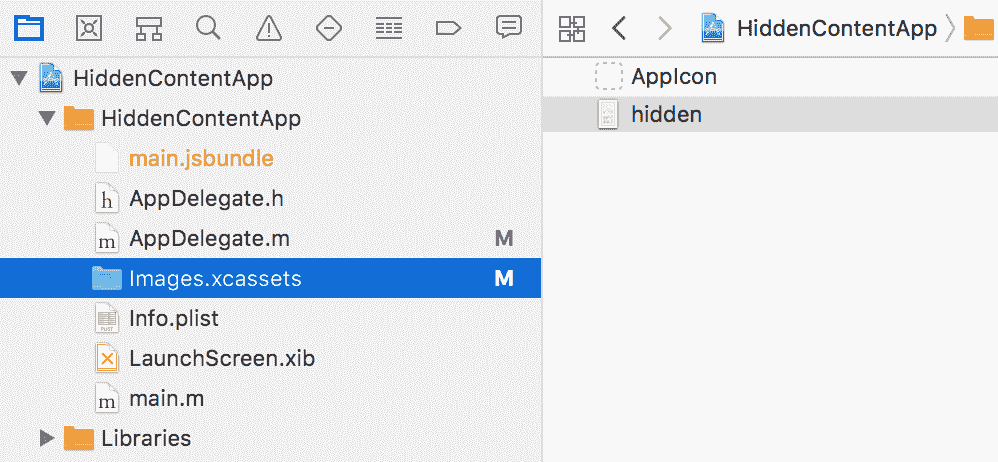

# 添加本机功能-第二部分

在本章中，我们将介绍以下配方：

*   对应用程序状态的更改作出反应
*   复制和粘贴内容
*   通过触摸 ID 或指纹传感器进行身份验证
*   多任务处理时隐藏应用程序内容
*   iOS 上的后台处理
*   Android 的后台处理
*   在 iOS 上播放音频文件
*   在 Android 上播放音频文件

# 介绍

在本章中，我们将继续介绍更多涉及编写与本机 iOS 和 Android 代码交互的 React 本机应用程序的不同方面的方法。我们将介绍利用内置和社区创建模块的示例应用程序。这些方法涵盖了一系列主题，从呈现基本按钮到创建不阻塞主应用程序线程的多线程进程。

# 对应用程序状态的更改作出反应

一般移动设备用户都有几个定期使用的应用程序。理想情况下，除了其他社交媒体应用程序、游戏、媒体播放器等，用户还将使用您的 React 本机应用程序。任何特定的用户可能会在每个应用程序中花费很短的时间，因为他或她可以同时处理多个任务。如果我们想在用户离开我们的应用程序并重新进入时做出反应，该怎么办？我们可以利用这个机会与服务器同步数据，或者告诉用户我们很高兴看到他们返回，或者礼貌地询问应用商店的评分。

本食谱将涵盖对应用程序状态变化做出反应的基本知识，即当应用程序处于前台（活动）、后台或非活动状态时做出反应。

对于这个配方，让我们创建一个名为`AppStateApp`的全新纯 React 原生应用程序。

# 怎么做。。。

1.  幸运的是，React Native 通过`AppState`模块提供了监听应用程序状态变化的支持。让我们通过向`App.js`文件添加依赖项开始构建应用程序，如下所示：

```jsx
import React, { Component } from 'react';
import {
  AppState,
  StyleSheet,
  Text,
  View
} from 'react-native';
```

2.  在配方中，我们将跟踪之前的状态，以查看用户来自何处。如果这是他们第一次进入应用程序，我们会欢迎他们，如果他们回来，我们会欢迎他们回来。为此，我们需要保留对以前和当前应用程序状态的引用。为此，我们将使用实例变量`previousAppState`和`currentAppStates`而不是使用状态，只是为了避免潜在的命名混乱。我们将使用`state`将状态消息保存给用户，如下所示：

```jsx
export default class App extends Component {
  previousAppState = null;
  currentAppState = 'active';
  state = {
    statusMessage: 'Welcome!'
  }
  // Defined on following steps
}
```

3.  当组件挂载时，我们将使用`AppState`组件向`change`事件添加事件侦听器。每当应用程序的状态发生变化时（例如，当应用程序处于后台状态时），将触发`change`事件，然后我们将触发`handleAppStateChange`处理程序，该处理程序在下一步中定义，如下所示：

```jsx
  componentWillMount() {
    AppState.addEventListener('change', this.handleAppStateChange);
  }
```

4.  `handleAppStateChange`方法将接收`appState`作为参数，我们可以预期它是三个字符串之一：`inactive`如果应用程序从内存中卸载，`background`如果应用程序在内存中并处于后台，以及`active`如果应用程序处于前台。我们将使用`switch`语句相应地更新`state`上的`statusMessage`：

```jsx
  handleAppStateChange = (appState) => {
    let statusMessage;

    this.previousAppState = this.currentAppState;
    this.currentAppState = appState;
    switch(appState) {
      case 'inactive':
        statusMessage = "Good Bye.";
        break;
      case 'background':
        statusMessage = "App Is Hidden...";
        break;
      case 'active':
        statusMessage = 'Welcome Back!'
        break;
    }
    this.setState({ statusMessage });
  }
```

5.  `render`方法在本配方中非常基本，因为它只需要向用户显示状态消息，如下所示：

```jsx
 render() {
    return (
      <View style={styles.container}>
        <Text style={styles.welcome}>
          {this.state.statusMessage}
        </Text>
      </View>
    );
  }
```

6.  此应用程序的样式为基本样式，添加字体大小、颜色和边距，如下所示：

```jsx
const styles = StyleSheet.create({
  container: {
    flex: 1,
    justifyContent: 'center',
    alignItems: 'center',
    backgroundColor: '#fff',
  },
  welcome: {
    fontSize: 40,
    textAlign: 'center',
    margin: 10,
  },
  instructions: {
    textAlign: 'center',
    color: '#333333',
    marginBottom: 5,
  },
});
```

7.  根据给定设备上应用程序的状态，已完成的应用程序现在应显示相应的状态消息。

# 它是如何工作的。。。

在这个配方中，我们使用了内置的`AppState`模块。该模块在 Android 上监听`Activity`事件，在 iOS 上使用`NSNotificationCenter`注册各种`UIApplication`事件的监听器。注意两个平台都支持`active`和`background`状态；然而，`inactive`状态是仅限 iOS 的概念。Android 不明确支持`inactive`状态，因为它实现了多任务，所以只能在`background`和`active`状态之间切换应用程序。要在 Android 上实现与 iOS 非活动状态相同的效果，请参阅本章后面的*隐藏应用程序内容 w**hen 多任务*配方。

# 复制和粘贴内容

桌面和移动操作系统中最常用的功能之一是用于复制和粘贴内容的剪贴板。手机上的一种常见情况是用长文本（如长电子邮件地址或密码）填写表单。与其用几个打字错误来输入，不如打开联系人应用程序，从那里复制电子邮件并粘贴到`TextInput`字段中。

这个配方将在 Android 和 iOS 上展示一个基本示例，说明如何在 React 本机应用程序中复制和粘贴文本。在我们的示例应用程序中，我们将有一个静态`Text`视图和一个`TextInput`字段，您可以使用它将内容复制到剪贴板。此外，还会有一个按钮将剪贴板的内容输出到视图。

# 准备

对于这个配方，我们将创建一个名为`CopyPasteApp`的纯 React 本机应用程序。

在此配方中，我们将再次使用`react-native-button`。用`npm`安装：

```jsx
npm install react-native-button
```

或者，我们可以使用`yarn`：

```jsx
yarn add react-native-button
```

# 怎么做。。。

1.  让我们先创建一个`ClipboardText`组件，它既使用`Text`组件显示文本，又提供通过长按将其内容复制到剪贴板的功能。让我们在项目的根目录中创建一个`component`文件夹，并在其中创建一个`ClipboardText.js`文件。我们将从导入依赖项开始，如下所示：

```jsx
import React, { Component } from 'react';
import {
  StyleSheet,
  Text,
  View,
  Clipboard,
  TextInput
} from 'react-native';
import Button from 'react-native-button';
```

2.  接下来我们将定义`App`类和初始`state`。我们将使用`state`上的`clipboardContent`属性来存储从剪贴板粘贴到 UI 中的文本，如下所示：

```jsx
export default class App extends Component {
  state = {
    clipboardContent: null
  }
  // Defined in following steps
}
```

3.  UI 将有一个`Text`组件，其文本将通过长按进行复制。让我们定义一下`copyToClipboard`方法。我们将通过其`ref`（稍后将定义）获取输入，并通过其`props.children`属性访问组件的文本。一旦文本存储在局部变量中，我们只需将其传递给`Clipboard`的`setString`方法，将文本复制到剪贴板，如下所示：

```jsx
  copyToClipboard = () => {
    const sourceText = this.refs.sourceText.props.children;
    Clipboard.setString(sourceText);
  }
```

4.  类似地，我们还需要一个方法将文本从剪贴板粘贴到应用程序的 UI 中。此方法将使用`Clipboard`的`getString`方法，并将返回的字符串保存到`state`的`clipboardContent`属性中，重新呈现应用的 UI 以反映粘贴的文本，如下所示：

```jsx
  getClipboardContent = async () => {
    const clipboardContent = await Clipboard.getString();
    this.setState({
      clipboardContent
    });
  }
```

5.  `render`方法将由两部分组成：第一部分由要复制的内容组成，第二部分是将剪贴板中的文本粘贴到 UI 中的方法。让我们从第一部分开始，它包括一个`Text`输入，其`onLongPress`道具连接到我们在*步骤 3*中创建的`copyToClipboard`方法，以及一个用于正常本机复制/粘贴的文本输入：

```jsx
  render() {
    return (
      <View style={styles.container}>
        <Text style={styles.instructions}>
          Tap and Hold the next line to copy it to the Clipboard:
        </Text>
        <Text
          ref="sourceText"
          onLongPress={this.copyToClipboard}
        >
          React Native Cookbook
        </Text>
        <Text style={styles.instructions}>
          Input some text into the TextInput below and Cut/Copy as
          you normally would:
        </Text>
        <TextInput style={styles.textInput} />

        // Defined on next step
      </View>
    );
  }
```

6.  UI 的第二部分包括一个`Text`组件，用于在`state`上显示保存在`clipboardContent`中的当前值，以及一个按钮，该按钮将使用*步骤 4*中定义的`getClipboardContent`方法从剪贴板粘贴：

```jsx
  render() {
    return (
      <View style={styles.container}>
        // Defined in previous step
 <View style={styles.row}>
 <Text style={styles.rowText}>
 Clipboard Contents:
 </Text>
 </View>
 <View style={styles.row}>
 <Text style={styles.content}>
 {this.state.clipboardContent}
 </Text>
 </View>
 <Button
 containerStyle={styles.buttonContainer}
 style={styles.buttonStyle}
 onPress={this.getClipboardContent}
 >
 Paste Clipboard
 </Button>
      </View>
    );
  }
```

最终的应用程序应类似于以下屏幕截图：


# 它是如何工作的。。。

在此配方中，我们使用 React Native 提供的`Clipboard`API 构建了一个简单的复制粘贴应用程序。`Clipboard`模块目前只支持`String`类型的内容，即使设备可以复制更复杂的数据。此模块使使用剪贴板与调用方法`setString`和`getString`一样简单。

# 通过触摸 ID 或指纹传感器进行身份验证

安全性是软件中最重要的问题，尤其是当存在任何类型的身份验证时。违规和密码泄露已成为每日新闻周期的一部分，各种规模的公司都希望在其应用程序中实施额外的安全措施。移动设备中的一个此类措施是生物认证，它使用指纹扫描或人脸识别技术提供补充身份识别方法。

本配方介绍了如何添加指纹扫描和人脸识别安全性。多亏了`react-native-touch-id`库，在 React 原生应用程序开发中简化了此过程。

# 准备

对于这个配方，我们需要一个新的纯 React 原生应用程序。我们叫它`BiometricAuth`。

我们将使用`react-native-button`和`react-native-touch-id`库。使用`npm`安装它们：

```jsx
npm install react-native-button react-native-touch-id --save
```

或者，我们可以使用`yarn`：

```jsx
yarn add react-native-button react-native-touch-id
```

一旦安装，`react-native-touch-id`将需要链接，因此请确保跟进：

```jsx
react-native link
```

权限也需要手动调整。对于 Android 权限，请在项目中找到`AndroidManifest.xml`文件，该文件应位于`BiometricAuth/android/app/src/main/AndroidManifest.xml`。除此文件中的其他权限外，您还需要添加以下权限：

```jsx
<uses-permission android:name="android.permission.USE_FINGERPRINT" />
```

对于 iOS 权限，您需要在文本编辑器中更新`Info.plist`文件。可以在`BiometricAuth/ios/BiometricAuth/Info.plist`中找到`Info.plist`。与所有其他条目一起，添加以下内容：

```jsx
<key>NSFaceIDUsageDescription</key>
<string>Enabling Face ID allows you quick and secure access to your account.</string>
```

# 怎么做。。。

1.  让我们从向`App.js`文件添加依赖项开始，如下所示：

```jsx
import React, { Component } from 'react';
import {
  StyleSheet,
  Text,
  View
} from 'react-native';
import Button from 'react-native-button';
import TouchID from 'react-native-touch-id';
```

2.  接下来，我们将定义该`App`类和初始`state`。我们将跟踪`state`的`authStatus`属性的认证状态，如下所示：

```jsx
export default class App extends Component {
  state = {
    authStatus: null
  }
  // Defined in following steps
}
```

3.  让我们定义`authenticate`方法，该方法将在按下按钮时触发，并在设备上启动身份验证。我们可以通过执行`TouchID`组件的`authenticate`方法来启动身份验证。此方法的第一个参数是解释请求原因的可选字符串，如下所示：

```jsx
  authenticate = () => {
    TouchID.authenticate('Access secret information!')
      .then(this.handleAuthSuccess)
      .catch(this.handleAuthFailure);
  }
```

4.  此方法在成功时触发`handleAuthSuccess`方法。现在让我们来定义它。此方法只是将`state`的`authStatus`属性更新为字符串`Authenticated`，如下所示：

```jsx
  handleAuthSuccess = () => {
    this.setState({
      authStatus : 'Authenticated'
    });
  }
```

5.  同样，如果身份验证失败，将调用`handleAuthFailure`函数，将相同的`state.authStatus`更新为字符串`Not Authenticated`，如下所示：

```jsx
  handleAuthFailure = () => {
    this.setState({
      authStatus : 'Not Authenticated'
    });
  }
```

6.  `render`方法将需要一个按钮来启动认证请求，以及两个`Text`组件：一个用于标签，一个用于显示认证状态，如下所示：

```jsx
  render() {
    return (
      <View style={styles.container}>
        <Button
          containerStyle={styles.buttonContainer}
          style={styles.button}
          onPress={this.authenticate}>
            Authenticate
        </Button>
        <Text style={styles.label}>Authentication Status</Text>
        <Text style={styles.welcome}>{this.state.authStatus}</Text>
      </View>
    );
  }
```

7.  最后，我们将为 UI 的颜色、大小和布局添加样式，如下所示：

```jsx
const styles = StyleSheet.create({
  container: {
    flex: 1,
    justifyContent: 'center',
    alignItems: 'center',
    backgroundColor: '#fff',
  },
  welcome: {
    fontSize: 20,
    textAlign: 'center',
    margin: 10,
  },
  label: {
    textAlign: 'center',
    color: '#333333',
    marginBottom: 5,
  },
  buttonContainer: {
    width: 150,
    padding: 10,
    margin: 5,
    height: 40,
    overflow: 'hidden',
    backgroundColor: '#FF5722'
  },
  button: {
    fontSize: 16,
    color: 'white'
  }
});
```

# 它是如何工作的。。。

此配方说明了将本机指纹和面部识别安全性集成到 React 本机应用程序中是多么简单。对`TouchID.authenticate`的调用还需要第二个可选选项对象参数，该参数具有三个属性：`title`表示确认对话框的标题（仅限 Android）、`color`表示对话框的颜色（仅限 Android）以及`fallbackLabel`用于编辑默认显示密码标签（仅限 iOS）。

# 多任务处理时隐藏应用程序内容

为了保持应用程序安全的主题，我们有时必须警惕不必要的眼睛和手触摸我们的设备并可能访问我们的应用程序。为了保护用户在查看敏感信息时免受窥探，我们可以在应用程序隐藏但仍处于活动状态时屏蔽应用程序。一旦用户返回应用程序，我们只需移除掩码，用户就可以继续正常使用该应用程序。这方面的一个很好的用例是在银行或密码应用程序中，当应用程序不在前台时隐藏敏感信息。

此配方将向您展示如何渲染图像以屏蔽应用程序，并在应用程序返回前台或活动状态后将其删除。我们将涵盖 iOS 和 Android；然而，整个实施过程各不相同。对于 iOS，我们采用纯 Objective-C 实现以获得最佳性能。对于 Android，我们必须对`MainActivity`进行一些修改，以便向 JavaScript 层发送应用程序失去焦点的事件。我们将在那里处理图像遮罩的渲染。

# 准备

我们将需要一个图像方便地使用作为遮罩时，应用程序不是前景。我选择使用 iPhone 壁纸，您可以在以下网址找到：

[http://www.hdiphone7wallpapers.com/2016/09/white-squares-iphone-7-and-7-plus-wallpapers.html](http://www.hdiphone7wallpapers.com/2016/09/white-squares-iphone-7-and-7-plus-wallpapers.html)

图像是一种风格化的马赛克图案。看起来是这样的：


你当然可以使用任何你喜欢的图像。在此配方中，图像文件将被命名为`hidden.jpg`，因此相应地重命名您的图像。

我们需要一个新的纯 React 本地应用程序。我们叫它`HiddenContentApp`。

# 怎么做。。。

1.  让我们首先将掩码图像添加到应用程序的 iOS 部分。我们需要在 Xcode 中打开项目的`ios`文件夹，该文件夹位于新 React 本机应用程序的`ios/`目录中。
2.  我们可以通过在 Xcode 中将`hidden.jpg`图像拖放到项目的`Images.xcassets`文件夹中，将`hidden.jpg`图像添加到项目中，如图所示：



3.  接下来，我们将向`AppDelegate.m`文件添加一个新的实现和两个方法。该文件的全部内容如下所示，包括生成的代码。为了清晰起见，我们正在添加的代码用粗体标记。我们正在扩展`applicationWillResignActive`方法，该方法将在给定应用程序从前景化更改为前景化时触发，以添加一个以`hidden.jpg`为图像的`imageView`。同样，我们还需要扩展相反的方法`applicationDidBecomeActive`，在应用程序重新前景化时移除图像：

```jsx
#import "AppDelegate.h"

#import <React/RCTBundleURLProvider.h>
#import <React/RCTRootView.h>

@implementation AppDelegate {
 UIImageView *imageView;
}

- (BOOL)application:(UIApplication *)application didFinishLaunchingWithOptions:(NSDictionary *)launchOptions
{
  NSURL *jsCodeLocation;

  jsCodeLocation = [[RCTBundleURLProvider sharedSettings] jsBundleURLForBundleRoot:@"index" fallbackResource:nil];

  RCTRootView *rootView = [[RCTRootView alloc] initWithBundleURL:jsCodeLocation
                                                      moduleName:@"HiddenContentApp"
                                               initialProperties:nil
                                                   launchOptions:launchOptions];
  rootView.backgroundColor = [[UIColor alloc] initWithRed:1.0f green:1.0f blue:1.0f alpha:1];

  self.window = [[UIWindow alloc] initWithFrame:[UIScreen mainScreen].bounds];
  UIViewController *rootViewController = [UIViewController new];
  rootViewController.view = rootView;
  self.window.rootViewController = rootViewController;
  [self.window makeKeyAndVisible];
  return YES;
}

- (void)applicationWillResignActive:(UIApplication *)application {
 imageView = [[UIImageView alloc] initWithFrame:[self.window frame]];
 [imageView setImage:[UIImage imageNamed:@"hidden.jpg"]];
 [self.window addSubview:imageView];
}

- (void)applicationDidBecomeActive:(UIApplication *)application {
 if(imageView != nil) {
 [imageView removeFromSuperview];
 imageView = nil;
 }
}

@end
```

4.  通过前面的三个步骤，在 iOS 应用程序中显示掩码所需的所有工作都已完成。让我们在 Android Studio 中打开项目的 Android 部分，继续讨论 Android 部分。在 Android Studio 中，选择打开现有的 Android Studio 项目，并打开该项目的`android`目录。

5.  我们需要在 Android 项目中更新的唯一本地代码位于`MainActivity.java`，位于以下位置：


我们需要添加一个方法，以及该方法使用的从 React 导入的三个方法。同样，完整的`MainActivity.java`文件如下，添加的代码用粗体标记。我们正在定义一个扩展基本方法功能的`onWindowFocusChanged`方法。只要给定应用程序的焦点发生变化，就会触发基本的`onWindowFocusChanged`Android 方法，并传递一个表示该应用程序是否有焦点的`hasFocus`布尔值。我们的扩展将通过一个我们命名为`focusChange`的事件，有效地将`hasFocus`布尔值从父方法传递到 React 本机层，如下所示：

```jsx
package com.hiddencontentapp;

import com.facebook.react.ReactActivity;
import com.facebook.react.bridge.Arguments;
import com.facebook.react.bridge.WritableMap;
import com.facebook.react.modules.core.DeviceEventManagerModule;

public class MainActivity extends ReactActivity {

  /**
  * Returns the name of the main component registered from JavaScript.
  * This is used to schedule rendering of the component.
  */
  @Override
  protected String getMainComponentName() {
    return "HiddenContentApp";
  }

 @Override
 public void onWindowFocusChanged(boolean hasFocus) {
 super.onWindowFocusChanged(hasFocus);
 if (getReactNativeHost().getReactInstanceManager().getCurrentReactContext() != null) {
 WritableMap params = Arguments.createMap();
 params.putBoolean("appHasFocus", hasFocus);

 getReactNativeHost().getReactInstanceManager()
 .getCurrentReactContext()
 .getJSModule(DeviceEventManagerModule.RCTDeviceEventEmitter.class)
 .emit("focusChange", params);
 }
 }
}
```

6.  要在 Android 中使用`hidden.jpg`掩码图像，我们还需要将其添加到 React 原生项目中。让我们在 React 原生项目的根目录中创建一个新的`assets`文件夹，并将`hidden.jpg`图像文件添加到新文件夹中。
7.  有了本机部分，我们就可以转向应用程序的 JavaScript 部分了。让我们将要使用的导入添加到`App.js`，如下所示：

```jsx
import React, {Component} from 'react';
import {
  StyleSheet,
  Text,
  View,
  DeviceEventEmitter,
  Image
} from 'react-native';
```

8.  接下来，让我们创建`App`类和首字母`state`。`state`只需要一个`showMask`布尔值，它将指示是否应显示掩码，如下所示：

```jsx
export default class App extends Component {
  state = {
    showMask: null
  }
  // Defined in following steps
}
```

9.  当组件挂载时，我们希望注册一个事件监听器，以使用`DeviceEventEmitter`的`addListener`方法侦听从本机 Android 层发出的事件，将字符串`focusChange`作为要侦听的事件的名称作为第一个参数传递，并将回调作为第二个参数执行。您可能还记得，`focusChange`是我们在*步骤 5 的`onWindowFocusChange`方法中为`MainActivity.java`中的事件分配的名称。*注册事件侦听器，如下所示：

```jsx
  componentWillMount() {
    this.subscription = DeviceEventEmitter.addListener(
      'focusChange',
      this.onFocusChange
    );
  }
```

10.  在此步骤中，我们将事件侦听器保存到类成员`this.subscription`。这将允许在卸载组件后清理事件侦听器。我们通过`componentWillUnmount`生命周期钩子在组件卸载时调用`this.subscription`上的`remove`方法来实现这一点，如下所示：

```jsx
  componentWillUnmount() {
    this.subscription.remove();
  }
```

11.  让我们定义*步骤 9*中使用的`onFocusChange`处理程序。该方法接收一个带有`appHasFocus`布尔值的`params`对象，该布尔值通过*步骤 5*中定义的`onWindowFocusChanged`方法从本机层传递。通过将`state`上的`showMask`布尔值设置为`appHasFocus`布尔值的倒数，我们可以在`render`函数中使用该值切换显示`hidden.jpg`图像，如下所示：

```jsx
  onFocusChange = (params) => {
    this.setState({showMask: !params.appHasFocus})
  }
```

12.  `render`方法的主要内容在本配方中并不重要，但当`showMask`状态属性为`true`时，我们可以使用它应用`hidden.jpg`掩模图像，如下所示：

```jsx
  render() {
    if(this.state.showMask) {
      return (<Image source={require('./img/hidden.jpg')} />);
    }
    return (
      <View style={styles.container}>
        <Text style={styles.welcome}>Welcome to React Native!</Text>
      </View>
    );
  }
```

13.  应用程序已完成。加载应用程序后，您应该能够进入应用程序选择视图（在 iOS 上双击 home，或在 Android 上按下 square 按钮），并在应用程序未预先固定时查看应用于应用程序的掩码图像。请注意，Android 模拟器可能无法按预期正确应用掩码，因此此功能可能需要 Android 设备进行测试：


# 它是如何工作的。。。

在这个配方中，我们看到了一个必须使用两种不同方法来完成相同任务的示例。对于 iOS，我们只在本机层中显示图像掩码，而不需要 React 本机层。对于 Android，我们使用 React Native 来处理图像屏蔽。

在*步骤 3*中，我们扩展了两种 Objective-C 方法：`applicationWillResignActive`在应用程序从前景化更改时触发，以及`applicationDidBecomeActive`在应用程序前景化时触发。对于每个事件，我们只需切换一个显示 Xcode 项目中`Images.xcassettes`文件夹中`hidden.jpg`图像存储的`imageView`。

在*步骤 5*中，我们使用`DeviceEventManagerModule`中的 React 类`RCTDeviceEventEmitter`发出一个名为`focusChange`的事件，将带有`appHasFocus`布尔值的`params`对象传递给 React 本机层，如下所示：

```jsx
     getReactNativeHost().getReactInstanceManager()
       .getCurrentReactContext()
       .getJSModule(DeviceEventManagerModule.RCTDeviceEventEmitter.class)
       .emit("focusChange", params);
     }
```

在*步骤 9*中，我们定义了`componentWillMount`生命周期钩子，它为本机 Android 层发出的`focusChange`事件设置一个事件监听器，触发`onFocusChange`方法，该方法将根据本机`appHasFocus`值更新`state`的`showMask`值，触发重新渲染，根据需要显示遮罩

# iOS 上的后台处理

在过去几年中，移动设备的处理能力有了很大的提高。用户要求更丰富的体验，在现代移动设备上实现更高性能的一种方法是通过多线程。当今大多数移动设备都由多核处理器提供动力，它们的操作系统现在为开发人员提供了在后台执行代码的简单抽象，不会影响应用程序 UI 的性能。

此方法将包括使用 iOS 的**Grand Central Dispatch**（**GCD**）在新线程上执行异步后台处理，以及在处理完成后与 React 本机层通信。

# 准备

对于这个配方，我们需要一个新的纯 React 本机应用程序。让我们把它命名为`MultiThreadingApp`。

我们还将使用`react-native-button`库。用`npm`安装：

```jsx
npm install react-native-button --save
```

或者，我们可以使用`yarn`：

```jsx
yarn add react-native-button --save
```

# 怎么做。。。

1.  我们将首先在 Xcode 中打开 iOS 项目，该项目位于新 React 本机应用程序的`ios`目录中。
2.  让我们添加一个名为`NSObject`子类的`BackgroundTaskManager`的新 Cocoa 类文件。有关在 Xcode 中执行此操作的更多详细信息，请参阅本章中的*公开定制 iOS 模块*配方。
3.  接下来，让我们将新模块连接到新模块头文件`BackgroundTaskManager.h`中的 React`RCTBrideModule`。要添加的代码在以下代码段中以粗体标记：

```jsx
#import <Foundation/Foundation.h>
#import <dispatch/dispatch.h>
#import "RCTBridgeModule.h"

@interface BackgroundTaskManager : NSObject <RCTBridgeModule> {
 dispatch_queue_t backgroundQueue;
}

@end
```

4.  我们将在`BackgroundTaskManager.m`文件中实现本机模块。同样，我们要添加的新代码在以下代码段中以粗体标记：

```jsx
#import "BackgroundTaskManager.h"
#import "RCTBridge.h"
#import "RCTEventDispatcher.h"

@implementation BackgroundTaskManager

@synthesize bridge = _bridge;

RCT_EXPORT_MODULE();

RCT_EXPORT_METHOD(loadInBackground) {
 backgroundQueue = dispatch_queue_create("com.moduscreate.bgqueue", NULL);

 dispatch_async(backgroundQueue, ^{
 NSLog(@"processing background");
 [self.bridge.eventDispatcher sendAppEventWithName:@"backgroundProgress" body:@{@"status": @"Loading"}];
 [NSThread sleepForTimeInterval:5];
 NSLog(@"slept");
 dispatch_async(dispatch_get_main_queue(), ^{
 NSLog(@"Done processing; main thread");
 [self.bridge.eventDispatcher sendAppEventWithName:@"backgroundProgress" body:@{@"status": @"Done"}];
 });
 });
}

@end
```

5.  接下来让我们转到 JavaScript 层。我们将首先向`App.js`文件添加依赖项。作为依赖项的一部分，我们还需要导入*步骤 3*和*步骤 4*中定义的`BackgroundTaskManager`本机模块，如下所示：

```jsx
import React, { Component } from 'react';
import {
  StyleSheet,
  Text,
  View,
  NativeModules,
  NativeAppEventEmitter
} from 'react-native';
import Button from 'react-native-button'; 

const BackgroundTaskManager = NativeModules.BackgroundTaskManager;
```

6.  让我们定义`App`类，初始状态`backgroundTaskStatus`设置为字符串`Not Started`，属性`doNothingCount`初始化为`0`，如下所示：

```jsx
 export default class App extends Component {
  state = {
    backgroundTaskStatus: 'Not Started',
    counter: 0
  }
  // Defined in following steps
}
```

7.  我们需要监听*步骤 3*和*步骤 4*中创建的自定义模块从本机 iOS 层发出的`backgroundProcess`事件。让我们使用`NativeAppEventEmitter`React Native 组件设置一个事件侦听器，该组件将`state`的`backgroundTaskStatus`属性设置为从本机事件接收的事件对象上的`status`值，如下所示：

```jsx
  componentWillMount = () => {
    this.subscription = NativeAppEventEmitter.addListener(
      'backgroundProgress',
      event => this.setState({ backgroundTaskStatus: event.status })
    );
  }
```

8.  当组件卸载时，我们需要从上一步中删除事件侦听器，如下所示：

```jsx
  componentWillUnmount = () => {
    this.subscription.remove();
  }
```

9.  UI 将有两个按钮，每个按钮在按下时都需要调用一个方法。`runBackgroundTask`将运行我们在`BackgroundTaskManager`自定义本机模块上从本机 iOS 层定义并导出的`loadInBackground`方法。`increaseCounter`按钮只需将`state`上的`counter`属性增加`1`，用于显示主线程如何未被阻塞，如下所示：

```jsx
  runBackgroundTask = () => {
    BackgroundTaskManager.loadInBackground();
  }

  increaseCounter = () => {
    this.setState({
      counter: this.state.counter + 1
    });
  }
```

10.  应用程序的 UI 将包括两个按钮，用于显示`Button`组件，以及一个`Text`组件，用于显示保存在`state`上的值。运行任务按钮将执行`runBackgroundTask`方法启动后台进程，`this.state.backgroundTaskStatus`将更新以显示进程的新状态。在后台进程运行的 5 秒钟内，按下增加计数器按钮仍会将计数器增加`1`，表明后台进程是非阻塞的，如以下代码段所示：

```jsx
  render() {
    return (
      <View style={styles.container}>
        <Button
          containerStyle={styles.buttonContainer}
          style={styles.buttonStyle}
          onPress={this.runBackgroundTask}>
            Run Task
        </Button>
        <Text style={styles.instructions}>
          Background Task Status:
        </Text>
        <Text style={styles.welcome}>
          {this.state.backgroundTaskStatus}
        </Text>
        <Text style={styles.instructions}>
          Pressing "Increase Conter" button shows that the task is
          not blocking the main thread
        </Text>
        <Button
          containerStyle={[
            styles.buttonContainer,
            styles.altButtonContainer
          ]}
          style={styles.buttonStyle}
          onPress={this.increaseCounter}
        >
            Increase Counter
        </Button>
        <Text style={styles.instructions}>
          Current Count:
        </Text>
        <Text style={styles.welcome}>
          {this.state.counter}
        </Text>
      </View>
    );
  }
```

11.  最后一步，让我们使用 styles 块对应用程序进行布局和样式设置，如下所示：

```jsx
const styles = StyleSheet.create({
  container: {
    flex: 1,
    justifyContent: 'center',
    alignItems: 'center',
    backgroundColor: '#F5FCFF',
  },
  welcome: {
    fontSize: 20,
    textAlign: 'center',
    margin: 10,
  },
  instructions: {
    textAlign: 'center',
    color: '#333333',
    marginBottom: 5,
    marginLeft: 20,
    marginRight: 20
  },
  buttonContainer: {
    width: 150,
    padding: 10,
    margin: 5,
    height: 40,
    overflow: 'hidden',
    borderRadius: 4,
    backgroundColor: '#FF5722'
  },
  altButtonContainer : {
    backgroundColor : '#CDDC39',
    marginTop : 30
  },
  buttonStyle: {
    fontSize: 16,
    color: 'white'
  }
});
```

# 它是如何工作的。。。

在这个配方中，我们创建了一个本机模块，类似于本章前面的*公开定制 iOS 模块*配方中介绍的模块。我们定义了本机模块以在 React 本机应用程序的后台执行任意执行。在此配方中，后台流程由以下三个步骤组成：

1.  产生一个新线程。
2.  在新线程上睡眠五秒钟。
3.  在五秒钟的睡眠（模拟正在运行的后台进程的结束）之后，一个事件从 iOS 层发送到 React 本机层，让它知道进程已经完成。这是通过操作系统的 GCD API 完成的。

此应用程序中 UI 的目的是展示已经实现了多线程。如果后台进程是在 React 原生层执行的，那么由于 JavaScript 的单线程特性，当该进程运行时，应用程序会被锁定五秒钟。当您按下按钮时，将调用网桥，从而可以将消息发布到本机层。如果本机线程当前正忙于睡眠，则无法处理此消息。通过将该处理卸载到新线程，可以同时执行这两个线程。

# Android 的后台处理

在这个配方中，我们将构建一个与上一个配方相当的 Android。该配方还将使用本机 Android 层创建一个新进程，通过睡眠五秒钟保持该进程运行，并允许用户通过按钮进行交互，以显示应用程序的主处理线程未被阻塞。

虽然最终结果将非常相同，但在 Android 项目中生成新流程的处理方式与 iOS 稍有不同。此方法将使用本机`AsyncTask`函数，专门用于处理短时间运行的后台进程，以允许在 React 本机层中执行，而不会阻塞主线程。

# 准备

对于这个配方，我们需要创建一个新的纯 React 原生应用程序。让我们把它命名为`MultiThreadingApp`。

我们还将使用`react-native-button`图书馆。用`npm`安装：

```jsx
npm install react-native-button --save
```

或者，我们可以使用`yarn`：

```jsx
yarn add react-native-button
```

# 怎么做。。。

1.  让我们首先在 Android Studio 中打开 Android 项目。在 Android Studio 中，选择打开现有的 Android Studio 项目，并打开新项目的`android`目录。
2.  我们需要两个新的 Java 类：`BackgroundTaskManager`和`BackgroundTaskPackage`。
3.  既然已经创建了两个类，那么让我们打开`BackgroundTaskManager.java`并开始实现本机模块，该模块将封装`AsyncTask`操作，从导入开始并定义类。此外，与任何其他原生 Android 模块一样，我们需要定义`getName`方法，用于为 React native 提供模块名称，如下所示：

```jsx
package com.multithreadingapp;

import android.os.AsyncTask;

import com.facebook.react.bridge.Arguments;
import com.facebook.react.bridge.ReactApplicationContext;
import com.facebook.react.bridge.ReactContextBaseJavaModule;
import com.facebook.react.bridge.ReactMethod;
import com.facebook.react.bridge.WritableMap;
import com.facebook.react.modules.core.DeviceEventManagerModule;

public class BackgroundTaskManager extends ReactContextBaseJavaModule {
  public BackgroundTaskManager(ReactApplicationContext reactApplicationContext) {
    super(reactApplicationContext);
  }

  @Override
  public String getName() {
    return "BackgroundTaskManager";
  }

  // Defined in following steps
}
```

4.  为了执行一个`AsyncTask`，它需要被一个私有类子类化。我们需要为此添加一个新的私有内部`BackgroundLoadTask`子类。在定义它之前，让我们首先添加一个`loadInBackground`方法，该方法最终将导出到 React 本机层。此方法只是创建一个新的`BackgroundLoadTask`实例并调用其`execute`方法，如下所示：

```jsx
public class BackgroundTaskManager extends ReactContextBaseJavaModule {
 // Defined in previous step
  @ReactMethod
 public void loadInBackground() {
 BackgroundLoadTask backgroundLoadTask = new BackgroundLoadTask();
 backgroundLoadTask.execute();
 }
}
```

5.  `BackgroundLoadTask`子类还将使用一个 helper 函数在 React 本机网桥上来回发送事件，以传达后台进程的状态。`sendEvent`方法将`eventName`和`params`作为参数，然后使用 React Native 的`RCTDeviceEventEmitter`类来`emit`事件，如下所示：

```jsx
public class BackgroundTaskManager extends ReactContextBaseJavaModule {
  // Defined in steps above

 private void sendEvent(String eventName, WritableMap params) {
 getReactApplicationContext().getJSModule(DeviceEventManagerModule.RCTDeviceEventEmitter.class).emit(eventName, params);
 }
}
```

6.  现在让我们继续定义扩展了`AsyncTask`的`BackgroundLoadTask`子类。子类将由三种方法组成：`doInBackground`用于旋转新线程并使其休眠五分钟；`onProgressUpdate`用于向 React Native 层发送`"Loading"`状态；`onPostExecute`用于在后台任务完成后发送`"Done"`状态，如下所示：

```jsx
public class BackgroundTaskManager extends ReactContextBaseJavaModule {
  // Defined in above steps

 private class BackgroundLoadTask extends AsyncTask<String, String, String> {
 @Override
 protected String doInBackground(String... params) {
 publishProgress("Loading");
 try {
 Thread.sleep(5000);
 } catch (Exception e) {
 e.printStackTrace();
 }
 return "Done";
 }

 @Override
 protected void onProgressUpdate(String... values) {
 WritableMap params = Arguments.createMap();
 params.putString("status", "Loading");
 sendEvent("backgroundProgress", params);
 }

 @Override
 protected void onPostExecute(String s) {
 WritableMap params = Arguments.createMap();
 params.putString("status", "Done");
 sendEvent("backgroundProgress", params);
 }
 }
}
```

7.  由于 iOS 实现和 Android 实现的唯一区别在于配方的本机层，因此您可以按照前面配方的*步骤 5*到*步骤 11*来实现应用程序的 JavaScript 部分。

8.  最终的应用程序的行为和外观（除了设备上的差异）应与上一个配方中的应用程序相同：


# 它是如何工作的。。。

在这个配方中，我们模仿了我们在 Android 上 iOS 配方的*后台处理中创建的功能。我们创建了一个 Android 本机模块，其中包含一个方法，当调用该方法时，它会在后台执行任意执行（睡眠 5 秒钟）。当流程完成时，它会向 React 原生层发出一个事件，然后我们更新 appui 以反映后台流程的状态。Android 有多个本机执行多线程操作的选项。在这个配方中，我们使用了`AsyncTask`，因为它面向短时间运行（几秒钟）的进程，所以实现起来相对简单，操作系统为我们管理线程创建和资源分配。有关`AsyncTask`的更多信息，请访问官方文档：*

[https://developer.android.com/reference/android/os/AsyncTask](https://developer.android.com/reference/android/os/AsyncTask)

# 在 iOS 上播放音频文件

在*章节实现复杂用户界面–第三部分*中，我们介绍了在*中构建一个相对复杂的小型音频播放器，使用 Expo SDK 提供的`Audio`组件创建音频播放器*配方。然而，Expo 的`Audio`组件的一个缺点是，当应用程序处于后台时，它不能用于播放音频。使用本机层是目前实现这一点的唯一方法。

在此配方中，我们将创建一个本机模块来显示 iOS MediaPicker，然后选择要播放的音乐文件。所选文件将通过本机 iOS 媒体播放器播放，该播放器允许在应用程序后台播放音频，并允许用户通过本机 iOS 控制中心控制音频。

# 准备

对于这个配方，我们需要创建一个新的纯 React 原生应用程序。我们叫它`AudioPlayerApp`。

我们还将使用`react-native-button`库，它可以与`npm`一起安装：

```jsx
npm install react-native-button --save
```

或者，我们可以使用`yarn`：

```jsx
yarn add react-native-button
```

这是一个只能在真实设备上使用的配方。您还需要确保已将音乐同步到 iOS 设备并可在媒体库中使用。

# 怎么做。。。

1.  让我们首先在 Xcode 中打开 iOS 项目，该项目位于新 React 本机应用程序的`ios`目录中。
2.  接下来，我们将创建一个名为`MediaManager`的新 Objective-C Cocoa 类。
3.  在`MediaManager`头（`.h`文件中，我们需要导入`MPMediaPickerController`和`MPMusicPlayerController`，以及 React 原生桥（`RCTBridgeModule`，如下所示：

```jsx
#import <Foundation/Foundation.h>
#import <MediaPlayer/MediaPlayer.h>

#import <React/RCTBridgeModule.h>
#import <React/RCTEventDispatcher.h>

@interface MediaManager : NSObject<RCTBridgeModule, MPMediaPickerControllerDelegate>

@property (nonatomic, retain) MPMediaPickerController *mediaPicker;
@property (nonatomic, retain) MPMusicPlayerController *musicPlayer;

@end
```

4.  首先，我们需要在`MediaManager`实现（`MediaManager.m`中添加本机`MediaPicker`。第一种方法是显示和隐藏`MediaPicker`：`showMediaPicker`和`hideMediaPicker`，如下所示：

```jsx
#import "MediaManager.h"
#import "AppDelegate.h"

@implementation MediaManager
RCT_EXPORT_MODULE();

@synthesize bridge = _bridge;
@synthesize musicPlayer;

#pragma mark private-methods

-(void)showMediaPicker {
 if(self.mediaPicker == nil) {
 self.mediaPicker = [[MPMediaPickerController alloc] initWithMediaTypes:MPMediaTypeAnyAudio];

 [self.mediaPicker setDelegate:self];
 [self.mediaPicker setAllowsPickingMultipleItems:NO];
 [self.mediaPicker setShowsCloudItems:NO];
 self.mediaPicker.prompt = @"Select song";
 }

 AppDelegate *delegate = (AppDelegate *)[[UIApplication sharedApplication] delegate];

 [delegate.window.rootViewController presentViewController:self.mediaPicker animated:YES completion:nil];
}

void hideMediaPicker() {
 AppDelegate *delegate = (AppDelegate *)[[UIApplication sharedApplication] delegate];
 [delegate.window.rootViewController dismissViewControllerAnimated:YES completion:nil];
}

// Defined on following steps

@end
```

5.  接下来，我们将实现`mediaPicker`需要的两个操作：`didPickMediaItems`用于拾取媒体项，以及`mediaPickerDidCancel`用于取消操作，如下所示：

```jsx
-(void) mediaPicker:(MPMediaPickerController *)mediaPicker didPickMediaItems:(MPMediaItemCollection *)mediaItemCollection {
  MPMediaItem *mediaItem = mediaItemCollection.items[0];
  NSURL *assetURL = [mediaItem valueForProperty:MPMediaItemPropertyAssetURL];

  [self.bridge.eventDispatcher sendAppEventWithName:@"SongPlaying"
                                               body:[mediaItem valueForProperty:MPMediaItemPropertyTitle]];

  if(musicPlayer == nil) {
    musicPlayer = [MPMusicPlayerController systemMusicPlayer];
  }

  [musicPlayer setQueueWithItemCollection:mediaItemCollection];
  [musicPlayer play];

  hideMediaPicker();
}

-(void) mediaPickerDidCancel:(MPMediaPickerController *)mediaPicker {
  hideMediaPicker();
}
```

6.  接下来，我们需要将我们的`MediaManager`暴露给 React 本机网桥，并创建一个将被调用以显示`MediaPicker`的方法，如下所示：

```jsx
RCT_EXPORT_MODULE(); 
RCT_EXPORT_METHOD(showSongs) { 
  [self showMediaPicker]; 
} 
```

7.  我们已经准备好进入 JavaScript 部分。让我们从向`App.js`添加依赖项开始。我们还需要使用`NativeModules`组件将*步骤 3*中创建的`MediaManager`本机模块导入*步骤 6*，如下所示：

```jsx
import React, { Component } from 'react';
import {
  StyleSheet,
  Text,
  View,
  NativeModules,
  NativeAppEventEmitter
} from 'react-native';
import Button from 'react-native-button';
const MediaManager = NativeModules.MediaManager;
```

8.  让我们定义`App`类和初始`state`。`currentSong`属性将保存当前播放歌曲的曲目信息，如从本机层传递的，如下所示：

```jsx
export default class App extends Component {
  state = {
    currentSong: null
  }

  // Defined on following steps
}
```

9.  当组件挂载时，我们将订阅`SongPlaying`事件，当歌曲开始播放时，该事件将从本机层发出。我们将把事件监听器保存到一个本地`subscription`类变量中，以便在组件卸载时使用`remove`方法清理它，如下所示：

```jsx
  componentWillMount() {
    this.subscription = NativeAppEventEmitter.addListener(
      'SongPlaying',
      this.updateCurrentlyPlaying
    );
  }

  componentWillUnmount = () => {
    this.subscription.remove();
  }
```

10.  我们还需要更新`state`上`currentSong`值的方法，以及在*步骤 3*到*步骤 6*中定义的本机`MediaManager`模块上调用`showSongs`方法的方法，如下所示：

```jsx
  updateCurrentlyPlaying = (currentSong) => {
    this.setState({ currentSong });
  }

  showSongs() {
    MediaManager.showSongs();
  }
```

11.  `render`方法将由一个`Button`组件组成，用于在按下时执行`showSongs`方法，以及`Text`组件用于显示当前播放的歌曲的信息，如下所示：

```jsx
  render() {
    return (
      <View style={styles.container}>
        <Button
          containerStyle={styles.buttonContainer}
          style={styles.buttonStyle}
          onPress={this.showSongs}>
            Pick Song
        </Button>
        <Text style={styles.instructions}>Song Playing:</Text>
        <Text style={styles.welcome}>{this.state.currentSong}</Text>
      </View>
    );
  }
```

12.  最后，我们将添加应用程序布局和样式的样式，如下所示：

```jsx
const styles = StyleSheet.create({
  container: {
    flex: 1,
    justifyContent: 'center',
    alignItems: 'center',
    backgroundColor: '#F5FCFF',
  },
  welcome: {
    fontSize: 20,
    textAlign: 'center',
    margin: 10,
  },
  instructions: {
    textAlign: 'center',
    color: '#333333',
    marginBottom: 5,
  },
  buttonContainer: {
    width: 150,
    padding: 10,
    margin: 5,
    height: 40,
    overflow: 'hidden',
    borderRadius: 4,
    backgroundColor: '#3B5998'
  },
  buttonStyle: {
    fontSize: 16,
    color: '#fff'
  }
});
```

# 它是如何工作的。。。

在本食谱中，我们介绍了如何在 iOS 中使用媒体播放器，方法是将其功能包装在本机模块中。media player 框架允许我们访问本机 iPod 库，并使用与本机 iOS 音乐应用程序相同的功能在设备上播放库中的音频文件。

# 在 Android 上播放音频文件

谷歌喜欢宣称 Android 相对于 iOS 的一个好处是在处理文件存储方面的灵活性。Android 设备支持可以填充媒体文件的外部 SD 卡，不需要像 iOS 那样使用专有方法添加多媒体。

在这个食谱中，我们将使用 Android 的原生`MediaPicker`，它是从一个意图开始的。然后，我们将能够选择一首歌曲，并通过我们的应用程序播放它。

# 准备

对于这个配方，我们将创建一个名为`AudioPlayer`的 React 本机应用程序。

在这个配方中，我们将使用`react-native-button`库。要安装它，请从项目根目录在终端中运行以下命令：

```jsx
 $ npm install react-native-button --save
```

确保 Android 设备或仿真器的`Music/`目录中有可用的音乐文件。

# 怎么做。。。

1.  让我们从使用 Android Studio 打开 Android 项目开始。在 Android Studio 中，选择打开现有的 Android Studio 项目，并打开该项目的`android`目录。
2.  我们需要两个新的 Java 类来制作这个配方：`MediaManager`和`MediaPackage`。

3.  我们的`MediaManager`将使用意图显示`mediaPicker`、`MediaPlayer`播放音乐、`MediaMetadataRetriever`解析音频文件中的元数据信息并发送回 JavaScript 层。让我们从导入`MediaManager.java`文件中需要的所有依赖项开始，如下所示：

```jsx
import android.app.Activity;
import android.content.Intent;
import android.media.AudioManager;
import android.media.MediaMetadataRetriever;
import android.media.MediaPlayer;
import android.net.Uri;
import android.provider.MediaStore;

import com.facebook.react.bridge.ActivityEventListener;
import com.facebook.react.bridge.Arguments;
import com.facebook.react.bridge.ReactApplicationContext;
import com.facebook.react.bridge.ReactContextBaseJavaModule;
import com.facebook.react.bridge.ReactMethod;
import com.facebook.react.bridge.WritableMap;
import com.facebook.react.modules.core.DeviceEventManagerModule;
```

4.  `showSongs`、`getName`、`playSong`、`mediaPlayer`、`onActivityResult`、`mediaMetadataRetreiver`和`SongPlaying`应采用代码格式。替换为：

```jsx
public class MediaManager extends ReactContextBaseJavaModule implements ActivityEventListener {
  private MediaPlayer mediaPlayer = null;
  private MediaMetadataRetriever mediaMetadataRetriever = null;

  public MediaManager(ReactApplicationContext reactApplicationContext) {
    super(reactApplicationContext);
    reactApplicationContext.addActivityEventListener(this);
  }

  @Override
  public String getName() {
    return "MediaManager";
  }

  @Override
  public void onCatalystInstanceDestroy() {
    super.onCatalystInstanceDestroy();
    mediaPlayer.stop();
    mediaPlayer.release();
    mediaPlayer = null;
  }

  @ReactMethod
  public void showSongs() {
    Activity activity = getCurrentActivity();
    Intent intent = new Intent(Intent.ACTION_PICK, MediaStore.Audio.Media.EXTERNAL_CONTENT_URI);
    activity.startActivityForResult(intent, 10);
  }

  @Override
  public void onActivityResult(Activity activity, int requestCode, int resultCode, Intent data) {
    if (data != null) {
      playSong(data.getData());
    }
  }

  @Override
  public void onNewIntent(Intent intent) {
  }

  private void playSong(Uri uri) {
    try {
      if (mediaPlayer != null) {
        mediaPlayer.stop();
        mediaPlayer.reset();
      } else {
        mediaMetadataRetriever = new MediaMetadataRetriever();
        mediaPlayer = new MediaPlayer();
        mediaPlayer.setAudioStreamType(AudioManager.STREAM_MUSIC);
      }

      mediaPlayer.setDataSource(getReactApplicationContext(), uri);

      mediaPlayer.prepare();
      mediaPlayer.start();

      mediaMetadataRetriever.setDataSource(getReactApplicationContext(), uri);
      String artist = mediaMetadataRetriever.extractMetadata(MediaMetadataRetriever.METADATA_KEY_ARTIST);
      String songTitle = mediaMetadataRetriever.extractMetadata(MediaMetadataRetriever.METADATA_KEY_TITLE);

      WritableMap params = Arguments.createMap();
      params.putString("songPlaying", artist + " - " + songTitle);

      getReactApplicationContext()
        .getJSModule(DeviceEventManagerModule.RCTDeviceEventEmitter.class)
        .emit("SongPlaying", params);
    } catch (Exception ex) {
      ex.printStackTrace();
    }
  }
}
```

5.  自定义模块还需要添加到`MainApplication.java`文件中的`getPackages`数组中，如下所示：

```jsx
    protected List<ReactPackage> getPackages() {
      return Arrays.<ReactPackage>asList(
          new MainReactPackage(),
 new MediaPackage()
      );
    }
```

6.  正如本章前面的*公开定制 Android 模块*配方中所述，我们必须向`MediaPackage.java`添加必要的样板文件，以便将我们的`MediaManager`定制模块导出到 React 本机层。请参考该配方以获得更全面的解释。添加必要的样板，如下所示：

```jsx
import com.facebook.react.ReactPackage;
import com.facebook.react.bridge.NativeModule;
import com.facebook.react.bridge.ReactApplicationContext;
import com.facebook.react.uimanager.ViewManager;

import java.util.ArrayList;
import java.util.Collections;
import java.util.List;

public class MediaPackage implements ReactPackage {
  @Override
  public List<ViewManager> createViewManagers(ReactApplicationContext reactContext) {
    return Collections.emptyList();
  }

  @Override
  public List<NativeModule> createNativeModules(ReactApplicationContext reactContext) {
    List<NativeModule> modules = new ArrayList<>();

    modules.add(new MediaManager(reactContext));

    return modules;
  }
}
```

7.  Android 应用程序的 JavaScript 层与之前的 iOS 配方中的 JavaScript 层相同。使用此配方的*步骤 7*到*步骤 12*完成应用程序的最后部分。