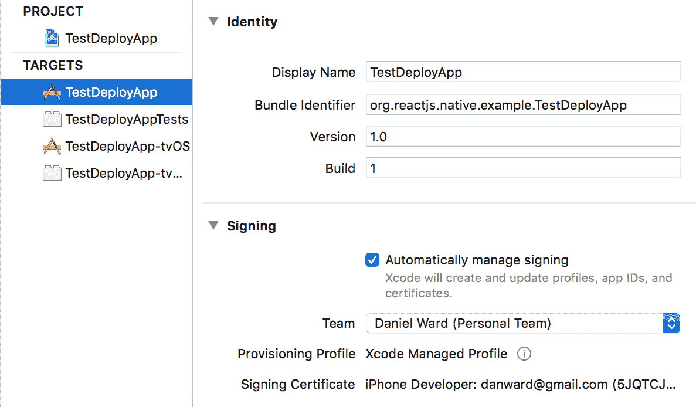
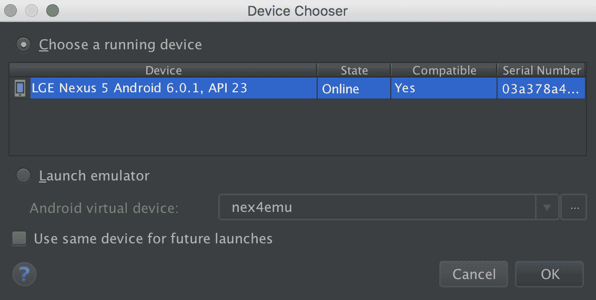
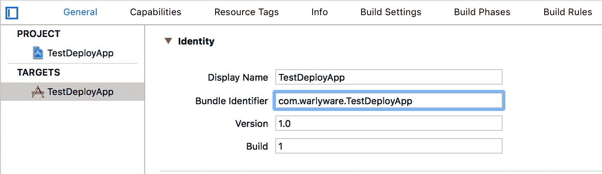
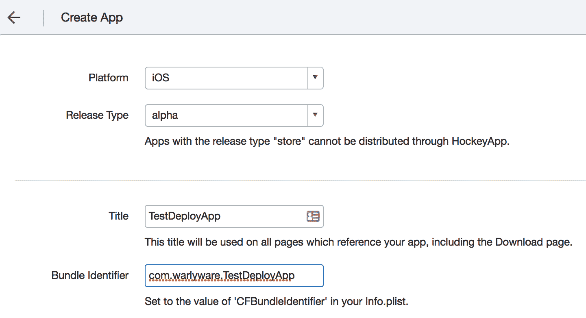
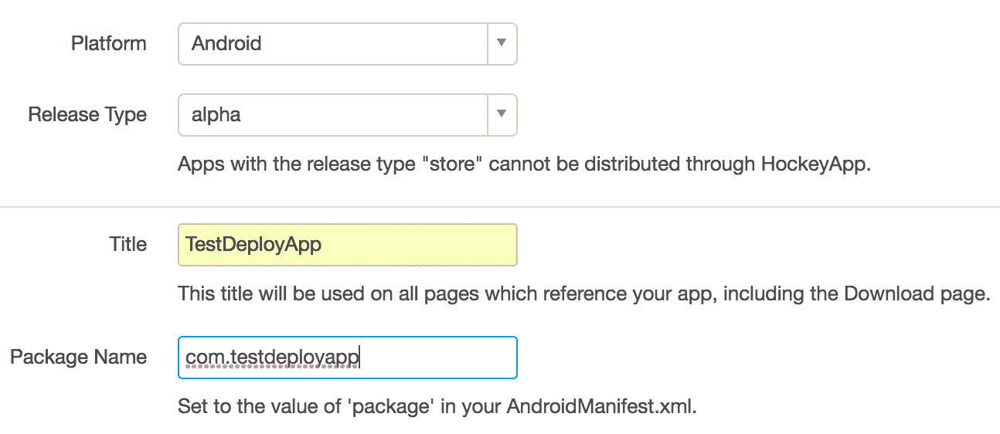
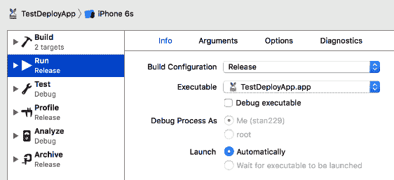
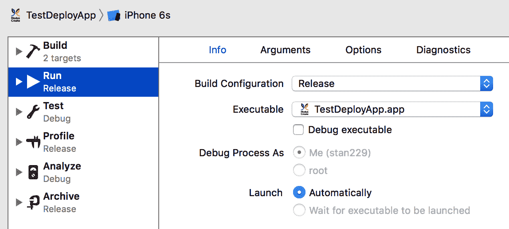
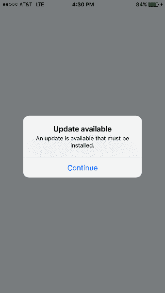
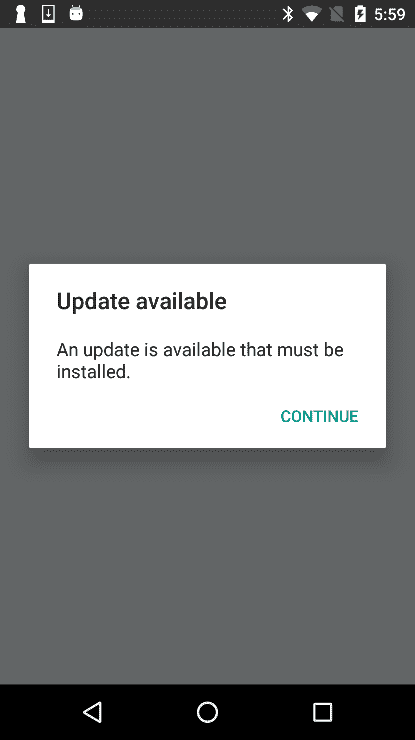

# 十四、部署你的应用

在本章中，我们将介绍以下配方：

*   将开发构建部署到 iOS 设备
*   将开发构建部署到 Android 设备
*   将测试构建部署到 HockeyApp
*   将 iOS 测试构建部署到 TestFlight
*   将生产版本部署到苹果应用商店
*   将生产构建部署到 Google Play 商店
*   部署空中更新
*   优化本地应用大小

# 介绍

如果你是一个独立的开发人员，你可能会经历几个不同的开发阶段。第一阶段是在个人 iOS 或 Android 设备上测试应用。在耗尽了这个阶段之后，您可能会希望与一组选定的人共享它，以获得用户反馈。最终，你的应用将通过应用商店发布到世界各地。本章将介绍这些阶段中的每一个阶段，并介绍如何向应用推送更新，以及一些优化技巧。

# 将开发构建部署到 iOS 设备

在开发过程中，您可能会花费大量时间使用随 Xcode 一起安装的 iOS 模拟器测试 iOS 应用。虽然 iOS 模拟器是目前为止性能最好、最接近于在 iOS 设备上运行应用的方法，但它仍然与实际情况不同。iOS 模拟器使用计算机的 CPU 和 GPU 来呈现模拟的操作系统，因此，根据您的开发机器，它最终的性能可能会更好（或更差）而不是实际的设备

谢天谢地，Expo 在实际设备上测试运行代码的能力离真正的最终产品又近了一步，但最终应用和在 Expo 中运行的开发应用之间仍然存在差异。而且，如果你正在构建一个纯 React 原生应用，你将无法享受使用 Expo 在设备上轻松运行应用的奢侈。

无论哪种方式，您最终都会希望在物理设备上测试真正的应用，以便体验最终产品的实际用户体验和性能。

在本食谱中，我们将引导您使用 React 本机应用并将其部署到 iPhone 或 iPad。

# 准备

我们只需要一个新的纯 React 原生应用，我们将其命名为`TestDeployApp`。您可以通过以下命令创建应用：

```jsx
 react-native init 
```

另外，确保您的 iOS 设备通过 USB 连接到您的开发机器。

# 怎么做。。。

1.  让我们首先在 Xcode 中打开新创建的 React 本机 iOS 项目。通过在左侧面板中选择项目的根来打开项目编辑器。
2.  在项目编辑器的“常规”选项卡下，在左侧的“目标”部分中选择 iOS 应用。在“签名”部分下，选择您的团队，如下所示：



3.  对目标列表中的每个条目重复此步骤。
4.  在目标选择器中选择您的设备，如下所示：


5.  要在连接的设备上开始运行应用，只需按“播放”按钮。您必须确保您的设备已插入、解锁并受信任，才能显示在 Xcode 中的设备列表中。如果这是第一次在此设备上运行您开发的应用，您还需要调整设置以信任来自开发人员帐户的应用。在 iOS 设备上，此设置可在设置|常规|设备管理中找到。

# 它是如何工作的。。。

将我们的开发构建部署到该设备只需指定一个团队，然后按照在 Xcode 模拟器上使用的方式运行应用，但目标是插入式设备。我们使用 localhost 打包程序来创建包文件。然后将此文件保存在设备上，以备将来使用。注意，由于这是一个开发构建，代码还没有像最终版本中那样优化。当转移到生产版本时，您将看到显著的性能提高。

# 将开发构建部署到 Android 设备

在开发 Android 应用时，您最常使用的可能是在 Android 仿真器上运行该应用。虽然很方便，但与真正的 Android 设备相比，仿真器的性能较差。

测试应用的最佳方法是使用物理 Android 设备。本食谱将介绍如何将 React 本机应用部署到物理 Android 设备。

# 准备

我们只需要一个新的纯 React 原生应用，我们将其命名为`TestDeployApp`。您可以通过以下命令创建应用：

```jsx
react-native init
```

另外，确保您的 iOS 设备通过 USB 连接到您的开发机器。

# 怎么做。。。

1.  让我们先在 Android Studio 中打开 React 原生 Android 项目。
2.  接下来，按 run 按钮，如下所示：


3.  确保选择了“选择正在运行的设备”单选按钮，并且您的设备显示在列表中。按 OK 继续，如下所示：



# 还有更多。。。

运行应用时，应启动 React 本机打包程序。如果没有，则必须手动启动打包机。如果您看到错误屏幕上显示消息“无法获取 BatchedBridge”，请确保您的包已正确打包或无法连接到 development server，您应该能够通过在终端中运行以下命令来修复此问题：

```jsx
adb reverse tcp:8081 tcp:8081
```

# 它是如何工作的。。。

很像 Xcode，我们只需插入真实设备，按 run，然后选择应用应该运行的设备，就可以运行我们的应用。唯一可能出现的复杂情况是在设备和开发机器之间建立通信。这些问题通常可以通过命令解决：

```jsx
adb reverse
```

这将建立从设备到主机的转发端口。这是一个开发版本，代码尚未优化，因此一旦应用作为生产版本构建，性能将有所提高。

# 将测试构建部署到 HockeyApp

在将应用发布到野外之前，对应用进行压力测试并在可能的情况下获得用户反馈是很重要的。要实现这一点，您需要创建应用的签名版本，以便与一组测试用户共享。对于健壮的测试构建，您需要两样东西：应用性能分析/报告，以及交付机制。HockeyApp 在 iOS 和 Android 上为您的测试构建提供了这一点和更多。虽然苹果应用商店和谷歌 Play 商店的两个官方平台都提供了测试和分析功能，但 HockeyApp 为处理这些问题提供了一个统一的平台，并提供了第二个度量来源，事故报告等

应该注意的是，HockeyApp 最近被微软收购。他们已经宣布，HockeyApp 产品将于 2019 年 11 月停产，取而代之的是微软的应用中心。您可以在[的产品转换页面上了解更多信息 https://hockeyapp.net/transition](https://hockeyapp.net/transition) 。为了测试目的，此配方将介绍如何将 React 本机应用部署到 HockeyApp。我们将介绍 iOS 和 Android 版本。

# 准备

对于这个配方，我们将使用上两个配方中相同的空的纯 React 原生应用，我们将其命名为`TestDeployApp`。对于 iOS 部署，您需要注册 Apple Developer 程序，并且需要安装`cocoapods`。安装`cocoapods`最简单的方法是使用自制软件，通过以下命令：

```jsx
 brew install cocoapods
```

你还需要有一个 HockeyApp 帐户，你可以在他们的网站[上注册 https://hockeyapp.net/](https://hockeyapp.net/)

# 怎么做。。。

1.  首先，我们需要在应用中安装`react-native-hockeyapp`模块。打开终端，转到应用的根项目目录，然后输入以下命令：

```jsx
        npm install react-native-hockeyapp --save
```

2.  进入你的`ios/`目录并初始化你的 pod 文件：

```jsx
        pod init
```

3.  打开你的播客文件，将`pod "HockeySDK"`添加到你的目标。
4.  回到终端中，安装 Podfile，如下所示：

```jsx
        pod install
```

5.  现在，让我们打开 Xcode 并打开我们的 React 原生项目：（`ios/TestDeployApp.xcodeproj`）。
6.  我建议将包标识符更改为比默认值更有意义的值，因此请在“常规设置”对话框中更改它，如下所示：



7.  将`./ios/Pods/Pods.xcodeproj`拖放到项目导航器中的“库”组中，如下所示：


8.  将位于`./node_modules/react-native-hockeyapp/RNHockeyApp/RNHockeyApp`中的`RNHockeyApp.h`和`RNHockeyApp.m`文件拖放到同一库组中。
9.  接下来，我们将转到 HockeyApp 网站并在那里创建我们的应用。登录并单击新应用。
10.  由于我们尚未准备好构建，请手动单击短语“不想上载构建？”？在以下模式中手动创建应用。
11.  填写创建应用表单中的字段时，请确保与前面在*步骤 6*中定义的标题和捆绑标识匹配，然后按 Save，如下所示：



12.  记下应用 ID，因为我们将在下一步中使用它。
13.  打开`App.js`并添加以下代码：

```jsx
        import HockeyApp from 'react-native-hockeyapp'; 

        export default class 
        TestDeployApp extends Component { 
          componentWillMount() { 
            HockeyApp.configure(YOUR_APP_ID_HERE, true); 
          } 

          componentDidMount() { 
            HockeyApp.start(); 
            HockeyApp.checkForUpdate(); 
          } 
        } 
```

14.  回到 Xcode，将通用 iOS 设备设置为目标设备，并构建（产品|构建）应用，如下所示：


15.  现在，我们需要创建我们的`.ipa`文件。这可以通过 Product | Archive 从 Xcode 菜单完成。
16.  这将打开归档文件列表。按 Distribute App 按钮开始创建`.ipa`的过程。
17.  选择“开发”选项，然后按“下一步”。
18.  应自动选择您的资源调配团队。选择正确的团队后，按“下一步”。
19.  保留默认的导出设置，然后按“下一步”。在摘要页面上，也按 Next。
20.  选择目标目录并按导出。
21.  回到*HockeyApp*浏览器窗口，单击添加版本。
22.  将刚才导出的`.ipa`文件拖到模式窗口中。
23.  我们可以将此处的设置保留为默认设置，因此继续按 Next 直到最后一个模式屏幕，然后在 summary 屏幕上按 Done。iOS 应用就是这样。您可以向*HockeyApp*应用添加用户，然后您的测试人员就可以下载您的应用了。让我们切换到 Android 方面。打开 Android Studio，然后在 React Native 中打开 Android 文件夹。
24.  重复*步骤 8*至*步骤 11*，将平台改为 Android，如下所示：



25.  现在，我们需要构建我们的`.apk`文件。您可以在 React Native 文档中找到构建`.apk`的最新方法，位于：

[https://facebook.github.io/react-native/docs/signed-apk-android.html](https://facebook.github.io/react-native/docs/signed-apk-android.html)

26.  对我们 Android 项目生成的`.apk`重复*步骤**21*和*步骤**22*。

# 它是如何工作的。。。

对于这个配方，我们使用了*HockeyApp*作为它的两个主要特性：它的 beta 发行版和它的 HockeySDK（它支持崩溃报告、度量、反馈、身份验证和更新通知）。对于 iOS，beta 版发行通过*HockeyApp*托管的 OTA 企业发行机制完成。当您签署应用时，您可以控制哪些设备可以打开它。*HockeyApp*只发送通知并提供 URL 供测试人员通过其企业应用商店下载您的应用。Android 更简单，因为不需要担心应用如何传输。这意味着*HockeyApp*在 web 服务器上托管`.apk`文件，测试人员可以下载并安装该文件。

有关在 Android 上设置*HockeyApp*的更多信息，请阅读[上的官方文档 https://support.hockeyapp.net/kb/client-integration-android/hockeyapp-for-android-sdk](https://support.hockeyapp.net/kb/client-integration-android/hockeyapp-for-android-sdk) 。

# 将 iOS 测试构建部署到 TestFlight

在*HockeyApp*出现之前，测试手机应用的最流行的服务是 TestFlight。事实上，苹果在这方面做得非常好，以至于苹果收购了其母公司，并将其整合到 iTunes Connect 中。TestFlight 现在是苹果的官方应用测试平台。TestFund 和 Po.T2 的 HOKECAP APP TY3T3 之间有一些不同的考虑。首先也是最重要的是，TestFlight 只有在被苹果收购后才成为 iOS。其次，TestFlight 中有两种类型的测试：内部测试和外部测试。**内部测试**涉及与您团队中的开发人员或管理员角色成员共享应用，并将分发范围限制为 10 台设备上的 25 名测试人员。**外部测试**允许您邀请多达 2000 名测试人员，他们不必是您组织的成员。这也意味着这些测试人员不会用完您的设备配额。外部测试应用要通过苹果公司执行的**测试版应用审查**，虽然没有苹果公司对向应用商店发布应用的审查严格，但这是一个很好的第一关。

此配方侧重于采用我们的 React 本机应用，并将测试构建部署到 TestFlight。我们将设置一个内部测试，因为我们不希望苹果审查我们的示例 React 本机应用，但内部和外部测试的程序是相同的。

# 准备

对于这个配方，我们将使用与以前配方相同的样板 React Native 应用，我们将其命名为`TestDeployApp`。您还需要注册 Apple 开发者计划，您需要在 Xcode 中设置开发和分发证书，您的应用需要设置 AppIcon。

# 怎么做。。。

1.  让我们首先通过`ios/TestDeployApp.xcodeproj`文件在 Xcode 中打开我们的项目。
2.  正如上一个配方中所述，我还建议将捆绑包标识符更改为比默认值更有意义的内容，例如：


3.  接下来，让我们登录到 Apple 开发者程序并导航到 App ID 注册页面，位于[https/：Developer.Apple.com/account/ios/identifier/bundle](https://developer.apple.com/account/ios/identifier/bundle)。
4.  在这里，填写项目的名称和捆绑 ID，然后按 Continue 按钮，然后按 Register 按钮，最后按 Done 按钮完成应用的注册。
5.  接下来，我们将登录位于[的 iTunes Connect 站点 https://itunesconnect.apple.com](https://itunesconnect.apple.com) 。
6.  在 iTunes Connect 中，导航到“我的应用”，然后按加号（+）按钮并选择“新建应用”以添加新应用。
7.  在“新建应用”对话框中，填写名称和语言。选择与您之前创建的捆绑包 ID 相匹配的捆绑包 ID，并在 SKU 字段中添加唯一的应用引用，然后按 Create。

8.  接下来，导航到应用的 TestFlight 部分，并确保填写可本地化信息部分。
9.  让我们回到 Xcode 来创建`.ipa`文件。为活动方案选择通用 iOS 设备，然后通过 Xcode 菜单（产品|存档）创建文件。这将打开存档列表，您可以在其中按上载到应用商店按钮上载应用。
10.  应自动选择您的资源调配团队。确保选择了正确的团队，然后按选择。创建存档后，按上载按钮。
11.  上传应用后，您需要等待，直到收到来自 iTunes Connect 的电子邮件，通知您构建已完成处理。处理完成后，您可以返回 iTunes Connect 页面并打开内部测试视图。
12.  在内部测试部分，单击选择要测试的版本并选择您的构建，然后单击下一步按钮。在导出符合性屏幕上，按 OK。
13.  我们已经准备好添加内部测试人员。选择要测试应用的用户，然后单击开始测试按钮，并在以下模式中确认您的选择。您的用户现在应该会收到一封邀请电子邮件来测试您的应用！

# 它是如何工作的。。。

TestFlight 是应用商店发布渠道中的一等公民。苹果已经将其对应用 beta 测试发行版的支持直接集成到 iTunes Connect 中，为开发者创造了一个平滑无缝的过程。此过程基本上与部署到应用商店相同，只是在使用 iTunes Connect 时，必须启用和配置测试。

对于测试人员来说，这也是一种无缝体验。只要您在 iTunes Connect 中添加测试用户，就会通知他们安装 TestFlight 应用，这样他们就可以轻松访问可以测试的应用。TestFlight 也使开发人员的过程更加容易，因为不需要他们添加任何额外的第三方库或代码来支持 TestFlight，正如*HockeyApp*所需要的那样。

# 将生产版本部署到苹果应用商店

一旦你彻底测试了你的应用，你就准备好进入 iOS 应用制作过程中的下一步（可能是最激动人心的一步）：发布到苹果应用商店。

此配方将贯穿准备生产版本并将其提交到苹果应用商店的整个过程。我们实际上不会将应用提交到商店，因为我们使用的是示例应用，而不是生产就绪的应用。然而，该过程的最后几个步骤非常简单。

# 准备

对于这个配方，我们将再次使用早期配方中的 simple React Native 示例应用`TestDeployApp`。当然，您还需要参加 Apple 开发者计划，并在本章前面讨论的 Xcode 中设置您的开发和分发证书。对于真正的生产应用部署，您还需要准备好应用的 AppIcon 集和屏幕截图，以便在 iTunes 中使用。

# 怎么做。。。

1.  让我们从使用`ios/TestDeployApp.xcodeproj`文件打开 Xcode 开始。
2.  如前所述，建议您将包标识符更改为比默认值更有意义的值，因此请确保在“常规设置”对话框中更改它。
3.  在设备上以生产模式测试应用也是一个好主意。这可以通过将应用方案的构建配置（通过产品|方案|编辑方案菜单找到）更改为发布来实现，如下所示：



4.  接下来，您需要在 app ID 注册页面上注册该应用，该页面位于：

[https://developer.apple.com/account/ios/identifier/bundle](https://developer.apple.com/account/ios/identifier/bundle)

此步骤需要一个活动的 Apple Developer 程序帐户。

5.  填写项目的“名称”和“捆绑 ID”字段，然后按“继续”按钮。
6.  接下来，我们将登录位于[的 iTunes Connect 站点 https://itunesconnect.apple.com](https://itunesconnect.apple.com) 。在“我的应用”部分，按加号（+）按钮并选择“新建应用”。
7.  您需要在下面的对话框中填写名称和语言，然后选择与先前在配方中创建的捆绑包 ID 匹配的捆绑包 ID。另外，为 SKU 添加一个唯一的应用参考，然后按“创建”按钮。
8.  让我们回到 Xcode 并创建`.ipa`文件。为活动方案选择通用 iOS 设备，并通过菜单（产品|存档）创建文件，该菜单将打开存档列表。最后，按上载到应用商店。
9.  选择您的资源调配团队，然后按选择。

10.  创建存档后，按上载按钮。完成构建后，您将收到来自 iTunes Connect 的电子邮件。
11.  处理完应用后，返回 iTunes Connect。在“应用商店”部分下，打开应用信息并选择应用适合的类别。
12.  打开 iOS 应用下的 1.0 准备提交部分。填写所有必填字段，包括应用截图、说明、关键字和支持 URL。
13.  接下来，在构建部分下，选择我们在*步骤*8 中构建的`.ipa`。
14.  最后，填写版权和应用审查信息部分，然后单击提交审查按钮。

# 它是如何工作的。。。

在此配方中，我们介绍了将 iOS 应用发布到应用商店的标准流程。在本例中，我们不需要遵循 React-Native 特定的步骤，因为最终产品（`.ipa`文件）包含运行 React-Native packager 所需的所有代码，React-Native packager 将以发布模式构建`main.jsbundle`文件。

# 将生产构建部署到 Google Play 商店

这个配方将贯穿我们的应用的制作构建过程，并将其提交给 Google Play 商店。与上一个配方一样，我们将在实际提交到应用商店之前停止，因为这只是一个 React 原生应用的示例，但此过程的其余部分也很简单。

# 准备

对于这个配方，我们将使用本章中使用的相同的 simple React 本机应用，`TestDeployApp`。你需要有一个 Google Play 开发者帐户才能向应用商店提交应用，如果你真的想发布你的应用，你还需要为 Play 商店准备好所有的图标和屏幕截图。

# 怎么做。。。

1.  让我们首先在 Android Studio 中打开 React 原生项目。第一步是构建`.apk`文件。正如本章前面提到的，从 React 原生项目创建生产 Android 应用的过程是复杂的，并且容易发生变化。访问 React 本地文档以创建位于[的`.apk`https://facebook.github.io/react-native/docs/signed-apk-android.html](https://facebook.github.io/react-native/docs/signed-apk-android.html) 。
2.  接下来，让我们在 web 浏览器中打开位于[的 Google Play 开发者控制台 https://play.google.com/apps/publish/](https://play.google.com/apps/publish/) 。
3.  让我们通过单击添加新应用开始这个过程。填写标题字段，然后单击上载 APK 按钮，如下所示：


4.  接下来您将看到发布屏幕的 APK 部分。点击上传您的第一个 APK 到生产，然后拖放（或选择）您的`.apk`文件。
5.  随后将出现一系列自解释的模态。浏览左侧侧菜单中的每个类别（商店列表、内容分级等），并相应地填写所有信息。
6.  满足所有要求后，按发布应用按钮。

# 它是如何工作的。。。

在本食谱中，我们介绍了将 Android 应用发布到 Google Play 商店的过程。按照*步骤*2 中链接的说明，您的 React Native 应用将完成 Gradle`assembleRelease`过程。`assemble`流程运行 packager 来创建 JavaScript 包文件，编译 Java 类，将它们与适当的资源打包在一起，最后允许您将应用签名到`.apk`中。

# 部署空中更新

使用 JavaScript 编写 React 本机应用的一个有用的副作用是，代码在运行时加载，这与 Cordova 混合应用的工作方式类似。我们可以利用此功能，使用**无线**（**OTA**）向我们的应用推送更新。这允许添加功能和错误修复，而无需通过 App Store 审批流程。React Native 的 OTA 更新的唯一限制是我们不能推送编译的（Objective-C 或 Java）代码，这意味着更新代码只能在 JavaScript 层中。有一些流行的服务提供基于云的 OTA 应用更新。我们将重点介绍微软的一项服务`CodePush`。

本食谱将涵盖在 iOS 和 Android 上使用`CodePush`为我们的 React 本机应用设置和推送更新。

# 准备

对于这个配方，我们将使用本章中使用的相同的 simple React 本机应用，`TestDeployApp`。我们将把应用部署到以生产/发布模式运行的物理设备上，这将允许应用接收来自 CodePush 服务器的更新。

# 怎么做。。。

1.  为了使用 CodePush，我们需要安装 CodePush CLI 并创建一个免费帐户。这可以通过在终端中运行以下两个命令来完成：

```jsx
npm install -g code-push-cli
code-push register
```

2.  下一步是使用 CodePush 注册我们的应用。记下运行`code-push register`输出提供的应用部署键。我们将使用**暂存键**进行此配方。文档建议每个平台添加一个应用，每个应用都有一个`-IOS`或`-Android`后缀。要将应用添加到 CodePush，请使用以下命令：

```jsx
code-push app add TestDeployApp-IOS
code-push app add TestDeployApp-Android

```

3.  我们还需要在 React Native 项目目录中安装 React Native CodePush 模块。这可以通过`npm`完成，如下所示：

```jsx
npm install --save react-native-code-push
```

或者，使用`yarn`：

```jsx
yarn add react-native-code-push
```

4.  下一步是将 CodePush 本机模块与我们的项目链接起来。当提示您输入 Android 和 iOS 的部署密钥时，请使用*步骤 2*中讨论的登台密钥。可以使用以下命令链接本机模块：

```jsx
react-native link react-native-code-push
```

5.  接下来，我们需要将 React 本机应用设置为使用 CodePush。在`index.js`内部，我们需要添加三个东西：CodePush 导入、选项对象，以及通过`AppRegistry.registerComponent`注册应用时对导入的`codePush`模块的调用。按如下方式设置应用：

```jsx
import {AppRegistry} from 'react-native';
import App from './App';
import codePush from 'react-native-code-push'; 

const codePushOptions = { 
 updateDialog : true 
} 

AppRegistry.registerComponent('TestDeployApp',
 () => codePush(codePushOptions)(App)
)
```

6.  为了测试我们在 iOS 应用中的更改，让我们部署到 iOS 设备。在 Xcode 中打开 React 本机项目，将方案的构建配置（产品|方案|编辑方案…）更改为 Release，然后按 Run，如下所示：



7.  接下来，对应用中的 React 本机代码进行某种任意更改，然后在终端中，运行以下命令以使用新代码更新应用：

```jsx
code-push release-react TestDeployApp ios -m --description "Updating using CodePush"
```

8.  接下来，关闭并重新打开 iOS 设备上的应用。您应该会看到以下提示：



9.  继续通过提示后，应用将自身更新为最新版本！
10.  我们还将在 Android 上测试该功能。您需要按照[中 React Native 文档中概述的步骤将 Android 应用制作成一个`.apk`文件 https://facebook.github.io/react-native/docs/signed-apk-android.html](https://facebook.github.io/react-native/docs/signed-apk-android.html) 。
11.  将 Android 设备插入开发机器后，从`android/`目录在终端中运行以下命令：

```jsx
adb install 
app/build/outputs/apk/app-release.apk
```

12.  接下来，对 React 原生 JavaScript 代码进行更改。只要添加了新代码，我们就可以使用更改后的代码来更新应用。然后，在终端中运行以下命令：

```jsx
code-push release-react TestDeployApp android -m --description "Updating using CodePush"
```

13.  再次关闭并重新打开 Android 设备上的应用，以获得以下提示：



14.  经过提示后，应用将自身更新为最新版本。

# 它是如何工作的。。。

CodePush（以及其他云承载的 OTA 更新平台）使用自 React Native 成立以来就存在的相同技术工作。React Native 在应用初始化时加载 JavaScript 包。在开发过程中，此捆绑包从`localhost:3000`加载。然而，一旦我们部署了一个应用，它将查找最终产品中包含的名为`main.jsbundle`的文件。通过在*步骤 5*中的`registerComponent`中添加对`codePush`的调用，应用将使用 CodePush API 检入以查看是否有更新。如果有新的更新，它将提示用户更新。接受提示将下载新的`jsbundle`文件并重新启动应用，从而更新代码。

# 优化本地应用大小

在将我们的应用部署到生产环境之前，最好将应用包的大小缩小到尽可能小的文件，我们可以利用几种技术来实现这一点。这些可能涉及支持较少的设备或压缩包含的资产

本食谱将介绍一些限制 iOS 和 Android React 本机应用中生产包文件大小的技术。

# 准备

对于这个配方，我们将使用本章中使用的相同的 simple React 本机应用，`TestDeployApp`。您还需要具备针对 iOS 的代码签名功能，以及创建前面介绍的`.apk`文件的能力。

# 怎么做。。。

1.  我们将从对捆绑资产执行的一些简单优化开始，这些优化通常包括图像和外部字体：
    *   对于 PNG 和 JPEG 压缩，您可以使用[等服务 http://www.tinypng.com](http://www.tinypng.com) 减少文件大小，图像质量几乎没有降低。
    *   如果您使用`react-native-vector-icons`库，您会注意到它捆绑了八种不同的字体图标集。建议您删除应用未使用的任何图标字体库。
    *   SVG 文件也可以被压缩和优化。用于此目的的一项服务是[http://compressor.io](http://compressor.io) 。
    *   随应用打包的任何音频资产都应使用可利用高质量压缩的文件格式，如 MP3 或 AAC。
2.  对于 iOS，除了在发布方案中默认启用的设置之外，没有多少方法可以进一步减小文件大小。其中包括为应用细化启用位代码，并将编译器优化设置为最快、最小的[-Os]。
3.  对于 Android，有两件事可以改善文件大小：
    *   在 Android Studio 中，打开`android/app/build.gradle`并找到以下行，然后将其值更新为以下内容：

```jsx
def enableSeparateBuildPerCPUArchitecture = true 
def enableProguardInReleaseBuilds = true 
```

4.  如果您计划只针对基于 ARM 的 Android 设备，我们可以阻止它完全针对 x86 构建。在`build.gradle`文件中，找到`splits abi`对象并添加以下行以不包括 x86 支持：

```jsx
include "armeabi-v7a" 
```

您可以在以下 Android 文档中阅读更多关于 ABI 管理的信息：

[https://developer.android.com/ndk/guides/abis](https://developer.android.com/ndk/guides/abis)

# 它是如何工作的。。。

在本食谱中，我们介绍了可用于减小应用文件大小的技术。JavaScript 包越小，JavaScript 解释器解析代码的速度就越快，转换成应用加载时间就越快，OTA 更新也就越快。我们保存的`.ipa`和`.apk`文件越小，我们的用户下载应用的速度就越快